# 인공지능과 자연어처리

## 인간의 자연어처리

- 대화의 단계
  - 화자는 자연어 형태로 객체를 `인코딩`
  - 메세지 전송
  - 청자는 자연어를 객체로 `디코딩`

컴퓨터의 자연어처리 방식도 이와 다르지 않다. Encoder는 벡터 형태로 자연어를 `인코딩`, Decoder는 벡터를 자연어로 `디코딩`

자연어 처리에는 다양한 application이 있다. 의미 분석, 구문 분석, 감성 분석, 형태소 분석, 개채명 인식, 등등... 대부분의 자연어처리는 '분류'의 문제. 분류를 위해 자연어를 벡터화(인코딩)

## 단어 임베딩

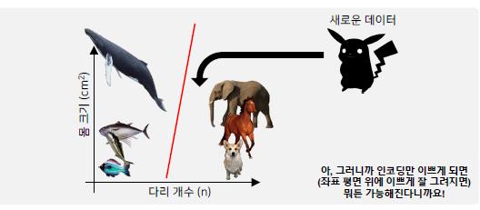

- 특징 추출과 분류
  - 분류를 위해서 데이터를 수학적으로 표현
  - 먼저 분류 대상의 특징(Feature)를 파악
  - 분류 대상의 특징을 기준으로 대상을 그래프 위에 표현 가능
  - 분류 대상들의 경계를 수학적으로 나눌 수 있다
  - 새로운 데이터 역시 그래프에 표현하여 어떤 그룹과 유사한지 파악 가능

과거에는 사람이 직접 특징을 파악해서 분류하나, 실제 복잡한 문제에선 분류대상의 특징을 사람이 파악하기 어려움. 이러한 특징을 컴퓨터가 스스로 찾고, 분류하는 것이 기계학습의 핵심

### Word2Vec

- 가장 단순한 방식. One-hot encoding
  - 단어 벡터가 가지는 의미를 벡터 공간에 표현하지 못 함...

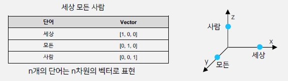

- Word2Vec 알고리즘: 자연어의 의미를 벡터 공간에 임베딩
- 한 단어의 주변 단어들을 통해 그 단어의 의미를 파악

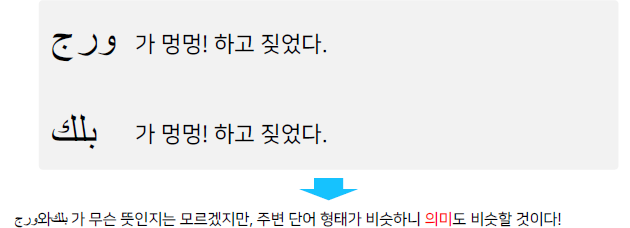

- Word2Vec 알고리즘은 주변부 단어를 예측하는 방식으로 학습(Skip-gram 방식)
- 단어에 대한 dense vector를 얻을 수 있다.
- 정리
  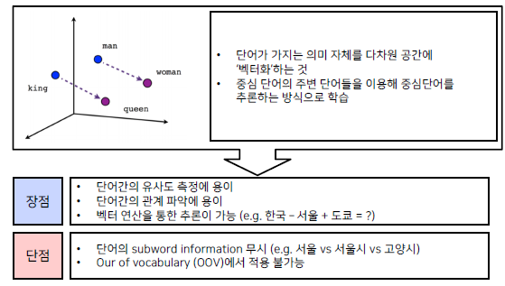

- 단점
  - Subword information 무시: 서울과 서울시가 다른 벡터, 고양시도 다른 벡터로 학습하게 됨. 하지만 서울과 서울시는 과연 크게 다른 단어인가?? 또, 시라는 단어 자체가 갖는 의미를 알지 못 함
  - OOV: 학습에 사용된 단어가 아니면 벡터값을 전혀 출력하지 못 함. 우리가 모든 단어를 다 가르쳐주지 못 하기 때문에 큰 문제임. 오타도 모름

### FastText

- OOV를 극복하고자 고안
- 한국어는 다양한 용언 형태를 가짐
  - 모르다, 모르네, 모르지, 모르겠고, 모르는데, ....
  - Word2Vec의 경우 다양한 용언 표현이 서로 독립된 vocab으로 관리됨
- 기존 Word2Vec과 유사하나, 단어를 n-gram으로 나누어 학습. 주변단어와 중심단어로 나눈다는 의미
  - 예) bi-gram (n=2): 단어를 2개로 쪼개서 보게 됨. assumption => as, ss, su, ... 처럼 슬라이딩 윈도우 방식으로 ㅉ괨
  - 이 n-gram으로 나눠진 단어는 사전에 들어가지는 않으나, 별도의 벡터를 형성

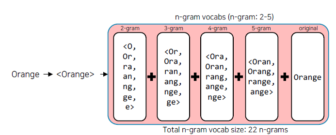
FastText는 단어를 n-gram으로 분리 후, 모든 n-gram 벡터를 합산하고 평균을 통해 단어 벡터를 획득

<꺽쇠>는 단어의 시작과 끝을 표현.

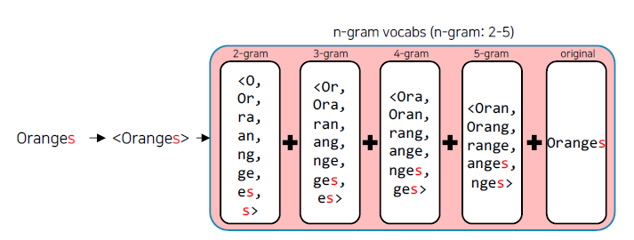
Oranges는 Orange와 유사한 벡터를 얻게된다!

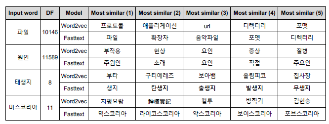
실험결과 등장횟수가 적은 단어더라도 잘 학습하는 것을 볼 수 있다.

### 여전한 단점들..

- word embedding 방식은 동형어, 다의어 등에 대해선 embedding 성능이 좋지 않음.
- 주변 단어를 통해 학습이 이루어지기 때문에 '문맥'을 고려하지 못 함.

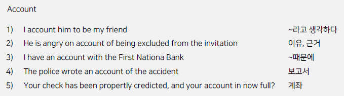

# 딥러닝 기반의 자연어처리와 언어모델

## 언어모델

- 자연어 법칙을 컴퓨터로 모사한 모델
- 주어진 단어들로부터 그 다음에 등장한 단어의 확률을 예측하는 방식으로 학습(이전 state로 미래 state를 예측)
- 다음 등장 단어를 잘 예측하는 모델은 그 언어의 특성을 잘 반영했다고 볼 수 있다. 즉, 문맥을 잘 계산한다.

### Markov Chain Model

- 초기의 언어 모델은 다음 단어나 문장이 나올 확률을 통계와 단어의 n-gram으로 계산
- 딥러닝 기반의 언어모델은 해당 확률을 최대로 하도록 네트워크를 학습

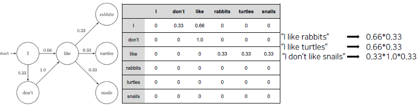

### RNN

- RNN은 히든 노드가 방향을 가진 엣지로 연결되어 순환구조를 이룸
- 이전 state정보가 다음 state를 예측하는데 사용됨. 시계열 데이터 처리에 특화

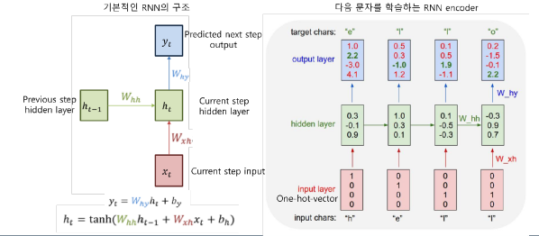

- 마지막 출력은 앞선 단어들의 '문맥'을 고려해서 만들어진 최종 출력 vector이다. `Context Vector`
- 출력된 context vector 값에 대해 classification layer를 붙이면 문장분류가 가능함!

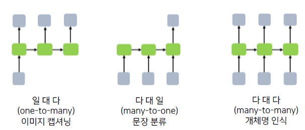

### Seq2Seq

RNN을 활용

- Encoder layer: 문맥을 고려하여 context vector 생성
- Decoder layer: context vector를 입력으로 출력을 예측

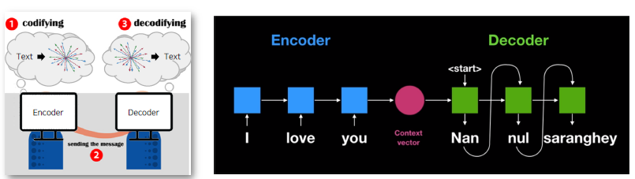

인코더-디코더 방식을 도입하여 모든 NLP 처리가 가능해짐. 음성인식, 이미지 캡셔닝, 형태소 분석, 기계 번역, 챗봇 등등...

하지만 과연 RNN도 완벽한가?

### RNN 구조의 문제점

- 입력 sequnce 길이가 매우 긴 경우, 처음 나온 token에 대한 정보가 희석된다.
- 고정된 context vector 사이즈로 인해 긴 sequnce에 대한 정보를 함축하기 어려움
- 모든 token이 영향을 미치니 중요하지 않은 token도 영향을 미치게 됨.

### Attention

- 인간이 정보를 처리할 때 모든 정보를 고려하며 하지는 않는다!
- 중요한 feature는 더욱 중요하게 고려하는 것!
- 문맥에 따라 동적으로 할당되는 attention layer weight로 인한 dynamic context vector를 획득
  - 기존 RNN은 가장 마지막 출력인 context vecotr에만 관심이 있었다.
  - attention에서는 RNN 각각의 hidden state vector 값을 활용한다.

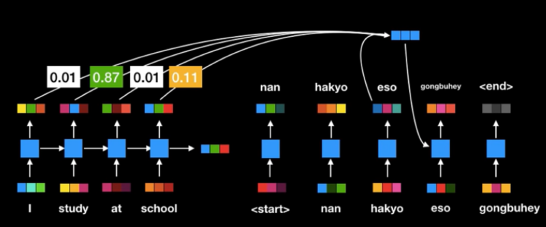

- 하지만 여전히 RNN이 순차적으로 연산이 이루어지므로 연산 속도가 느리다.

### Self-Attention

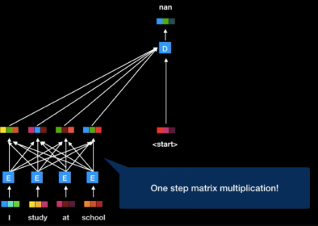

RNN 구조에 있던 이전 state를 다음 state로 전달하는 구조를 없애고, 모든 token들을 all-to-all로 연결한다.

### Transformer

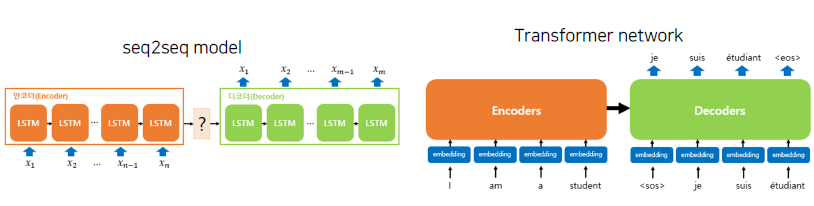

기존 seq2seq 모델은 Encoder와 Decoder의 RNN 구조가 따로 존재했다. 중간 결과물인 context vector를 통한다.

그러나 transformer 구조에서는 인코더와 디코더가 분리되어 있지 않고 하나의 네트워크에 포함되어 있다.

### 다양한 Transformer 기반 모델들

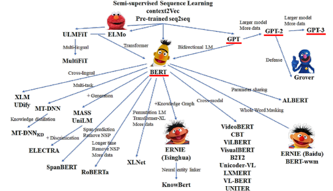

# 자연어 전처리 & 토크나이징

## 자연어 전처리

원시 데이터를 기계학습 모델이 학습하는데 적합하게 만드는 프로세스. 학습에 쓰이는 데이터를 수집 및 가공하는 모든 프로세스

모델을 아무리 바꾸더라도, 튜닝하더라도, 데이터가 가장! 제일! 중요하다!

## 자연어처리의 단계

- Task 설계
- 필요 데이터 수집
- 통계학적 분석
- 전처리
- Tagging
- Tokenizing
  - 자연어를 어떤 단위로 살펴볼 것인가
  - 어절, 형태소, 워드피스 단위 등등
- 모델 설계 및 구현
- 성능 평가

### Python string 관련 함수

- 대소문자 변환
  - upper()
  - lower()
  - capitalize(): 첫문자만 대문자
  - title(): 각 단어의 첫 문자를 대문자
  - swapcase(): 대문자와 소문자를 서로 변환
- 편집, 치환
  - strip(): 좌우 공백 제거
  - lstrip(), rstrip()
  - replace(a, b): a를 b로 치환
- 분리, 결합
  - split(): 공백 기준 분리
  - split('\t'): tab 기준
  - ' '.join(s): 리스트 s에 대하 공백을 두고 결합
  - lines.splitlines(): 라인 단위 분리
- 구성 문자열 판별
  - isdigit()
  - isalpha()
  - isalnum()
  - islower()
  - isupper()
  - isspace()
  - startswith('hi'): 'hi'로 시작하는지
  - endswith('hi'): 'hi'로 끝나는지
- 검색
  - count('a')
  - find('a')
  - find('h', 3): 문자열 index에서 3번부터 h가 출현한 위치 검색
  - rfind('h'): 문자열의 오른쪽에서부터 검사하여 처음으로 출현한 위치
  - index('hi'): find와 비슷. 단, 존재하지 않으면 예외발생

## 토큰화

- 토큰화
  - 주어진 데이터를 Token이라는 단위로 나누는 작업
  - 토큰이 되는 기준은 다양하다. 음절, 단어, 형태소, 어절, 자소 등
- 문장 토큰화
  - 문장을 분리
- 단어 토큰화
  - 구두점 분리, 단어 분리
  - "Hello, World!" -> "Hello", ",", "World", "!"

### 한국어 토큰화

- 영어는 New York과 같은 합성어 처리와 it's와 같은 줄임말 예외처리만 하면 띄어쓰기를 기준으로 잘 동작함
- 하지만 한국어는 조사나 어미를 붙여서 말을 만드는 `교착어`이다. 띄어쓰기 기준으로 분리하는 것은 부적합함.
- 따라서 어절이 의미를 가지는 최소 단위인 `형태소`로 분리한다.
  - 안녕하세요 -> 안녕/NNG, 하/XSA, 세/EP, 요/EC

## 전처리 & 토큰화 실습

colab notebook 참고
