# BERT

## BERT 소개

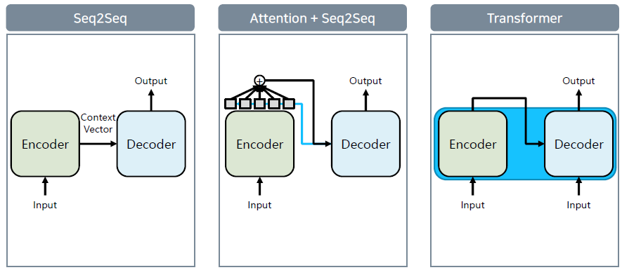

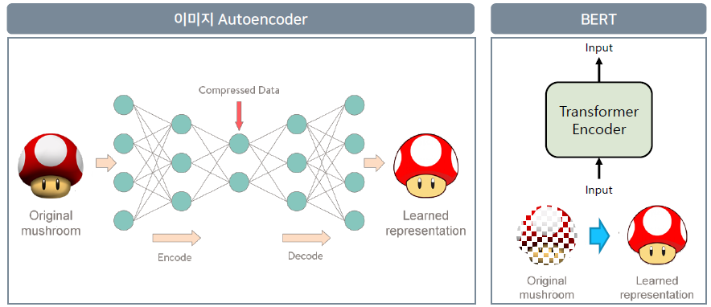

인코더는 압축, 디코더는 복원

여기서 Mask를 적용하여 원본을 복원하기 어렵게 만든다. 더 어렵게 학습을 시켜 완벽하게 복원할 수 있도록...

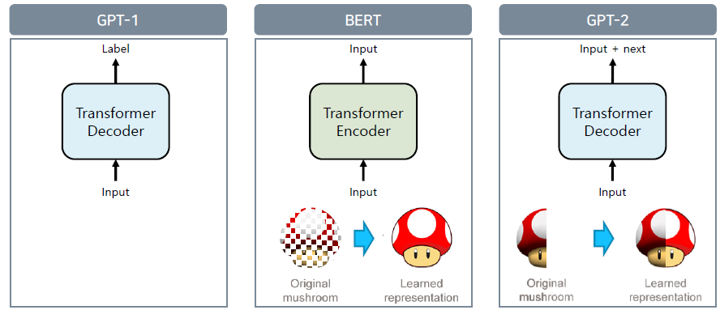

- BERT: mask를 추측
- GPT-2: next를 추측

### BERT 모델 구조

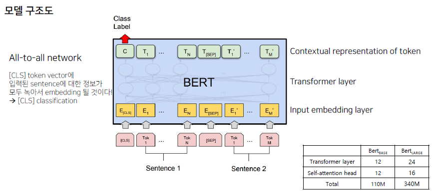

- input: sentence 2개와 [SEP]를 입력 받음
- layer: Transformer 12개
- Class Label: [CLS]. s1과 s2가 next 관계인지, 전혀 상관 없는 관계인지 등등
- BERT 내부 transformer는 all-to-all 관계로 연결됨. 즉, [CLS] 벡터가 s1과 s2를 모두 포괄하는 정보를 가진다고 볼 수 있음.
- 이제 이 [CLS] 토큰에 적절한 classification label을 붙여 학습을 하게 된다.

### BERT 토크나이징

- WordPiece 토크나이징을 사용
- 빈도수 기반의 토크나이징
  - He likes playing -> He likes play ##ing
- 입력 문장을 토크나이징하고, token들로 token sequnce를 만들어 학습에 사용. 2개의 시퀀스가 학습에 사용

### MLM

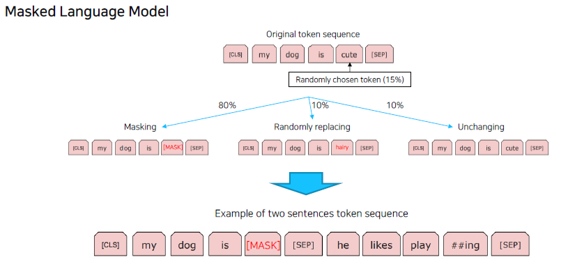

스페셜 토큰을 제외하고 랜덤하게 15%를 선택하고... 거기서 80%는 마스킹 나머지는 랜덤 리플레이싱과 변화를 주지 않음. 최종적으로 이 문장이 input으로 들어가게 된다.

### 실험

GLUE dataset을 이용하여 실험

- MNLI
- QQP
- QNLI
- SST-2
- CoLA
- STS-B
- MRPC
- RTE
- WNLI

### NLP task

다양한 NLP task에 대해 작동함

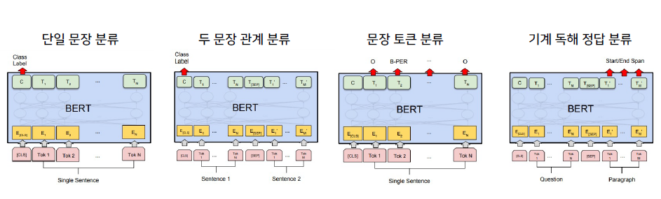

## BERT 응용

1. 감성 분석

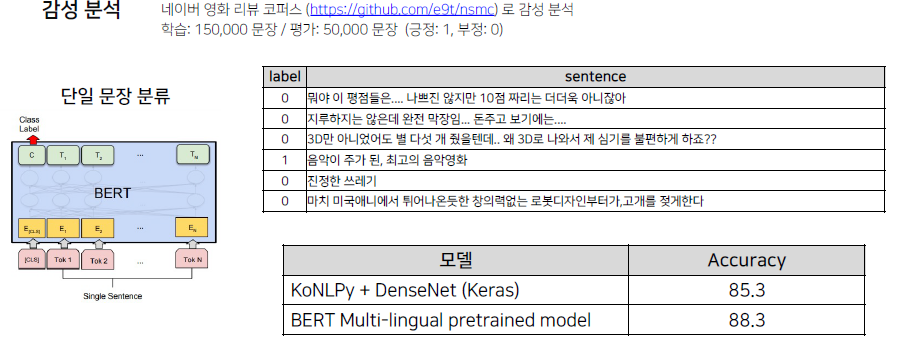

2. 관계 추출

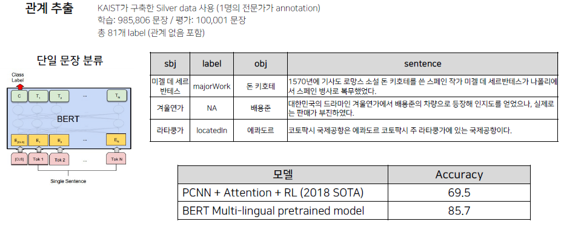
한 문장에서 sjb, obj일때 관계 (label)이다.

3. 의미 비교

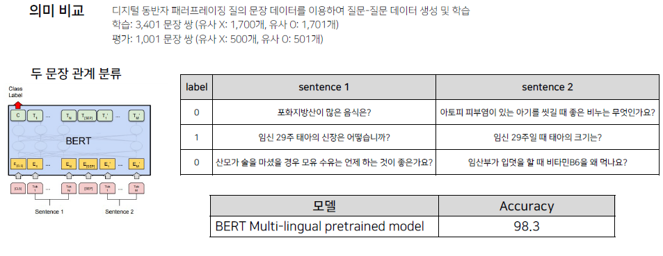
단, 이 예에서는 문제점이 존재함. s1과 s2가 전혀 상관이 없다... 실제로 우리가 분류하게 될 문장은 굉장히 유사한 경우가 많다. 예를 들어, 무협 소설 추천해주세요와 판타지소설 추천해주세요는 굉장히 유사한 문장이기 때문.

4. 개체명 분석

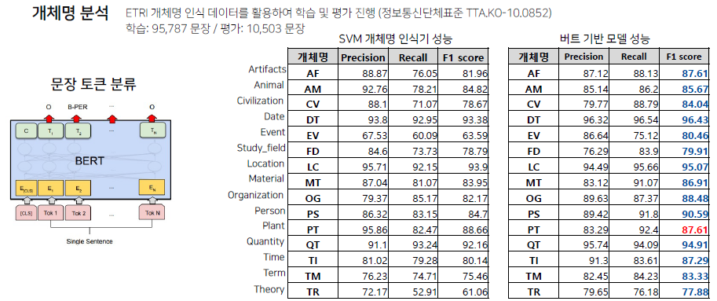

5. 기계 독해

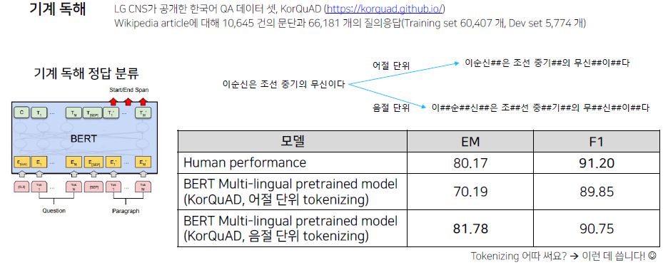

토크나이징에 따라 점수가 크게 차이나는 것을 볼 수 있다. 이처럼 토크나이징을 적용하는 것도 중요한 사항임.

### 한국어 BERT

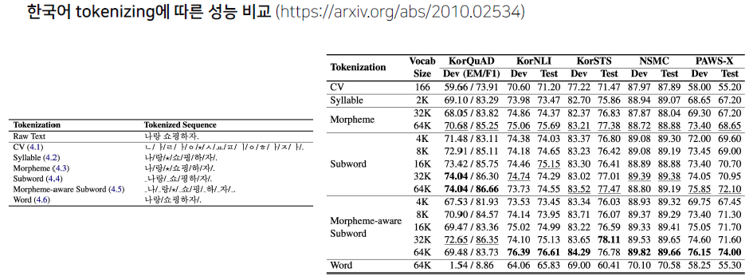

가장 성능이 좋았던 것은 형태소를 분석 후 WordPiece를 적용시킨 Morpheme-aware

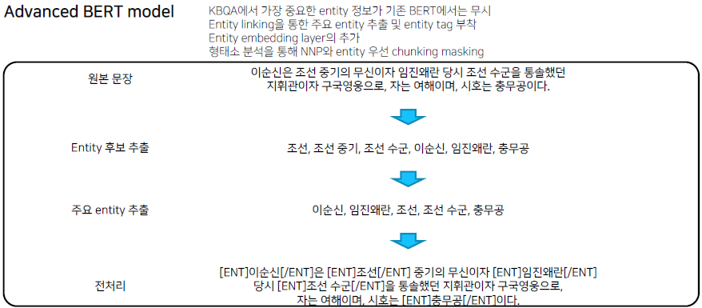

지식 추출의 대상이 되는 존재들, entity가 중요하다는 점. 그러나 BERT 내에서는 entity를 명시할 수 있는 구조가 존재하지 않음. 그래서 원본 문장에서 entity 후보를 추출하고 태그를 부착시켜보았다.

버트의 embedding layer에 tag를 위한 embedding layer를 하나 더 부착하여 사용해봄. 결과는 좋았다.

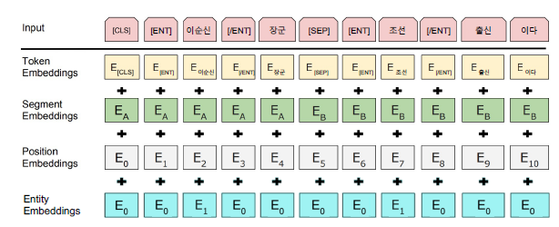

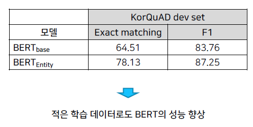

결과를 살펴보면 성능의 크게 향상된 것을 알 수 있음. 여기서의 시사점은 어떻게 하면 더욱 feature를 잘 뽑아낼 것인지 고민해보는 것!

# 과제

- BERT 실습 with 허깅스페이스
- BERT를 이용한 챗봇
  - colab notebook 참고!
