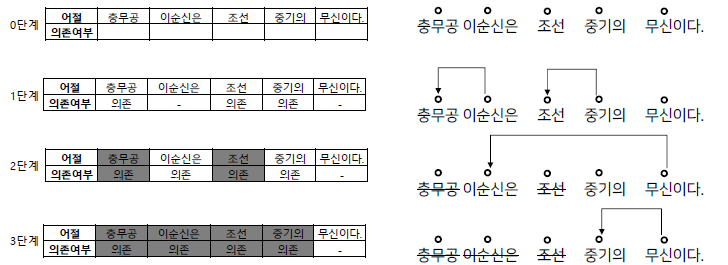
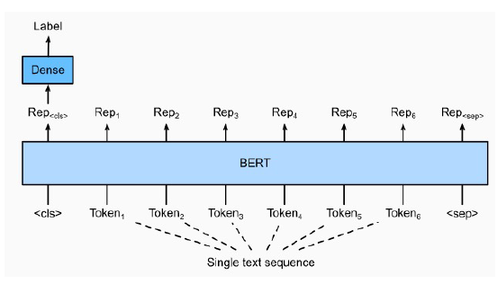
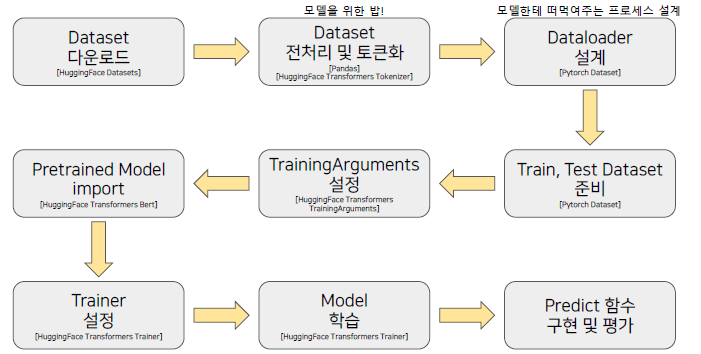
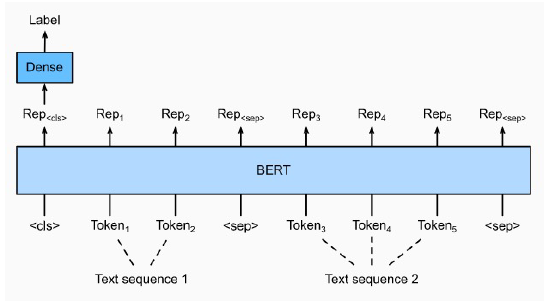
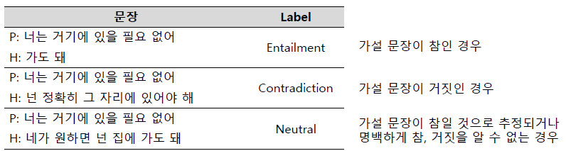
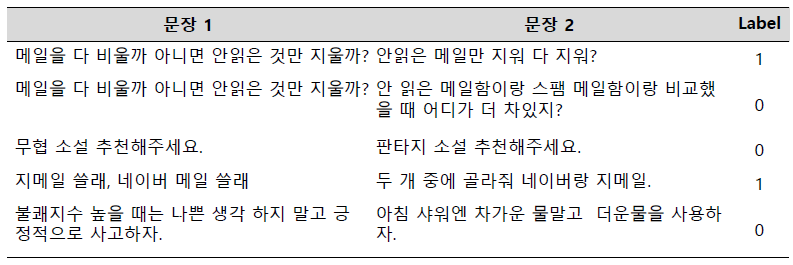
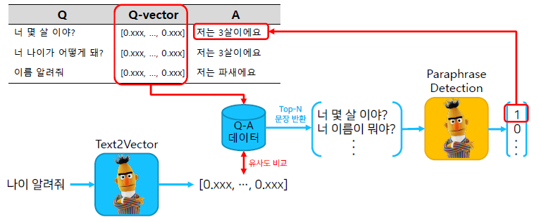

# KLUE 데이터셋

한국어 자연어 이해 벤치마크. KLUE의 task들을 잘 수행할 수 있다면, 한국어 NLP task는 어느것이든 잘 해결할 수 있을것임.

- 문장분류
- 관계추출
- 문장 유사도
- 자연어 추론
- 개체명 인식
- 품사 태깅
- 질의응답
- 목적형 대화
- 의존구문 분석

## 의존구문 분석

단어들 사이의 관계를 분석하는 task

1. 특징

   - 지배소: 의미의 중심
   - 의존소: 지배소가 갖는 의미를 보완해주는 요소(수식)
   - 어순과 생략이 자유로운 한국어에서 주로 연구됨

2. 분류 규칙

   - 지배소는 후위언어이다. 항상 의존소보다 뒤에 위치한다.
   - 각 의존소의 지배소는 하나이다.
   - 교차 의존 구조는 없다.

3. 분류 방법
   - Sequence labeling 방식으로 처리 단계를 나눈다.
   - 앞 어절에 의존소가 없고 다음 어절이 지배소인 어절을 삭제하며 의존 관계를 만든다.

- 복잡한 자연어를 그래프로 구조화해서 표현이 가능하다. 각 대상에 대한 정보 추출이 가능!
  - 구름 그림 -> 새털구름을 그린 것 -> 내가 그린 것
  - "나"는 "구름그림"을 그렸다.
  - "구름 그림"은 "새털구름"을 그린 것이다.

## 문장분류 task

주어진 문장이 어떤 종류의 범주에 속하는지 구분하는 task

1. 감정분석
   - 문장의 긍정 또는 부정 및 중립 분류
   - 문장을 작성한 사람의 느낌, 감정등을 분석 할 수 있기 때문에 기업에서 모니터링, 고객지원, 댓글에 대한 필터링 등이 가능
   - 활용방안
     - 혐오 발언 분류
     - 기업 모니터링
2. 주제 라벨링
   - 문장의 내용을 이해하고 적절한 범주를 분류하는 task
   - 주제별로 뉴스 기사를 구성하는 등 데이터 구조화와 구성에 용이
   - 활용 방안
     - 대용량 문서 분류: 대용량의 문서를 범주화
     - VoC(Voice of Customer): 고객의 피드백을 제품 가격, 개선점, 디자인 등 적절한 주제로 분류하여 데이터를 구조화
3. 언어 감지
   - 문장이 어떤 나라 언어인지를 분류
   - 주로 번역기에서 정확한 번역을 위해 입력 문장의 타게팅하는 작업이 가능
   - 활용방안
     - 번역기
     - 데이터 필터링
4. 의도 분류
   - 문장이 가진 의도를 분류하는 task
   - 입력 문장이 질문, 불만, 명령 등 다양한 의도를 가질 수 있기 때문에 적절한 피드백을 줄 수 있는 곳으로 라우팅 작업이 가능
   - 활용 방안
     - 챗봇: 문장의 의도를 파악하고 적절한 답변을 제공

### 문장 분류를 위한 데이터

Kor_hate

- 혐오 표현에 대한 데이터
- 특정 개인 또는 집단에 대한 공격적 문장
- 무례, 공격적이거나 비꼬는 문장
- 부정적이지 않은 문장

Kor_sarcasm

- 비꼬지 않은 표현의 문장
- 비꼬는 표현의 문장

Kor_sae

- 예/아니오로 답변 가능한 질문
- 대안 선택을 묻는 질문
- Wh- 질문
- 금지 명령
- 요구 명령
- 강한 요구 명령

Kor_3i4k

- 단어 또는 문장 조각
- 평서문
- 질문
- 명령문
- 수사적 질문
- 수사적 명령문
- 억양에 의존하는 의도

## 단일 문장 분류 모델 학습

BERT의 [CLS] token의 vector를 classifiaction 하는 Dense layer 사용

### 주요 매개변수

- input_ids : sequence token을 입력
- attention_mask : [0,1]로 구성된 마스크이며 패딩 토큰을 구분
- token_type_ids : [0,1]로 구성되었으며 입력의 첫 문장과 두번째 문장 구분
- position_ids : 각 입력 시퀀스의 임베딩 인덱스
- inputs_embeds : input_ids대신 직접 임베딩 표현을 할당
- labels : loss 계산을 위한 레이블
- Next_sentence_label : 다음 문장 예측 loss 계산을 위한 레이블

### 학습 과정

## 문장 분류 실습 with NSMC

ipynb 파일 참고!

# BERT 언어모델 기반의 두 문장 관계 분류

## 두 문장 관계 분류 Task

주어진 2개 문장에 대해 두 문장의 자연어 추론과 의미론적 유사성을 측정하는 task

## 두 문장 관계분류를 위한 Data

NLI

- 언어 모델이 자연어의 맥락을 이해할수 있는지 검증하는 task
- 전제문장(Premise)와 가설문장(Hypothesis)을 Entailment(함의), Contradiction(모순), Neutral(중립)으로 분류

Semantic text pair

- 두 문장의 의미가 서로 같은 문장인지 검증하는 task

## 두 문장 관계 분류 모델 학습

단순히 두 문장 관계 분류만 하면 재미없으니까... IRQA 챗봇을 만들어보자!

### IRQA

Information Retrieval Question and Answering

사전에 이미 정의해놓은 QA 셋에서 가장 적절한 답면을 찾아내는 과정이다. 여기에 우리는 두문장 관계분류 모델을 부착해볼 것이다. 무조건 Top1이 정답이 되지 않는 경우가 있기 때문에, 의사한 문장임을 검증하여 답변을 할 수 있도록 하기 위함이다.

## 실습

ipynb 파일 참고!!
