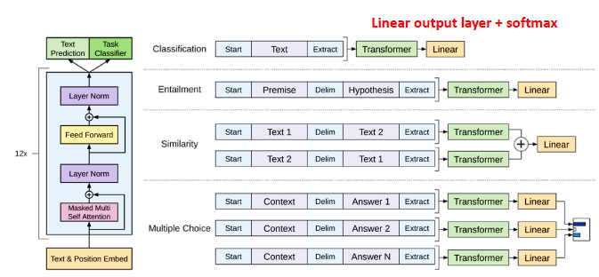

# GPT 언어모델

자연어의 임베딩: BERT

자연어의 생성: GPT

## GPT 모델 소개

트래스포머의 디코더를 사용한 모델.

각 토큰의 다음 토큰에 적절한 것이 어느것인지 학습...

### GPT tasks

- 자연어문장 분류에 성능이 아주 좋은 디코더인 GPT
- 덕분에 적은 양의 데이터에서도 높은 분류 성능을 나타냄
- 다양한 자연어 task에서 SOTA 달성
- pre-train 언어 모델의 새 지평을 열었음 -> BERT 발전의 밑거름
- 하지만 여전히 지도학습을 필요로 하며, labeled data가 필수적임
- 특정 task를 위해 fine-tunning된 모델은 다른 task에서 사용 `불가능`

언어의 특성상 지도학습의 목적함수는 비지도 학습의 목적함수와 같지 않은가? 즉, fine tuning이 필요 없다고 볼 수 있다!!!

그러니까 fine tuning된 레이블 자체도 하나의 언어모델이라는 것이다. 감정 분류 task를 수행시, label에 있는 감정인 기쁨, 슬픔 등등도 결국 단어니까, 자연어 아닌가?

즉, 엄청 큰 데이터셋을 사용하면 자연어 task를 자연스럽게 학습할 수 있다!

### 여전한 문제점

pre-train 모델 하나를 위해서 엄청나게 많은 data와 리소스를 필요로한다. 그런데 그렇게 만든 모델이 하나의 task밖에 할 수 없다면? 자원의 낭비!!

이를 극복하기 위해 zero-shot, few-shot 을 제시함

- 파인튜닝
  - 기존의 언어모델은 프리트레인된 모델이 있고, data를 하나씩 넣으면서 grad 업데이트를 통해 fine-tuning을 진행한다.
  - GPT 에서는 다른 러닝방법을 제시했다.
- Zero-shot
  - 번역 task를 원한다면? task를 설명하고 바로 번역하고싶은 말을 입력한다.
  - 이미 엄청나게 사용한 데이터 셋을 통해 학습되어있으므로 가능함
  - One-shot, Few-shot은 예시를 하나 혹은 여러개 주어주는 것이다. zero-shot보다 성능이 더 좋다.

### GPT-3

GPT와 GPT-2 보다도 훨씬 큰 학습 데이터를 사용하고 파라미터 숫자도 어마어마하게 키운 버전. 구조 자체는 여전히 트랜스포머 디코더의 구조에 기반한다. 몇가지 task를 수행하였는데 생성에 있어서 아주 뛰어난 성능을 보였다.

- 뉴스 기사 생성
  - 진짜 뉴스와 동일한 제목, 부제목을 입력하여 뉴스기사를 생성하게 함. 평가자가 진짜뉴스인지 가짜뉴스인지 구분하도록 시킴. 결과는 88%였다.
- 수학 계산
  - What is 48 plus 76? 처럼 수학 계산을 문장으로 입력하여도 답변이 정확하였음
- Open-domain Q&A
  - 기계독해의 경우 정답에 관한 context가 인풋에 함께 주어지지만, GPT-3는 그런 문서조차 주어주지 않고 질문만 받는다는 차이점이 있다.
  - 즉 굉장히 어려운 task이다. 모델 자체에 이미 질문에 대한 정보가 녹아있어야하기 때문이다. 그럼에도 뛰어난 성능을 보였다.
- 텍스트 데이터 파싱
  - 문단을 입력하고 특정한 쿼리를 요청하면 파싱까지 가능
- 요약
  - 질문과 함께 선지를 주어주면 정답을 맞출 뿐 아니라 설명까지 가능함
- Awesome GPT-3
  - 70개 가량의 예제 수록!

그러면 GPT-3의 한계점은 없는가..?

## GPT-3 한계

다음 단어 혹은 masked 단어를 예측하는 언어 모델 학습 방식이다. 과연 이것으로 모든게 해결될 수 있는가?

weight update가 없다는 것은 모델에 새로운 지식 학습이 없다는 것이다. 즉, pre-train시 배운 내용에 대한 업데이트가 없다!! 만약 한국의 대통령에 대한 질문에 대해서는 업데이트가 이루어지지 않기 때문에 오답을 낼 것이다...

또 GPT-3는 모델 사이즈가 아주아주 크다. 과연 모델 사이즈 만능론이 유효한지는 아직도 모르는 것이다. 다른 다양한 연구 방법론도 계속 시도해보아야 한다.

그밖에도 GPT-3는 언어로만 학습을 한다. 하지만 현실은 멀티모달이다.
