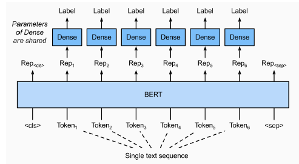
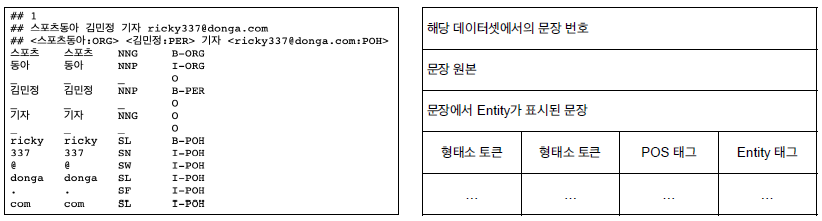
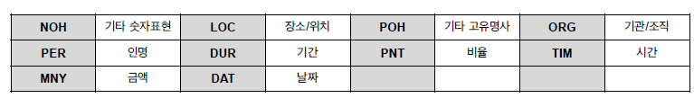
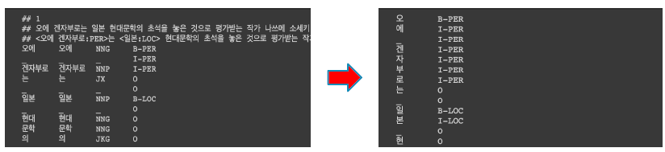

# BERT 문장 토큰 분류

## 문장 토큰 관계 분류 task

주어진 문장의 각 token이 어떤 범주에 속하는지 분류하는 task



대표적으로 개체명인식(NER)이 있다. Named Entity Recognition

- 개체명인식은 문맥을 파악해서 인명, 기관명, 지명 등 문장에서 특정한 의미를 가지고 있는 단어 또는 어구를 인식하는 과정을 말함.
- 같은 단어라도 문맥에서 다양한 개체(Entity)로 사용됨.
- 카카오브레인의 pororo를 추천함.

형태소, 품사 태깅인 POS tagging도 있다.

- 주어진 문장에 대해 문법을 파악.
- 품사 태깅은 주어진 문장의 각 성분에 대해 가장 알맞는 품사를 태깅함
- 마찬가지로 pororo에도 있음

```python
from pororo import Pororo
# 개체명 인식
ner = Pororo(task='ner', lang='ko')
for text in texts:
    for pred in ner(text):
        if pred[1] != '0'::
            print(pred[0], pred[1])
        else:
            print(pred[0])
    print()
# 품사 태깅
pos = Pororo(task='pos', lang='ko')
pos("이순신은 조선 중기의 무신이다.")
```

## 문장 토큰 분류를 위한 데이터

kor_ner



- 한국해양대학교 자연어처리 연구실에서 공개한 한국어 NER 데이터셋
- 일반적으로 NER 셋은 pos tagging도 같이 존재함
- B, I, O 태그로 구성. B는 시작, I는 내부, O는 다루지 않는 개체명을 의미함



## 문장 토큰 분류 모델 학습시 주의점

BERT는 wordpiece 토크나이저를 사용한다. 그런데 이 때 잘못된 피스로 토크나이징 된 경우, 개체명 인식시 에러가 날 수 있음. 예를 들어 '이순신은' [이순], [신은] 이라고 분류할 수 있다. 이 경우 [이순]은 Person이 될 수 있지만, [신은]은 아무리 잘라도 person이 될 수 없다.

그래서 음절 단위로 토큰을 나눠 학습하는 것을 추천한다. 즉, 형태소 단위의 토큰을 음절단위 토큰으로 분해하고, Entity tag역시 음절 단위로 매핑시켜 주어야 한다.


