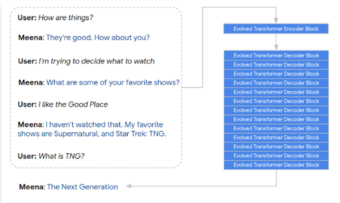

# Transformer와 multi-modal 연구

## BERT 이후 다양한 LM들

### XLNet

BERT는 mask 토큰을 생성하고 예측하는 방법으로 학습. 때문에 mask 토큰을 독립적으로 예측한다. 즉, 예측의 대상은 오직 mask 토큰 뿐이고 토큰 사이의 관계는 학습이 불가능하다. 또한 embedding length의 한계로 segment간 관계 학습도 불가능하다. 왜냐하면 설정에 따라 다르지만, 512 token을 벗어나는 길이는 학습을 못 하기 때문

GPT-2는 앞에 나온 단어를 바탕으로 다음 단어를 예측하는 방법으로 학습한다. 때문에 단일 방향으로만 학습하는 문제점이 있다.

XLNet은 이러한 문제점을 극복하기 위해 등장했다. 우선 Relative positional encoding을 사용한다.

- BERT처럼 0, 1, 2, 3, ... 으로 위치를 표현하는 것이 아니라, 현재 token의 위치 대비 0번째, 1번째, ... 상대적 거리 표현법을 사용
- 이를 통해 token간 관계성을 표현할 수 있으면서
- Sequence 길이에 제한이 없어짐

#### Permutation language modeling

XLNet은 mask 토큰을 쓰지 않고, PLM 이라는 방법으로 학습을 한다. 토큰의 순열-조합으로 모든 가능한 문장을 생성하고 섞인 순서가 학습의 대상이 된다.

이렇게 무작위로 순서를 섞게 되므로 단방향 학습의 단점도 극복할 수 있다.

### RoBERTa

BERT 구조에서 학습 방법을 다시 고민

1. Model 학습 시간 증가 + batch size 증가 + train data 증가
2. Next sentence prediction 제거 -> fine-tuning과 관련 없고, 오히려 너무 쉬운 task라 성능이 하락되는것 아닌가?
3. Longer sentence 추가 -> 긴 시퀀스 사용 가능
4. Dynamic masking -> 똑같은 텍스트 데이터에 대해 masking을 10번 다르게 적용하여 학습

즉, 문제를 더 어렵게 만들고 더 많은 양을 학습시킨 것이다.

### BART

BERT와 GPT 모두 성능이 좋으니, 둘의 구조를 합쳐보면 어떨까?

Transformer Encoder-Decoder 통합 LM

GPT와 BERT의 학습 방법을 모두 섞어서 사용한다.

### T-5

Transformer Encoder-Decoder 통합 LM. 현재 가장 좋은 성능을 보임

mask 된 토큰은 하나의 단어가 아니라 여러개의 단어가 모인 구나 절이 될 수 있음. 또 마스크도 한번에 여러개의 마스크를 복원하는 multi-mask task임

인코더에서는 input, 디코더에서는 target. 이처럼 여러개의 문장을 동시에 복원하는 학습을 한다. 즉, 어려운 문제를 학습하는 것!

현재까지 T-5가 NLU에서 가장 높은 성능을 보임.

### Meena

대화 모델을 위한 LM

SNS 데이터 (341GB)를 이용하여 26억개의 파라미터를 가진 신경망 모델을 이용한 end2end multi-turn 챗봇.

챗봇 평가를 위한 새로운 Metric인 SSA(Sensible and Specificity Average)를 제안함.

- Sensible: 현재까지 진행중인 대화에 가장 적절한 답변을 했는지 안 했는지를 결정하는 점수. 만약 맥락에 어울린다면 높은 점수를 준다.
- Specificity: 얼마나 구체적으로 답변했는가. 즉, 너무 일반적인 답변만 하지 않도록 하기 위함이다. 예를 들어 어떤 질문이든 '잘 모르겠어요.'는 적절한 답변이지만, 구체적인 답변은 아니다.

생각해볼 점. 인공지능이 더 인간다움을 평가할 수 있는 방법에는 무엇이 있을까...

### Controllable LM

Plug and Play LM(PPLM)

일반적인 LM은 다음에 등장할 단어 -> 확률 분포를 통해 선택

그러나 PPLM에서는 다음에 나오기에 적절한 단어들을 bag of word에 저장해둔다. 예를 들어 긍정적 답변이라는 단어들을 bow에 저장해둔다. PPLM에서는 내가 원하는 bow 단어들의 확률이 최대가 되도록 이전 상태의 vector를 수정하는 방법을 제안한다.

The chicken 까지 생성했다고 가정한다. 그렇다면 chicken 다음 모델이 결정한 단어는 tastes이다. 이후 그 다음에는 ok가 제일 높은 확률을 보인다.

그러나 나는 delicious가 더 높기를 바란다. 즉, 나의 bag of word에는 delicious가 담겨져있다. 그러면 모델은 먼저 delicious의 확률 분포를 확인한다.

모델은 bag of word의 확률 데이터를 현재 상태에 맞춰 확인한다. 그렇다면 ok가 delicious보다 더 확률이 높을 것이다. 그렇다면 back-propaganda를 통해 delicious가 최대 확률로 유지되도록 chicken을 통해 만들어진 vector를 수정하게 된다.

여기서 주의점은 grad 업데이트가 아니라, 이전에 만들어진 vector를 수정하는 것이다.

이 모델의 가장 큰 장점은 grad update가 필요하지 않으므로 기존 학습한 모델을 바탕으로 내가 원하는 단어로 생성하도록 유도를 할 수 있다는 것이다.

- 확률 분포를 사용하기 때문에 중첩도 가능하다. 즉 여러 감정을 중첩시킬 수 있다.
- 특정 카테고리에 대한 감정을 컨트롤 할 수 있다.
  - 정치,종교,성적,인종적 키워드에 대해서는 다른 대체 단어를 택하도록 설정하거나
  - 범죄 사건에 대해서는 부정적으로 단어를 생성하도록...
- 확률 분포 조절을 통해 그라데이션 감정도 가능하다...
  - 즉 특정 bag의 확률을 점차 높여볼 수 있다!

- koGPT는 뉴스에 좀 편향된 데이터셋으로 학습했다. 그래서 뉴스 스러운 글이 만들어지는 듯 함.
- BoW를 적용시켜보면 이처럼 원하는 방향으로 생성을 컨트롤 할 수 있다.

편향성이 제거된 데이터만 가지고 학습하면 편향성이 제거된 output만 나온다? 틀린말이다. AI는 단어 자체의 의미를 모르기 때문이다. 따라서 PPLM처럼 LM 모델의 생성 자체를 뒷단에서 컨트롤 하도록 해야한다. (윤리성 컨트롤을 위해!)

## Multi-modal LM

LM은 자연어 to 자연어로 충분할까?

우리는 언어를 배울 때 글로만 학습하지 않는다. 말과 시각, 후각, 촉각 등 다양한 감각을 이용하여 세상을 학습한다.

### 할머니세포 (Grandmother cell)

Halle Berry와 관련된 사진, 글자만 봐도 반응하는 특정 영역이 있었다. 즉, 우리의 뇌는 하나의 객체를 Multi-modal로 인지한다!

### LXMERT

이미지와 자연어를 동시에 학습한다.

Cross-modality output: 이미지와 단어를 모두 반영한 CLS 토큰!

질문에 대한 자연어 이해도 하고 있으며, cat-desk의 자연어 관계도 이해하고 있다. 또, 이미지역시 이해하고 있음을 알 수 있다.

### ViLBERT

BERT for vision-and-language

먼저 버트에서는 s1 [SEP] s2 와 같은 방식으로 input을 넣는다.

ViLBERT에서는 앞 토큰에는 이미지 토큰에대한 임베딩 벡터, SEP 토큰 다음에는 자연어에 대한 벡터를 넣는다.

만들어진 CLS 토큰 위에 classification layer만 부착하면 자연어와 이미지가 합쳐진 multi-modal 정보(CLS)를 이용한 task들을 수행할 수 있다!

### Dall-e

자연어로부터 이미지를 생성하는 모델.

1. VQ-VAE를 통해 이미지의 차원 축소 학습

이미지를 생성하기 위해서는 어쨌든 이미지 토큰을 학습해야 한다. 이미지가 256x256 사이즈라면 256x256x3의 data size를 가지게 된다. BERT만 하더라도 512 토큰으로 되어 있는데, 그렇다면 모델 사이즈는 ... 어마어마하게 커지게 된다.

즉, 이미지를 차원 축소하여 작은 사이즈로 만들어야 수월할 것이다.

2. Autoregressive 형태로 다음 토큰 예측 학습

256 토큰 까지는 무조건 text embedding vector가 들어간다. 없다면 padding이 들어간다. 그 다음에는 이미지 벡터를 생성하도록 한다. 즉, text token이 들어갔을 때 image token을 생성하도록 학습한 것이다.

COCO data: 이미지에 대해서 서술형으로 설명이 적혀있는 데이터셋
