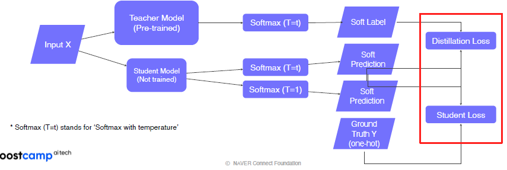

# Computer Vision - Image Classification

## Overview

AI에는 사람의 지능을 컴퓨터 시스템으로 구현한 것이다. 여기서 지능은 인지능력과 지각능력을 포함한 사고능력을 의미한다. 즉, 시각역시 인공지능을 구현하기 위해 필요한 영역인 것이다. 사람으로 예를 들어 표현하자면, 아기시절 세상을 배우기 위해서는 시각과 청각, 미각 등 오감을 전부 이용하여 배우게 된다. 이를 통해 세상과 상호작용을 하고 인과관계를 배우며 사고를 익히기 시작한다. 즉, 지각 능력이 지능에 있어서 가장 중요한 시작인 것이다.


따라서 Computer Vision은 기계에게 이미지를 어떻게 볼지를 가르치는 분야이다.

- Visual perception & intelligence
  - input: visual data (image or video)
- visual perception의 종류
  - Color
  - Motion
  - 3D
  - Semantic-level
  - Social perception (emotion)
  - Visuomotor
  - etc
- 또, 사람이 보는 방식도 포함한다!
  - 사람의 시각능력은 불완전하다.
  - 예를 들어 착시나 illusion image등이 있다. 이를 기계도 사람처럼 볼 수 있도록 학습하는 것도 포함된다.
  - 혹은 적당히 불완전한 이미지도 뇌를 거쳐 보정하여 보는 경우도 있다.
  - 사람의 구조(장단점이 있다)를 모방하는 것이 시작이기 때문

### Machine Learning vs Deep Learning

사람이 직접 특징을 추출하는 것 vs gradient desecent를 통한 특징 추출


deep learning의 부활이 일어나면서 40년간 정체되었던 computer vision이 크게 발전하기 시작했다. 이제는 실제 서비스가 가능한 단계까지 발전했으며 최근에는 computer vision 학술지가 Top 5에 들어가기도 했다.

## Image Classification

분류기 (Classifier)


- 어떻게 구현할까?
  - 만약 세상의 모든 지식(정보)를 가지고 있다면?
  - 그저 갖고 있는 정보에서 찾는, 검색 문제가 된다.
    - k Nearest Neighbors Problem (k-NN)
    - 
  - 다만 세상의 모든 정보를 갖고 있다는 것은 허황된 이야기다...
  - 또, 영상(이미지)간의 유사도는 어떻게 계산할 것인가도 중요한 문제다. 이를 계산하는 것은 시스템 복잡도가 상당하므로 어려운 문제다.
  - 이 모든 것을 Neural Network에 녹여 학습을 해보면 어떨까?

### Convolutional Neural Network (CNN)

- Single layer neural network (fully-connected) : FC layer


모든 픽셀을 서로 다른 가중치로 weighted sum (내적)을 하고, Activation fuction을 통해 분류 score를 출력하는 가장 간단한 모델이다. 간단한만큼 한계도 명확하게 존재한다.


Score를 살펴보자. 하단의 그림은 해당하는 class들의 평균적인 score를 이미지화 한 것이다. 여기서 두가지 문제가 있다. 우선 첫번째는 layer가 한층이라 매우 단순하므로 평균이미지외를 표현하기가 너무 힘들다는 단점이 있다.


두번째 문제로는 학습시 사용한 이미지와 다른 이미지가 들어가는 경우 발생한다. 같은 object이지만 약간의 다른 변화만 있더라도 다른 결과를 내놓게 된다.

이러한 Fully-connected layer를 극복하기 위해 등장한 것이 바로 CNN이다.


- CNN
  - locally connected neural network
  - 하나의 특징을 뽑기 위해 모든 픽셀을 고려하는 fc 레이어와는 다르다
  - 하나의 특징을 위해서 국부적인 픽셀만을 고려한다.
    - 국부적으로 parameter의 숫자가 획기적으로 줄게된다.
    - 국부적으로 본 영역들 간의 연결성도 놓치지 않는다. (슬라이딩 윈도우)
    - Over-fitting도 방지된다.
  - 이런 특징 덕분에 CNN은 다양한 CV task에서 backbone으로 사용된다.


## Brief History


### AlexNet

CNN 구조가 처음 고안된 것은 1998년. 당시에는 CNN 2개정도의 간단한 구조 (LeNet-5)

- Conv - Pool - Conv - Pool - FC - FC
- 5x5 filter with stride 1

AlexNet은 이 구조에서 많은 모티브를 받았다. 차이점은 다음과 같다.


- 7개의 히든 레이어 (60m의 파라미터)
- ImageNet을 이용한 학습 (1.2milion 개의 이미지)
- 더 나은 activation function인 ReLU와 dropout 테크닉 적용
- 모델 구조가 2부분으로 나뉜 이유는 당시 GPU 성능의 한계가 있었기 때문에 병렬처리를 위함이다.


- 주의점. MaxPool2d 의 output은 바로 Linear로 들어가지 못 한다. 공간 정보와 채널 정보도 존재하기 때문. 즉, 3D 구조에서 2D 구조(혹은 1D)로 바꾸어야한다. 따라서 3D인 텐서형태를 벡터 형태로 바꿔야한다.
  - 논문에서는 두번째 방법인 flatten을 사용했다.
  - 2048이였는데 왜 4096?
    - 그 당시 학습할때 성능의 문제로 절반씩 하였기 때문에 2048로 적혀있던 것

#### LRN

Local Response Normalization. 국지적인 노말라이제이션.

현재는 사용하지 않는 기법이기 때문에 설명에서 제외했음. 현재는 Batch Normalization을 사용한다.


그외 AlexNet에서만 썻던 낡은 구조는 11 x 11 conv filter이다. 현재는 이렇게 큰 사이즈의 필터는 사용하지 않는다. Receptiv field란 한 element가 출력되었을 때, 그 element의 출력에 쓰인 field의 영역을 의미한다. (디펜던시가 있다고 봄) 여러 레이어를 거치면서 하나의 결과에 영향을 미친 영역은 점점 커지게 된다.

## VGGNet

지금도 가장 많이 쓰고있는 모델이다.

- 더 깊은 사이즈. 16 ~ 19 레이어
- 더 간단한 구조
  - LRN 사용 안 함
  - 3x3 conv filter, 2x2 max pooling 사용
- 더 좋은 퍼포먼스
- 일반화가 잘 됨 (특징 추출을 잘 한다)

### 상세한 특징

- input
  - 224 x 224 RGB image (AlexNet과 같음)
  - training 이미지의 평균 RGB값을 빼주면서 입력받음 (일종의 normalization)
- Key design choices
  - 3x3 conv filter
  - 2x2 max pooling
  - why?
    - 작은 필터들도 stack을 많이 쌓으면 큰 receptive field 사이즈를 얻을 수 있음.
    - 이는 곧 이미지에서 많은 부분을 고려해서 결론을 내렸다는 뜻이 된다.
    - 더 적은 파라미터를 얻으면서도 더 많은 곳을 고려한 학습이 가능
- 3 FC layer
- ReLU

# Annotation data and efficient learning

레이블링이 잘 되어있는 대용량의 데이터셋을 구축하는 것은 정말 어려운 일이다. annotation data(레이블 된 data)를 구축하는 것도 활발히 연구되는 분야이다. 이번에는 CV 에서 data 부족문제를 해결하는 몇가지 방법들에 대해 알아보겠다.

## Data augmentation

먼저, train data는 real data와 같지 않다. real data는 사람이 찍고, 사람이 보는 이미지이다. 하지만 train에 적합한 data는 조금 다른 관점에서 봐야한다.

세상의 모든 data를 다 얻을 수는 없기 때문에, train data는 실제 data의 극히 일부만 sampling한 데이터라고 볼 수 있다.


학습 데이터에 vias가 되는 경우도 문제다. 학습에 쓰인 데이터는 밝은 데이터로만 되어있다면, 어두운 사진을 받았을 때 제대로 인식하지 못 하는 문제가 발생한다. 이는 모델의 문제라기 보다는 data set이 실제 세상을 충분히 반영하지 못 했기 때문에 발생하는 문제다. 이러한 gap을 어떻게 하면 줄여볼 수 있을까?

gap을 줄이기 위해 구축한 data를 증강하는, augmentation의 방법에는 다양한 방법들이 있다. 이미지를 회전하거나, 밝기를 조절하거나, crop, 컬러 변환, etc... 이 방법들은 OpenCV나 NumPy에 많이 구축되어 있다.

예를 들어 영상의 밝기를 바꾸는 방법은 그냥 각 픽셀에 일정 수치를 더해주면 된다. 혹은 scaling을 고려해볼 수도 있다. 특정 값을 곱해주는 것으로 가능하다.

```python
# rotate
img = cv.rotate(image, cv.ROTATE_90_CLOCKWISE)
# crop
img_crop = image[y_s : y_s + cropsize, x_s: x_s+cropsize, :]
```

Affine transform도 있다. 평행사변형으로 바꿔주는 방법이다.

```python
rows, cols, ch = image.shape
pts1 = np.float32([[50,50], [200,50], [50,200]])
pts2 = np.float32([[10,100], [200,50], [100,250]])
M = cv2.getAffineTransform(pts1, pts2)
shear_img = cv.warpAffine(image, M, (cols, rows))
```


CutMix는 두 이미지를 crop하여 섞는 방법이다. 비율을 조정하는 것으로 두 이미지의 비율을 조정할 수 있다.


### Modern augmentation 기법들

data augementation을 한번씩만 사용해야 할까? 물론 아니다, 조합하여 사용해도 좋다. 그렇다면 어느 것들을 조합할까, 조합 순서는 뭐가 좋을까?

`RandAugmentation` : 모든 가능성을 탐색할 수는 없으니, random하게 섞어서 수행해보고, 성능이 잘 나오는 것을 가져와서 사용해보자. 어떤 것을 가져오고, 얼마나 쎄게 적용할지를 결정한다.

## Transfer learning

여지껏 시도해보지 않은 task를 시도해본다고 가정해보자. 그렇다면 먼저 data set을 구축하는 것부터 시작하게 될 것이다. data를 수집하고, label을 책정하는 것은 단기간에 대규모로 구축하는 것은 쉽지 않다. 의뢰를 한다고 해도 그 data의 퀄리티가 보장되는 것 또한 아니다...

내가 하고자하는 task와 유사한, 기존의 미리 학습한 모델이 존재하다면 가져와서 쓰자! 한 data에서 배운 지식을 다른 data에서 쓰는 것이다!

이것이 가능한 이유는 뭘까?


위 4가지 데이터셋은 서로 다른 task를 위해 구축된 data set이다. 그런데 자세히 살펴보면 의외로 비슷한 data이기도 하다... 이를 활용해볼 여지가 있지 않을까에서 출발한 개념이다.


- 하나의 데이터 셋에서 미리 학습된 모델을 준비한다.
- 마지막 FC layer를 제거하고, 새로운 FC layer를 붙인다.

  - 새로 붙인 layer만 우리가 시도하는 새로운 task에 대한 결과를 학습시키도록 한다. 즉 업데이트를 마지막 fc layer만 하겠다는 것이다.
  - 즉 우리는 레이어 1개만 학습하면 되므로, 많은 데이터가 필요 없다는 의미가 된다!!!


- 미리 다른 데이터셋에서 학습된 모델을 준비한다.
- 마지막 layer를 제거하고 새로운 layer로 대체한다.
- 첫번째 방법과는 달리, 이전의 layer 들도 learning rate는 낮게 잡은 다음 학습을 한다. (body는 업데이트가 느려진다)
  - 우리가 붙인 fc layer는 더 빠르게 학습이 진행되도록 learning rate를 조절한다.
- 이 방법은 데이터가 조금 더 갖고 있는 경우 진행한다.


- Knowledge distillation
- 이미 학습된 teacher 모델의 '지식'을 더 작은 모델 (student model)에게 전달하도록 학습을 진행한다.
  - Student model은 더 작은 모델이다.
- 최근에는 teacher에서 생성된 출력을 unlabeled된 data의 pesudo-labeling하여 사용한다. 즉, 가짜 레이블로 자동생성한다. 이는 곧 더 많은 데이터를 학습에 쓴다는 의미이다.
- 두 모델의 출력을 KL div Loss를 이용하여 학습을 하는데, Student model만 업데이트를 진행한다.
  - KL div Loss는 두 모델의 출력이 비슷하도록 학습을 한다. 이 과정에서는 전혀 label을 쓰지 않기 때문에 un-supervised learning이라고 볼 수 있다.



- 만약 label이 존재하는 데이터가 있어서 쓰고자 한다면?
  - Ground Truth 를 이용할 수 있다. 이는 Student Loss라고 부른다.
  - Soft prediction

### soft label


이게 바로 soft prediction! softmax를 통해 만들어진다.

- Temperature (T)?
  - softmax만 취하게 되면 입력의 값을 극단적으로 벌리게 된다...
  - 입력값을 큰 값으로 나눠서 넣어주게 되면 각 값간의 차이가 줄어들게 된다. 극단적으로 나누는 것 보다는 좁은 폭을 갖는 것이 더 민감하게 구분할 수 있기 때문이다.


- Distillation Loss
  - KLdiv(Soft label, Soft prediction): 두 distribution의 차이(거리)
  - Loss = 티처와 스튜던트 간의 차이를 측정하여 따라하도록
- Student Loss
  - CrossEntropy(Hard label, Soft prediction)
  - Loss = 스튜던트가 출력한 것과 label을 비교하여 맞게 출력하였는지
- 최종적으로 두 loss에 weighted sum을 사용한다.

## Unlabeled data 활용

### Semi-supervised learning

unlabeled data를 활용. label이 필요 없는 data는 구축하기가 훨씬 수월하다. semi-supervised는 unlabel과 label data 둘 다 활용하는 방법이다.


label data로 먼저 pre-trian을 한다.

unlabel data의 pesudo-label을 생성해본다. 이 label을 합친 것을 pseudo-labeled dataset으로 구축하여 다시 사용하게 된다.

### Self-training

가장 높은 성능 향상을 보여줌

augmentation + Teacher-Student networks + semi-superivsed laeraning

- Self-training with noisy student


