# CV - Image Classification II

## Problems with deeper layers

Alexnet (8 layer)에서 VGGNet(19 layer)로 발전해가면서 더욱 깊은 모델이 더 좋은 성능을 보이는 것을 알게 되었다. 하지만 더 깊게 쌓는 것이 만능이었을까?

- Gradient vanishing / exploding
  - 그라디언트가 사라지거나 폭발적으로 커지는 문제
- Computationally complex
  - 계산 복잡도가 점점 늘어나 많은 비용과 시간이 늘어남
- Degradation Problem

## CNN architectures for image classification 2

### GoogLeNet

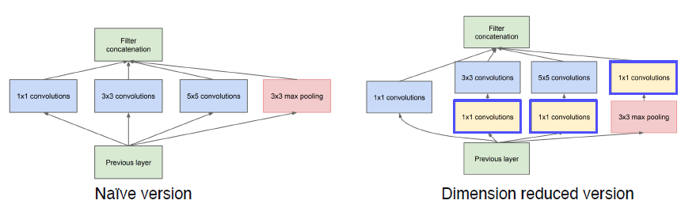

- inception module 제안
  - 하나의 layer에서 다양한 크기의 conv filter를 사용한다.
  - 각 필터의 결과물을 concat하여 다음 층으로 넘겨준다.
    - 즉, depth를 늘이기 보다는 수평적인 확장을 의미한다.
  - 당연하게도 한 층에 여러 필터를 사용하면 계산 복잡도나 용량이 매우 커진다
    - 다른 conv를 적용하기 전에 1x1 conv를 먼저 적용하여 채널을 압축시킨다

#### 1x1 convolution

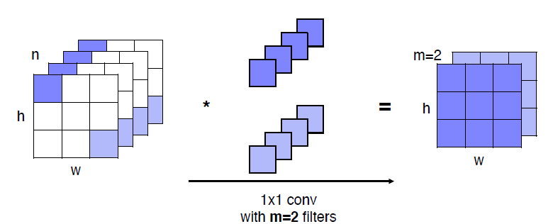
feature vector와 filter vector의 내적이다. 결과물의 차원은 필터의 갯수만큼이 된다. 공간의 크기는 변하지 않고, 채널의 숫자만 바뀌게 된다.

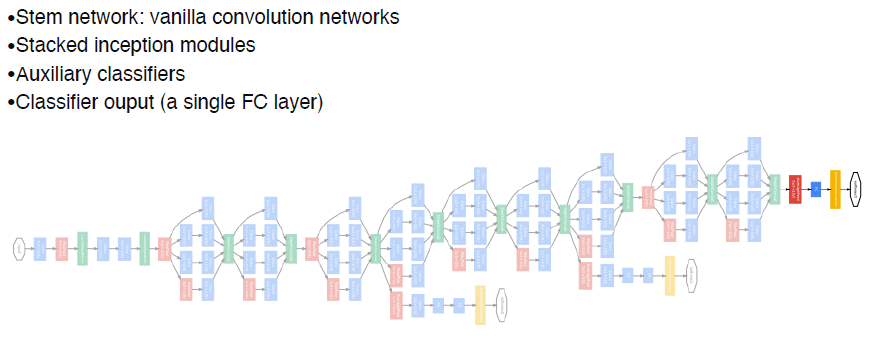

이렇게 인셉션 모듈을 많이 쌓는 구조이다. 다만, 이렇게 깊게 쌓으면 back-propagation gradient가 사라지는 문제가 발생한다. 끝 부분은 학습이 잘 되지만, 앞 부분은 학습이 잘 되지 않게된다. 이를 방지하기 위해 중간 중간에 Auxiliary Classifier 구조를 집어 넣는다. 이 모듈을 통해서 중간 중간 loss를 계산하여 back-propagation을 수행한다.

#### Auxiliary classifier

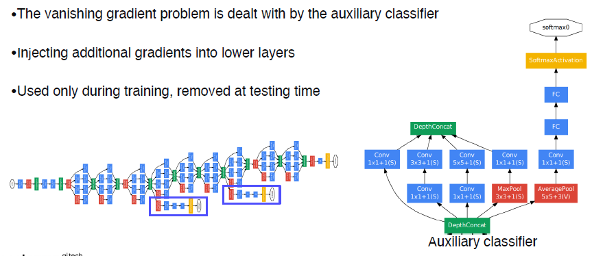

softmax를 사용하며, 두개의 FC와 1x1 Conv로 구성된다. 이 모듈은 학습시에만 사용하고 테스트 시에는 사용하지 않는 것에 주의

### ResNet

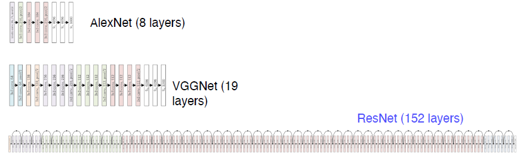

#### Degradation problem

그렇다면 왜 ResNet 이전에는 깊게 쌓지 못 했을까?

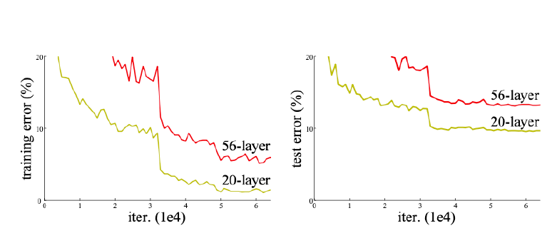

위 그래프처럼 네트워크가 깊어질수록 오히려 error가 높아지는 것을 볼 수 있다. 이전에는 파라미터가 많아질 수록 training error가 낮아질 것이라고 예상했었다. 다만 이는 over-fitting 문제라고는 볼 수 없다. 왜냐면 training과 test의 차이가 적은 숫자의 레이어에서 더 컸기 때문이다.

즉, 이는 degradiation 이라는 다른 문제이고. 이는 56 레이어의 학습이 잘 되지 않은 것이라고 해석해야 한다. (gradient vanishing 때문 등)

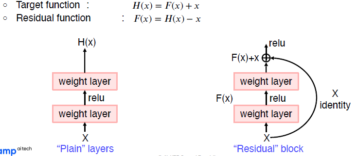

그렇다면 학습 최적화를 어떻게 이뤘을까?

H(x)라는 매핑을 학습할 때, X에서 곧바로 H(X)를 학습하는 것은 복잡하여 어렵다. 이 매핑을 한번에 찾으려 하지 말고, 나머지 잔여 부분(F(x))를 찾아내는 방법을 도입했다. 즉, 일종의 분할정복이다. H(X)를 바로 구하기 어려우니, F(X)를 이용하는 것이다.

이를 구현하기 위해서 논문에서는 Shortcut connection을 제안한다. 백-프로파게이션을 shortcut을 이용해서 바로 전달하는 방법이다. 이를 통해서 gradient vanishing 문제를 해결할 수 있었다.

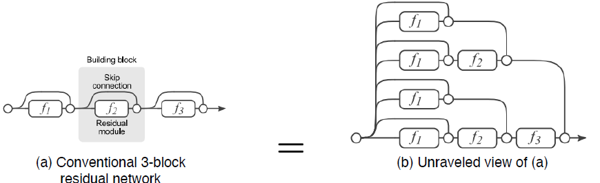

한 분석논문에 의하면 이러한 숏컷 덕분에 그라디언트가 지나가는 경로의 수를 크게 늘릴 수 있다고 한다. 이런 경로의 경우의 수는 2^n이 된다. 따라서 Res block을 하나 추가할 때 마다 경우의 수는 2배가 된다고 볼 수 있다. 따라서 gradient가 다양한 경로를 거쳐 전달되므로 굉장히 복잡한 매핑을 학습하는 효과를 얻게 된다.

#### 구조

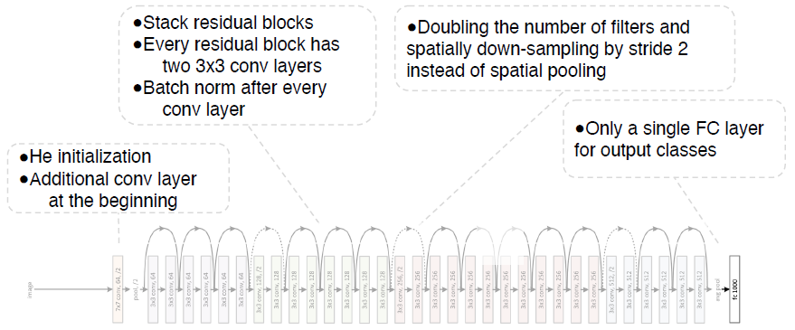

### DenseNet

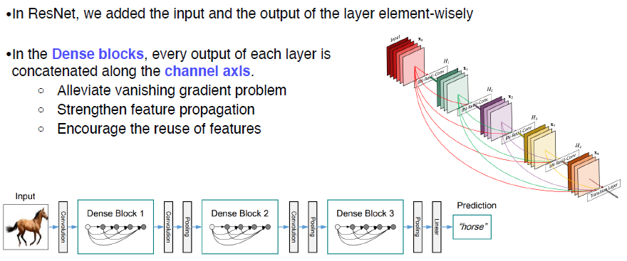

ResNet에서는 skip-connection을 통해 전달한 identity를, DenseNet에서는 채널 축으로 concat되어 있다. 즉, 바로 직전 입력을 넘겨받을 뿐 아니라 훨씬 이전 블록의 정보(출력)도 연결되어 있다. 이래서 Dense하다고 한다.

Resnet의 skip-connection은 덧셈(+)이지만, DenseNet에서는 채널축 `concat`이라는 차이점에 주의

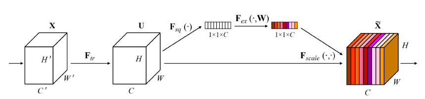

그 외 특징으로는 SENet이 있다. 현재 주어진 activation 간의 관계가 더 명확해지도록 채널간 관계를 모델링하고, 중요도에 따라 attention을 할 수 있도록 한다. attentnion을 생성하는 방법에는 2가지 스텝이 있다.

- Squeeze: global average polling을 통해 각 채널의 공간 정보를 없애고 분포를 구한다. (H와 W를 1로 만든 것이다.)
- Excitation: FC 레이어 하나를 통해 채널간 연관성을 살펴본다. 각 벡터를 받아 W를 거쳐서 채널간 연관성을 고려하여 새로운 weight을 하는 score를 계산한다. 이 채널마다 있는 스코어가 바로 attention score다.
- 이렇게 나온 attention으로 입력 attention과 weight를 같이 활용하여 activation을 re-scaling 한다. 중요도가 떨어지는 것은 닫고, 중요도가 높은 것은 더욱 강하게 만든다.

### EfficientNet

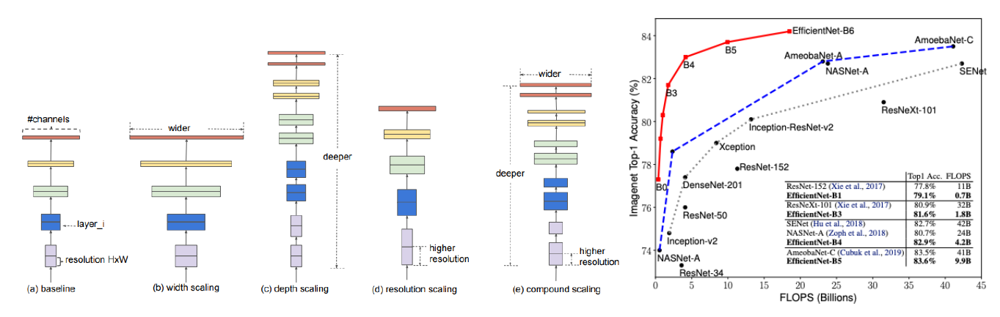

이전까지 모델의 개발 방향은 위와 같았다. 채널 축을 늘리거나(Width, googleNet, densenet), layer를 더 쌓거나(Depth, ResNet), input 이미지를 애초에 큰 것으로 넣는 resolution scailing이 있었다.

위의 각 방법은 늘리다보면 어느정도에서 한계점을 마주치게 된다. 그 지점은 서로 다르다. 특히 resolution의 경우가 성능 증가폭이 가장 크다. 그렇다면 이 세가지 방법을 적절한 비율로 스케일링하여 활용하면 어떨까 하는 점에서 시작된 연구이다. - compound scailing

### Deformable convolution

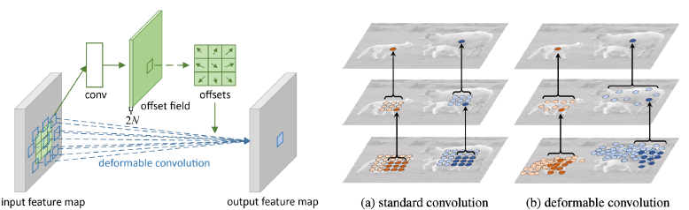

정형화된 convolution이 아닌 새로운 방식을 사용해보는 연구도 진행되었다. fix된 기존의 conv filter 외에도 offsets 매트릭스가 따로 정의되어 있다. offset 필드에 따라 각각의 weight에 따라 filter의 형태를 변형시켜 사용한다. 이렇게 하면 irregular한 grid sampling을 진행할 수 있게 된다.

## Summary of image classification

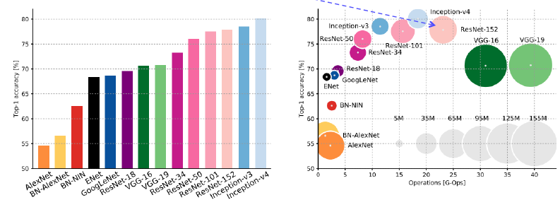

- AlexNet: 가장 간단한 CNN 구조. 매우 간단한 컴퓨테이션, 큰 메모리 사이즈. 낮은 정확도
- VGGNet: 간단한 3x3 conv. 큰 메모리, 매우 큰 계산능력 필요
- GoogLeNet: inception 모듈과 auxiliary classifier가 특징. 적절한 계산량과 메모리사이즈
- ResNet: 깊은 layer와 residual block이 특징. VGG에 비해서 계산량도 적고 메모리 사용량도 작음. 다만 inception 계열 보다는 크고 느리다.

그렇다면 GoogLeNet이 가장 효율적인 CNN 네트워크인가?

- auxiliary classifier의 존재가 학습을 복잡하게 만드는 문제가 있으며, inception 모듈은 수평적 확장이여서 구현이 난해한 문제점이 있다.
- 따라서 일반적으로 대중적으로 쓰이는 Backbone 모델은 VGG나 ResNet이 쓰인다. 간단한 구조이고, 심플하게 쌓을 수 있기 때문이다.
