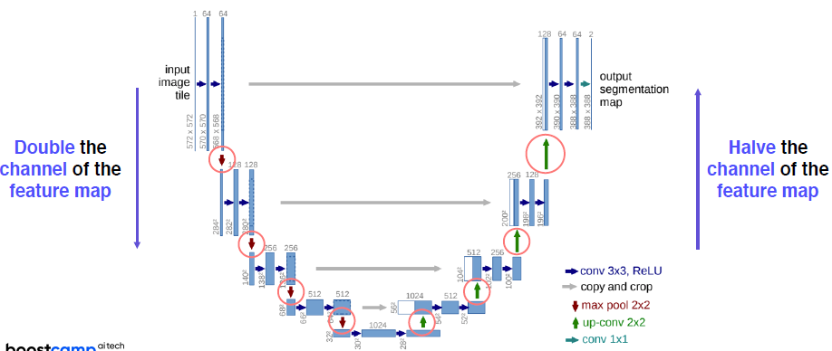

# CV - Semantic Segmentation

## Semantic segmentation


픽셀단위로 이미지를 인식, 분류한다. 예를 들어 자동차가 여러대 있든 하나 있든 같은 class이므로 같은 물체로 인식하게 된다. 응용 분야로는 Medical, 자율주행 등이 있다.

## Semantic segmentation architectures

### Fully Convolution Networks (FCN)

- 첫번째 end-to-end network 구조
  - e2e: 입력에서 출력까지 모두 미분 가능한 뉴럴 네트워크의 형태로, 입력과 출력 데이터의 pair만 있으면 학습을 통해서 target task를 해결할 수 있는 구조를 말한다. 즉, 중간의 구조들이 학습 가능한 구조이다.
  - 이전에는 여러 알고리즘의 결합으로 Semantic Segmentation을 수행했기 때문에 데이터에 따라 학습이 가능한 영역이 제한되어 있었고, 사람이 직접 작업하는 알고리즘에 의존하기 때문에 성능에 제약이 있었다.


- Fully connected layer: 이전까지 가장 많이 사용했던, FC-layer.
  - 기본적으로 공간정보를 고려하지 않고 fixed dim 벡터가 주어지면 다른 fixed dim 벡터로 출력하는 구조이다.
- Fully covoultion layer:
  - 입력이 tensor로 들어오고, 출력도 tensor로 나온다. 즉, 벡터의 dim이 고정되어 있지 않다.
  - 1x1 conv로 구현이 된다.

### FC layer 연산


- flattening을 통해 긴 벡터 형태로 만들고, FC layer에 input으로 넣어준다.
  - 이렇게 만들면 영상(이미지)의 공간정보를 고려하지 않게 된다. 그렇다면 어떻게 위치 정보를 넣을 수 있을까?
  - 각 위치마다 채널 축으로 Flattening을 하면 된다!


- 이렇게 각 위치에서 채널축 방향으로 Flatten을 하면 된다.
- 이 개념은 1x1 conv와 동일하다!!!


- 결론
  - FC layer는 1x1 conv로 해석과 구현이 가능하므로 FC layer를 Conv layer로 대체 가능하다.
  - 이를 통해 어떤 이미지 사이즈에도 대응 가능해진다.
  - 이제 각 위치별로 classification이 가능해지는데, 이러면 오히려 작은 output score map을 얻게 된다. (input은 큰데, output은 작다는 뜻이다)
  - 만약 넓은 영역을 고려하고 싶다면? stride나 pooling layer를 조절하면 된다! 다만 이는 필연적으로 해상도를 낮추게 된다.
    - Upsamling으로 이 해상도가 작아지는 문제를 해결한다.


### Upsampling


- FCN에서는 작은 activaiton map을 원래 input size에 맞추기 위해 upsampling을 한다.
- stride나 pooling을 제거하면 작은 activation map을 얻지 못 한다. 즉, 고해상도의 맵을 유지할 수 있다. 그러나 이렇게 하면 receptive field size가 작기 때문에 영상의 전반적인 context를 파악하지 못 하는 단점이 있다.
  - 따라서 Trade-off가 있다. 일단 작게 만들어서 receptive field를 최대한 키워놓고, upsampling을 통해 해상도를 높여주는 과정을 거친다.
  - Upsampling에는 2가지 방법이 있다.
    - Transposed convolution
    - Upsample and convolution

#### Transposed convolution


a,b 두개의 입력이 주어졌을 때, Transposed conv의 필터가 있다고 가정. 위의 그림과 같은 연산을 통해 output을 내놓게 되는데, 이때 확장이 되는 것을 알 수 있다. 중첩된 부분에선 더하기가 이루어진다.

- 그렇다면 중첩되는 부분이 계속 더해져도 되는 건가?
  - 이 부분을 매우 주의해야한다!!!!
  - conv kernel size와 stride size를 잘 조절하여 중첩이 생기지 않도록 해야한다.


#### Upsampling and convoution

Transposed의 오버랩 문제를 해결.


- Upsampling에서는 중첩 문제가 없고, 모두 골고루 영향을 받게 만든다.
- Transposed conv: 학습 가능한 upsampling을 하나의 layer로 한번에 처리한 것으로 볼 수 있다.
- Upsampling conv: 업샘플링 operation을 두개로 분리하고 (NN, Billnear 등)을 적용 후 conv를 진행한다

### FCN

아무리 업 샘플링을 하더라도 잃어버린 정보를 살리는 것은 쉽지 않다. 각 layer별로 activation map의 해상도와 의미를 살펴보자.


- 낮은 레이어에서는...
  - receptive 사이즈가 작기 때문에 국지적이고, 작은 디테일을 본다.
  - 작은 차이에 민감하다
- 높은 레이어에서는...
  - 해상도는 낮아지지만, 큰 receptive field를 가진다.
  - 이미지 전체의 의미론적(Semantic) 정보를 포함하게 된다.
- 그러나 우리는 위 두가지 정보가 모두 필요하다! 국지적인든, 전체적이든!
  - 위 두가지를 모두 확보하기 위해
  - 높은 레이어는 업샘플링을 통해 해상도를 크게 높인다
    - 그에 맞춰 중간층 activation map을 업샘플링을 해서 가져온다.
  - concat을 하여 최종 출력을 만든다.


- FCN-8s가 가장 많은 activation map을 사용하는 버전이다.
- 결과를 살펴보면, 중간 단계 특징을 많이 합친 FCN-8s가 가장 성능이 좋다.

### Hypercolums for object segmentation

동시기에 발표된, 비슷한 주제의 논문. 다만 강조하는 것이 달랐다. FCN과는 달리 낮은 레이어와 높은 레이어의 feature의 융합을 강조하였다. 1x1 conv나 fully conv가 강조되지는 않은 연구다.


FCN의 마지막 부분과 마찬가지로, 낮은 레이어와 높은 레이어의 특징을 해상도를 맞춰 같이 사용하는 방식을 제시했다. 다만, End-to-end 구조는 아니었다. 서드파티 알고리즘을 이용하여 물체의 bounding box를 추출하고 사용했다는 점이 아쉽다.

### U-Net

- Fully conv network이다
- 낮은 layer와 높은 layer를 잘 결합하는 방법을 사용
  - skip connection 이용


- 먼저 입력 영상을 몇개의 conv를 통과시키고, pooling을 통해서 receptive field를 확보하기 위해 해상도를 낮추고 채널 수를 늘린다.
  - 이를 몇차례 반복하여 작은 activation map을 만들어내고, 여기에 영상의 정보가 잘 녹아있다고 본다.
- 다음에는 디코딩이라고도 부르는 Expanding path이다. 한번에 업 샘플링을 하지 않고 단계적으로 activation map의 해상도를 늘려준다.
  - 이 때 이전 path에서 대칭되는 layer와 동일하게 맞춰서 낮은 층의 activation map을 합쳐서 사용할 수 있도록 한다. (skip connection)
  - 채널 사이즈가 점점 줄어들고 해상도는 늘어난다
  - fusion 하는 방법에서는 concat을 사용한다.




- Concatenation of feature maps provides localized information
  - 낮은 레이어에서 전달된 특징이 로컬라이즈된 정보를 준다고 한다.
  - 공간적으로 높은 해상도와 입력이 약간 바뀌는 것 만으로도 민감한 정보를 제공한다.
  - 경계선이나 공간적으로 중요한 정보를 뒤쪽 레이어로 바로 전달하는 (skip connection) 역할을 한다는 것이다.

#### U-net 주의점

- 만약 feature map(activation map)의 사이즈가 홀수라면?


- U-net에서는 업 샘플링과 다운 샘플링이 매우 빈번하게 일어나는 구조이다.
- 따라서 위와 같은 문제 처럼 해당 이슈에 대해 적절한 처리를 해야한다...
  - 절대 홀수 해상도의 map이 나오지 않도록 조심해야한다!!!

#### U-net with pytorch

```python
def double_conv(in_chan, out_chan):
    return nn.Sequential(
        nn.Conv2d(in_chan, out_cha, 3),
        nn.ReLU(inplace=True),
        nn.Conv2d(out_chan, out_chan, 3),
        nn.ReLU(inplace=True)
    )

## down sampling
self.dconv_down1 = dobule_conv(3, 64)
self.maxpool_2x2 = nn.MaxPool2d(kernel_size=2, stride=2)

self.dconv_down2 = dobule_conv(64, 128)
self.maxpool_2x2 = nn.MaxPool2d(kernel_size=2, stride=2)

self.dconv_down3 = dobule_conv(128, 256)
self.maxpool_2x2 = nn.MaxPool2d(kernel_size=2, stride=2)

self.dconv_down4 = dobule_conv(256, 512)
self.maxpool_2x2 = nn.MaxPool2d(kernel_size=2, stride=2)

self.dconv_down5 = double_conv(512, 1024)

## up sampling
self.up_trans1 = nn.ConvTransposed2d(in_chan=1024, out_chan=512, kernsel_size=2, stride=2) # 여기서 커널 사이즈와 스트라이드가 2인 점에 유의. 중첩되는 부분이 없다
self.up_conv_1 = dobule_conv(1024, 512)

self.up_trans_2 = nn.ConvTransposed2d(in_chan=512, out_chan=256, 2, 2)
self.up_conv_2 = double_conv(512, 256)
# ...

self.out = nn.Conv2d(in_chan=64, out_chan=2, kernel_size=1)
```

### DeepLab

2015년 ICLR에서 소개되었다. CRFs 라는 후처리와 Atrous Convolution이라는 conv가 특징이다.


- Conditional Random Fields (CRFs)
  - 픽셀과 픽셀 사이의 관계를 이어주고, 그러한 픽셀 맵을 본다.
  - 즉, 경계를 잘 찾을 수 있도록 한다.


- Dilated convolution
  - Atrous conv라고 부르기도 함
  - Conv kernel 사이에 dilation factor 만큼 일정한 공간을 넣어준다.
  - 실제 conv filter가 커버하는 영역보다 더 넓은 영역을 커버하면서, 파라미터는 증가하지 않는다.


