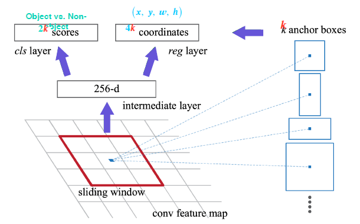

# CV - Object detection

## Object detection


같은 클래스(차, 사람)이더라도 인스턴스까지 구분이 가능하느냐를 해결해야만 Panoptic segmentation으로 나아갈 수 있다. object detection은 Classification과 Box localization 두가지를 해결해야 가능하다.

Object detection은 자동 주행이나, OCR 등 이미지 인식 전반에서 유용하게 사용되는 기술이다.

## Two-stage detector

### 과거의 Obejct detection

1. Gradient-based detecotr


경계선을 찾아내면 가능하겠구나! --> 특정 물체의 특징을 가정하고, 경계선을 찾아내는 알고리즘을 설계

2. Selective search


가장 최근까지도 사용했던 기술이다. 특정 물체 뿐 아니라 다양한 물체 후보군에 대해서 영역을 특정해서 제안하는 방식이다. Box-proposal 알고리즘이라고 부르기도 한다.

1. 영상을 비슷한 색끼리 잘게 분할을 한다.
2. 잘게 분할한 영역을 다시 비슷한 영역끼리 (색이나 그라디언트가 비슷하다거나 등) 합친다.
3. 합쳐진 큰 Segmentation들을 포함하는 Bounding box를 추출하여 물체의 후보군으로 사용한다.

### R-CNN


2014년 압도적인 성능을 보이며 등장! 먼저 영상에서 Selective search같은 방법으로 먼저 region proposal을 구한다. 그리고 이를 적절한 사이즈로 warp하고 뉴럴 네트워크(CNN)에 input으로 넣고 cateogry classification을 진행한다.

CNN은 미리 학습된 모델이고, 마지막 FC 레이어에서 추출된 feature를 기반으로 학습을 진행한다.

단점: 각각 region proposal 하나하나를 모델에 넣어 학습하기 때문에 속도가 느리다. 또, region proposal은 별도의 알고리즘을 사용하므로 학습을 이용한 성능 향상과 관계가 없다는 단점이 있다.

### Fast R-CNN


핵심: 영상 전체에 대한 feature를 `한번`에 추출하고, 이를 재활용하여 여러 object들을 detection 한다.

1. Conv featur map을 뽑아낸다
2. 한번 뽑은 feature를 재활용하기 위해 제안된 RoI pooling layer
   1. RoI: Region of Interest. 리전 프로포절이 제시한 물체 후보의 위치
   2. RoI에 해당하는 feature만 추출한다.
   3. fixed size 되게 리사이즈도 거침
3. 더 정밀한 bounding box 위치 추출을 위한 regressor와 classification을 위한 softmax

기존의 R-CNN에 비해 18배정도 빠른 속도를 보였다. 하지만 여전히 별도의 알고리즘을 이용해 region proposal을 추출하고 있다는 단점이 있다. 손으로 작성한 알고리즘에 의존적이라는 한계이다.

### Faster R-CNN

이제 드디어 region proposal을 개선하게 된다. 뉴럴 네트워크 기반으로 대체가 되었다. 즉, 최초의 end-to-end 모델이 되었다!

#### IOU


두 영역의 overlap을 측정하는 기준을 제시한다. 이 수치가 높을수록 두 영역이 잘 정합되었다고 볼 수 있다.

#### Anchor boxes


각 위치에서 발생할것 같은 box들을 미리 정의해놓은 후보군이다. 각 scale에 따라 어떤 박스가 발생할지 미리 정의해 놓은 것이다.

학습을 진행하면서 GT가 어느정도 이상이면서 IoU와도 align이 잘 된 box는 postive sample이 된다. 즉, object에 해당된다고 보고 나머지 박스들은 negative box로 삼아 loss를 주고 학습을 진행한다.

#### Region Proposal Network (RPN)


가장 중요한 변경점은 Region proposal network이다. 영상 하나에서 공유되는 feature map을 미리 뽑아두고, 여기서 여러 region을 제안하게 된다. 이에 대해서도 RoI pooling과 classifier를 통해 학습을 진행한다.



feature map 관점에서 슬라이딩 윈도우 방식으로 매 위치마다 k개의 anchor box를 고려한다.

각 위치에서 우선 256-d 의 feature vector를 하나 추출하고, 2k 개의 classification score를 뱉어낸다. 여기서 2k인 이유는 object / non-object이기 때문이다.

이후 k개의 bounding box의 정교한 위치를 regression 하는 4k coordinates도 뽑아낸다. 여기서 4k인 이유는 x, y 좌표와 넓이, 높이 정보를 포함하기 때문이다.

#### Non-Maximum Suppression (NMS)


RPN에서는 일정 objectness score 이상이면 전부 내보내게 되기 대문에 엄청나게 많고 중복되는 bounding box들이 나오게 된다. 이 박스들을 효과적으로 필터링 및 스크리닝 하기 위해 NMS를 적용한다.

```
Step 1: Select the box with the highest objectiveness score
Step 2: Compare IoU of this box with other boxes
Step 3: Remove the bounding boxes with IoU 50%
Step 4: Move to the next highest objectiveness score
Step 5: Repeat steps 2-4
```

이 방법은 딥러닝 이전 세대에서도 계속되서 사용된 방법이다.

### R-CNN 요약


## One-stage Detector


정확도를 조금 포기하더라도 속도를 확보하여 real-time detection이 가능하도록 하자! region proposal을 기반으로 한 RoI pooling을 사용하지 않아 구조가 간단하고 수행시간이 빠르다.

### YOLO


이미지를 각 grid로 나누고, 각 grid에서 B개의 box (4개 좌표, confidence score)를 예측한다. 각 위치에서의 class score도 예측한다. 앵커 박스와 유사한 개념이다. Faster R-CNN과 마찬가지로 박스들을 필터링 및 추출한다.


마지막 출력이 30 채널이다. 여기서 Bounding box의 앵커는 2개를 사용했다. class는 20개의 class를 고려했다. 이후 5B + C 이므로, 10 + 20이 되어 30의 grid가 나오게 되기 때문이다.

YOLO는 당시 real-time 에서는 압도적인 성능을 보였고, Faster R-CNN보다는 훨씬 빠르지만 조금 낮은 성능을 보였다.

### Single Shot MultiBox Detector (SSD)

YOLO는 맨 마지막 레이어에서만 한번 prediction을 하기 때문에 local 정확도가 떨어지는 결과를 보였다. 이를 보완하고자 SSD가 등장하였다.


SSD는 멀티 스킬 오브젝트를 잘 처리하기 위해 중간 feature map을 각 해상도에 맞춰 적절하게 bounding box를 추출할 수 있도록 만들었다. 각 feature map마다 해상도에 적절한 박스를 만든 것이다. 이렇게 여러개의 feature map을 고려하여 다양한 box shapes를 고려하게 되었다.


중간 feature map은 물론 최종 결과에도 classifier가 붙어 있다. 각 층마다 object detection 결과를 출력하도록 하여 다양한 스케일에 대해서 잘 대응하도록 설계하였다.

정말 많은 숫자의 앵커 박스를 사용함에도 네트워크 구조가 단순하여 속도가 훨씬 빠르다. YOLO보다 더 좋은 성능 (심지어 Faster R-CNN 보다도!)과 속도를 보였다.

## Two-stage vs One-stage


먼저 싱글 스테이지 방법들은 RoI pooling이 없다보니, 모든 영역의 loss가 계산되고 일정한 gradient가 발생된다. 이러한 점은 문제가 된다. 대부분의 이미지는 배경이 더 넓고 물체는 일부분만 공간을 차지하고 있기 때문에 적절한 사이즈의 박스 하나로도 커버가 될 수 있다. 즉, Postive sample은 적은 반면에 배경에서 오는 gradient들은 유용한 정보도 아니면서 많은 영역과 정보를 차지하기 때문에 class imbalance 문제를 보이게 된다.

### Focal loss

imbalance 문제를 해결하기 위해 제안된 loss이다. 크로스 엔트로피의 확장이라고 볼 수 있다.


True class에 대한 스코어가 높아 정답을 잘 맞추게 되는 영역에서는 낮은 loss를 반환할 것이다. 반대로 맞추지 못 하는 경우에는 큰 loss값을 반환할 것이다.

Focal loss에서는 여기서 한발 더 나아간다. 잘 맞추는 경우에는 더 loss를 낮게 만들고, 반대로 맞추지 못 할 수록 더욱 sharp 한 loss를 주게 된다. 오답일 때 감마가 큰 경우에 더 작은 loss를 갖게 된다. 주의할 점은 틀렸음에도 loss가 작게 들어간다는 착각을 할 수 있다. 여기서는 절대값 자체가 중요하다기 보다는, 네트워크 학습시 gradient를 쓴 다는 점을 상기해보자. 즉, 기울기를 살펴보라는 것이다. 감마가 클 수록 기울기가 매우 샤프하다는 것을 알 수 있을 것이다.

따라서 정답을 맞출수록 gradient가 한 없이 0에 가깝게 된다. 즉, 정답에 가까운 경우는 거의 무시가 되고, 틀리는 부분이 큰 영향을 끼치게 된다. 따라서 어렵고 잘 못 판별한 예제에 대해서 더욱 민감하게 처리를 한다는 것이다.

### RetinaNet

#### Feature Pyramid Network


low level 특징 레이어와 high level의 특징 레이어를 활용한다. 중간 중간 feature를 다음에 넘겨주고 더하기로 fusion을 한다. class 헤드와 box 헤드가 따로 구성이 되어서 dense하게 각 위치마다 수행하게 된다.

## Detection with Transformer

새로운 트랜드는 Transformer의 CV 분야 도입이다. 구글의 ViT, 페이스북의 DETR등 많은 시도가 진행중이다.

### DETR


기본적으로 CNN의 feature와 각 위치의 multi-dim으로 표현된 encoding을 통해 입력 토큰을 만들어 준다. 이후 트랜스포머 인코더와 디코더를 거치며 학습을 진행한다.

여기서 object query를 통해 모델에 질의를 하게 된다. 특정 위치의 object가 무엇이냐? (여기서 쿼리는 또 다른 학습된 positional encoding이다.) 그러면 해당 질의에 적절한 답을 파싱한다.

## Detection object as point

최근에는 bounding box를 regression하지 말고 다른 형태로도 object detection이 가능한지 연구가 진행중이다. 물체의 중심점을 찾는다거나, 왼쪽 위와 오른쪽 아래의 양 끝 점을 찾아 box를 찾는 것을 피하고 다른 식으로 box를 찾는 다는지 등 다양하게 연구가 이루어지고 있다.
