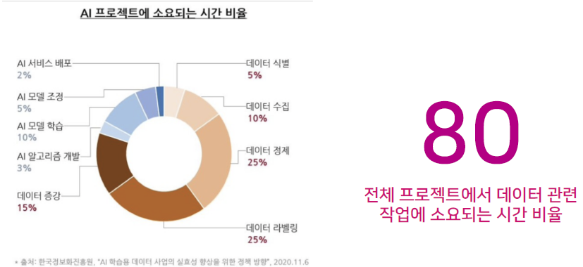
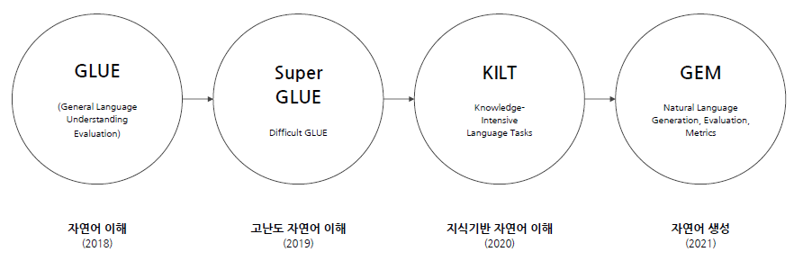

# 데이터 제작의 A to Z

## 데이터 제작의 중요성

- 일반적인 인공지능 서비스 개발 과정
  - 서비스 기획 (문제 정의)
  - 데이터 준비 수집 정제
  - 모델학습 -> 모델 검증 -> 분석 -> 모델학습 -> ...
  - 모델 평가
  - 배포



## 데이터 구축 과정

- 원시 데이터 선정 및 확보
  - 저작권과 태스크 적합성을 고려하여 선정
- 구축 및 가공 `프로세스 확립`
  - 구축 및 검수 절차 준비
  - 작업자 선정
- 구축 및 가공 `지침 작성`
  - 플랫폼 소통 및 작업자 교육
- 데이터 구축 및 `가공`
  - 파일럿, 작업자 관리
- 데이터 검수
  - 품질 평가 기준, 데이터 규격, 내용

## 데이터 설계

- 데이터의 유형
- 데이터의 in/out 형식
- train validation test 별 규모와 구분 방식
- 주석의 유형

### 데이터의 유형

- 소리: 신호처리, 음성인식
- 텍스트: 자연어
- 이미지: 컴퓨터 비전
- 영상: 영상처리
- 멀티모달

### 데이터 in/out

텍스트 데이터에 대해서는 HTML, XML, CSV, TXT, JSON 등을 주로 사용한다. 이미지라면 JPG, PDF, png등이 있고, 음성이나 영상이라면 mp3, pcm 등이 있다.

### 데이터 규모 & 구분 방식

학습 데이터와 검증(개발) 데이터, 그리고 평가 데이터의 규모를 정하는 것도 중요하다. 규모 선정에 필요한 정보는 확보 가능한 원시 데이터의 규모와 주석 잡업 시간에 달려있다.

구분 방식에는 데이터 비율과 기준에 따라 다르다. 랜덤하게 나눌 것인지, 특정 조건을 적용할 것인지.

### 주석 (annotation)

|     주석 유형(Annotation Type)     | 활용 용도                                             |
| :--------------------------------: | :---------------------------------------------------- |
|      클래스 라벨(단일, 다중)       | 텍스트 분류 (감성, 주제 등)                           |
|          단어(구문) 라벨           | 명명된 개체명(Entity) 인식 (Named Entity Recognition) |
|            텍스트 라벨             | 문장 번역, 문장 요약                                  |
| 단어 라벨링 및 두 단어 사이의 관계 | 관계 의존성 정의 (Relation-Dependencies)              |
|                기타                | 그 밖의 용도                                          |

### 데이터 수집-가공

- 원시 데이터 선정
  - 전산화, 스크래핑, 작업자가 작성, 모델 생성 등등...
  - 적합한 데이터란 무엇인지 기준을 세워야 한다
- 작업자 선정
  - 주석 작업의 난이도와 규모에 맞게 선정
  - 전문가가 필요한지, 크라우드 소싱으로 처리할 것인지
- 구축 및 검수 설계
  - 구축 작업의 난이도와 규모, Task 특성에 맞는 구축 및 검수 방식 설계
  - 전문가 IAA가 필요한 경우가 있음
  - 하나의 데이터르 한 사람만 볼지, 여러사람이 볼지 여부
  - 일반적으로 파일럿 작업의 경우 100개~1000개 정도
    - 일반적으로 딥러닝시 최소 필요 수량은 1만개 정도이다. (문장이라고 하면 약 3만 문장정도)
    - 3만개의 약 10%를 파일럿으로 구축한다고 보면 된다.
    - 가이드라인을 작성하면서 최소 100개 정도는 직접 해본다.
- 데이터 구축 및 가공
  - 파일럿
    - 설계 시 발견 못한 이슈 발굴 및 해결
    - 생각보다 이슈가 많이 발생하므로 꼭 해결하고 넘어가야 함
    - 가이드라인 보완 및 개정
    - 작업자 선정
  - 본 구축
    - 작업 일정 관리
    - 작업자 관리 (작업량 관리 및 결과물 퀄리티 관리)
    - 중간 검수
- 데이터 검수 및 분석
  - 평가지표 설정
    - 전문가 평가: 샘플링 검사, 가이드라인 적합도 분석
    - 자동 평가: 데이터 형식, 레이블별 분포 파악, 일괄 수정 사항 반영

### 데이터 분류 방식

- 원천 데이터 도메인: 문어(가사, 도서), 구어 (대화), 웹(메신저 대화, 게시판 등)
- 과제 유형
  - 자연어 이해(형태분석, 구문분석, 문장 유사도 평가 등)
  - 자연어 생성(기계번역, 추상 요약)
  - 혼합 (이해+생성: 챗봇)
- 자연어 처리 데이터를 만들 때는 복잡한 과제도 단순화하여 단계별로 구축해간다

# 자연어처리 데이터 기초

## 인공지능 개발을 위한 데이터

- 데이터의 종류
  - 말뭉치 류
    - 실제 텍스트 기반의 데이터.
    - 대화문, 기사, SNS 텍스트, 댓글, 주석 말뭉치, 요약 말뭉치 등등...
  - 사전/데이터베이스 류
    - 텍스트 분석 시 참조로 사용되는 자원
    - 온톨로지: 지식을 표상하기 위한 체계에 따라 어휘들의 의미를 분석해놓음
    - 워드넷, 시소러스: 단어간의 관계를 나타냄
    - 지식 그래프

### 언어 모델 평가를 위한 벤치마크



벤치마크에는 Task와 평가 데이터, 검증데이터, 훈련데이터가 제공된다. 이때 평가 데이터는 제외하고 제공한다. 이후 평가지표를 통해 검증한다.

## 데이터 관련 용어 정리

- 텍스트 text
  - 주석, 번역, 서문 및 부록 따위에 대한 본문이나 원문.
  - 언어 문장보다 더 큰 문법 단위. 문장이 모여 이루어진 `한 덩어리의 글`
- 말뭉치 corpus, plural corpora
  - 어떤 기준으로든 한 덩어리로 볼 수 있는 `말의 뭉치`
  - 텍스트 아카이브 text archive vs 말뭉치 corpu(selected, structured, designed)
- 데이터 data
  - 컴퓨터가 처리할 수 있는 문자, 숫자, 소리, 그림 따위의 형태로 된 정보
  - 말뭉치 데이터 corpus data: 말뭉치 자체
  - 말뭉치의 데이터 data from corpus: 용례 색인 결과, 언어 추출 결과, 통계 분석 결과 등
- 주석
  - 주석: tag, label, annotation
  - 형태소 분석기
    - POS(part of speech) tagger
    - Segmentation (문장 분할)
    - Tagging (품사 태깅)
  - 언어 사실을 분석하고자 하는 열망

### 텍스트 데이터의 기본 단위

- 영어 말뭉치의 계량 단위: 단어 (띄어쓰기 단위) / 문장 또는 발화
- 한국어 말뭉치의 계량 단위: 어절 (띄어쓰기 단위) / 문장 또는 발화

한국어의 단어는 9품사로 분석된다. 이중 `조사`는 체언(명사, 수사, 대명사)와 붙어서 사용되기 때문에 띄어쓰기 단위와 단어의 단위가 일치하지 않는 문제가 발생한다. 또한 `어미`는 하나의 품사로는 인정되지 않으며 형태 단위이므로 독립된 단어가 아니다.

> 어미는 단어가 아닌데 조사는 단어이다...

- 품사: 단어를 문법적 성질의 공통성에 따라 몇 갈래로 묶어 놓은 것
- 품사 분류의 기준: 의미(meaning), 기능(function), 형식(form)

### 타입 & 토큰

- 토큰화 tokenization -> 표제어 추출 lemmatization / 품사 주석 태깅 POS tagging
- TTR: type/token ratio - 말뭉치 크기와 반비례
- 토큰: 언어를 다루는 가장 작은 기본 단위. 단어, 형태소, 서브워드 등이 있음
- 타입: 토큰의 대표 형태

한국어 예시로 살펴보자

```
"이 사람은 내가 알던 사람이 아니다."

- 토근화: 이 사람 은 내 가 알 더 ㄴ 사람 이 아니 다
- 표제어 추출: 이, 사람, 나, 알다, 아니다
- 품사 주석: 이/MM 사람/NNG+은/JX 나/NP+가/JKS 알/VV+더/EP+ㄴ/ETM 사람/NNG+이/JKS 아니/VA+다/EF
    - 여기서 이/MM 과 이/JKS 는 서로 다른 품사이고 지칭하는 바도 다르다. 형태는 똑같기 때문에 토큰의 대표 형태(타입)은 같다. 하지만 토큰으로는 다른 것이다.
- 토큰 수는 12개, 타입 수는 10개이다
```

### N-gram

연속된 N개의 단위. 입력된 단위는 글자, 형태소, 단어, 어절 등으로 지정할 수 있음

> 흔들리는 꽃들 속에서 네 샴푸향이 느껴진거야

- 글자수 bi-gram
  - 흔들, 들리, 리는, 는꽃, 꽃들
- 형태소 bi-gram
  - 흔들리+는, 는+꽃, 꽃+들, 들+속, ...
- 어절 bi-gram
  - 흔들리는+꽃들, 꽃들+속에서, 속에서+네, ..
- 보통은 bi-gram, uni-gram을 자주 쓴다

### 표상 representation

대표로 삼을 만큼 상징적인 것.

자연어처리 분야에소 표현으로 번역하기도 하나, 자연어를 컴퓨터가 이해할 수 있는 기법으로 표시한다는 점에서 표상이 더 적합. 표시를 통해 재현과정을 통해 나타내는 작업.

사전학습모델 (PLM), word2vec 등등

## 자연어처리 데이터 형식

- HTML
  - 웹 페이지를 표현하는 마크업 언어
  - 보통 크롤링 하는 자료는 HTML로 되어 있음
- XML
  - 사람과 기계가 동시에 읽기 편한 구조
  - 다른 특수한 목적을 갖는 마크업 언어를 만드는데 사용하도록 권장하는 다목적 마크업 언어
  - HTML과의 차이는?
    - HTML은 세계 규약에 맞춰서 갖춰야 하는 태그등이 지정되어 있음
    - XML은 본인 마음대로 구성할 수 있음
- JSON
  - 속성-값 쌍의 구조로 이루어진 데이터 오브젝트를 전달하기 위해 제안된 개방형 표준 포멧
  - 역시 사람과 기계 둘 다 읽기 편하게 되어있음
  - 기본 자료형은 수, 문자열, 불린, 배열, 객체, null이 있다.
  - JSONL: JOSN을 한줄로 만든 것임
- CSV, TSV

## 공개 데이터

- 경진대회 공개 데이터
  - Kaggle
  - Dacon
- 국가 주도 공공 데이터
  - 국립국어원: 모두의 말뭉치
  - AI Hub
- 오픈소스 + 벤치마크
  - paper with code
  - nlp-progress
