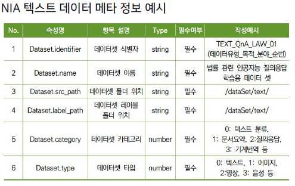
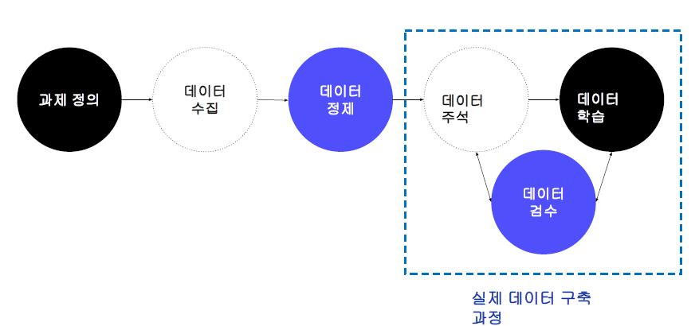
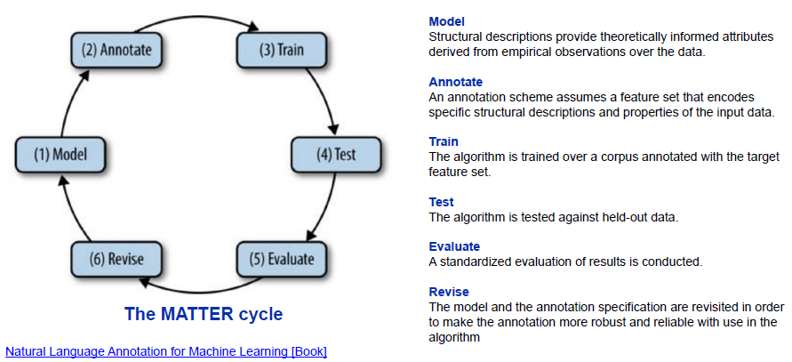
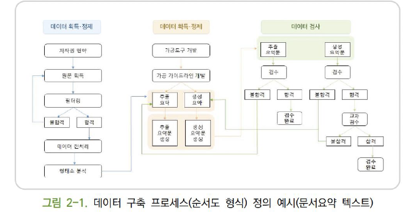

# 자연어처리 Task들

## 최신 자연어처리 데이터를 찾는 법

내가 하고자하는 프로젝트와 유사한 task를 찾아서 도전해보자

- [NLP-progress](http://nlpprogress.com)
- [Papers with code](https://paperswithcode./com/search?q_meta=&q_type=&q=lexical+semantic)
  - 추천!!

## 질의응답 QA

- SQuAD: 위키피디아 데이터를 기반으로 제작한 기계독해 및 질의응답 데이터
  - KorQuAD (한국어)
  - SQuAD 1.0 데이터 구축
    - 구축 대상 기사 추출: 위키피디아 상위 10000 기사 중 500자 이하인 536 기사 무작위 추출
    - 크라우드 소싱을 통한 질의 응답 수집: 각 문단마다 다섯개의 질문과 답변 수집
    - 추가 응답 수집: 평가를 통해 각 질문당 최소 두개의 추가적 답변 수집. 기사의 단락과 질문 노출 후 가장 짧은 대답 선택
  - SQuAD 2.0
    - 크라우드 소싱 플랫폼을 통해 대답하기 어려운 질문 수집: 각 문단마다 문단 만으로는 대답할 수 없는 다섯개의 질문 생성 & 적합한 질문을 25개 이하로 남김
    - 적합한 질문이 수집되지 않은 기사는 삭제
    - 학습, 검증, 평가용 데이터 분할
- 중요한 점은 좋은 질문답변을 수집할 수 있도록 적절한 플랫폼을 제공해야 한다. 또, 섬세한 지시문을 통해 사람들이 작업을 잘 수행할 수 있도록 해야한다.
  - 문장 생성을 유도하는 경우에 구체적인 지시문을 최대한 넣어야한다. 성의없는 답변을 내지 않도록 하는 주의 문구나 권유등이 필요하다. 또, 지나치게 반복되는 답변이 나오지 않도록 하는 것도 중요하다. 피해야 하는 단어 리스트를 주거나, 특정 단어를 넣어서 하거나 등등

## 기계 번역

- WMT 데이터셋
  - 2014년 이후 시행된 기계 번역 학회에서 공개한 데이터셋. 다국어 번역 데이터이며 두 언어간의 병렬 말뭉치로 구성됨. 뉴스, 바이오, 멀티모달 데이터가 제공
  - 2018년 기준
    - 평가용 데이터: 1500개의 영어문장 + 1500개의 다른 언어
    - 훈련용 데이터: 기존에 존재하는 병렬 말뭉치와 단일 언어 말뭉치 제공

## 요약

- CNN/Daily Mail
  - 추상 요약 말뭉치
  - 기사에 대해 사람이 직접 작성한 요약문이 짝을 이루고 있음
  - 저작권 문제로 URL list를 제공
- 추출 요약: 텍스트에서 가장 텍스트를 대표할 것 같은 문장을 몇개 `선택`
- 추상 요약: 텍스트를 대표할 것 같은 문장을 `생성`

## 대화

DSTC - Dialog System Technology Challenges

대화 task는 굉장히 복잡한 task이다. 데이터 형태도 다양하고, 유명한 데이터 셋도 많다

- DSTC
  - 휴먼-컴퓨터 다이얼로그. 주제는 버스 시간표
- DSTC2 & 3
  - 휴면-컴퓨터 다이얼로그. 주제는 레스토랑 정보
- DSCT4 & 5
  - 휴먼-컴퓨터 다이얼로그. 주제는 여행 정보
- DSTC6 이후

  - End-to-End 목적의 dialog learning, conversation modeling, dialog breakdown detection으로 확장

- Wizard-of-Oz
  - WoZ 방식으로 수집된 데이터셋이며, 대화 상태 추적 데이터와 유사한 형태로 이루어짐
  - WoZ: 참여자가 대화 시스템을 통해 대화를 하고 있다고 생각하게 한 뒤, 실제로는 실제 사람이 참여자의 발화에 맞추어 응답을 제시하고 대화를 이끌어 나가면서 대화를 수집하는 방식
- UDC
  - 우분투 플랫폼 포럼의 대화를 수집
  - 100만개의 멀티 턴 대화로 구성, 700만개 발화와 1억개의 단어가 포함됨
  - 특별한 레이블이 주석되어 있지 않음

# 원시 데이터 수집과 가공

## 원시 데이터

과제를 해결하기 위해 특정 도메인, 장르, 주제등에 대해 조건에 맞춰 수집하였으나 주석 단계를 거치지 않은 상태의 데이터. 원하는 형태로 가공하기 이전의 데이터로 목적에 맞는 전처리 과정을 거쳐 가공이 되어야 활용할 수 있다.

원시 텍스트 수집 시 검토 사항은 다음이 있다.

| 5W1H  | 항 목                       | 설 명                                                    |
| :---: | :-------------------------- | :------------------------------------------------------- |
| What  | 수집 대상, 포함요소         | 시간별,주제별,지역별등등, 텍스트 생성 주체, 생성 시기 등 |
| When  | 수집 기간                   | 수집 작업 기간                                           |
| Where | 수집 장소(대상)             | 크라우드 소싱, SNS, 크롤링 등                            |
|  Who  | 담당자                      |                                                          |
|  How  | 수집 방법, 주기, 형식, 규모 | 크롤링, 모델 생성, 크라우드 소싱, JSON, txt 등           |
| What  | 수집 목적, 기대결과         | 과제별 목적 및 기대 결과                                 |

### 원시 텍스트 데이터의 종류

- 문어: 신문기사, 소설, 수필, 논문, 잡지 등
- 구어(음성): 일상 대화, 연설, 강연
  - 준구어: 방송 대본, 영화 대본
- 웹: SNS, 커뮤니티, 메신저, 블로그, 이메일 등

### 메타 정보?

텍스트 외에 텍스트를 설명하는 정보. 텍스트 ID, 이름, 저장 정보, 매체 정보, 주석 정보, 출처, 형태 등을 사전에 정해진 양식에 맞춰 기록한다.

## 원시 데이터 수집시 고려사항

- 획득 가능성
  - 획득이 불가능하거나 통제 불가능한 주기를 가지고 있으면 원시데이터의 정책에 의존하게 되므로 바람직하지 않음. 획득이 용이하더라도 서비스 활용 측면에서 가공에 너무 많은 노력이 들어가는 경우도 선정하기 좋지 않음. 직접 산출이 어려운 경우 획득 난이도 측면에서 트래픽량과 저장공간 등을 고려해야 함. 대안을 준비하는 것도 필요
- 균형과 다양성
  - 개체가 다양하면서도 균형을 갖춰야 한다. 시간별, 종류별, 사람별, 지역벌 다양성도 챙겨야 한다.
- 신뢰성
  - 데이터의 품질이 신뢰할 수 있는지 검토
- 법 제도 준수
  - 저작권 및 사생활 보호를 잘 지켰는지 검토 및 필터링 처리
  - 사람 이름이나 아이디, 주소, 계좌번호 등은 가려야한다.
  - 저작권
  - 윤리

## 원시 데이터 전처리

- 추출 대상 확인
  - 메타 정보
  - 주석 대상 텍스트
- 정제 대상 확인
  - 숫자, 외국어, 기호, 이모지
  - 띄어쓰기, 맞춤법, 오탈자
  - 개인 정보
  - 문장 분리
- 불필요 요소 제거 및 변환
  - 개인정보 비식별화
  - 비윤리적 표현 정제

## 원시 데이터의 가공-주석 도구

- 주석
  - 원시 데이터를 가공하여 원하는 정보를 부착하는 작업. 텍스트를 단순히 분류하여(긍/부정, 주제별) 해당 분류를 텍스트에 삽입하거나 개체명, 관계 정보등의 정보를 문자열에 직접 주석할 수 있음. 다양한 도구들이 사용됨

### 주석 도구들

- 구글 스프레드 시트
  - 여러명의 작업자가 동시 작업 가능, 작업과 동시에 저장, 데이터 관리가 용이함. csv 형식 지원
- 구글 폼
  - 단순 분류 문제 등 복잡한 주석도구가 필요하지 않은 경우 적합. 결과를 스프레드 시트로 확인 가능.
- Bart
  - 오픈 소스 데이터 주석기 (오래됨)
- Doccano
  - NER, 감성분석, 기계번역 등 주석기능 제공
  - 서버 또는 로컬에 설치하여 사용
- Tagtog
  - 웹 기반 주석 도구. 다양한 형식 지원.
  - 무료 이용시 데이터 공개

# 데이터 구축 작업 설계

## 데이터 구축 프로세스

- 모델: task 자체. 과제 정의 등을 의미함
- 주석
- 학습
- 테스트
- 평가
- 개정

### 데이터 구축 프로세스 예시

파일럿 구축 -> 파일러 검수 -> 파일럿 데이터에 반영 -> 1차 구축 -> 1차 검수 -> 수정 -> 2차 -> ... -> 최종 검수

## 데이터 주석

- 주석 유형 1
  - 문장 또는 텍스트에 대한 분류 레이블 주석
  - 감성분석, 주제분류, 자연어 추론 등
  - 구축 난이도는 일반적으로 낮은 편
- 주석 유형 2 - 특정 범위(sapn) 주석: NER
  - 텍스트의 일부를 선택하여 특정한 레이블을 주석
  - 개체명, 형태 분석 등
  - 구축 난이도는 과제에 따라 다르다
- 주석 유형 3 - 개체명 연결
  - 대상 간 관계를 주석하는 유형
  - 관계 추출, 개체명 연결, 구문 분석 등
  - 두 단계에 걸쳐 구축하므로 난이도가 높은 편
- 주석 유형 4 - 텍스트 생성: 번역
  - 주어진 텍스트에 대한 텍스트 또는 발화를 생성하는 유형
  - 대화문, 번역, 요약 등
- 주석 유형 5
  - 그 외 복합적인 유형들이다
  - 질의 응답, 슬롯필링 대화 등

## 데이터 검수

## 데이터 구축 설계 시 유의사항
