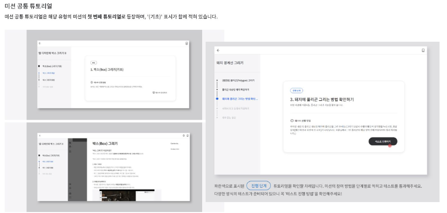
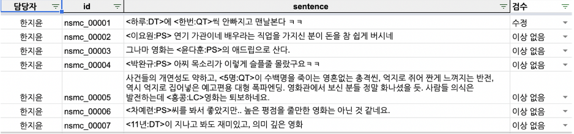
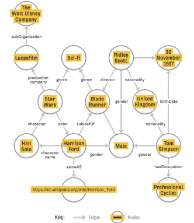

# 가이드라인 작성

## 가이드라인 유형

- 수집을 위한 가이드라인
- 주석을 위한 가이드라인
- 검수를 위한 가이드라인
- 제시 방법
  - 문서형
  - 화면 노출형 & 튜토리얼형

### 튜토리얼형 가이드라인 예시

미션과 예시를 같이 제시



## 가이드라인 구성 요소

- 데이터 구축 목적 정의
  - 작업에 대한 이해도를 높여야 높은 품질의 데이터를 얻을 수 있다.
  - 작업의 의도에 대해 참가자들이 잘 알아야 함. (몰라야 하는 경우도 있음)
- 데이터 구축 시 고려사항
- 사용 용어 정의!
  - 사람마다 배경지식이 다르므로 낯설게 느껴질 수 있는 용어에 대해서 알려야 함
- 데이터 주석 작업을 위한 가이드라인의 경우...
  - 데이터 특성 분류 체계 안내
  - 주석 방법 및 절차 안내
    - 특히 개체명을 어떻게 할 것인지 모호한 부분을 명쾌하게 설명해두어야 함
    - 예를 들어 '서울시'의 경우 LOC(장소)가 될 수도, ORG(기관)이 될 수도 있다.
  - 주석 형식과 정의
  - 주석 도구 사용법 안내
  - 주석 완료 후 관리 방법
  - 반려 및 통과 기준

## 가이드라인 작성 도구

- Notion
- Google Docs
- Wiki
- Word, 한글, etc,...

## 가이드라인 작성 고려사항

- 가이드라인 버전 관리
  - 가이드라인 구축은 검수 과정을 통해 지속적으로 개정해야 함. 개정 전과 후 변화를 비교하여 볼 수 있도록 버전관리를 하는 것이 좋다.
- 가이드라인 작성 유의 사항
  - 가이드라인의 유형별 특성에 맞춰 필요한 정보를 작성해야 함
  - 작업자의 작업 이해도를 고려하여 맞춤형 작성
  - 작업자에게 공개해야 하는 필수적인 정보와 부가적인 정보가 무엇인지 고려
  - 구성 요소 배치 및 가독성 고려

# 관계 추출 과제의 이해

- 개체명 인식 Named Entity Recognition, NER
- 관계 추출 Relation Extract, RE

## 관계 추출 과제 개요

- 개체명 인식
  - 개체명이란 인명, 지명, 기관명 등과 같은 `고유명사`나 `명사구`를 의미
  - 개체명 인식 태스크는 문장을 분석 대상으로 삼아서 문장에 출현한 개체명의 경계를 인식하고, 각 개체명에 해당하는 태그를 주석함
  - KLUE에서는 국제적 기준에서 널리 알려진 `CoNLL 2003`의 태그 체계 및 `Stanford NER`을 바탕으로 국내 TTA 표준 지침의 주석 가이드라인에 따라 데이터를 구축함.
    - PS(사람), LC(지역), OG(기관), DT(날짜), TI(시간), QT(수량)
  - 챌린지들
    - MUC-7
    - CoNLL 2003
    - 여러가지 데이터가 공개되어 있음
- 관계 추출
  - 관계 추출은 문장에서 나타난 개체명 쌍(Entity Pair)의 관계(Relation)을 판별하는 태스크
  - 개체명 쌍은 관계의 주체(Subject)와 대상(Object)로 구성
  - KLUE에서는 TACLED에 기반하여 30개 관계 Class를 설정하여 데이터를 구축
- 개체명 연결 EL
  - 개체명을 인식하고 모호성을 해소하는 과제를 결합한 것
  - 텍스트에서 추출된 개체명을 지식 베이스에 연결하여 모호성을 해소
  - AIDA CoNLL-YAGO dataset 또는 TAC KBP English Entity Linking Comprehensive and Evalutation Data 2010 등

### NER 예시

```
<키르케고르:PS>는 <덴마크:OG>의 수도 <코펜하겐:LC>의 부유한 집안에서 태어났다.

<오에 겐자부로:PS>는 <일본:LC> 현대문학의 초석을 놓은 것으로 평가받는 작가 <나쓰메 소세키:PS>(<1867~1916:DT>)의 대표작 '마음'에 담긴 군국주의적 요소, <야스쿠니 신사:LC> 참배 행위까지 소설의 삽화로 동원하며 <일본:LC> 사회의 '비정상성'을 문제 삼는다.
```



### RE 예시

```
# Relation: 단체:창립자
<subject:페이스북>의 창업자 <object:마크 주커버그>는 1984년에 태어났다.

# Relation: 인물:소속단체
<object:페이스북>의 창업자 <subject:마크 주커버그>는 1984년에 태어났다
```

## 과제별 차이점


## 데이터 제작시 문제점

### NER

- 2개 이상의 태그로 주석될 수 있는 개체명
  - 맥락에 기반하여 주석한다
  - 서울시는 정책을 발표했다
    - 서울시는 ORG
  - 그 카페는 서울시 서대문구 연희동에 있다
    - 서울시는 LC
- 주석 대상의 범주
  - 구체적 범주 및 기준 명시
  - ex) A급, B급, C급, 삼류
    - 숫자를 태그해야 하는데, 삼류는 숫자인가..? -> 이런 고민을 피드백 받아 가이드라인을 계속 개정

### RE

- 한국어 데이터 현실에 맞지 않는 주석
  - 태그 통폐합 및 추가
  - 지역관련 태그는 통합, 사람 기관 작품 및 생산물 관련 태그 추가 등
- KB(knowledge base)의 활용
  - 일부만 활용한다

### EL

- 적합한 KB 선정의 문제
  - 현재 AI HUB에 공개된 KB의 경우 제한적이거나 저작권 아래서 활용 가능. 위키 데이터를 활용하여 자체적 지식 베이스를 구축하여 활용하거나, 서비스 도메인에 맞는 지식 베이스를 구축하여 활용할 수 있음.
  - 지식 베이스를 구축하는 것 자체가 많은 비용과 자원이 드는 일이다.

## 데이터를 만드는 이유?

NER, RE, EL은 기본적으로 비구조화된 텍스트에서 정보를 추출하여 구조화하려는 것이 목적이다. 따라서 이 과정에서 지식 베이스가 활용되기도 하고, 결과물이 지식 베이스가 되기도 한다. 정보처리의 관점에서 구조화된 정보의 활용도는 높기 때문에 이러한 시도는 중요하다.

- 지식 그래프
  

## 활용

검색 시스템, 챗봇, 구글 핀포인트 등

# 데이터 검수

- 데이터 형식의 정확도
- 관계 레이블의 정확도
- 관계 추출 정확도

## 데이터 평가

- 작업자간 일치도 IAA
  - Fleiss' k (TACRED)
  - Krippendorff's a(KLUE)
- 모델 성능 평가
  - 정밀도, 재현율, F1 score (TACRED)
  - Micro F1, AUPRC (KLUE)
