# MRC

## Introduction to Machine Reading Comprehension

MRC. 기계독해는 주어진 지문을 이해하고 주어진 질의의 답변을 추론하는 문제이다. MRC에는 다음 종류가 있다.

1. Extractive Answer Datasets
   1. 질의에 대한 답이 항상 주어진 지문의 segment(혹은 span)으로 존재
2. Descriptive/Narrative Answer Datasets
   1. 답이 지문 내에서 추출한 sapn이 아니라, 질의를 보고 생성된 형태
3. Multiple-choice Datasets
   1. 질의에 대한 답을 여러개의 asnwer 중 하나로 고르는 형태

### MRC task에서의 어려운 점

- 단어들의 구성이 유사하지는 않지만 동일한 의미의 문장을 이해해야 하는 경우

```
P1: ..., Cole is selected for a mission., ...
P2: ..., James Cole, who after retrieving samples is given the chance to go back in time to 1996 and find information about ...

Question: What is the name for the person who
selected for the mission?
Answer: Cole

P1은 이해하기 쉬운 지문이지만, P2는 간접적으로 이야기하는데, 모델은 이를 같은 의미로 받아들이기 쉽지 않다.
```

- Coreference Resoultion
  - 어떤 사람, 물건 등을 지칭하는 용어를 이해시키는 것은 어렵지만 꼭 해결해야 할 일이다.
- Unanswerable Questions
  - 주어진 지문 안에서 답을 찾을 수 없는 경우도 있다. 이런 경우 답변을 모른다고 하도록 유도해야 한다.
- Multi-hop resaoning
  - 여러 개의 document에서 질의에 대한 fact를 찾아야지만 답을 찾을 수 있는 경우.

### MRC의 평가방법

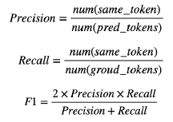

- Exact Match / F1 score
  - EM: 예측한 답과 ground-truth가 정확이 일치하는 비율. accuaracy와 같음. 단점은 답변이 조금만 달라도 점수를 못 받는 것이다.
  - F1: 예측한 답과 ground-truth 사이의 token overlap을 F1으로 계산한다. 단, F1의 경우에는 단어의 overlap만 보다보니, 답변이 언어적으로 완벽한지는 보지 못 하는 단점이 있다.
- ROUGE-L / BLEU
  - ROUGE-L: 예측한 값과 ground-truth 사이의 overlap recall. LCS(Longest common subsequence 기반)으로 찾는다.
  - BLEU: 예측한 답과 ground-truth 사이의 precision. n-gram단위로 겹치는 것을 본다.
  - 실제로는 ROUGE-L과 BLUE-n을 사용한다.

## Unicode & Tokenization

MRC 뿐 아니라 어느 NLP task를 하더라도 중요한 스킬이다.

### Unicode

전 세계의 모든 문자를 일관되게 표현하고 다룰 수 있도록 만들어진 문자 셋. 각 문자마다 숫자 하나에 매핑된다.

- 인코딩
  - 문자를 컴퓨터에서 저장 및 처리할 수 있게 이진수로 바꾸는 과정
  - UTF-8: 현재 가장 많이 쓰는 인코딩 방식이다. 문자 타입에 따라 다른 길이의 바이트를 할당한다. 영어나 숫자는 1byte, 한글은 3byte, 이모지는 4byte 등

### 파이썬에서 unicode 다루기

Python 3부터 string 타입은 유니코드 표준을 사용한다.

- ord: 문자를 유니코드로 변환
- chr: code point를 문자로 변환

```python
ord('A') # 65
ord('가') # 44032
hex(ord('A')) # 0x41

chr(44032) # '가'
chr(65) # 'A'
chr(0x41) # 'A'

chr(0x1100) + chr(0x1161) # '가'
```

> 한국어는 한자 다음으로 유니코드에서 많은 코드를 차지하고 있다. 파이썬에서는 조합형과 완성형 둘 다 사용 가능하다. 조합형의 경우에는 덧셈 기호를 통해 합쳐서 한 글자로 만들 수도 있음.

- 토크나이징
  - 텍스트를 토큰 단위로 나누는 것.
  - 단어(띄어쓰기), 형태소, subword 등 여러 기준이 있다. 초기에는 띄어쓰기 단위를 사용했으나 요즘에는 효율이 떨어져 다른 방식들을 사용함.
- Subword 토크나이징
  - 자주 쓰이는 글자 조합은 한 단위로 취급하고, 자주 쓰이지 않는 조합은 subword로 쪼갠다. '##'은 디코딩(토크나이징의 역과정)을 할 때 해당 토큰을 앞 토큰에 띄어쓰기 없이 붙이는 것을 의미함

```python
tokenizer.tokenize('아버지 가방에 들어가신다')
# [아버지, 가, ##방, ##에, 들어, ##가, ##신, ##다]
```

#### Byte-Paire Encoding

데이터 압축용으로 제안된 알고리즘이다. NLP에서 토크나이징으로 활발히 사용되고 있음.

- 가장 자주 나오는 글자 단위 Bigram (or Byte pair)를 다른 글자로 치환한다.
- 치환된 글자를 저장해둔다.
- 반복한다.

예를 들어, aaabdaaabac가 있다면 먼저 aa를 Z로 치환한다. ZabdZabac -> ZYdZYac -> XdXac 로 압축해간다.

## KorQuAD

LG CNS가 AI 언어지능 연구를 위해 공개한 질의응답/기계독해 한국어 데이터 셋. 인공지능이 한국어 질문에 대한 답변을 하도록 필요한 학습 데이터 셋이다. 1550개의 위키 피디아 문서에서 10649건의 문서와 크라우드 소싱으로 제작한 63952 개의 질의응답 쌍으로 구성

- 데이터 수집 과정
  - 대상 문서 수집: 위키 백과에서 수집한 글을 문단 단위로 정제. 이미지/표 등은 제거. 짧은 문단, 수식이 포함단 문단 등은 제거함
  - 질문/답변 생성: 크라우드 소싱을 통해 질의응답 쌍 약 7만개를 생성. 상세한 가이드라인을 통해 양질의 질의응답 쌍을 제작함
  - 2차 답변 태깅: 앞서 생성한 질문에 대해 사람이 직접 답하면서 Human Performance 측정. 생성 과정에 참여한 사람은 참여 불가

### HuggingFace datasets 라이브러리

- 자연어 처리에 사용되는 대부분의 데이터셋과 평가 지표를 접근하고 공유할 수 있게 만든 라이브러리.
- Numpy, Pandas, PyTorch, Tensorflow2와 호환된다.
- 접근 가능한 모든 데이터셋이 memory-mapped, cahced 되어있어서 데이터를 로드하면서 생기는 메모리 공간 부족이나 전처리 과정 반복의 번거로움을 피할 수 있음
- KorQuAD의 경우 squad_kor_v1, squad_kor_v2로 불러 올 수 있다.

```python
from datasets import load_dataset
dataset = load_dataset('squad_kor_v1', split='train')
```

### 통계치

- 질문유형
  - 구문 변형 56%
  - 어휘 변형(유의어) 13.6%
  - 어휘 변형(일반 상식) 1.9%
  - 여러 문장 근거 활용 19.6%
  - 논리적 추론 요구 3.6%
  - 기타 출제 오류 2.9%
- 답변유형
  - 대상 55.4%
  - 인물 23.2%
  - 시간 8.9%
  - 장소 7.5%
  - 방법 4.3%
  - 원인 0.7%

# Extraction based MRC

질문의 답변이 항상 주어진 지문 내에 존재한다. 평가방법으로는 EM과 F1을 이용

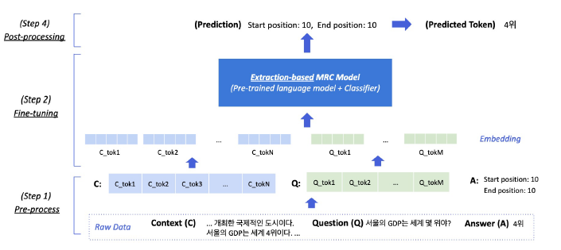

## Pre-processing

### Tokenization

- 띄어쓰기 기준, 형태소, subword 등 여러 기준 존재
- 최근에는 Out of Vocabulary 문제를 해결해주고 정보학적 이점이 큰 Byte Pair Encoding을 주로 사용
- 본 강의에서는 BPE의 하나인 WordPiece Tokenizer를 사용

```
"미국 군대 내 두번째로 높은 직위는 무엇인가?"
[미국, 군대, 내, 두번째, ##로, 높은, 직, ##위는, 무엇인가, ?]
```

### Special Tokens

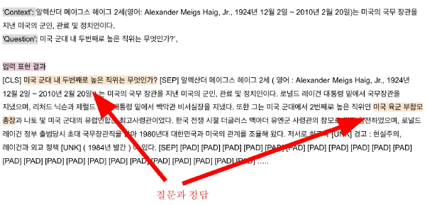

- Question과 Context를 구분하기위한 SEP 토큰
- CLS 토큰으로 시작

### Attention Mask

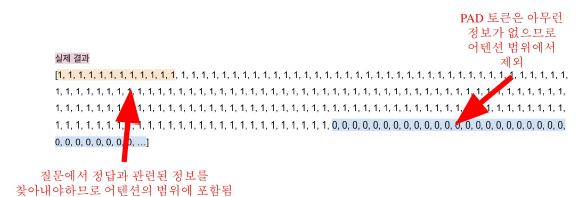

- 입력 시퀀스 중에서 attention을 연살할 때 무시할 토큰을 표시
- 0은 무시하고 1은 연산에 포함
- 보통 [PAD]와 같은 의미가 없는 특수토큰을 무시하기 위해 사용함

### Token Type IDs

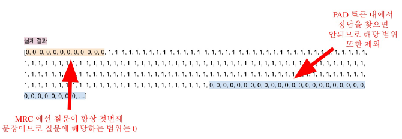

- 입력이 2개 이상일 때, (질문과 지문) 각각에게 ID를 부여하여 모델이 구분해서 해석하도록 유도

### 모델 출력값

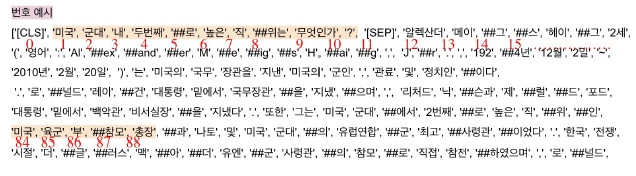

- 정답은 문서 내 존재하는 연속된 단어토큰(span)이므로 span의 시작과 끝 위치를 알면 정답을 맞출 수 있음
- Extraction-based에선 답안을 생성하기 보다는 시작위치와 끝 위치를 예측하도록 학습함. 즉, Token Classification 문제로 치환하여 해결함

## Fine-tuning

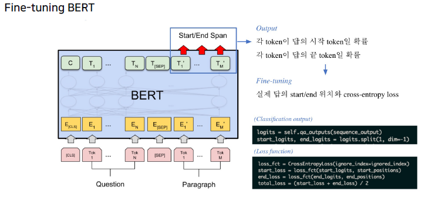

BERT를 이용한다. 토큰의 임베딩이 input으로, output도 토큰의 임베딩이다. 지문 내에서 정답에 해당되는 임베딩을 각 단어마다 Linear transforamtion 적용. 이 linear transformation도 학습의 대상이다. 결국 출력값은 일종의 점수로 실제 답의 위치와 cross-entropy loss를 계산한다.

## Post-processing

- 불가능한 답 제거하기
  - 다음과 같은 경우 candidate list에서 제거한다
    - End position이 start position 보다 앞서는 경우
    - 예측한 위치가 context를 벗어난 경우 (즉 질문에서 정답을 찾는 경우)
    - 미리 설정한 max_length 보다 긴 경우
- 최적의 답안 찾기
  - start/end postition prediction에서 score가 가장 높은 N개를 각각 찾는다
  - 불가능한 start/end 조합을 제거
  - 가능한 조합들을 다시 score의 합이 큰 순서대로 정렬
  - score가 가장 큰 조합을 최종 예측으로 선정
  - Top-k가 필요한 경우에는 차례대로 내보낸다.

# 실습

- (미션-1) QuickTour_Huggingface.ipynb
- (2강) Extraction-based MRC.ipynb

# Generation based MRC

주어진 지문과 질의를 보고 답변을 `생성`한다. 설사 지문 내에 정답이 있더라도 그 위치를 학습하는 것이 아님. 평가지표는 Extraction-based MRC와 동일하다.

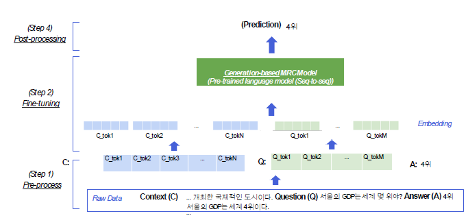

BERT같은 경우에는 인코딩 단계만 있고 디코딩 단계는 없기 때문에 generative based MRC에는 사용할 수 없다.

- MRC 모델 구조
  - seq2seq PLM 구조(gerneration) vs PLM + Classifier 구조(extraction)
- loss 계산을 위한 prediction 형태
  - Free-form text (generation) vs 지문 내 답의 위치 (extraction)

## Pre-processing

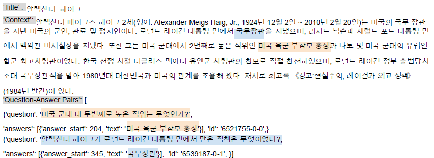

특정 위치를 측정할 필요가 없기 때문에 정답을 그대로 넘겨주면 된다.

- WordPiece Tokenizer 사용
  - 인덱스로 바뀐 질문을 보통 input_ids (또는 input_token_ids)로 부름
  - 모델의 기본 입력은 input_ids만 필요하나, 그 외 추가적인 정보가 필요함
- Special Token
  - 각 특수 토큰들은 사용하는 모델에 따라 다를 수 있다
- additional information
  - Attention mask: 어텐션 연산을 수행할지 결정하는 마스크
  - Token type ids: BERT와 달리 BART에서는 입력 시퀀스에 대한 구분이 없어 token_type_ids가 존재하지 않는다.
    - SEP 같은 토큰이 직접 제공되지 않아도 모델이 구분하기 때문에 나중 모델들은 딱히 설정하지 않기 때문
  - 따라서 Extraction-based MRC와 달리 입력에 token_type_ids가 들어가지 않음

### 출력 표현


Generation MRC는 조금 더 어려운, 실제 텍스트를 생성하는 과제를 수행한다.

## Model & Fine-tuning

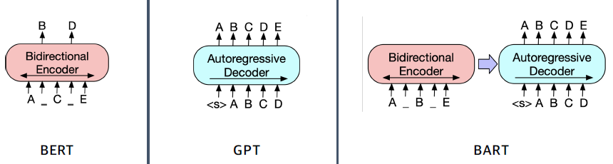

- BART
  - 기계 독해, 기계 번역, 요약, 대화 등 seq2seq 문제의 pre-training을 위한 denoising auto encoder
  - BART는 텍스트에 노이즈를 주고 원래 텍스트를 복구하는 문제르 푸는 것으로 pre-train을 했음. 따라서 생성에 강점을 보인다

## Post-processing

decoding을 통해 텍스트를 생성하므로 디코더 이전 스텝에서 나온 출력이 다음 스텝의 입력으로 들어간다. 이를 autoregressive라고 부른다. 맨 처음 입력은 문장의 시작을 뜻하는 스페셜 토큰이다. 디코딩 방법론에는 여러가지가 있다.

### Searching

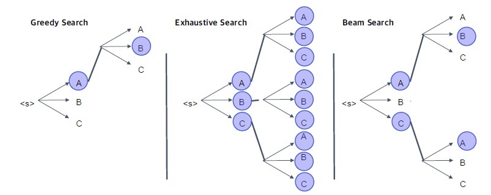

- Greedy: 그때 그때 가장 확률이 높은 토큰을 생성하는 방식. 빠르지만 나중에 가서는 잘못된 결과를 일으킬 수 있음
- Exhaustive: 모든 가능성을 다 보고 결정한다. 이는 step에 비례해서 기하급수적으로 경우의 숫자가 늘어나고, vocab 사이즈도 조금만 커져도 불가능에 가깝다
- Beam: Exhaustive를 하되, Top-K 개만 유지한다
