# Passage Retrieval - Sparse Embedding

## Intro

### Passage Retrieval

질문(Query)에 맞는 문서(passage)를 찾는 것. MRC와 연결하면 Open-domain Q&A를 할 수 있게 된다. 대규모의 문서 중에서 질문에 대한 답을 찾는 Task를 말한다.

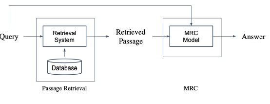

Passage Retrieval과 MRC 2개의 stage로 만들 수 있다.

그렇다면 실제로 어떻게 구현을 할까?

일반적으로는 임베딩 스페이스에서 검색을 한다. 질문이 들어올 때 벡터로 임베딩을 하고, passage도 임베딩을 한다. passage는 질문이 들어올때마다 하는 것이 아니고 미리 해놓아서 효율성을 높인다. 이후 Similarity Score를 계산한다. 계산 방법은 다양하게 있다. 어쨌든 모든 passage에 대해 유사도를 계산하고 랭킹을 매긴다음 내보낸다.

## Passage Embedding and Sparse Embedding

### Bag of Words

- Passage Embedding Space
  - Passage Embedding의 벡터 공간
  - 벡터화된 passage를 이용하여 passage간 유사도 등을 알고리즘으로 계산할 수 있음.

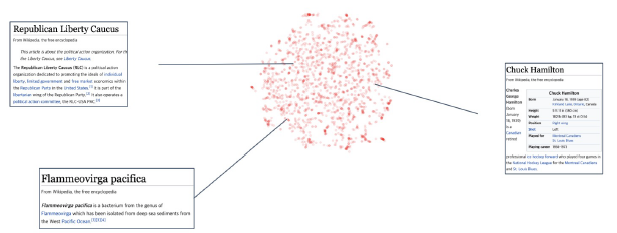

- Sparse Embedding 소개 (Bag of Words)
  - Sparse: dense의 반대 의미. 0이 아닌 숫자가 많다
  - 문서가 주어졌을 때, 임베딩 스페이스로 매핑하기 위해 문서에 존재하는 각 단어들을 있으면 1, 없으면 0으로 한다고 해보자.
    - 벡터의 길이는 전체 vocab의 사이즈와 같을 것이다.
    - 각각의 dim은 하나의 단어에 해당한다.

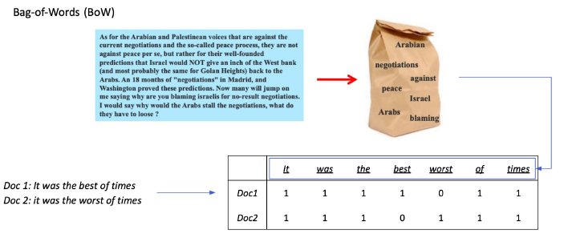

- BoW를 구성하는 방법 -> n-gram
  - unigram (1-gram): vocab의 사이즈와 동일하게 된다.
  - bigram (2-gram): unigram 보다는 사이즈가 작다.
  - n-gram에서 n이 늘어날수록 unigram은 기하 급수적으로 늘어난다. 그래서 보통은 bigram, 경우에 따라서는 trigram을 사용한다.
- Term value을 결정하는 방법

  - Term이 Document에 등장 하는지 (binary)
  - Term이 Document에 몇번 등장하는지 (TF-IDF)

- Dimension of embedding vector = number of terms
  - 등장하는 단어가 많아질수록 증가한다.
  - n-gram의 n이 커질수록 증가한다.

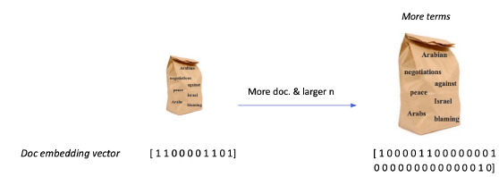

- Term overlap을 정확하게 잡아내야할 때 유용함
- 반면, 의미(semantic)는 비슷하지만 다른 단어인 경우에는 비교가 불가능하다..
  - 이 경우에는 dense embedding을 이용함

## TF-IDF

- Term Frequency (TF): 단어의 등장 빈도
- Inverse Document Frequency (IDF): 단어가 제공하는 정보의 양

어떤 문서 내에 단어가 등장을 많이 했다. 그러나 다른 문서들(전체문서)에서는 등장하는 경우가 적다고 해보자. 그렇다면 그 단어는 그 문서에서 특히 중요한 단어라는 의미이다.

예를 들어, it, was, the, of 와 같은 단어는 어디서든 자주 등장하는 단어다. 즉, 정보량이 적다. 반면 best, times와 같은 경우에는 더 많은 정보를 제공한다고 볼 수 있다.

### TF

해당 문서 내 단어의 등장 빈도

1. Raw count
2. Adjusted for doc length: raw count / num words (TF)
3. Other: binary, log normalization, etc...

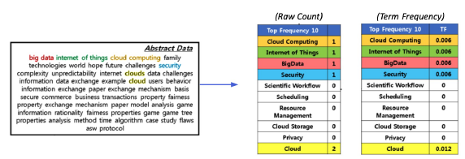

### IDF

단어가 제공하는 정보의 양

$$ IDF(t) = log{N \over DF(t)} $$

- Document Freqeuncy(DF) = Term t가 등장한 document의 개수
- N: 총 Document의 개수

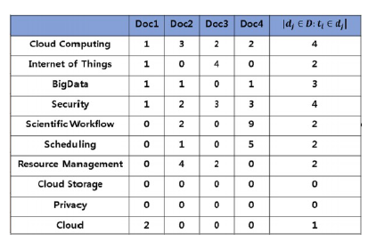

### Combine TF & IDF

TF 점수의 경우 t와 d 를 표시해야 하지만, IDF는 term마다 유니크하므로 t만 표시한다. 최종 TF-IDF는 두 수치를 곱한 것으로 정의한다.

$$ TF(t,d) \times IDF(t) $$

- a, the 등의 관사는 low TF-IDF일 것이다. 거의 모든 문서에 등장하기 때문이다.
- 반면 자주 등장하지 않는 고유 명사 들은 높은 점수를 받을 것이다.

### BM25

TF-IDF의 개념을 바탕으로 문서의 길이까지 고려하여 점수를 매긴다. 기존의 방식을 조금 더 개선한 방법임

- TF 값에 한계를 지정해두어 일정한 범위를 유지하도록 함
- 평균적인 문서 길이 보다 더 작은 문서에 단어가 매칭된 경우 그 문서에 가중치를 부여한다.
- 실제 검색엔진, 추천 시스템 등에서 아직까지도 많이 사용되는 알고리즘임

# Passage Retrieval - Dense Embedding

## Dense Embedding

### Sparse Embedding의 한계

- Sparse Embdeeing
  - TF-IDF 벡터는 Sparse 하다.
  - 벡터의 크기는 아주 크지만, 벡터 내에서 0이 아닌 숫자는 상당히 적게 있다.
  - 특히, BoW 방식을 이용하므로 vocab의 특정 단어가 문단에 있는 경우에만 non-zero가 되므로 사실상 대부분이 0이 된다.

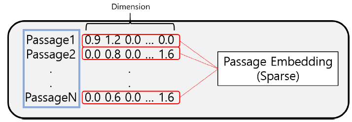

- 차원의 극복
  - 차원의 수가 매우큰데 이를 compressed format으로 극복 가능하다
  - 하지만 유사성을 고려하지 못 하는 단점이 있다.

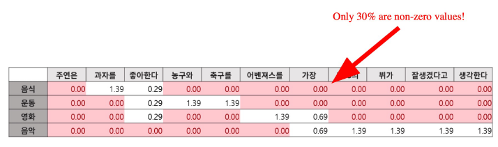

### Dense Embedding

- 장점
  - sparse는 vocab 사이즈 이상의 훨씬 더 큰 벡터 사이즈로 매핑이 된다. dense는 더 작은 차원의 고밀도 벡터로 매핑이 된다. 보통은 50~1000 사이가 된다.
  - 각 차원이 특정 term에 대응되지 않는다. 복합적인, 부분적인 의미를 갖는다.
  - 대부분의 요소가 non-zero 값으로 의미를 지닌다.

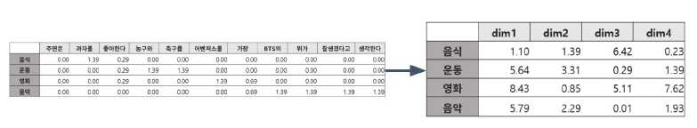

- 결론
  - Sparse: 단어의 존재 유무를 맞추기에는 상당히 유용. 하지만 의미적 해석능력은 떨어짐
  - Dense: 의미가 같더라도 다른 단어인 경우도 detect 가능하다.

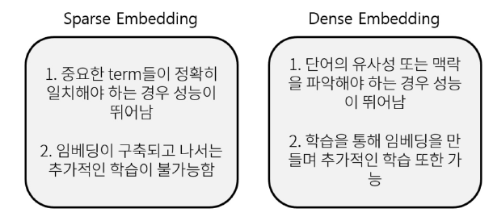
최근에는 사전학습 모델의 등장과 검색 기술의 발전으로 인해 Dense Embedding을 활발히 사용하고 있다.

### dense embedding 구조

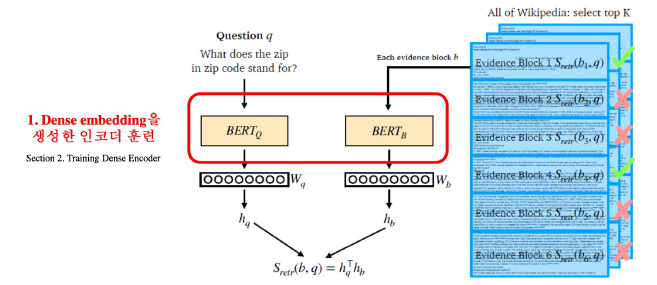
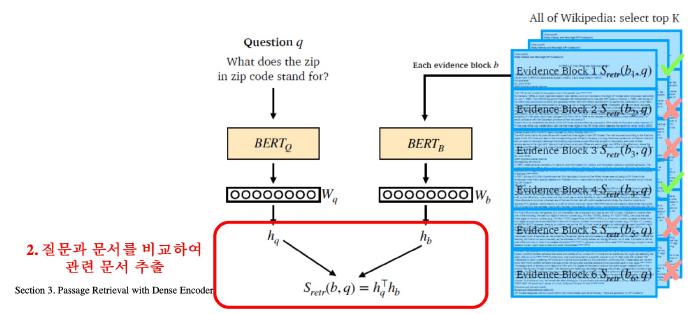

왼쪽에는 질문에 대응되는 encoder가 있다. 인코더는 hq 라는 벡터로 내보낼 것이다.

오른쪽에는 passage의 encoder가 있다. hb 라는 벡터를 내보낸다.

여기서 두개의 벡터가 같은 사이즈여야 하는데, 유사도를 계산해야하기 때문이다. 두 벡터의 dot product를 함으로써 구한다.

## Training Dense Encoder

BERT 뿐 아니라 다양한 PLM들도 자주 사용한다. 이번 경우에는 passage와 question을 독립적으로 넣어 결과를 보려고 한다.

기존에는 passage의 어디에 답이 있는지를 예측하기 위해서 각 토큰별로 socre를 내는 것이 목적이었다. 이번에는 임베딩을 출력하는 것이 목적이므로 CLS 토큰을 보면서 `CLS의 최종 아웃풋`이 무엇인지 살펴볼 것이다. 여기서 passage와 question의 파라미터는 같을수도 다르게 할 수도 있다.

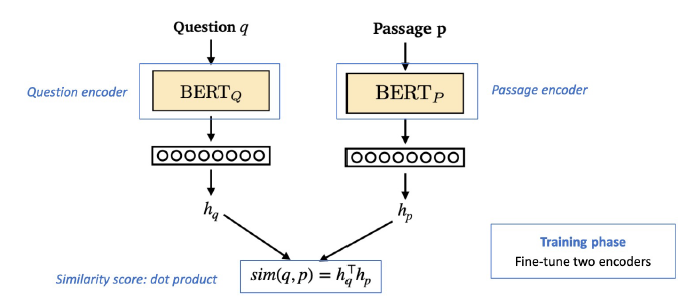

### 구체적인 학습 목표

- 연관된 질문과 passage dense embedding 간의 거리를 좁히는 것 (inner product를 높이는 것)
- Challenge : 연관된 질문 / passage를 어떻게 찾을 것인지?
  - 기존 MRC 데이터셋을 활용!

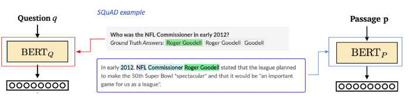

### Negative sampling

- 연관된 질문과 passage 간의 dense embedding 간 거리를 좁히는 것은 Positive
- 연과되지 않은 관계 간의 거리는 멀어져야 함 `Negative`

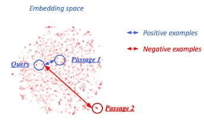

그렇다면 어떻게 Nagative sampling을 진행할 수 있을까?

- Corpus 내에서 랜덤하게 뽑기
- 좀 더 헷갈리는 negative 샘플들 뽑기 (높은 TF-IDF 스코어를 기록하나 오답인 경우)

### Ojbective function

Positive passage에 대한 negative log likelihood(NLL) loss를 사용한다. 이 경우 postivie passage와 question 간의 sim score (높을수록 유사)와 negative sample과의 점수를 softmax를 통해 계산한 확률 값을 NLL loss에 적용하여 학습한다.

그림의 오른쪽 부분에 해당 수식이 있다. 분자에는 postive만 있고 분모에는 negative와 positive가 있다.

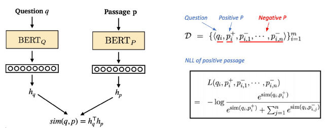

### 성능 측정

가장 심플한 방법은 retrieve된 passage 중에서 Ground-truth passage가 있는지 확인하는 방법이다. 조금 더 나아가서는 MRC처럼 답을 포함하는 passage를 포함하는 비율을 볼 수 있다.

## Passage Retrieval with Dense Encoder

### Inference

Passage와 query를 각각 embedding한 후, query로부터 가까운 순서대로 passage의 순위를 매긴다.

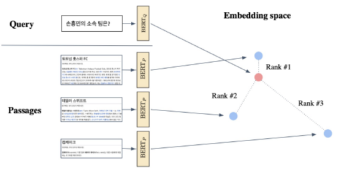

Retriever를 통해 찾아낸 passage를 활용, MRC 모델로 답을 찾는다.

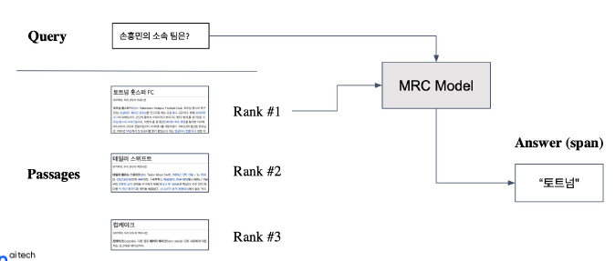

### 개선

- 학습 방법 개선 (DPR)
- 인코더 모델 개선 (BERT보다 큰, 정확한 PLM)
- 데이터 개선 (더 많은 데이터, 전처리 등)
