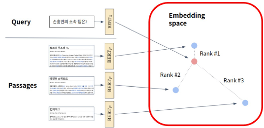

# Passage Retrieval - Scaling Up

dense embedding은 scail up을 할 때 고려할 점이 많다.

## Passage Retrieval and Similarity Search


Question과 Passage 모두 임베딩이 된다.



- 인퍼런스: passage와 query를 각각 임베딩 한 후, query로부터 거리가 가까운 순서대로 passage에 순위를 매김
- passage의 숫자가 늘어날 수록, 파란색 점의 숫자가 점점 늘어나게 된다. dot product 조차도 dim이 늘어날수록 부담스러운 연산이 된다. 그렇다면 어떻게 효율적으로 찾아낼 수 있을까? `Similarity Search`

### MIPS (Maximum Inner Product Search)

주어진 질문(query) 벡터 q에 대해 Passage 벡터 v들 중 가장 질문과 관련된 벡터를 찾아야 함. 여기서 관련성은 내적(inner product)가 가장 큰 것임.

이전 까지 배운 방법은 brute-force search임. 저장해둔 모든 Sparse/Dense 임베딩에 대해 일일히 내적값을 계산하여 가장 큰 값을 가지는 passage를 추출하기 때문


실제로 검색해야 할 데이터는 훨씬 방대하다. 위키피디아만 하더라도 5백만개의 문서가 있으며, 수십억 조 단위까지 커질 수 있음. 따라서 모든 문서 임베딩을 일일히 보면서 검색할 수는 없다.

### Trade-off of Similarity Search

- Search speed
  - 쿼리 당 유사한 벡터 k개를 찾는데 걸리는 시간
  - 가지고 있는 벡터량이 클 수록 오래 걸림
  - Pruning
- Memory usage
  - 벡터를 사용할 때, 어디에서 가져올 것인지
  - RAM에 올려둘 수 있으면 빠르지만, 많은 용량이 필요
  - 디스크에서 불러오는 경우 속도가 느려짐
  - Compression
- Accuracy
  - brute-force 검색 결과와 얼마나 비슷한가
  - 속도를 증가시키려면 정확도가 희생되는 경우가 많음
  - Exhaustive Search
- 일반적으로 더 정확한 검색을 하려면 더 오랜 시간이 소모됨
- 코퍼스의 크기가 커질수록
  - 탐색 공간이 커지고 검색이 어려워짐
  - 메모리 공간도 많이 요구됨
  - Sparse Embedding의 경우 이런 문제가 훨씬 크게 다가옴

## Approximating Similarity Search

### Compression - Scalar Quantization (SQ)

일반적으로 숫자를 저장할 때는 float-32라는 4byte 체계를 사용한다. 그러나 inner product search를 하는 경우에는 4바이트까지 필요한 경우가 없다. 1바이트만 사용하더라도 충분히 정확도 있는 결과를 얻을 수 있다. 이를 적용하여 1/4로 줄여볼 수 있다.

### Pruning - Inverted File (IVF)

클러스터를 만들어 군집을 생성한다. 쿼리가 들어왔을 때, 쿼리가 모든 클러스터를 방문하는 것이 아니라, 쿼리에 가장 근접한 클러스터만 보도록 하는 방식이다. 클러스터링이 잘 되어 있다면 멀리 있는 클러스터를 볼 이유가 없기 때문이다.

클러스터링을 통해 전체 vector space를 k개의 클러스터로 나눈다. 만약 100개의 클러스터를 만들었다면 실제 걸리는 시간도 전체 passage의 1/100 만 보면 되므로 시간을 절약할 수 있다. `k-means clustering`

IVF: 각 클러스터에 속해있는 포인트들을 역으로 index로 가지고 있는데, 이를 inverted list structure라고 부른다. 각 클러스터의 centroid id와 해당 클러스터의 벡터들이 연결되어 있는 형태이다.

대략적인 프로세스는 다음과 같다.

- 주어진 쿼리 벡터에 대해 근접한 centroid 벡터를 찾는다.
- 찾은 클러스터의 inverted list내 vector들에 대해서 서치를 수행한다.

## FAISS

Facebook에서 공개한 라이브러리로, Fast Approximate를 위한 라이브러리다.

### Passage Retrieval with FAISS

벡터들을 확보하면 학습을 진행한다. 클러스터링 진행을 위해서다.

1. index and map vectors를 학습한다.
   1. 먼저 일부 데이터로 학습을 진행하고, 나머지는 추가한다.


2. Search based on FAISS index
   1. n-probe: 몇개의 가장 가까운 클러스터를 방문할 것인지
   2. FAISS는 클러스터들을 방문하고 가장 비슷한 Top-k개의 결과를 반환한다.


## Scailing up with FAISS

- 브루트 포스로 모든 벡터와 쿼리를 비교하는 가장 단순한 인덱스

```python
d=64 # 벡터의 차원
nb=100000 # 데이터베이스 크기
nq=10000 # 쿼리 개수
xb = np.random.random((nb, d)).astype('float32')
xq = np.random.random((nq, d)).astype('float32')

# 인덱스 만들기
index = faiss.IndexFlatL2(d) # 인덱스 빌드
index.add(xb) # 인덱스에 벡터 추가

# 검색하기
k = 4 # Top-k
D, I = index.search(xq, k) # 검색
# D: 쿼리와의 거리
# I: 검색된 벡터의 인덱스
```

- IFV with FAISS
  - IVF 인덱스 만들기
  - 클러스터링을 통해 가까운 클러스터 내 벡터들만 비교
  - 클러스터 내에서는 전체 벡터와 비교함

```python
nlist = 100 # 클러스터 개수
quantizer = faiss.IndexFlatL2(d) # Flat하게 비교하므로 L2. 클러스터에서 거리를 재는 방법 정의

index = faiss.IndexIVFFlat(quantizer, d, nlit) # Inverted File 만들기
index.train(xb) # 클러스터 학습

index.add(xb) # 클러스터에 벡터 추가
D, I = index.search(xq, k) # 검색
```

- IVF-PQ with FAISS
  - 벡터 압축 기법(PQ) 활용
  - 전체 벡터를 저장하지 않고 압축된 벡터만 저장
  - 메모리 사용량 감소 효과

```python
nlist = 100
m = 8 # subquantizer 개수
quantizer = faiss.IndexFlatL2(d)
index = faiss.IndexIVFPQ(quantizer, d, nlist, m, 8) # 각각 sub-vector가 8bits로 인코딩

index.train(xb)
index.add(xb)
D, I = index.search(xq, k)
```

- Using GPU with FAISS
  - GPU의 빠른 연산속도를 활용 가능
    - 거리 계산을 위한 행렬곱에 강점
  - 다만 GPU 메모리 제한이나 메모리 랜덤 액세스 시간이 느림

```python
res = faiss.StandardGpuResources() # 단일 GPU 사용
index_flat = faiss.IndexFlatL2(d) # 인덱스 빌드

gpq_index_flat = faiss.index_cpu_to_gpu(res, 0, index_flat)
gpu_index_flat.add(xb)

D, I = gpu_index_flat.search(xq, k)
```
