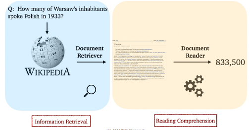

# Linking MRC and Retrieval & ODQA

MRC와 차이점이 있다. MRC는 지문이 주어진 상황에서 질의응답을 하는 task이다. 반면 ODQA는 지문이 따로 주어지지 않는다. 방대한 world knowledge에 기반해서 응답하는 task다. 여기서 기반하는 문서는 위키피티다안 웹 전체가 된다. 즉, 어마어마하게 거대한 문서를 기반으로 하여 적절한 응답을 찾아내야 하는 과제이다.

비슷한 점도 있다. input과 output의 형식은 같다는 점이다.

## History of ODQA

구글의 검색 시스템이 대표적인 ODQA이다. 초기에는 검색 결과만을 보여줬다면, 최근에는 연관 문서뿐 아니라 질문에 대한 답까지 같이 제공을 한다.

초기에는 QA Tracks에서 주로 다뤘던, 연관문서만을 반환하는 information retrieval(IR)에서 더 나아가서, short answer with support 형태를 목표로 하였다.

```
Question processing + Passage Retrieval + Answer processing
```

### 딥러닝 이전

- Question processing
  - 질문으로부터 키워드를 선택 / answer type 선택
- Passage Retrieval
  - 기존의 IR 방법을 활용하여 연관된 doc을 뽑고, passage 단위로 자른 후 선별한다. Named entity나 question의 단어의 개수등과 같은 피처를 활용함
- Answer processing
  - 위에서 선별한 hand-crafted features와 heuristic을 활용한 classifier 이용. 주어진 질문과 선별된 passage 내에서 답을 선택.
- 대표적으로는 IBM Watson(2011)이 있다.

## Retriever-Reader Approach

ODQA에서 가장 일반적인 방법론이다. 지금까지 배운것과 관련성이 깊다.

- Retriever: 데이터베이스에서 관련있는 문서를 검색 함
- Reader: 검색된 문서에서 질문에 해당하는 답을 찾아냄



### 접근 방식

- Retriever
  - 입력
    - 문서 셋(Document corpus)
    - 질문 (Query)
  - 출력
    - 관련성 높은 문서
- Reader
  - 입력
    - Retrieved 된 문서
    - 질문
  - 출력
    - 답변

### 학습 단계

- Retriever
  - TF-IDF, BM25 : 학습 없음
  - Dense: 학습 있음
- Reader
  - SQuAD와 같은 MRC 데이터셋으로 학습
  - 학습 데이터를 추가하기 위해 Distant supervison 활용

### Distant supervision

질문-답변만 있는 데이터셋에서 MRC학습 데이터 만들기. Supporting doc이 필요함.

1. 위키피디아에서 Retriever를 이용해 관련성 높은 문서를 검색
2. 너무 짧거나 긴 문서, 질문의 고유명사를 포함하지 않는 등 부적합한 문서 제거
3. answer가 exact match로 들어있지 않은 문서도 제거
4. 남은 문서 중에서 질문과 (사용단어 기준으로) 연관성이 가장 높은 단락을 supporting evidence로 사용한다.

### inference

- Retriever가 질문과 가장 관련성 높은 5개 문서 출력
- Reader는 5개 문서를 읽고 답변 예측
- Reader가 예측한 답변 중 가장 socre가 높은 것을 최종 답으로 사용함

# Issue & Recnet Approaches

## Differnet granularities of text at indexing time

위키피디아에서 passage 단위를 문서로 볼지, 단락으로 볼지, 문장으로 볼 지 명확히 정의되어 있지는 않음...

Retirever 단계에서 몇개 (top-k)의 문서를 넘길지 정해야 한다. 그러나 여기서 Granularity(세분화 정도)에 따라 k가 다를 수 밖에 없다.

> 예를 들어 article 단위로면 k=5, 단락 단위라면 k=29, 문장 단위라면 k=78이 된다...

## Single-passage training vs Multi-passage training

- Single-passage: 현재 우리는 k개의 passage들으 reader가 각각 확인하고 특정 answer span에 대한 예측 점수를 나타낸다. 그리고 이 중 가장 높은 점수를 가진 span을 고르도록 한다
  - 이 경우 retrieved passage들에 대한 직접적인 비교라고 볼 수 없다. 즉, 간접적인 비교다.
  - 따로 reader 모델이 보는게 아니라, 전체를 한번에 보면 어떨까?
- Multi-passage: retrieved passage 전체를 하나의 passage로 보고 reader 모델이 그 안에서 answer span 하나를 찾도록 한다.
  - 문서가 너무 길어지므로 GPU 메모리 할당 문제와 처리해야하는 연산량도 많아진다.

## Importance of eache passage

Retriever 모델에서 추출된 top-k passage 들의 retireveal score를 reader 모델에게 전달해보자! 즉, Retiver가 찾아낸 문서에 대한 점수도 같이 보내서 reader가 정답을 추론할때 도움이 되도록 하는 방법론이다.

# 실습

7강) 지금까지 배운 내용을 토대로 Open-Domain Question Answering(ODQA) 시스템 구축해보기

https://colab.research.google.com/drive/1etxIUiIk6jaR1F5UFV6q5cx7SCUkCk5_?authuser=1
