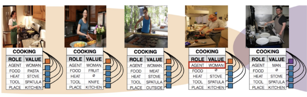
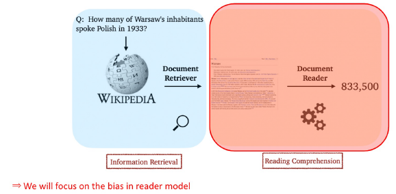
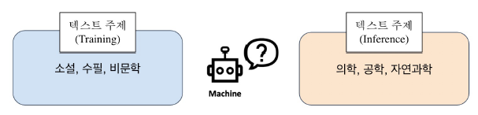
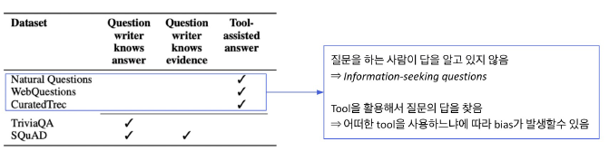
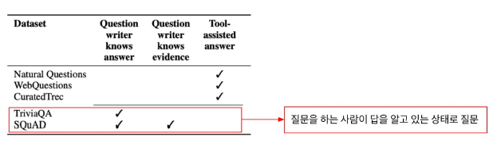
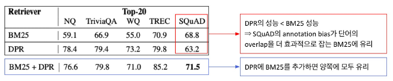

# Reducing Training Bias

day71 - 코드 분석 등 하느라 강의 못 들었음..

## Bias?

Bias의 종류

- bias in learning
  - 학습할 때 과적합을 막거나 사전 지식을 주입하기 위해 특정 형태의 함수를 선호하는 것
- biased world
  - 현실 세계가 편햐오디어 있기 때문에 모델에 원치 않는 속성이 학습되는 것
  - 성별과 직업간 관계처럼 표면적인 관계 때문에 원치않는 편향을 가질 수 있음
- bias in data generation
  - 입력과 출력을 정의한 방식 때문에 생기는 편향 specificaetion bias
  - 데이터를 샘플링하는 방식 때문에 생기는 편향 sampling bias
  - 어노테이션의 특성 때문에 생기는 편향 annotator bias

### Gender Bias

- 대표적인 bias의 예시
- 사진처럼 요리 사진에서 여성이 많이 있다보니 남자가 요리를 하는 경우에도 남자를 여자로 착각하는 경우가 발생한다.

### Sampling Bias

- <리터러시 다이제스트> 여론조사 (1936년)
  - 표본 크기: 240만명 (사상 최대)
  - 예측: 루즈벨트 43% 랜던 57% -> 실제: 루즈벨트 62% 랜던 38%
  - 설문 대상: 잡지 정기 구독자, 자동차 등록명부, 사교클럽 인명부 등 -> 중산층 이상으로 표본이 왜곡

## Bias in Open-domain Question Answering

Retriever-Reader Pipeline

### Trainin bias in reader model

만약 reader 모델이 한정된 데이터셋에서만 학습이 된다면 어떻게 될까? Reader는 항상 정답이 문서내에 포함된 데이터 쌍으로 학습을 한다. 예를 들어 SQuAD 같은 (contxet, query, answer)가 모두 포함된 데이터는 positive가 완전히 고정되어있다.

- inference 시 만약 데이터 내에서 찾아볼 수 없던 새로운 문서를 준다면?
- Reader 모델은 해당 문서에 대한 독해능력이 매우 떨어질 것이고, 정답을 내지 못 한다.

- 예를 들어 소설, 문학 지문으로 학습을 했다면, 비문학적인 글은 잘 이해하지 못 하게 된다.

### How to mitigate training bias?

- Negative example
  - 훈련시 잘못된 예시도 보여줘야 retreiver가 negative한 내용은 먼 곳에 배치할 수 있음
  - Negative sample도 완전히 다른 negative와 비슷한 negative에 대한 차이를 고려해야 함
- Add no answer bias
  - 입력 시퀀스 길이가 N일시, 시퀀스 길이 외 1개의 토큰이 더 있다고 생각.
  - 훈련 모델의 마지막 레이어 weight에 훈련 가능한 bias를 하나 더 추가
  - Softmax로 answer prediction을 최종저긍로 수행할 때, start end 확률이 해당 bias 위치에 있는 경우가 가장 확률이 높다면 '정답 없음'이라고 취급 가능해진다.

### negative sample

- 어떻게 좋은 negative sample을 만들 수 있을까?
  - corpus 내에서 랜덤하게 뽑기
  - 좀 더 헷갈리는 negative 샘플 뽑기
    - 높은 BM25/TF-IDF 매칭 스코어를 가지나, 오답인 샘플
    - 같은 문서에서 나온 다른 Passage/Question 선택

## Annotation Bias from Datasets

ODQA 학습 시 기존의 MRC 데이터셋을 활용했다. ODQA 세팅에는 적합하지 않은 bias가 데이터 제작 단계에서 발생할 수 있음.

- 질문하는 사람이 답을 알고 있음
- 질문과 evidence 문단 사이의 많은 단어가 겹치는 bias가 발생됨
  - 즉, 질문이 지문에 굉장히 의존적이게 만들게 되버림...
- SQuAD의 경우 사람들이 많이 보는 wiki 문서를 이용하므로 학습 데이터 분포 자체도 이미 bias되어 있음

### 어떤 문제가 있을까?

- BM25: sparse embedding
- DPR: dense embedding
- DPR이 일반적으로 더 높은 성능을 보인다. (dense)

- 그러나 이런 현상이 발생한 이유는 SQuAD의 bias가 단어의 중복을 유도하게 되고 이는 BM25에게 더 유리한 환경이된다. (sparse므로 단어가 겹칠수록 잘 판단하기 때문)

### annotation bias 다루기

Annotation 단계에서도 bias가 발생할 수 있음을 인지하고 이를 고려하여 데이터를 수집/제작 해야함

- Natural Questions: Supporting evidence가 주어지지 않고, 실제 유저의 질문들을 모아서 dataset을 구성. 이후 anntator들이 답을 하는 과정으로 구축
- SQuAD: passage가 주어지고 주어진 passage 내에서 질문과 답을 생성한다. 이는 ODQA에는 적합하지 않다. 예를 들어 passgae의 상황과 현재 상황이 다를 수 있기 때문이다.
