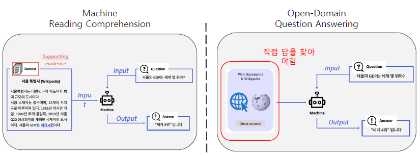
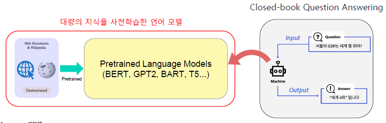
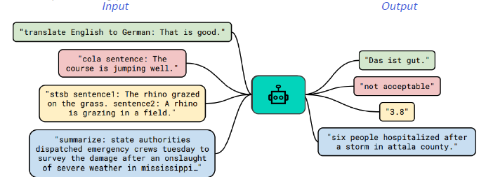
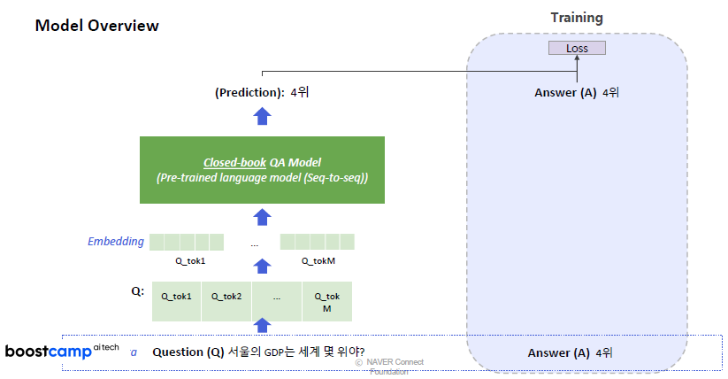
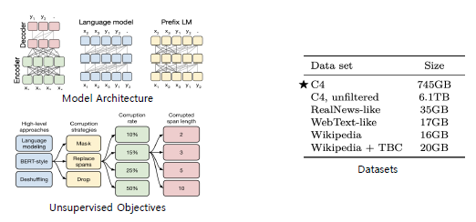
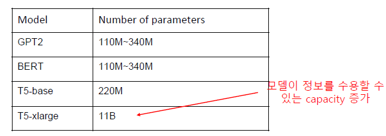
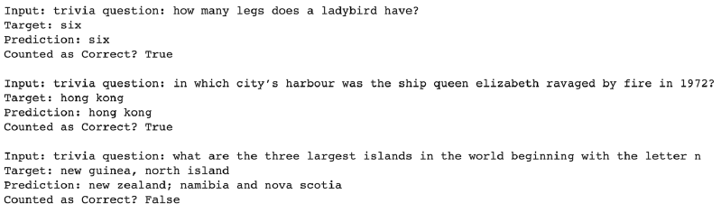
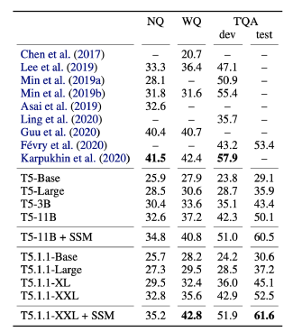
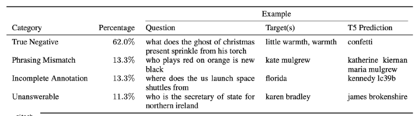

# Closed-book QA with T5

## Closed-book QA

이전까지는 문서를 주거나, 문서가 주어지지 않았을 때는 전체 corpus에서 해당되는 문서를 찾아서 모델이 문서에서 답을 찾는 방식으로 QA Task를 진행했다. 혹은 Web corpus를 이용하는 방법도 있다.

2019년부터 또 다른 방법론이 등장하였다. 모델이 이미 사전학습으로 대량의 지식을 학습했다면, 사전학습 모델 자체가 이미 하나의 Knowledge storage라고 볼 수 있지 않겠느냐는 아이디어에서 출발했다. 즉, 굳이 다른 곳에서 지식을 가져와야할 필요가 없지 않느냐는 것이다.

실제로 GPT-2의 Zero-shot QA performance 성능은 사전학습시 전혀 본 적 없는 Natural Questions 데이터셋에도 어느정도 대답이 가능한 모습을 보였다.

|                  | Open-book QA                                                                                                            | Closed-book QA                                                                                                               |
| ---------------- | ----------------------------------------------------------------------------------------------------------------------- | ---------------------------------------------------------------------------------------------------------------------------- |
| 지식을 찾는 방법 | 대량의 지식 소스를 특정 문서 단위로 나누어 Dense/Sparse 형태로 표현 후, query가 들어오면 그와 가장 관련된 문서를 search | 대량의 지식 소스(위키)를 기반으로 사전학습된 모델이 그 지식을 기억하고 있을 것이라고 가정. Search 과정 없이 바로 정답을 생성 |
| 문제점           | 지식 소스를 저장하기 어려움. 검색 시간이 소요됨                                                                         | 사전학습된 모델이 얼마나 지식을 잘 기억하고 있는지가 매우 중요함                                                             |

## Text-to-Text Format

Closed-book QA의 가능성이 입증되자 조금 더 연구가 진행되었다. Closed-book QA의 방식은 Generation based MRC와 유사하다. 단, 입력에 지문 없이 질문만 들어간다는 것이 차이점이다.

사전학습된 언어 모델은 주로 BART와 같은 seq2seq 형태의 Transformer 모델을 사용한다. Text-to-Text format에서는 각 입력값(질문)과 출력값(답변)에 대한 설명을 맨 앞에 추가한다.

### 예시

input을 받아서 output으로 새로운 text를 생성하는 문제. 다양한 text processing problem을 Text-to-Text 문제로 변형 가능하다!

- Task-specific prefix를 추가 : 특정 task에 알맞은 output text를 생성하도록 하기 위함이다.
- Text classification: 어떤 classification인지 설명을 해주고 접근한다. 두 개의 sentence를 주고, 이 둘의 관계를 예측하는 task

### Model Overview

BART와 유사한 구조이다.

### T5

Text-to-Text format의 형태로 데이터의 입출력을 만들어 거의 모든 자연어처리 문제를 해결하도록 학습된 seq2seq 형태의 Transformer 모델. 다양한 모델 구조, 사전학습 목표, 사전학습용 데이터, Fine-tuning 방법 등을 체계적으로 실험함. 가장 선능이 좋은 방식들을 선택하여 방대한 규모의 모델을 학습시켰다.

특히 C4 라는 6.1TB 사이즈의 엄청 큰 데이터를 745GB 정도로 줄여서 사용했다. 그럼에도 상당히 많은 양의 데이터이다.

특히 많은 정보를 담아야하기 때문에 파라미터의 개수가 엄청나게 크게 증가하게 되었다.

### T5 활용

미리 학습된 T5를 가져와서 MRC 데이터셋 (TriviaQA, WebQuestions, Natural Questions)의 QA pair를 활용한다. 실제로도 T5 fine-tuning에서 활용한 데이터셋이다. 다만 MRC 데이터셋에서 제공되는 supporting document는 무시했다.

## Experiment Result & Analysis

- Dataset
  - Open-domain QA 데이터셋 또는 MRC 데이터셋에서 지문을 제거하고 질문과 답변만 남긴 데이터셋을 활용
- Salient Span Masking
  - 고유명사, 날짜 등 의미를 갖는 단위에 속하는 토큰 범위를 마스킹한 뒤 학습
  - Pre-trianed 체크포인트에서 추가로 pre-training 함
- Fine tuning
  - Pre-trained T5 체크포인트를 Open-domain QA 학습 데이터셋으로 추가 학습

사실 마지막 문제에 대해서는 정답을 틀리게 냈다. 틀릴 수는 있지만 그래도 어느정도 질문을 이해한 상태에서 답을 하는 모습을 볼 수 있다.

### Quantitative Examples

- 대부분의 Open-book 스타일 모델 (검색 후 독해)보다 뛰어난 성능을 보여줌
- 모델 크기가 커질수록 성능이 증가함
- Salient Span Masking이 성능을 크게 끌어올림

### False negatives

- EM 기준으로 오답으로 채점된 결과를 사람이 평가한 결과 오답이 아닌 경우
  - Pharsing Mismatch: 정답에 대한 표현을 다르게 한 경우
  - Incomplete Annotation: 정답이 여러개 일 수 있으나 하나만 정답으로 처리된 경우
  - Unanswerable: 질문을 하는 시간이나 문맥에 따라 정답이 달라지는 경우
- 즉, 오답 중 62%는 실제로 틀린 답이지만, 나머지에 대해서는 사람이 보았을 때 틀렸다고 하긴 힘든 답안이었다.

### Limitations

- 모델의 크기가 커서 계산량이 많고 속도가 느림. 더 효율적인 모델이 필요
- 모델이 어떤 데이터로 답을 내는지 알 수 없음. 결과의 해석 가능성(interpretablility)를 높이는 연구가 필요
- 모델이 참조하는 지식을 추가하거나 제거하기 어려움

# 9강 실습

(9강) Closed book QA.ipynb 참조
