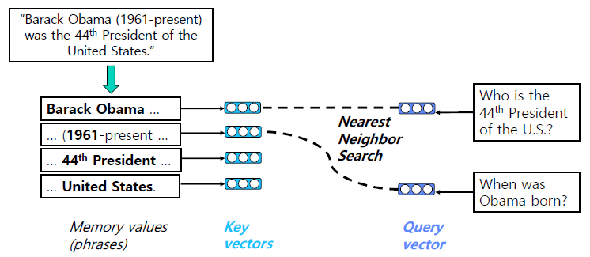
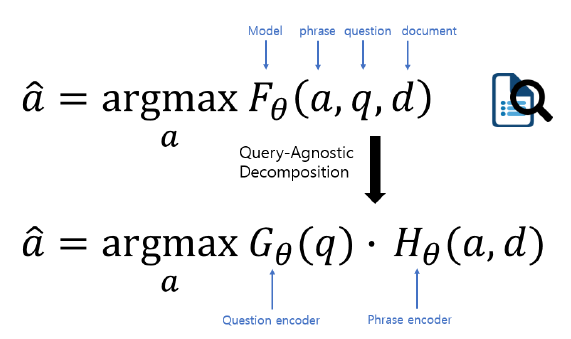
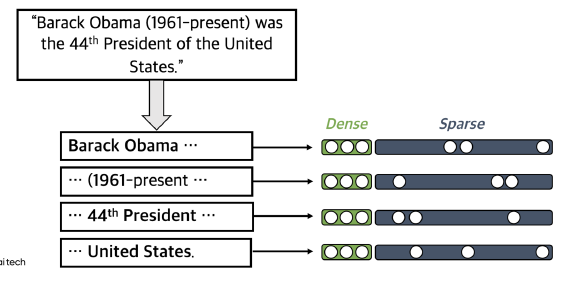
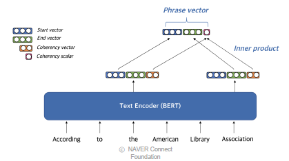
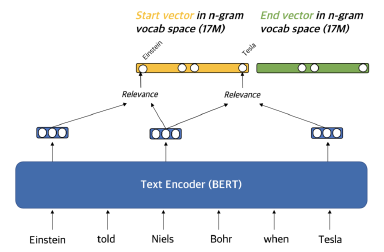
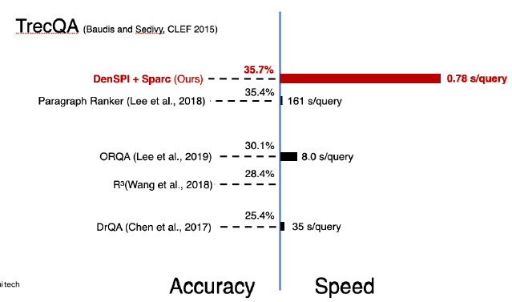
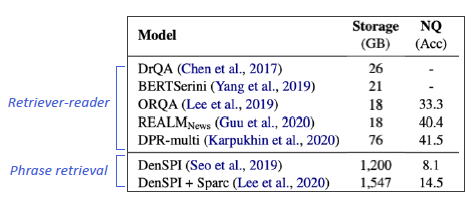
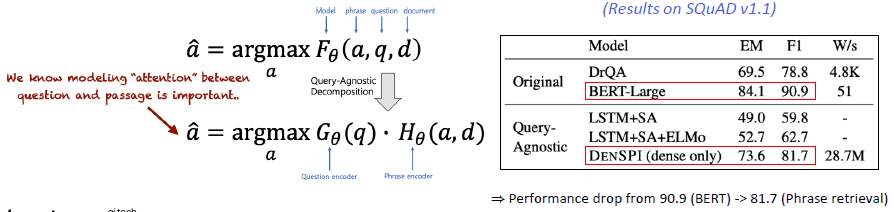

# QA with Pharse Retrieval

## Pharse Retrieval in Open-domain QA

- Retriever-Reader 구조의 한계점
  - Error Propagation 이슈: 5~10개의 문서만 reader에게 전달됨. 즉, Retriever가 잘못한다면 Reader가 아무리 좋더라도 성능에 문제가 발생함.
  - Query-dependent encoding: query에 따라 정답이 되는 answer span에 대한 encoding이 달라짐. (query + context 를 한번에 인코딩하기 때문...)

### Pharse Search

- Document search와 비슷
  - 문서를 가져오려고 할 때, 문서에 대한 벡터를 구성해놓고, 관련있는 문서를 가져오는 방법.
  - 문서 검색을 하듯이, 정답을 그냥 바로 검색하면 되지 않을까?

문서의 pharse들을 전부 임베딩(key vector)해놓고, 질문이 들어왔을때 질문과 가장 가까운 key vector를 찾아내면 관련있는 문서임을 알 수 있다. 새로운 질문이 들어오더라도 또 그 질문에 대한 키 벡터를 찾아내면 된다.

기존 방식에서는 새로운 질문이 들어올 때 마다, F 펑션을 이용해 계속 새로운 계산을 진행해야 한다. 그러나 Pharse retrieval을 적용한다면, 새로운 질문이 들어오더라도 G(q)만을 계산하면 된다. 즉, H(a, d)는 그대로 놔둔채로 사용하므로 훨씬 효율적이다.

하지만 F가 G와 H로 나누어질 수 있다는 가정 자체가 빈약하다. 즉, 실제로 정확히 decompose 하기 보다는, approximate한 방식으로 접근하게 된다. 여기서 문제점이 발생하게 된다.

- 여전한 문제점?
  - Key Challnage: 어떻게 각 pharse를 vector space 상에 잘 매핑할 수 있을까?
  - Dense와 Sparse 임베딩을 둘 다 사용해보자!
  - 최근에는 Dense만을 사용해도 잘 되는 모델도 있다.

## Dense-sparse Representation for Phrases

- Dense vs Sparse
  - Dense: 통사적, 의미적 정보를 담는 데 효과적
  - Sparse: 어휘적 정보를 담는 데 효과적

예를 들어 아인슈타인과 테슬라를 비교해보자. 둘 다 과학자므로 비슷한 의미를 가진다고 볼 수도 있으나, 두 사람은 완전 다른 사람이다. 만약 두 사람을 비교하고자 한다면 dense vector가 더 적절하지만, 둘을 완전히 구분하고자 한다면 sparse vector가 더 적절하다.

- Dense vector를 만드는 방법
  - Pre-trained LM (BERT)를 이용
  - Start 벡터와 end 벡터를 재사용해서 메모리 사용량을 줄임

- Coherency vector
  - pharse가 한 단위 문장 구성요소에 해당하는 지를 나타냄
  - 구를 형성하지 않느 pahrse를 걸러내기 위해 사용
  - start & end vector를 이용하여 계산
- Question embedding
  - Question을 임베딩할 때는 [CLS] 토큰 (BERT)를 활용

- Sparse representation

  - 각 pharse의 주변 단어들과의 유사성을 계산하여 그 유사성을 각 단어에 해당하는 sparse vector상에 매핑한다. 일종의 TF-IDF와 비슷하나, 각 문장마다 단어의 weight가 다양하게 변하는 형태를 갖는다.
  - n-gram을 활용하여 겹치는 부분도 어느정도 정보를 활용할 수 있다.

- Scalability Challenge
  - wiki에는 60B의 pharse가 존재한다. 저장과 인덱싱, 검색의 scalability가 고려되어야 함...
  - FAISS를 활용하여 dense vector에 대한 search를 먼저 수행 후, sparse vector로 reranking 하는 방식을 사용함.
    - FAISS 는 dense 에만 적용 가능하므로..

## Experiment Result & Analysis

- 당시 기준, SQuAD-open에서 좋은 성능을 보였다.
  - DrQA보다 성능이 높으면서도 68배정도 빠른 속도를 보였음. 거의 1초 미만

- 다만 그 후로 등장한 모델들과 비교해서는 낮은 성능을 보였다.
  - 특히, 많은 하드웨어적 요구사항이 있었다. RAM은 30기가 이상, Storage도 1.5TB 이상 등.. 다만 GPU가 필요하진 않았다.
  - 최신 Retriever-reader 모델 대비 낮은 성능
  - approximate하지만 결국 차이가 발생할 수 밖에 없다.

- 결국 F 함수가 G와 H로 decompose 할때 발생하는 gap 때문이라고 볼 수 있다.
- 기존: Question, passage, answer가 모두 함께 embedding
- Qeustion & passage와 Question & answer이 각각 encoding 되므로 question과 passage 사이의 attention 정보 교환이 일어나지 않는다.
