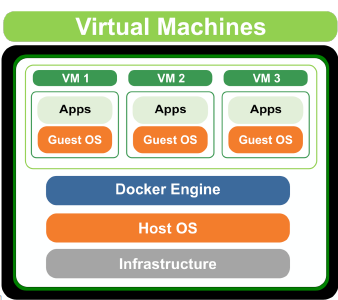
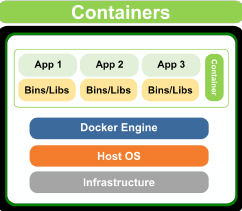
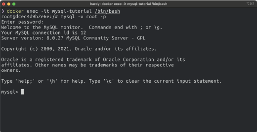
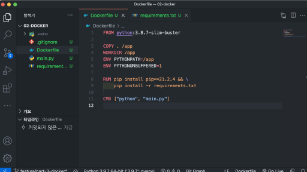
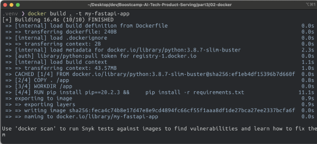

day85 -> 휴가!

# Docker

## 가상화

개발할 때, 서비스 운영에 사용하는 서버에 직접 들어가서 개발하지 않는다. Local 환경에서 개발하고, 완료되면 Staging 서버 / Production 서버에 배포하게 된다.

이때 Local 환경에는 윈도우/맥이고 서버 환경은 Linux인 경우가 있을 수 있다. 즉, OS가 다르기 때문에 라이브러리, 파이썬 등 설치 시 다르게 진행해야 한다.

다양한 설정을 README 등에 기록하고 항상 실행하도록 하는 방법이 있을 수 있다. 하지만 이는 사람이 진행하는 일이라 Human Error가 발생할 수 있다.

거기에 운영하는 서버가 100대, 그 이상이라면?

- 특정 서버 업데이트가 진행되었다면 다른 나머지 서버에도 모두 접속해 동일한 업데이트가 필요하다.

> 서버 환경까지 모두 한번에 소프트웨어화 할 수 없을까?

이런 고민을 해결하기 위해 나온 개념이 `가상화`다. 엄밀히는 HW와 SW 가상화는 다르지만, 여기서는 SW 가상화로 한정함.

### 가상화의 장점

- 특정 소프트웨어 환경을 만들고, Local과 Production 서버에서 그대로 활용
- 개발과 운영 서버의 환경 불일치 해소
- 어느 환경이나 동일한 환경을 보장하여 프로그램을 실행할 수 있음
- 개발 외에도 Research도 같은 환경을 사용할 수 있음

### Docker 등장 이전



가상화 기술로 주로 VM을 사용했다. 호스트 머신이라고 하는 실제 물리 컴퓨터 위에 OS를 포함한 가상화 SW를 두는 방식이다.

GCP의 컴퓨터엔진 또는 AWS EC2가 이런 개념을 활용했다. 클라우드 회사에서 미리 만든 이미지를 바탕으로, Computing 서비스를 통해 사용자에게 동일한 컴퓨팅 환경을 제공하는 것이다.

그러나 OS 위에 OS를 하나 더 실행시키는 점 때문에 VM은 굉장히 많은 리소스를 사용하게 된다. 이때 `Container`라는 기술이 등장하게 된다. VM의 무거움을 크게 덜어주면서 가상화를 좀 더 경량화된 `프로세스`의 개념으로 만든 기술이다.



### Docker 등장!

Container 기술을 쉽게 사용할 수 있도록 나온 도구가 바로 `Docker`!!

- 2013년 오픈소스로 등장
- 컨테이너 기반 개발과 운영을 매우 빠르게 확장함

## Docker

- Docker Image
  - 컨테이너를 실행할 때 사용할 수 있는 `템플릿`
  - Read Only
- Docker Container
  - Docker Image를 활용해 실행된 `인스턴스`
  - Write 가능

Docker를 이용하면, 다른 사람이 만든 소프트웨어를 가져와서 바로 사용할 수 있다!!! 이때 도커 이미지에는 OS, 설정을 포함한 실행환경까지 같이 포함된다. 따라서 OS에 구애받지 않고 어디서나 `동일하게 실행`할 수 있다!

자신의 이미지를 다른 사람에게 공유할 때도 유용하다. 원격 저장소에 저장하여 어디서나 사용할 수 있다!

- Docekr Registry
  - 회사에서 서비스를 배포할 때는 원격 저장소에 이미지를 업로드하고 서버에서 받아서 실행하는 식으로 진행된다.
  - Docker hub, GCR, ECR등등...

## Docker 실습

상세한 실습 과정은 PDF 참조!

- docker pull mysql:8
  - mysql 8버전을 다운하게 됨
- docker images
  - 다운받은 이미지 확인
- docker run --name mysql-tutorial -e MYSQL_ROOT_PASSWORD=1234 -d -p 3306:3306 mysql:8
  - name: 컨테이너 이름을 지정
  - -e: 환경변수 설정. 사용하는 이미지에 따라 설정은 다르다
  - -d: 데몬 모드. 컨테이너를 백그라운드 모드로 실행함. 설정하지 않는 경우 현재 실행하는 셸 위에서 컨테이너가 실행됨. 컨테이너 로그를 바로 볼 수 있으나, 컨테이너를 나가면 실행이 종료됨
  - -p: 로컬호스트 포트:컨테이너 포트 설정. 3306포트를 이용함. mysql의 경우 기본적으로 3306 포트를 활용한다.

### docker 프로세스 관리

- docker ps
  - 실행한 `컨테이너`를 확인할 수 있음
  - 작동을 멈춘 컨테이너는 docker ps -a 명령어로만 확인할 수 있음. docker ps는 실행중인 컨테이너만 보여준다.
- docker exec -it '컨테이너이름' /bin/bash
  - MYSQL이 실행되고 있는지 확인하기 위해 컨테이너에 진입하는 명령어
  - 컴퓨터엔진의 SSH 접속과 유사함!



> MySQL 프로세스로 들어가면 MySQL 셸 화면이 보이는 것을 알 수 있음!

- docker rm 컨테이너이름
  - 멈춘 컨테이너를 삭제한다. 멈춘 컨테이너만 삭제할 수 있지만, -f 옵션을 주면 실행중인 컨테이너도 삭제 가능하다.

### 호스트-컨테이너 간 공유

그 외 docker run 할 때 파일을 공유하는 방법

- Volume Mount
  - Docker Container 내부는 특별한 설정이 없으면 컨테이너를 삭제할 때 파일이 사라진다. 즉, 호스트와 컨테이너 간 파일 공유가 되지 않는다.
  - 만약 파일을 유지하고 싶다면 호스트와 컨테이너의 저장소를 `공유` 해야함
  - Volume Mount를 진행하면 호스트-컨테이너 간 폴더가 공유된다.
  - -v 옵션으로 사용하며 p옵션처럼 사용한다.
    - -v Host_folder:Container_folder

```
docker run -it -p 8888:8888 -v /some/host/folder:/home/joyvan/workspace jupyter/minimal-notebook
```

### Docker Image 만들기

간단한 FastAPI 애플리케이션을 실행하는 서버를 Docker Image로 생성해보자!

상세한 과정은 PDF 및 실습 코드 참조!

- pip freeze: 설치한 라이브러를 모두 보여줌
  - pip freeze > requeirements.txt
- Dockerfile 이라는 파일을 만들어 예시처럼 작성한다.



- FROM '이미지이름:태그'
  - 이미지 빌드에 사용할 베이스 이미지 지정
  - 베이스 이미지는 이미 만들어진 이미지다.
  - 보통 처음부터 만들기 보다는 공개된 이미지를 기반으로 새로운 설정을 추가함
- COPY . /app
  - COPY '로컬 디렉토리' '컨테이너 내 디렉토리'
  - 컨테이너는 자체적인 파일 시스템과 디렉토리를 가진다
  - COPY 명령어로 dockerfile이 존재하는 경로 기준, 로컬 디렉토리를 컨테이너 내부의 디렉토리로 복사한다
  - 해당 코드는 프로젝트 최상위에 존재하는 모든 파일을 컨테이너 내부에 `/app` 디렉토리로 복사하게 된다
- WORKDIR /app
  - WORKDIR '컨테이너 내부 디렉토리'
  - 도커파일의 RUN, CMD 등 명령어를 실행할 컨테이너 경로 지정
- ENV '환경변수 이름=값'
- RUN pip install ...
  - RUN '실행할 리눅스 명령어'
  - 컨테이너 내 리눅스 명령어를 실행한다
  - 위의 경우 pip 명령어를 실행하게 됨.
  - 한번에 실행할 명령어가 여러개인 경우 &&\ 로 이어줌
  - 이전 라인에서 COPY와 WORKDIR이 설정되었으므로 컨테이너 내 requirements.txt가 존재하고, 이를 pip install -r로 실행할 수 있음
- CMD ['python', 'main.py']
  - CMD ['실행할 명령어', '인자']
  - docker run으로 이 이미지 기반으로 컨테이너를 만들 때, 실행할 명령어
  - 이미지는 실행되는 즉시 python main.py 를 실행하게 됨. CMD는 띄어쓰기를 사용하지 않음!

### 그 외 명렁어들

- EXPOSE: 컨테이너 외부에 노출할 포트 지정
- ENTRYPOINT: 이미지를 컨테이너로 띄울 때 항상 실행되는 커맨드

여기서 의문, RUN, CMD, ENTRYPOINT의 차이는?

- RUN:
- CMD:
- ENTRYPOINT:

### Docker Image Build

- docker build 'dockerfile 경로'
  - 이미지 생성은 빌드라고 표현함
  - 아래 이미지에서 .은 현재 폴더에 dockerfile이 잇음을 의미함
  - -t '이미지이름:태그'
    - 이미지 이름과 태그를 지정해 줄 수 있다!
    - 태그는 미지정하는 경우 `latest`로 설정됨



### Docker Image Push

Container registry에 우리가 만든 이미지를 업로드해보자! 여기서는 GCP의 GCR을 사용해본다.
