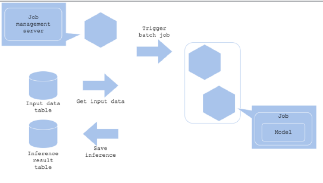

# 머신러닝 디자인 패턴

## 디자인 패턴

- 처음 개발할 때는 main.py, inference.py, predict.py, train.py 정도 등 간단하게 시작할 것이다.
- 점점 규모가 커지면 하나의 시스템에 여러 역할이 필요한 경우가 존재하게 됨.
- 복잡한 `비즈니스 로직`을 해결하기 위해 코드 아키텍쳐를 잘 설계하는 것이 중요하다!

디자인 패턴

- 문제를 해결하는 방법을 패턴화
- 반복적으로 발생하는 문제를 어떻게 해결할지에 대한 솔루션!
- 안티패턴: 좋지 않은 패턴

### 머신러닝의 특수성

- 일반적인 개발 패턴 외에도 머신러닝의 특수성으로 별도의 디자인 패턴이 필요하다.
- 머신러닝의 특수성: Data, Model, Code
- 학습, 예측, 운영하면서 생기는 노하우를 패턴화
- 단, 이 방법이 꼭 best는 아닐 수 있다. 참고할 수 있는 지침서로 활용하자

머신러닝의 디자인 패턴은 크게 4가지로 분류할 수 있다.

- Serving: 모델을 production 환경에서 서빙하는 패턴
- Training: 모델을 학습하는 패턴
- QA: 모델의 성능을 Production 환경에서 `평가`하기 위한 패턴
- Operation: 모델을 운영하기 위한 패턴

## Serving 패턴

머신러닝 모델을 production 환경에서 어떻게 사용할 것인가? Online serving, batch serving etc...

### Web Single 패턴

Usecase

- 가장 간단한 아키텍처
- 예측 서버를 빠르게 출시하고 싶은 경우

Architecture

- FastAPI, Flask 등으로 단일 REST 인터페이스 생성
- 요청시 전처리도 포함
- 간단하게 생성할 수 있는 구조

장점

- 하나의 프로그래밍 언어로 진행
- 아키텍처의 단순함

단점

- 구성 요소 하나가 바뀌면 전체 업데이트를 해야 함

### Synchronous 패턴

Usecase

- 예측 결과에 따라 로직이 달라지는 경우
- 예) 예측 결과가 강아지라면 강아지화면, 고양이라면 고양이 화면을 띄워야 하는 경우

Architecture

- 예측이 끝날 때까지 프로세스를 Block해야 함
- REST API는 대부분 Synchronous 패턴이다

장점

- 아키텍처의 단순함
- 예측이 완료될 때 까지 프로세스가 다른 작업을 하지 않으므로 Workflow가 단순해짐

단점

- 예측 속도가 병목을 일으키게 됨
- 특히 동시에 많은 요청이 올 경우 문제가 된다.
- 예측 지연으로 사용자 경험에 악영향을 줄 수 있음

### Asynchronous 패턴

Usecase

- 예측과 진행 프로세스의 의존성이 없는 경우
- `비동기`로 실행됨. 예측 요청 후 바로 답을 필요가 없는 경우
- 예측 요청하는 클라이언트와 응답을 반환하는 목적지가 분리된 경우

Architecture

- 클라이언트와 예측 서버 사이에 메시지 시스템(Queue)를 추가
- 특정 메시지에 request 데이터를 메시지 Queue에 저장(Push)
- 특정 서버는 메시지 Queue의 데이터를 가져와서 예측(Pull)

장점

- 클라이언트와 예측이 분리
- 클라이언트가 예측을 기다릴 필요가 없음

단점

- 메시지 queue 시스템을 구축해야 함
- 실시간 예측에는 부적합

### Batch 패턴

Usecase

- 예측 결과를 실시간으로 얻을 필요가 없는 경우
- 대량의 데이터에 대한 예측이 필요한 경우
- 예측 실행이 시간대별, 월별, 일병 등 스케쥴링 하는 경우

Architecture

- 실시간으로 진행할 필요가 없음
- Airflow 등으로 batch 작업을 스케줄링에 맞게 트리거링
- Input, Output 데이터는 `데이터 웨어하우스`에 저장

장점

- API 서버 등을 개발하지 않아도 되는 단순함
- 서버 리소스를 유연하게 관리할 수 있다

단점

- 스케줄링을 위한 서버가 필요함

### Preprocess - Prediction 패턴

Usecase

- 전처리와 예측을 분리하고 싶은 경우
- 전처리와 예측에서 사용하는 언어가 다른 경우
- 리소스를 분리해서 효율성 향상을 원하는 경우

Architecture

- 전처리 서버와 예측 서버를 분리
- Request를 할 경우 맨 처음엔 전처리 서버로 가서 전처리하고, 그 데이터를 예측 서버로 request

장점

- 전처리 서버와 예측 서버 분리를 통한 효율적 리소스 관리
- Fault isolation: 장애 격리가 가능
- 딥러닝에서는 전처리도 많이 필요해서 이렇게 활용하기도 함

단점

- 서버 2개를 운용하는 부담
- 전처리 서버와 예측 서버 네트워크 연결에서 병목이 발생할 수 있음

### Microservice Vertical 패턴

Usecase

- 여러 모델이 순차적으로 연결되는 경우
- A 모델의 결과를 B모델의 input으로 사용하는 경우
- 예측끼리 의존 관계가 있는 경우

Architecture

- 각각의 모델을 별도의 서버로 배포
- 동기적으로 순서대로 예측하고, 예측 결과를 다른 모델에 또 reqeust

장점

- 여러 예측을 순서대로 실행할 수 있음
- 이전 예측 결과에 따라 다음 예측 모델을 여러개로 분기

단점

- 동기적으로 실행되므로 대기시간이 더 걸림
- 하나의 포인트에서 병목이 발생할 수 있음
- 복잡한 시스템 구조

### Microservice Horizontal 패턴

Usecase

- 하나의 request에 여러 모델을 병렬로 실행
- 보통 이런 경우 마지막에 예측 결과를 통합함

Architecture

- Microservice Vertical 패턴과 유사하게 모델을 각각 서버로 배포
- request가 올 경우 여러 모델 서버로 예측

장점

- 리소스 사용량을 독립적으로 사용하고, 장애 격리가 가능
- 다른 모델에 의존성이 없이 개발할 수 있음

단점

- 시스템이 복잡해질 수 있음

### Prediction Cache 패턴

Usecase

- request할 때 데이터를 저장하고 예측 결과도 별도로 저장
- 예측 결과가 자주 변경되지 않는 경우
- 입력 데이터를 캐시로 활용하는 경우
- 예측 속도를 개선하려는 경우

Architecture

- rquest가 올 경우 해당 데이터로 예측한 결과가 있는지 우선 캐시에서 검색 (주로 `Redis`를 사용)
- 만약 예측된 결과가 있다면 해당 데이터를 바로 return
- 없다면 모델이 예측 후 반환
- 오래된 예측은 주기적으로 삭제를 해야 함

장점

- 반복되는 요청이 있는 경우 성능 개선

단점

- 캐시 서버를 운영해야 함

## 안티 Serving 패턴

### Online Bigsize 패턴

- 실시간 대응이 필요한 온라인 서비스에 예측이 오래 걸리는 모델을 사용하는 경우
- 속도와 비용 Trade-off를 조절해 모델 경량화를 해야 한다.
- 실시간이 아닌 배치로 변경하는 것도 가능한지 검토
- 중간에 캐시 서버를 추가하여 캐싱하거나, 전처리를 분리하는 등 Bigsize를 탈피해야 함

### All-in-one 패턴

- 하나의 서버에 여러 예측 모델을 띄우는 경우
- predict1, predict2, predict3로 나눠서 하나의 서버에서 모두 실행하는 경우를 말함
- 라이브러리 선택 제한이 존재
- 장애가 발생하는 경우 로그 확인이 매우 어려워짐

## Training 패턴

학습 파이프라인을 구성하기 위한 패턴이다. 얼마나 자주 학습하는지, 학습의 component를 다양한 단계에 재사용 하는지 등을 검토.

### Batch Training 패턴

Usecase

- 주기적으로 학습해야 하는 경우

Architecture

- Batch serving 패턴처럼 스케줄링 서버 필요
- 학습 과정의 전처리, 평가과정 모두 필요
- 저장한 모델을 사용할 수 있도록 저장하는 작업 필요

장점

- 정기적인 재학습과 모델 업데이트

단점

- 데이터 수집, 전처리, 학습, 평가 과정에서 오류가 발생할 상황을 고려해야 함

### Pipeline Training 패턴

Usecase

- 학습 파이프라인 단계를 분리해 각각을 선택/재사용 할 수 있도록 만드는 경우
- 각 작업을 별도로 컨트롤하고 싶은 경우

Architecture

- Batch training 패턴의 응용
- 각 작업을 개별 리소스로 분할한다. (서버/컨테이너 등)
  - 전처리 서버는 메모리가 크게, 서빙 서버는 GPU를 써야하는 등등
- 시간이 많이 걸리는 작업은 자주 실행하고, 다른 작업은 적게 실행
- 이전 작업의 실행 결과가 후속 작업의 Input이 됨
- 처리 완료된 데이터를 `데이터 웨어하우스`에 중간 저장

장점

- 작업 리소스, 라이브러리를 유연하게 선택 가능
- 장애 분리
- Workflow 기반 작업
- 컨테이너를 재사용 할 수 있음

단점

- 다중 구조로 여러 작업을 관리해야 함

## 안티 Training 패턴

### Training code in Serving 패턴

- 학습, 실험, 평가에 사용해야 하는 코드가 서빙 코드에 들어간 경우
- 학습, 실험, 평가를 위한 환경과 서빙을 같이 처리하는 경우
- Research 단계와 Production 단계에서 필요한 코드와 로직은 다르다
- 마찬가지로 리소스도 분리해야 함

### Too many pipes 패턴

- 학습 파이프라인이 너무 다양하고 복잡한 경우
- 데이터 소스가 너무 많아서 각각 가져오는 방법이 다양하고, 추상화되어 있지 않은 경우

## QA 패턴

예측 서버와 모델의 성능 평가를 위한 패턴

- 모델이 처음 배포된다면 배포 끝! 이지만, 기존 모델이 있고 신규 모델이 있다면 모델을 비교해야 함
- Production 환경에 영향이 없도록 Test 하는 패턴, 바로 영향이 가는 패턴 등이 존재
- 추천 시스템에서 자주 사용. AB Test - MAB 등

### Shadow AB Test 패턴

Usecase

- 새로운 예측 모델이 production 환경에서 잘 동작하는지 확인하고 싶은 경우
- 새로운 예측 서버가 production 환경의 부하를 잘 견디는지 확인하고 싶은 경우

Architecture

- 예측 모델, 서버를 production 환경에 배포하기 전에 사용
- request가 들어온 경우 기존 모델과 새로운 모델 모두에게 전달하고 resposne는 기존 모델 서버에만 전달됨.
  - 새로운 모델의 결과는 별도로 저장만 한다
- 모델이 잘 예측하는지 동시에 2개의 모델의 결과를 보고 판단
- 새로운 모델이 문제가 생기면 AB test에서 제거하고 다시 개선하러 가자!
- 현재 모델은 계속 운영하므로 Risk가 적다!

장점

- production 환경에 영향을 주지 않고 새로운 모델 성능을 확인할 수 있음
- 여러 모델의 예측 결과를 수집해서 분석 가능

단점

- 새로운 예측 서버에 대한 비용

### Online AB Test 패턴

Usecase

- 새로운 모델이 production 환경에서 잘 동작하는지 확인하고 싶은 경우
- 새로운 서버가 prodction 환경의 부하를 견딜 수 있는지 확인하고 싶은 경우
- 온라인으로 여러 예측 모델을 측정하고 싶은 경우

Architecture

- Shadow AB Test 패턴과 비슷
- request가 들어오면 지정된 비율에 따라 트래픽을 나눠서 절반은 기존 모델, 절반은 신규 모델이 예측
- 보통 신규 모델의 비율을 10% 잡고 시작함

장점

- production 환경에서 새로운 모델의 예측 결과/속도 등을 확인 가능
- 여러 모델의 예측 결과를 수집하여 분석 가능

단점

- 새로운 모델이 비즈니스에 노출되므로 부정적인 영향을 끼칠 수 있음
- 새로운 예측 서버에 대한 비용

## 안티 QA 패턴

### Offline Only 패턴

- 머신러닝 모델이 Online test를 하지 않고, Offline Test Data로만 진행되는 경우
- 머신러닝 모델의 비즈니스 가치를 입증하기 어렵다
- 로컬 환경에서만 테스트 하는 것이 아니라, production 환경에도 꼭 사용하는 시기가 필요함

## Operation 패턴

머신러닝 시스템의 설정, 로깅, 모니터링 등 운영을 위한 패턴

- 모델의 이미지를 함께 docker image로 만들까?
- 로그를 어떻게 저장할까?
- 저장된 로그의 모니터링은 어떻게 할까?
- 기타 등등...

### Model in Image 패턴

Usecase

- 서비스 환경과 모델을 통합해서 관리하려는 경우
- Docker Image 안에 모델이 저장되는 경우
- 작은 모델이라면 가능하나, 크기가 GB 단위처럼 크다면 장기적인 관점에서 잘 고려해야 함

Architecture

- Docker Image로 모델 코드와 모델 파일(pkl)를 저장해서 사용
- Production 환경에선 이 이미지를 pull하여 사용

장점

- production 환경과 dev 환경을 동일하게 운영 가능

단점

- 모델을 수정하는 일이 빈번하다면 매번 Docker Image Build를 계속 수행해야 함

### Model Load 패턴

Usecase

- Docker 이미지와 모델 파일을 분리하고 싶은 경우
- 모델 업데이트가 빈번한 경우
- 서버 이미지는 공통으로 사용하되, 모델은 여러개를 사용하는 경우

Architecture

- 개발 코드는 Docker Image로 Build
- 모델 파일은 Object Storage 등에 업로드하고 프로세스 시작할 때 모델 파일을 다운한다
  - Hugging face hub 등
- 분리를 통해 서버 이미지 경량화가 가능

장점

- 모델과 서버 이미지를 구분
- 서버 이미지를 재사용할 수 잇으며, 서버 이미지가 경량화됨

단점

- 모델 파일을 가지고 와야하기 때문에 서비스 시작시 설정이 오래걸릴 수 있음
- 서버 이미지와 모델관리를 따로 해야 함

### Prediction Log 패턴

Usecase

- 서비스 개선을 위해 예측, 지연시간 로그를 사용하려고 하는 경우
- Data Validation, 예측 결과 등을 확인하고 싶은 경우

Architecture

- 프로세스에 로그를 저장하지 않고, `메시지 시스템`으로 넘겨서 프로세스가 저장에 신경쓰는 시간을 줄임
- 장애 등을 파악할 수 있도록 로그도 기록하고 모니터링도 할 수 있도록

장점

- 예측 결과, latency 등을 분석할 수 있음

단점

- 로그가 많아지면 저장 비용이 발생

### Condition Based Serving 패턴

Usecase

- 상황에 따라 예측해야 하는 대상이 다양한 경우
- 룰 베이스 방식으로 상황에 따라 모델을 선택하는 경우

Architecture

- 사용자의 상태, 시간, 장소에 따라 예측 대상이 달라짐

장점

- 상황에 따라 알맞은 모델 제공

단점

- 모델 수에 따라 운영비용 증가

## 안티 Operation 패턴

### No Logging 패턴

- 별도의 로그를 남기지 않는 경우
- 문제가 발생하면 분석이 불가능해진다...

# 정리

- 머신러닝 시스템 개발도 점점 패턴화가 진행되고 있다.
- 어떻게 설계할지 고민된다면 패턴을 찾아보고 떠올려보자!

이미지 출처: https://mercari.github.io/ml-system-design-pattern/README_ko.html

패턴 코드가 궁금하다면? https://github.com/shibuiwilliam/ml-system-in-actions

> 참고도서: 머신러닝 시스템 디자인 패턴
