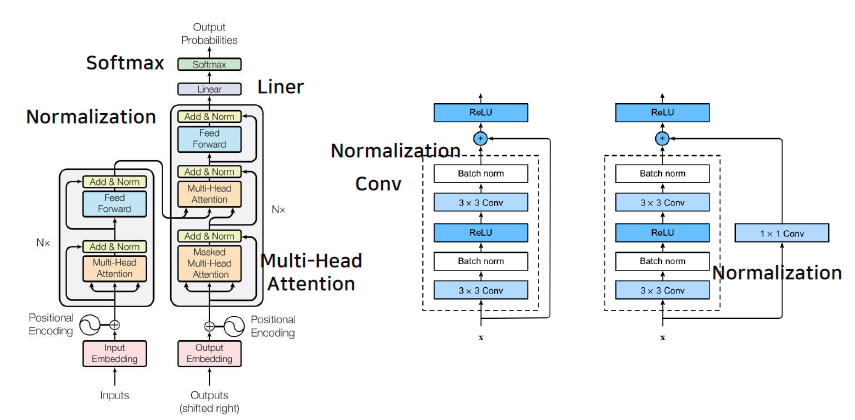

# AutoGrad & Optimizer

## 논문을 구현해보자!

ResNet 논문을 보면 굉장히 기다란 레이어들이 쌓인 구조를 하고 있다는 것을 알 수 있다. 하지만, 대부분은 수많은 반복의 연속일 뿐이다. 즉, 레이어를 마치 블록처럼 생각하고, 블록을 쌓아 만든 구조가 딥러닝이라고 할 수 있다.


그림에서 각각의 레이어가 어떤 역할을 하는지 볼 수 있다. 특정한 일을 하는 레이어도 있고, 단순히 데이터를 취합하거나 분배하는 일도 한다. 여러개의 레이어를 합쳐 하나의 큰 레이어로 보기도 한다.

## torch.nn.Moudle

- 딥러닝을 구성하는 Layer의 base Class이다.
- Input, Output, Forward, Backward 정의
- 학습의 대상이 되는 parameter(tensor) 정의


인풋 x, y에 대해 작용하는 f(x,y), 그리고 output z로 구성됨. xw + b = z 라는 대표적인 수식을 알고 있을 것이다. f(x, y)가 바로 그 수식이다.

backward 에서는 미분값들을 이용한다.
$$ df = {dL \over dW}, {dL \over db} $$
여기서 df는 dL/dW, dL/db (b는 bias) 등을 구하게 되는 것이 일반적으로 nn.Module을 구성하는 방법이다.

## nn.Parameter

모듈을 구성하기 위해서 학습이 대상이 되는 weight값을 정해야 한다. 보통 weight 값은 parameter라는 클래스에 정의를 하게 된다.

- Tensor의 상속 객체
- nn.Module 내에 attribute가 될 때는 required_grad=True로 지정되어 학습이 대상이 된다
- 직접 지정할 일은 잘 없음: 대부분의 layer에는 weights 값들이 지정되어 있기 때문

### xw + b 예제

```python
class MyLiner(nn.Moudle):
    def __init_(self, in_features, out_features, bias=True):
        super().__init__()
        self.in_features = in_features
        self.out_features = out_features

        self.weights = nn.Parameter(torch.randn(in_features, out_features))
        self.bias = nn.Parameter(torch.randn(out_features))

    def forward(self, x:Tensor):
        return x @ self.weights + self.bias
```

input이 되는 만큼의 weights 개수가 in_features에 들어가게 된다. out_features는 나오는 weights의 개수가 된다. 예를 들어, 3개의 batch-data에서 7개의 feature를 넣어서 5개의 output으로 바꾼다고 한다면, 총 weight의 값은 7 x 5개의 값이 있어야 3x5의 output이 나올 것이다.

forward는 x의 값과 weights의 값을 이용하여 계산하는 f()역할을 한다. 즉, 결과값은 \_y인 셈이다. 위의 예에서는 대표적인 fomula인 xw + b이다.

weights는 Parameter로 선언할 수도 있지만, Tensor로 선언할 수도 있다. 가장 큰 차이는 print의 출력 유무인데, parameter 클래스의 경우에는 미분의 대상인 경우만 출력하기 때문에 Tensor로 선언한 경우에는 출력되지 않는다. 미분의 대상이라는 뜻은 Backward 시 미분이 되는 대상이라는 의미이다.
일반적으로 Parameter를 직접 지정할 일은 잘 없다

## Backward

- Layer에 있는 Parameter들의 미분을 수행
- Forward의 결과값 (model의 output = 예측치 \_y)와 실제 값 간의 차이(loss)에 대해 미분을 수행 ~ AutoGrad
- 해당 값으로 Parameter를 업데이트

```python
for epoch in range(epochs):
    ...
    # Clear gradient buffers because we don't want any gradient from previous epoch to carry forward, dont want to cummulate gradients
    optimizer.zero_grad() # 1

    # get output from the model, given the inputs
    outputs = model(inputs)

    # get loss for the predicted output
    loss = criterion(outputs, labels) # 2
    print(loss)
    # get gradients w.r.t to parameters
    loss.backward() # 3

    # update parameters
    optimizer.step() # 4

    print('epoch {}, loss {}'.format(epoch, loss.item()))
```

- zero_grad(): 이전의 grad값이 지금의 값에 영향을 끼치지 않도록 초기화를 진행
- model(input)의 결과는 \_y (예측치)이다.
- criterion(outputs, labels)의 결과는 loss값이다.

$$ {d loss \over d W} $$

- loss에 대해서 모든 weight 값을 구하는 것이 loss.backward()이다.
- optimizer.step()

기본적으로 학습을 진행할 때에는 이 4단계를 반드시 거치게 된다.

### Backward from the scratch

실제 backward는 Module 단계에서 직접 지정가능. 그러나 직접 할 필요는 없다. Auto Grad가 알아서 하기 때문이다. 직접 지정을 위해서는 nn.Module을 가져와 backward와 optimizer를 오버라이딩을 하면 가능하다. 이 경우 사용자가 직접 미분 수식을 작성해야 한다. 보통 쓸일은 많지 않으나, 이해할 필요는 있다.

### logistic regulation 예제


`def forward`

- sigmoid function
  $$ {1 \over 1 + e^{-z}} $$
  여기서 z는 W와 x의 linear combination이다.
  forward에서 z = torch.mm(self.w.T, x) + self.b 를 넣어주면 더 정확하다.

`def backward`

미분 값을 적어주면 된다.
예를 들어 dw로 미분한다면, 아래와 같은 수식이 된다.

$$ {1 \over m} \sum_{i=1}^m (h_\theta (x^i) - y^i)x_j^i $$

위의 수식에서 m은 x.shape[1], 즉 데이터 전체의 크기이다.
(yhat - y)는 위의 수식에서 h_theta(x)에 해당한다. 그리고 x를 곱해주는데, xji 임.

`optimze`

기존의 세타(w)에 미분값 만큼의 업데이트를 해준다. 지정된 lr만큼(알파) 곱해서 빼게 된다.

<hr>
<hr>

# PyTorch Dataset & Dataloaders
PyThorch dataset API: 대용량 데이터 입력을 위한 핵심

## 모델에 데이터를 먹이는 방법


Dataset 클래스에서는 해당 데이터의 초기화(init), 길이(len) 그리고 하나의 데이터를 어떻게 반환을 할 것인지(getitem)를 정의해야 한다.

transforms 에서는 데이터의 전처리에 관한 부분을 담당한다. 보통은 tensor로 바꿔주는 역할을 한다. 이 텐서는 getitem과는 역할이 비슷하면서도 다르기 때문에 주의하자.

DataLoader 클래스에서는 batch와 shuffle을 담당한다. 데이터를 모델에 feeding 하는 역할을 맡는다.

### Dataset 클래스

- 데이터 입력 형태를 정의하는 클래스
- 데이터를 입력하는 방식을 표준화
- Image, Text, Audio 등 다양한 데이터에 따른 입력을 정의한다.

```python
def __init__(self, text, labels):
    self.labels = labels
    self.data = text

def __len__(self):
    return len(self.labels)

def __getitem__(self, idx):
    label = self.labels[idx]
    text = self.data[idx]
    sample = {"Text": text, "Class": label}
    return sample
```
Dataset class를 생성할 때는 데이터의 형태에 따라 함수 정의를 맞춰서 정의해야 한다. 단, 모든 것을 데이터 생성 시점에서 처리할 필요는 없다. 예를 들어 이미지의 경우 Tensor의 변화는 학습에 필요한 시점에서 변경하면 된다.

Dataset을 정의하면서 얻는 장점으로는 Dataset에 대한 표준화된 처리방법을 정의하는데서 오는 이점이다. 이는 다른 사람이 사용할 때 길잡이 역할을 할 수 있다. 최근에는 `HuggingFace`와 같은 표준화된 라이브러리를 사용하기도 한다.


### DataLoader 클래스

- Data의 Batch를 생성하는 클래스
- 학습직전(Feed 전) 데이터 변환을 책임
- Tensor로 변환하고, Batch 처리를 하는 것이 주 역할
- 병렬적 데이터 전처리를 고민하여 작성하면 좋음

```py
text = ['Happy', 'Amazing', 'Sad', 'Unhapy', 'Glum']
labels = ['Positive', 'Positive', 'Negative', 'Negative', 'Negative']
MyDataset = CustomDataset(text, labels) # Dataset 생성

MyDataLoader = DataLoader(MyDataset, batch_size=2, shuffle=True) # batch=2 개씩 뽑아서 사용한다.
next(iter(MyDataLoader))
#>>> {'Class': ['Negative', 'Positive'], 'Text': ['Glum', 'Happy']} 
# 2쌍을 뽑는다. 즉, 각각 text와 labels를 뽑는다.

MyDataLoader = DataLoader(MyDataset, batch_size=3, shuffle=True)
for dataset in MyDataLoader:
    print(dataset)
#>>> {'Text': ['Unhapy', 'Glum', 'Sad'], 'Class': ['Negative', 'Negative', 'Negative']}
#>>> {'Text': ['Happy', 'Amazing'], 'Class': ['Positive', 'Positive']}

```

> sampler? batch_sampler?  
> 참고: https://subinium.github.io/pytorch-dataloader/

### CaseStudy - NotMNIST
- data 다운로드부터 loader까지 직접 구현해보기
- juypter notebook 파일 참조


<hr>
<hr>

# Today Todos
- custom model 제작 과제:
  - torch.gather()를 이용한 3D tensor에서 대각요소 뽑기. diagnoal을 쓰지 않고 구현해보자.
- backward hook
  - backward hook에서 gradient 값 조작하는 방법
- NotMNIST case study 해보기