# Historical Reviews

## Introduction

Deep Learning에 있어서 핵심 요소는 다음 4개로 분류할 수 있다.

- Data
- Model
- Loss fucntion
- Algorithm to adjust the parameter to minimize the loss

## Historical Review

> Deep Learning's Most Important Ideas - A Brief Historical Review. Denny Britz, 2020-07-29

### 2012 - AlexNet

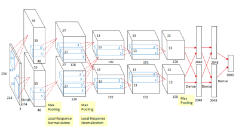

### 2013 - DQN

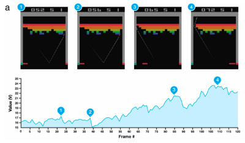
알파고의 바로 그것!

### 2014 Encoder / Decoder

NMT (기계번역) 문제를 풀기 위해 등장함. 단어의 시퀀스를 벡터로 인코딩하고, 다른 언어의 벡터로 디코딩하는 과정

### 2014 - Adam Optimizer

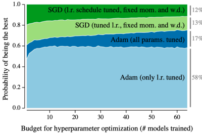

### 2015 - GAN

### 2015 - Residual Networks (ResNet)

딥러닝이 정말 '딥' 하게 할 수 있어짐. ResNet 이전에는 네트워크를 너무 깊게 쌓으면 학습이 잘 이루어지지 않는다는 문제가 있었다. 그러나 ResNet 이후에는 그러한 제한이 많이 완화되었음.

### 2017 - Transformer

> Attention Is All You Need

다른 기존의 방법론과 비교하여 많은 장점, 발전이 있다.

### 2018 - BERT

fine-tuned NLP models 개념
다음에 나올 단어가 무엇인지 맞춰보는 알고리즘이다. 큰 단어 뭉치들로 pre-train 한 모델들을 사용하여 fine-tuening 하여 다른 문제 해결에 쓰는 개념이다.

### 2019 - GPT-X

GPT-3, 굉장히 많은 파라미터를 사용하여 BIG language model이라고 부르기도 한다.

### 2020 - Self Supervised Learning

SimCLR: a simple framework for contrastive learning of visual representation.

주어진 학습 데이터 외의, 즉 라벨을 모르는 데이터를 이용하여 학습을 하는 방법.

# Multi-Layer Perceptron

## Neural Network

마치 뇌세포의 뉴런처럼 작동하기에 Neural Network라는 이름을 붙였지만, 실제로 정말 역전파 같은 과정이 뉴런에 있는지는 잘...

뉴럴 네트워크는 affine transformation and non-linear transformation 과정을 거치며 함수를 근사하는 모델이다.

## Linear Neural Network

가장 간단한 뉴럴 네트워크. 입력이 1차원이고 출력도 1차원인 문제는 선형 회귀로 분석할 수 있다.
입력과 출력을 연결할 수 있는 모델, 즉 선형식을 추론할 수 있다. 여기서 필요한 파라미터(2개)를 찾아내는 과정으로 볼 수 있다.

모델: `y = wx + b`의 w와 b를 찾는 것이 목표이다.

loss는 간단하게 squred error를 사용한다.

$$loss = {1 \over N} \sum^N_{i=1}(y_i - \hat{y_i})^2 $$

학습은 loss를 줄이는 것이 목표이다. 파라미터를 어느 방향으로 움직였을 때 loss가 줄어드는지 파악하고, 그 방향으로 파라미터를 움직이게 된다. 이 과정은 loss를 w로 미분하는 것과 같다. bias에도 마찬가지이다. loss를 b로 미분하여 그 값을 빼주는 방식으로 업데이트 한다.

$$ w \gets w - \eta {\partial loss \over \partial w} $$

$$ b \gets b - \eta {\partial loss \over \partial b} $$

$$\eta : stepsize$$
에타가 너무 크게 되면 학습이 이루어지지 않는다. gradient 정보는 굉장히 local한 정보이기 때문에 너무 보폭이 크면 정보의 의미가 상실된다.

### 1차원 그 이상은?

행렬을 사용하면 된다. 100차원에서 20차원으로 가고자 한다면? 100x20 행렬을 사용하여 곱한다. 이런 변환을 affine transform이라고 하며, W는 행렬이 된다.

행렬의 곱에 대한 해석은 두개의 벡터 공간의 변환으로 볼 수 있다. 즉, 선형대수의 선형변환과 같은 개념이다. 두개의 다른 차원의 선형 변환을 찾는 것임.

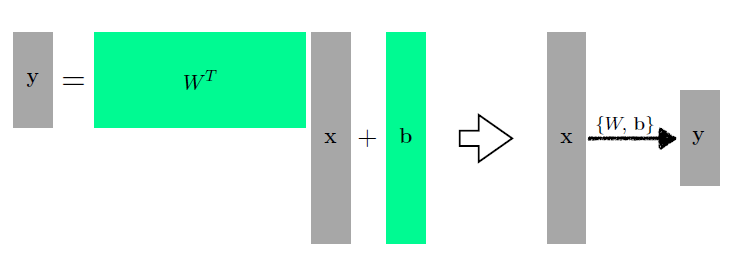
W와 b로 입력 x를 출력 y로 변환

### What if we stack more?

이러한 행렬을 더 depp 하게 쌓을 수 있다. 이 때 단순하게 선형변환을 쌓는 것 보다는, 한번의 선형변환 후, activation func을 적용하여 Non-linear transform을 한번 거쳐서 다시 반복한다.

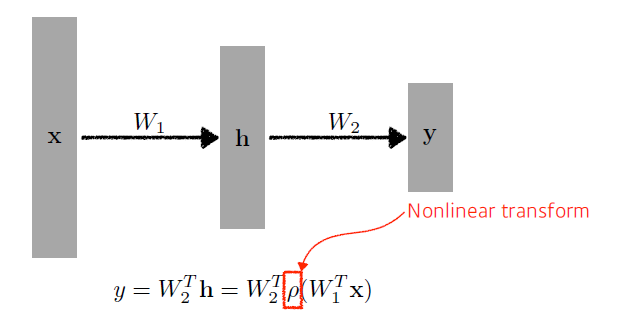

단순하게 선형변환만 반복하는 것은 단순히 행렬곱의 중복만이 될 뿐이다. 중간 중간 nonlinear transform을 거치면서 네트워크의 표현력을 극대화 할 수 있기 때문이다. (?)

여기에 쓰이는 Activation Function들에는 다음이 있다.

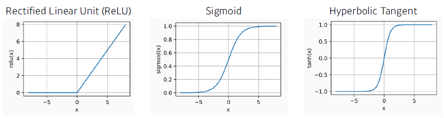

- ReLU
- Sigmoid
- Hyperbolic Tangent

## Multi-Layer Perceptron

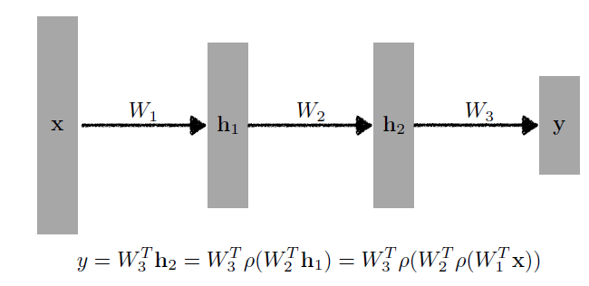
위의 개념을 더 확장하여 더 deep 하게 쌓을 수 있다. 바로 다층의 perceptron이다.

### loss function

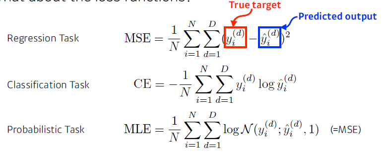

MSE는 큰 에러가 있는 경우 그 데이터의 에러에 맞추려다 네트워크 전체가 망가지는 경우가 발생할 수 있다.

CE(cross-entrophy). 분류문제는 일반적으로 one-hot 벡터로 표현할 수 있다. 내가 찾고자 하는 label이 10개라면, 10차원의 벡터로 나오게 된다. 여기서 내가 찾고자 하는 것이 강아지라면 해당 값만 1이고 나머지는 전부 0이다.

CE loss minimize의 의미는, 네트워크 출력값에서 해당하는 값만 높이겠다는 의미이다. 그 차원에서 해당하는 값만을 높이는 것이다. 분류문제에서는 최종적으로 output에서 가장 큰 값을 고려한다. 즉, 다른 값들 대비 높기만 하면 된다.

## 실습

MLP 구현 실습 -> mlp.ipynb 참조
  

# Optimization

## Intro

Gradient Descent: First-order iterative optimization algorithm for finding a local minimum of a differentiable function.

## Conecepts in Optimization

- Generalization
- Under-fitting vs over-fitting
- Cross validation
- Bias-variance tradeoff
- Bootstrapping
- Bagging and boosting

## Generalization

Training error가 줄어들 수록 좋지만, 어느정도 이상은 줄어들어도 의미가 없다. 오히려 Test error는 증가하기도 한다. Generalization이 좋다는 의미는 이러한 Test와 training error의 gap이 적다는 뜻이다.

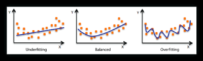

## Cross-validation

train data를 k개로 나눠 k-1개로 학습을 진행하고, 나머지 1개로 test를 해보는(validation) 것. 뉴럴네트워크 학습에서 hyper parameter를 tune할때 쓴다.

- parameter: 최적해에서 찾고 싶은 값. w, b의 값이나 conv의 값 등등..
- hyper parameter: 내가 정하는 값. learning rate나 네트워크의 사이즈, 어떤 loss function을 사용할지 등등

**test data는 학습에서는 '절대' 사용되지 않는다.**

## Bias and Variance

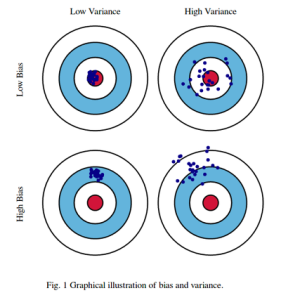

variance는 작은게 좋다. 단순히 bias만 이동시키면 되기 때문이다.

### Bias and Variance Tradeoff

학습 데이터에 노이즈가 껴있다고 가정했을 때, 내가 이 노이즈가 껴있는 target data를 minimize하는 것은 3가지 part로 나눌 수 있다. 이 3가지는 하나가 작아지면 나머지는 커진다.

따라서 bias와 variance를 둘 다 줄이는 방법은 힘들다.

## Bootstrapping

'Bootstrapping is any test or metric that uses random sampling with replacement.'

모델들이 예측하는 값들의 consensus(일치)를 보고 전체적인 모델의 예측을 하는데 활용된다. 학습 데이터가 고정되어 있을 때, 그 안에서 sampling을 통해 여러개의 데이터를 만들고, 여러개의 모델을 만들어서 관찰해보겠다.

## Bagging vs Boosting

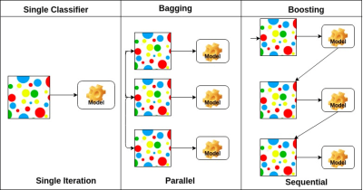

- Bagging (Bootstrapping aggregating)

  - 학습 데이터를 다 사용하여 모델 1개를 학습하는 것이 아니라, 학습데이터 샘플링을 통해 여러개의 데이터와 여러 모델을 학습시켜본다. 그 output의 평균을 내보겠다.

- Boosting
  - 학습 데이터에서 일부 시퀀셜한 것을 샘플삼아 간단한 모델 하나를 만들어 학습을 해본다. 여기서 학습이 잘 되지 않은 부분은 새로운 모델을 만들어 시도한다. 이렇게 여러개의 모델을 만들어 합쳐보는 방법이다.
  - bagging과는 다르게 여러개의 모델을 뽑는 것이 아닌, 합쳐서 하나의 모델을 만드는 방식.

# Practical Gradient Descent Methods

## Gradient Descent Methods

- Stochastic gradient descent
  - 하나의 샘플을 통해 grad 업데이트
- Mini-batch GD
  - 조금 더 큰 사이즈의 샘플. batch size로 하나의 grad를 구하고, 업데이트
- Batch gradient descent
  - 전체 데이터를 사용하여 grad 업데이트. 평균을 사용한다.

### Batch-size matters

> ... large batch size를 활용하게 되면 sharp minimizer에 도달하게 된다. 반대로 small batch size를 활용한다면 flat minimizer에 도달하게 된다.
>
> > [On large-batch training for deep learning: generalization gap and sharp minima, 2017]

요컨데, flat minimizer에 도달하는 것이 더 좋다는 의미이다.

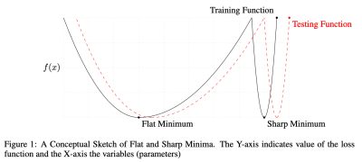

sharp minimum을 살펴보면, training function과 test function은 큰 차이를 보인다. 따라서 flat minimum에 도달하는 것이 좋다.

## Gradient Descent Methods

- SGD
- Momentum
- Nesterov accelerated gradient
- Adagrad
- Adadelta
- RMSprop
- Adam

### Gradient Descent

$$ W_{t+1} \gets W_t - \eta g_t $$
$$ \eta: Learning\,rate $$
$$ g_t: Gradient $$

제일 기본적인 Gradient descent이다. 여기서의 문제는 learning rate를 잡는 것이 어렵다는 점이다.

### Momentum

똑같은 구조를 활용하면서도 좀 더 빠른 학습을 할 수 있는 기법중 하나. '관성'. 한번 grad가 흐르면 그쪽 방향으로 흐르도록 하자는 아이디어. 즉, 방향이라는 정보를 활용해보자.

$$ a_{t+1} \gets \beta a_t + g_t $$
$$ W_{t+1} \gets W_t - \eta a_{t+1} $$

$$ a_{t+1}: accumulation \quad \beta: momentum $$

모멘텀과 grad를 합친, accumulation으로 업데이트를 진행한다. 모멘텀 기법의 장점은 gradient가 굉장히 많이 왔다갔다 하더라도 학습이 잘 진행된다. 방향성을 유지하기 때문이다.

### NAG

gradient를 계산할 때, lookahead gradient를 계산하여 사용하는 것이 차이점이다.

$$ a_{t+1} \gets \beta_{a_t} + \nabla \pounds (W_t - \eta\beta_{a_t}) $$
$$ W_{t+1} \gets W_t - \eta a_{t+1} $$

Momentum은 현재 주어진 parameter에서 grad를 계산하여 그 grad를 가지고 accumulation을 한다. 그러나 NAG에서는 한 번 이동을 한다. 즉, 그 방향으로 한번 가보고 거기서의 grad를 계산한 것으로 accumulation을 진행한다.

단순 모멘텀의 경우에는 관성을 계속 유지하기 때문에, 아래로 볼록한 모양에서 최솟값으로 minimize 하지 못 하고 양 끝단에서 왔다갔다 하는 현상이 생긴다.

그러나 NAG의 경우에는 한번 지나간 점에서 계산을 해보기 때문에 local minimum으로 좀 더 빠르게 다가갈 수 있다.

### Adagrad
네트워크의 파라미터가 얼마나 변해왔는지를 본다. 많이 변한 경우에는 적게 변화하도록, 변하지 않은 파라미터는 많이 변하도록 조정한다.

$$ G_t: sum\,of\,gradient\,squares $$
지금까지 gradient가 얼마나 변했는지를 제곱하여 더한 값. 이 값이 클수록 변함이 크다는 것이다.

$$ W_{t+1} = W_t - {\eta\over \sqrt{G_t + \epsilon}} g_t $$

$$ \epsilon: for\,numerical\,stability $$

가장 큰 문제점은 G값이 계속 커진다는 것이다. 만약 G가 무한대로 가게 된다면? W 업데이트에 문제가 생긴다. 즉, 학습이 진행될수록 문제가 발생할 여지가 있다.

### Adadelta
Adagrad의 G가 무한대로 커지는 것을 막으려는 방법이다. 어느정도 윈도우 사이즈에 맞춰 거기서만의 변화를 보는 방법이다.

GPT-3 같은 천억개의 파라미터를 쓰는 모델의 경우에는 G_t 자체도 천억개의 파라미터가 된다. 만약 이걸 윈도우 사이즈(100이라 가정) 하면, 1000억개를 100개만큼 들고 있게 된다는 문제가 발생한다.

$$ G_t = \gamma G_{t-1} + (1-\gamma)g_{t}^2  $$

$$ H_t = \gamma H_{t-1} + (1-\gamma)(\Delta W_t)^2 $$

$$ W_{t+1} = W_t - {\sqrt{H_{t-1} + \epsilon}\over \sqrt{G_t + \epsilon}} g_t $$

이런 문제를 막기 위해 G_t에는 exponential moving average를 사용한다.

Adadelta는 learning rate를 사용하지 않는다는 특징이 있다. 그래서 그렇게 많이 사용되지는 않는다... learning rate를 대신하는 H_t를 사용한다.

### RMSprop
Adadelta 보다는 RMSprop을 더 많이 사용했다.

G_t를 그냥 더해서 구하기 보다는 exponential moving average을 더해준다. 그걸 분모에 넣고, 분자에는 대신 eta를 넣어준다.

$$ G_t = \gamma G_{t-1} + (1-\gamma)g_{t}^2 $$

$$ W_{t+1} = W_t - {\eta \over \sqrt{G_t + \epsilon}} g_t $$

### Adam
가장 무난하게 사용됨. momentum과 gradient square를 같이 활용.

epsilon 파라미터를 잘 바꿔주는 것이 핵심

## Regularization
Generalization을 잘 되도록 하기 위해 제한을 걸어두는 것. 의도적으로 학습을 방해하는 것이다.

- Early stopping
- Parameter norm penalty
- Data augmentation
- Noise robustness
- Label smoothing
- Dropout
- Batch normalization

### Early stopping
학습을 조기에 멈춰 과적합을 방지한다. 이때 절대 test data로 검증하지 않고, validation error를 활용한다. 이 data는 train에 활용되지 않은 data여야 한다.

### Parameter Norm Penalty
parameter가 너무 커지지 않게 한다. 네트워크 파라미터를 다 제곱하여 더한 숫자를 줄여나가도록 한다. 네트워크의 weight 숫자는 작으면 작을수록 좋기 때문.

함수의 공간을 최대한 부드러운 함수가 되도록, 그렇게 하는 것이 성능이 좋다는 가정에 따라서...

### Data Augmentation
데이터가 무한히 많으면 잘 된다. 그러나 실제로는 데이터는 한정적이기 때문에 만족하기 어려운 조건임.

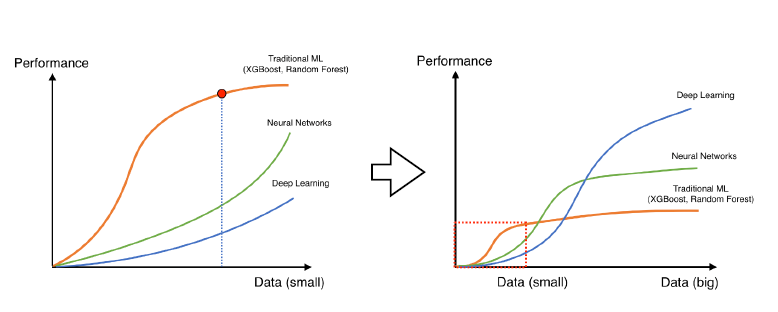

그러나 정말 많은 데이터를 다 표현할만한 표현력이 부족하기 때문에 비례성이 점점 떨어진다. 또한 실제 데이터는 한정적이다.

Data augmentation은 가지고 있는 데이터를 적절히 변조하여 갖고 있는 data의 숫자를 늘리는 작업이다. 예를 들어 이미지 분류 task에서 학습용 이미지를 뒤집거나 회전하는 등의 변조를 거쳐 학습에 이용한다.

단, 무작정 변조하는 것이 답은 아니다. MNIST 숫자 인식의 경우에는 뒤집은 경우 다른 숫자가 될 수도 있다 (6과 9)

### Noise Robustness

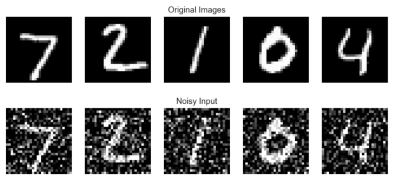

왜 잘 되는지에 관해서는 아직까지 의문이 있다. 그러나 실제 실험 결과 noise를 집어넣는 것이 더 성능이 잘 나온다는 결과가 있다.

### Label Smoothing

학습 data 두개를 뽑아서 적절히 섞어준다. 분류 문제를 예를들면 두 분류를 나누는 descision boundary를 찾는 문제라고 볼 수 있는데, 이 boundary를 부드럽게 만들어주는 효과가 있다고 알려져있다.

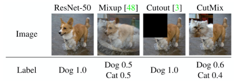

Mixup을 하여 섞다보면 Dog인지 Cat인지 그 중간지점 쯤에 해당하는 boundary를 찾을 수 있다.

**성능이 정말 많이 올라가는 기법이다.**

### Dropout

뉴럴 네트워크의 weight를 0으로 바꿔보는 방법이다. 일부 뉴런을 대상으로 랜덤하게 0으로 만드는데, 각각의 뉴런들이 조금 더 robust한 feature를 잡을 수 있다고 해석한다. 엄밀한 증명이 이루어지지는 않았음.

### Batch Normalization

내가 적용하고자 하는 layer의 statistics(?)를 정규화 시키는 것이다. 그 결과 뉴럴 네트워크의 각 layer가...

예를 들어 1000개의 파라미터가 있는 히든 레이어라고 하면, 각각의 파라미터가 min 0인 정규화를 시킨다. 이는 internal covariate(feature) shift를 줄이는 효과가 있으며, 그 결과 네트워크가 잘 학습된다는 논문의 주장이다. 다만, 이는 약간 논란이 있는 편이다. 

한가지 확실한 것은 BN을 활용하게 되면 layer가 많이 쌓여있는 모델에서 성능이 올라간다는 점이다.

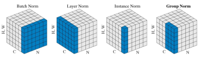

- Batch Norm: layer 전체
- Layer Norm: 각각의 layer만 대상
- Instance Norm: 각 인스턴스(예를 들면 이미지 한 장)
- Grop Norm

## 실습

Optimization.ipynb 파일 참조

# 막간

## cross entrophy와 KL-divergence

정리 예정
