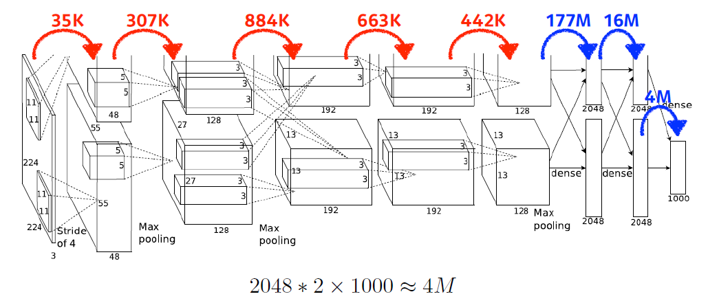
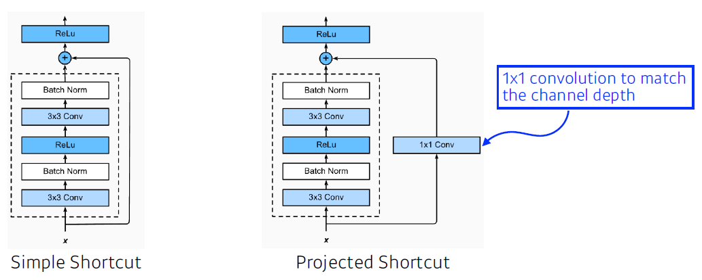
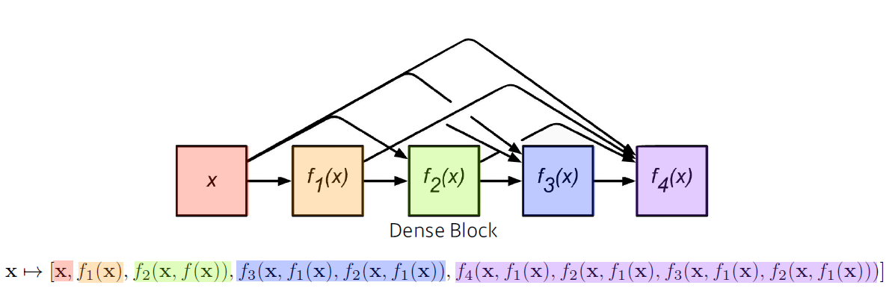
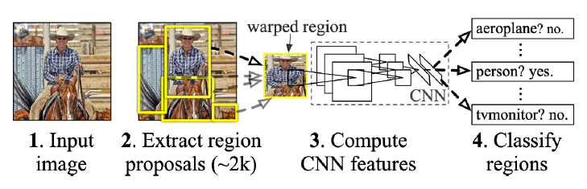

# Convolutional Neural Networks

## Convolution
- Continuos convoltuion

$$ $$

- Discrete convolution

$$ $$

- 2D image convolution

$$ $$

## RGB image convolution

### stack of convolution

우리가 다루는 이미지는 보통 RGB 이미지이기 때문에 X * Y * 3 의 텐서로 볼 수 있다. 이때, 필터를 여러개 사용하면 여러개의 feature들을 뽑아내어 feature map을 만들어 볼 수 있다.

## CNN

일반적으로 convolution layer와 pooling layer는 feature를 추출하는데 쓰이고, Fully connected layer는 분류문제와 같은 의사결정에 주로 쓰인다.

최근에는 fully connected layer는 최소화 시키는 추세이다. 이는 parameter의 숫자 때문이다. ML에서 학습하고자 하는 모델의 parameter의 숫자가 늘어나면 늘어날수록 학습이 어렵고, generalizae 퍼포먼스가 떨어진다고 알려져있다. 따라서 모델을 만들 때는 최대한 deep 하게 만들면서도 parameter 숫자는 최대한 억제하는 방향으로 만들게 된다.

위 표를 보면 parameter의 숫자가 상당하다는 것을 볼 수 있다.

## Stride

필터가 input에서 얼마큼 간격으로 건너는지에 관한 설정이다.

### padding?

stide를 하게 되면 output의 사이즈와 input의 사이즈가 차이가 나게 된다. 이때 비어진 공간을 채워주는 것을 말한다. 0으로 채워주는 zero padding이 대표적이다.

## Convolution Arithmetic

이 convolution layer를 위한 parameter의 개수는?

커널이 3x3 이고, input의 채널이 128이므로 우선 3x3x128이 된다. 또 output의 채널이 64이길 원하므로 커널이 총 64개 동원된다고 볼 수 있다.

따라서 3 x 3 x 128 x 64 = 73,728 이다.

### 예제

11 x 11 x 3 x 48 x 2 = 35K

5 x 5 x 48 x 128 x 2 = 307K

3 x 3 x 128 x 2 x 192 x 2 = 884K

3 x 3x 192 x 128 x 2 = 442K

여기서부터 dense layer로 들어서면서 (fully connectd layer) parameter의 개수가 급격히 커진다.

13 x 13 x 128 x 2 x 2048 x 2 = 177M

2048 x 2 x 2048 x 2 = 16M

2048 x 2 x 1000 = 4M

왜 dense layer에서 paramter의 개수가 급격히 커질까? conv 연산이 각각의 하나의 커널이 모든 위치에 대해서 동일하게 적용되기 때문이다. 

## 1x1 Convolution

fully connected layer를 최대한 줄여보려고 하는 시도. Dimension reduction이라고 부르기도 하는데, 256x256이라는 special dimension은 그대로 유지하면서 채널은 128->32로 줄이게 된다.

이를 통해 depth는 깊게 쌓을 수 있으면서 동시에 parameter의 개수는 줄일 수 있게 된다. bottleneck architecture에서 적용하는 기법이다.

 

# Modern Convolution Neural Networks

~ 2018 까지의 CNN을 다뤄보겠다. 이후의 모델들에 대해서는 추후 다룰 예정

## ILSRVRC
ImageNet Large-Scale Visual Recognition Challenge. 1000여개의 카테고리, 100만개의 이미지를 분류, 감지, localization, segmentation에 도전

2010년에는 28.2%의 error를 보였으나, 2015년 즈음에는 3.5%의 error로 사람(5.1%) 보다도 더 잘 인식할 수 있게 되었다.

## AlexNet
network를 2개로 나눈 이유는 두장의 GPU를 활용하기 위해서 도입했다. 11x11 filter를 사용하였다. 이는 그렇게 좋은 판단은 아니게 되었는데, 넓은 영역을 볼 수 있었지만 너무 많은 parameter가 나오게 되기 때문이다.

아무튼 AlexNet은 5 conv layer, 3 dense layer로 구성되엇다.

- Key idea
  - ReLU activation: 효과적인 activation fucntion.
  - GPU implementation (2 GPUs)
  - Local response normalization, Overlapping pooling: 어떤 입력에서 response가 너무 많이 나오는 경우 일부를 죽인다. 현재는 잘 안 쓰임
  - Data augmentation
  - Dropout: 일부 뉴런을 0으로 바꿈

현재에서는 당연히 쓰이는 기법, 아이디어다.

### ReLU
linear model에 최적화 되어있음. 0 이상의 경우에는 gradient를 잘 반영할 수 있다는 장점. 또, linear model의 특징을 잘 갖고 있어서 쉽게 optimize가 가능하다. 따라서 학습이 잘 된다. 또 다른 큰 특징으로 vanishing gradient problem을 극복할 수 있었다는 점이다. 

이전에 활용하던 sigmoid, tanh는 0을 기점으로 값이 커지면 기울기가 점점 줄어들게 된다. 즉, gradient가 줄어든다. 따라서 뉴런의 값이 크다면 기울기가 0에 가깝게 되고, 이는 곧 gradient가 없어져가는 vanishing 현상이 발생한다. 그러나 ReLU는 그 기울기가 계속 보존되므로 이런 현상이 나타나지 않는다.

## VGGNet

3x3 Conv filter만을 사용함.

conv filter의 크기가 커지면서 갖는 이점은 하나의 filter로 고려되는 input의 크기가 커진다는 점이다. 즉, 한번에 더 많은 영역을 고려한다는 것이다.

그러나 3x3 filter를 2번 적용해본다고 한다면, 마지막 레이어의 하나의 값은 5x5의 픽셀 값이 합쳐진 결과라고 볼 수 있다. 즉, 5x5 filter 하나를 쓰는것과 3x3 filter 두번을 쓰는 것은 똑같다고 볼 수 있다.

하지만, parameter의 관점에서 본다면 30만개 vs 40만개로 큰 차이를 보인다. 이 차이는 filter의 사이즈가 클수록 더욱 큰 차이를 보인다.

## GoogLeNet

2014년 ILSVRC에서 우승함.

중간 중간 1x1 conv filter를 잘 활용하게 되면 parameter의 갯수를 줄이는데 큰 도움이 된다는 점에 착안.

### Inception blocks

하나의 input에 대해서 여러개의 inception filter를 거치게 되고, 이를 concat한다. 가장 핵심은 1x1 Conv를 통한 paramter reduce이다. 이를 통해서 channel-wise dimension reducetion이 가능하다.

왼쪽의 경우 paramter의 갯수는 어떻게 될까?

special dimesion은 일단 신경쓰지 않고, convolution에 집중해보자. 3x3 filter를 적용하므로 3 x 3 x 128 x 128이 된다.

>147,456

오른쪽의 경우는 어떻게 될까?

1x1 conv와 3x3 conv를 거친다. 먼저 1x1 conv를 살펴보자. 1x1 x 128 x 32가 된다. 이후 3x3 conv를 적용하게 되면, 3x3 x 32 x 128이 될 것이다. 이 두 filter에서 나타나는 parameter를 더해보면 약 4만개가 된다.

>4,096 + 36,864 = 40,960

이처럼 1x1 conv를 사용하면 paramter 숫자를 크게 줄일 수 있다.

## ResNet

일반적으로 paramter 숫자가 많아질수록 2가지 문제점이 나타난다.
- over-fitting: training error는 줄어드는데, testing error가 늘어나는 현상
- ㅁㄴㅇㄹ

이런 문제 때문에 모델이 깊어질수록 학습하기가 어려워진다. training error보다 test error가 더 큰 현상이 잦기 때문이다. ResNet에서는 이 문제를 해결하기 위해 identity map(skip connection)이란 것을 추가하게 된다.

neural network의 출력값에 input으로 들어온 x 값을 더해준다. 모델은 학습하고자 하는 residual한 차이만을 학습한다. 즉, 이러한 connection을 더해주는 것으로 그 차이를 학습할 수 있게 된다.

이와 같은 ResNet 구조를 활용하게 되면서 더 깊은 layer를 쌓을 수 있게 되었다.

여기서 차원이 달라지는 경우가 있을 수 있으므로 1x1 Conv를 사용하여 차원을 맞춰(channel) 주는 경우가 있다. 여기서 shortcut connection을 하기 전 batch norm을 하는데, 이 둘간의 순서에 대해서는 아직 논란이 있다.

### Bottleneck architecture

inception block과 유사.

3x3 conv를 하기 위해서는 3x3xa input channel이 필요하다. 이 때 input channel을 줄이고 conv를 하게 된다면 전체적인 parameter 숫자를 줄일 수 있을 것이다. 이후 다시 channel을 늘리기 위해 1x1 conv를 다시 해준다.

## DenseNet

ResNet 구조와 유사하나, 그냥 더하지 말고 같이 써보는게 어떨까 하는 아이디어에서 출발. feature map을 쌓아가며 학습을 하면 더 좋은 성능을 보여줄 수 있기 때문이다.

단, 이 경우에는 채널이 점점 커지는 문제가 생긴다. 그에 따라 parameter의 숫자도 급격히 커진다. 따라서 중간에 한번씩 channel을 줄여주는 작업을 진행한다.

Dense Block을 통해 feature map을 키우고, 지나치게 커진 channel은 Transition Block을 통해 줄인다. 그리고 이를 반복한다.

## Summary
- VGG: 3x3 blocks.
- GoogLeNet: 1x1 conv를 통한 channel 줄이기
- ResNet: skip-connection 으로 네트워크를 deep 하게 쌓는다.
- DenseNet: concatenation를 통해 feature map을 더하는 것 대신 쌓는 것으로 더 좋은 성능을 낼 수 있었다.

# Computer Vision Apllications

## Semantic segmentation

어떤 이미지가 있을 때, 이미지의 픽셀마다 적절한 분류를 진행하는 것. 대표적으로 자율 주행에 활용한다.

## Fully Convolution Network

CNN에서는 마지막에 Dense layer를 적용하여 뽑아낸다.

여기서 Dense layer를 없애보자! --> convolutionalization

parameter의 차이는 없다. 

왼쪽의 파라미터 갯수는 4 x 4 x 16 x 10 = 2560

오른쪽의 파라미터 갯수는 4 x 4 x 16 x 10 = 2560

간단하게 이해하자면, dense layer를 옆으로 돌려서 conv처럼 적용한 것이다.

### Why?
Fully convolution network의 장점 중 하나는 input dimension에 independent 하다는 것이다. 32x32 네트워크가 있다고 했을 때, output은 1x1이다. 더 큰 이미지에 대해서는 원래 네트워크를 사용할 수 없다. 그러나 fully conv network는 이미지에 상관 없이 네트워크가 작동한다. output이 커지면 그에 비례해서 network(special dimension)도 커지게 된다. `Heat map`

### FCN
FCN은 어떠한 input size든, 작동을 보장한다. output dimension 역시 줄어든다. 따라서 원래의 dense feature를 늘리는 작업이 필요하다. 이를 위해 여러가지 방법들이 제안되고 있다.

### Deconvolution (conv transpose)

Convolution의 역연산 같은 개념이다. 엄밀하게 따지면 conv의 역연산은 존재할 수 없다. 완전히 역으로 복원할 수는 없기 때문이다.

## Detection
per-pixel이 아닌, boundary box를 찾는다.

## R-CNN

이미지 안에서 약 2천개의 region을 뽑아내고, 똑같은 크기로 맞춘다. 그 다음 분류를 진행해본다. feature를 뽑을 때는 AlexNet을 사용했다. 

R-CNN의 가장 큰 문제는 이미지 안에서 bounding box를 2000개 뽑았다고 했을 때, 이미지 하나를 분석하는데 2000개의 fetch를 진행시켜야 한다. 즉, 이미지 하나를 처리하는데 너무 많은 시간이 소요된다.

## SPPNet

R-CNN의 문제점을 해결하기위해 등장. 이미지 안에서 CNN을 한번만 돌리자. 이미지 기반에서 box를 뽑고, 이미지 전체에 대해서 convolution feature map을 만든 다음에 뽑은 box에 해당하는 위치에 있는 sub-tensor만 가져와서 보자.

CNN을 한번만 돌려서 얻어지는 feature map 위에서 얻은 bounding box의 fetch를 가져온다는 아이디어!

## Fast R-CNN

CNN을 한번만 돌리지만, 그래도 여전히 느리다. box에 해당하는 tensor를 뜯어오고, 다시 분류를 해야하기 때문이다.

1. input과 bounding box를 얻어온다.
2. convoulution feature map을 한번 생성한다.
3. 각각의 region에 대해서, fixed length feature를 뽑는다. ROI pooling
4. neural network를 통해서 box의 regression과 label을 찾게 된다.

### Faster R-CNN
bouding box를 뽑아내는 과정도 학습을 해보자!

box를 뽑아내는 selective search는 내가 풀고자 하는 detection과는 다르다. Faster R-CNN에서는 box를 뽑아내는 것도 network를 통해서 학습하고자 한다. `Region Proposal Network`

이미지의 특정 영역이 bouding box로서의 의미가 있을지 없을지를 판단한다. 여기서 해당 위치에 어떤 물체가 있는지는 다음 층에서 다룰 것이고, 여기서는 물체가 있을지만 판단한다.

anchor box는 미리 정의해 놓은 bounding box의 크기이다. 대충 어떤 크기의 물체들이 있을것 같다는 정의이다. k개의 템플릿을 만들어 놓고 (미리 고정) 판단한다.

### Region Proposal Network

9: three different region size (128, 256, 512) with three differnet ratios (1:1, 1:2, 2:1)

4: four bouding box regression parameters (box를 얼머나 키우거나 줄일지)

2: box classification. 박스가 useful한가 아닌가

## YOLO
Faster R-CNN보다 훨씬 빠르다!!

빠를 수 있는 이유는, Region Proposal Network의 작동 방식처럼 이미지의 특정 영역의 sub-tensor를 뽑아서 분류를 진행하는 것이 아니라, 그냥 이미지 한장에서 바로 output을 뽑기 때문이다. YOLO라는 이름 그 자체!

`YOLO 에서는 bounding box를 따로 뽑는 sampling 과정이 없기 때문에 빠른 것이다.`

이미지가 들어오면 SxS grid로 나눈다. 이미지에서 찾고자 하는 물체의 중앙이 해당 grid에 있다면 그 grid cell이 해당 물체의 bounding box와 해당 물체가 무엇인지를 같이 예측한다. 그와 함께 해당 box가 쓸모가 있는지 없는지도 같이 학습한다.

각각의 cell은 bounding box를 예측하고 동시에 class probabilites를 예측한다.

Tensor로 표현하면, S x S x (B*5 + C)가 된다.
- SxS: number of cells of the grid
- B*5: B bounding boxes with offsets(x, y, w, h) and confidence
- C: number of classes

## summary
여러 detection 방법론들은 위를 포함 여러가지 기법들을 섞어서 사용하고 있다. bounding box를 미리 정해놓고 찾는 anchor box나, YOLO 처럼 바로 bounding box를 바로 찾아보고 (class도 같이 찾으면서) 조금씩 변형시켜보는 시도를 한다.

 

# 의문점
왜 layer는 deep 할수록 좋고, parameter는 적을수록 좋은가?