# Recurrent Neural Network

## Sequential Model
sequential model을 처리할 때의 가장 큰 어려움은, label을 붙이기가 난해하다는 것이다. sequential data의 길이가 애매하기 때문에, input dimension을 정의하기가 난해하다. 음성 데이터로 예를 들자면, 어느 만큼의 말이 들어올지 모른다는 것이다.

### Naive sequence model
현재 들어오는 정보는 과거에 들어온 정보들을 모두 고려해야 한다. 어려운 점이다. 조금 쉽게 접근하기 위해서 과거의 '일부'만 보는 방법이 있다. Fix the past timespan.

### Markov model
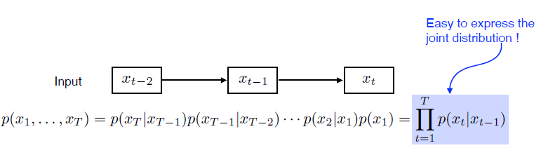

First-order autoregressive model. 나의 현재는 바로 직전의 과거에만 dependent하다 라는 접근. 사실 말이 안 되는 접근이지만, 이를 적용하면 아주 쉽게 표현할 수 있다.

### Latent autoregressive model
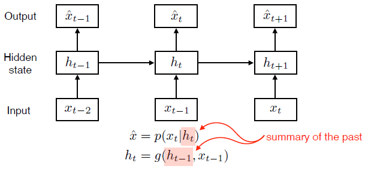

Markov 모델의 단점은 수많은 과거의 정보를 고려하지 않는다는 것이다. 이를 개선하기 위해 중간에 Hidden state를 넣는다. 이 Hidden state가 과거의 정보들을 summerize하고 있다. 그리고 이 hidden state를 참조한다.

## Recurrent Neural Network
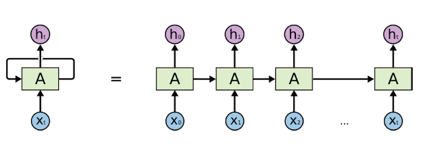
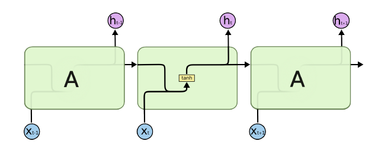

앞의 구조들과 가장 큰 차이점이라면, 자기 자신으로 돌아오는 구조가 있다는 점이다. 이전 timestamp의 정보들이 다음에도 계속 활용된다!

### Short-term dependencies
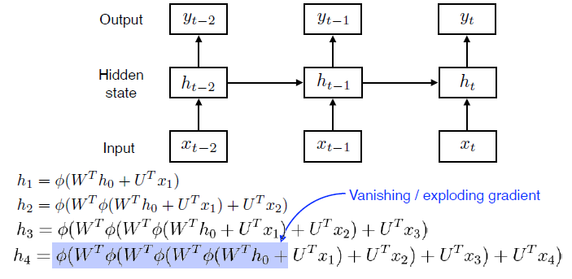

과거의 정보들을 계속 취합하는 것은 좋은데... 과거의 정보가 미래까지 살아남는 것이 쉽지 않다. 비교적 최근의 과거는 잘 반영 되지만, 먼 거리의 과거는 점차 사라진다. 이를 극복하기 위해 long-short-term memory (LSTM)이 등장했다.

## Long Short Term Memoey (LSTM)
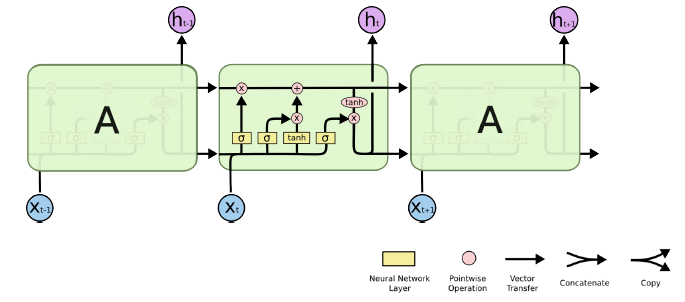

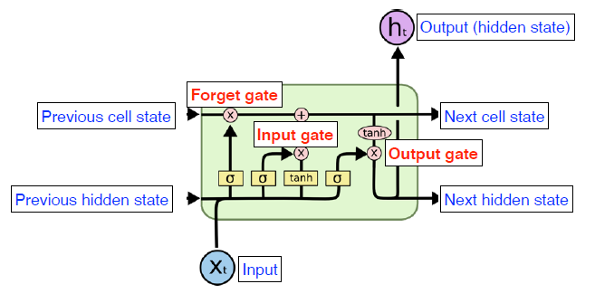
Previous cell state는 Xt 까지의 정보들을 모두 취합하고 있다고 볼 수 있다. Previous hidden state는 바로 직전의 Output이다. 
sigmoid가 3개와 tanh가 존재하는 것도 볼 수 있다. 

LSTM은 3개의 gate가 존재한다. LSTM의 가장 큰 아이디어는 중간에 흘러가는 cell state이다. cell state의 역할은 time stamp t 까지의 정보를 summerize하는 데에 있다. 마치 컨베이어 벨트처럼 필요한(유용한) 정보들을 잘 챙겨서 다음 time stamp로 넘기는 역할을 한다. 이를 위해서 gate가 존재하는 것이다.


- Forget Gate: 어떤 정보를 버릴 것인가
  - 이전의 출력값과 현재의 input을 비교하여 이전 cell state의 정보에서 버릴 것을 정한다.
- Input Gate: 어떤 정보를 cell state에 받아들일 것인가
  - 이전의 hidden state와 현재 input을 가지고 it를 만든다. Ct는 따로 학습되는 network를 통해서 (tanh) 만들어진다. C-tilda라고 부르는데, 현재 정보와 이전 출력값으로 만들어지는 cell state의 일종의 예비군이라고 볼 수 있다.


- Update cell: it와 C-tilda, 이전의 C_{t-1}을 이용하여 새로운 Cell state로 업데이트한다.
- Output Gate: 그대로 출력하기도 하지만, LSTM에서는 한번 더 조작을 하고 보낸다.


## Gated Recurrent Unit
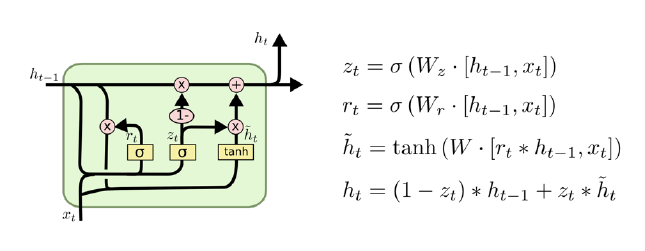

LSTM 대비 훨씬 simple한 구조. 오직 2개의 gate만 존재한다.(reset gate, update gate) 또, cell state가 없다. GRU에서는 hidden state만 존재한다. 일반적으로 연구결과에서 LSTM과 GRU를 비교하였을 때, GRU의 퍼포먼스가 더 높다는 결과들이 나왔다. 물론 요즘에는 Transformer가 등장하면서 대세가 넘어가고 있다.

</br>
<hr>

# Transformer

## Sequential Model
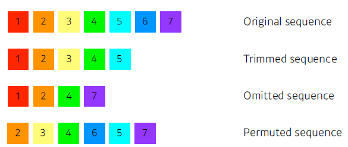

시퀀셜 모델을 다루는 것은 꽤 어려운 문제라는 점을 앞서 배웠다. 문장은 늘 길이가 달라질 수 있고, 말을 할 때 어순을 잘 지키지 않기도 한다. Transformer에서는 이런 문제를 해결하고자 Self-Attention 이라는 구조를 사용하였다.

## Transformer
```
Transformer is the first sequence transduction model based entirely on attention.
```

이 방법론은 Sequence data를 다루는 방법론이기 때문에 어느 분야에든 적용 가능하다는 점.

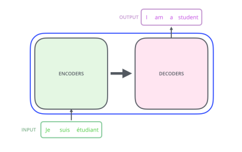

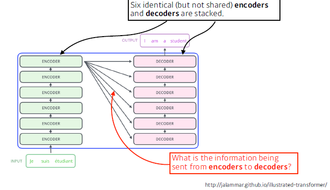

RNN 이라면 3개의 단어가 input으로 들어왔을 때, 3번 돌게 된다. 그러나 transformer encoder에서는 몇개의 단어가 들어오든, 재귀적으로 돌아가지 않는다.

N개의 단어가 어떻게 encoder에서 한번에 처리가 되는 것일까? decoder와 encoder간의 정보는 어떻게 전달되는 것인가? 그리고 decoder는 어떻게 출력을 만들어 내는가?

## Encoder
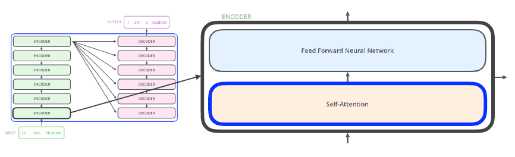

N개의 단어가 encoder로 들어간다. 벡터가 몇개이든!

Self-Attention과 Feed Forward Neural Network가 하나의 encoder를 이룬다. "The Self-Attention in both encoder and decoder is the cornerstone of Transformer."

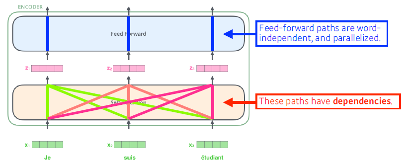

3개의 단어가 들어왔다고 가정해보자. 이는 곧 3개의 벡터가 된다. 여기서 self attention에서는 한 벡터가 넘어갈 때, (X1이 넘어갈 때) 나머지 X2, X3를 모두 고려한다. 즉, **dependencies**가 있다. 반면에 Feed-forward 에서는 dependencies가 없다.

## Self-Attention
>The animal didn't cross the street because it was too tired.

이 문장을 이해할 때 중요한 점은 it이 무엇을 가리키냐이다. 즉, 그 단어를 그 자체로 이해하는 것이 아니라, 문장 내에서 다른 단어들과 어떤 관계가 있는 것인지를 파악해야 한다. Transformer에서는 이 점을 고려한다. 단어간의 관계성

### Self-attention 3 Vectors
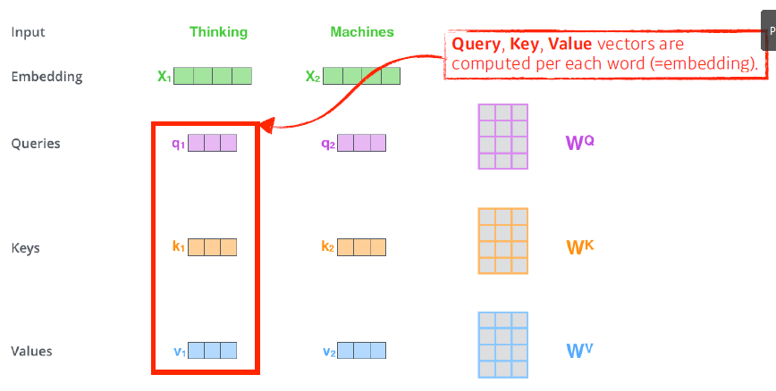

주어진 하나의 단어에 대해서 기본 임베딩과 함께 Query, Key, Value 3개의 vector를 만든다. 그리고 Score 벡터를 계산한다.

Score 벡터는 i번째 단어에 대한 Score vector는 내가 인코딩을 하고자 하는 단어의 Query vector와 나머지 n개의 단어들에 대한 Key vector의 내적으로 구한다. 간단히 말하자면 Score는 이 두 벡터가 얼마나 잘 align이 되어있는지를 살펴보고, 이 i번째 단어가 나머지 단어들과 얼마나 유사도가 있는지를 정하는 것이다.

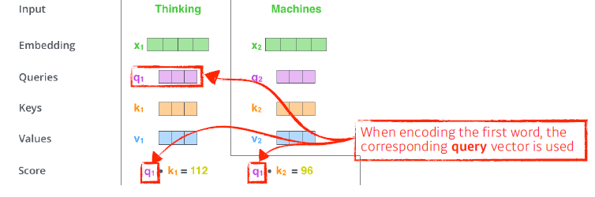

내적을 통해서 i번째 단어와 나머지 단어들 간의 interaction을 본다. (attention의 유래) 즉, 어떤 단어를 좀 더 attention할 것인가!

이후 Score 벡터를 normalize를 하고, softmax를 적용하여 attention weights로써 사용한다.


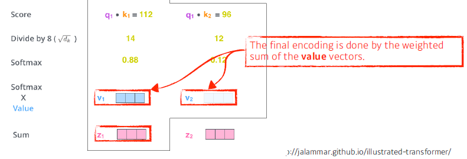

예시의 그림을 살펴보자. 먼저 i번째 단어에 대한 score 벡터는, 인코딩 하고자 하는 단어의 Q와 나머지 단어의 K 벡터의 내적이다. 그 후, socre 벡터의 값이 너무 커지는 것을 막기 위해 K의 차원의 제곱근으로 나눈다.

이후에는 Normalize와 softmax를 취해 sum to one이 되도록 조정한다. 결과적으로 Thinking과 자기자신의 interaction(유사도)는 0.88이 되고, Machine과의 interaction은 0.12가 나온다. 이것을 attention weight라고 한다.

각각의 embedding vector에서 Q,K,V 벡터를 만들었다. K와 V의 내적으로 Score 벡터를 계산한다. 이후 Norm과 softmax를 취한 값과 각 단어의 V 벡터들의 weighted Sum을 이용한다.

즉, 최종적으로는 각 단어에서 나오는 V벡터의 sum을 이용한다. 

**즉, Value vector의 weight를 구하는 과정이다!!!**

이 모든 과정을 거치게 되면 하나의 단어에 대한 encoding vector가 나온다. 여기서 주의점으로, Q와 K 벡터의 차원이 같아야 한다. 내적을 해야하기 때문이다. V벡터는 크게 상관없다. 그리고 최종적으로 나오는 벡터의 차원은 V 벡터와 동일하게 된다. (multi-head attention에서는 다름)

### Ex
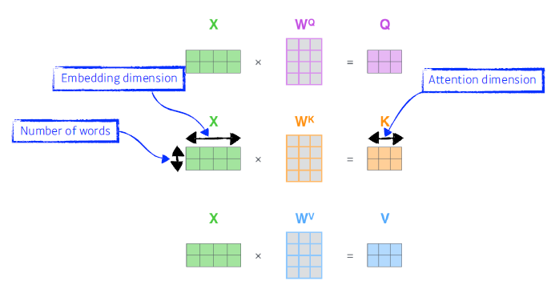

X는 4의 embedding 차원과 2개의 단어이다.

Wq, Wk, Wv는 Q,K,V를 구하기 위한 MLP이다.

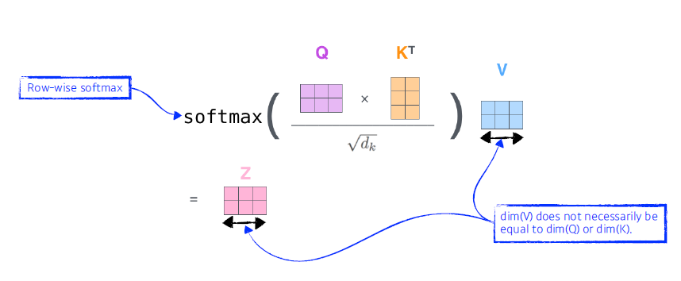

Q와 K의 내적, 그리고 normalize, softmax를 거쳐 최종적으로 Z를 얻을 수 있다.

입력이 고정되더라도 내 주변의 입력이 다르다면 출력이 달라진다.

여기서 N개의 단어가 주어지면, NxN 짜리 attention map이 필요하다. RNN의 경우에는 1000개의 시퀀스라면 그냥 1000회면 족하다. 따라서 Transformer는 length가 길어질수록 처리하기가 힘들어진다. 대신, 훨씬 flexible하고 더 많은 표현력을 가진 network를 만들 수 있다.

## Multi-Head Attention (MHA)
MHA는 Attention을 여러번 하는 것이다. 하나의 embedding vector에 대해서 Q,K,V를 하나만 만드는 것이 아니라 N개 만드는 것이다. 이를 통해 N개의 attention을 반복하게 되는데, N개의 encoding vector를 얻게 된다. 즉, 헤드의 숫자 N에 따라서 하나의 임베딩 벡터로부터 N개의 encodede vector를 얻을 수 있다. 

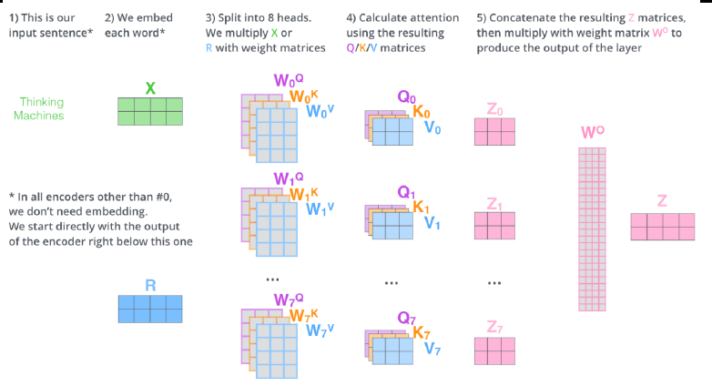

주의할 점은 임베딩 디멘션과 인코딩된 벡터의 차원을 일치시켜야 한다는 점이다. 여기서는 N개의 output이 나오므로 행렬곱을 통해 차원을 줄여야 한다.


## Positional Encoding
N개의 단어를 시퀀스하게 넣어줬다고 하지만, 사실 이 시퀀스 정보 자체는 안에 포함되어 있지 않다. 예를 들어 A B C D를 넣거나, B A C D를 넣거나 해도 인코딩 되는 값은 달라지지 않는다. 그래서 position 정보를 위한 encoding 과정이 추가적으로 필요하다. 이 과정은 대개 pre-defined 되어 있다. 일종의 offset을 추가하는 방식이다.

## Encoder to Decoder

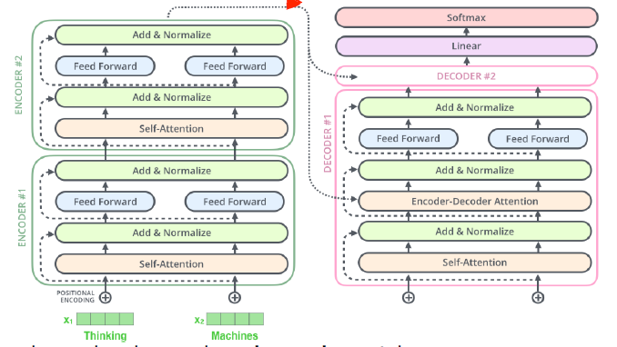

그렇다면 encoder에서 decoder로 어떤 정보가 보내질까?

K와 V를 보낸다. why?

i번째 단어를 만들 때, i번째의 Q와 나머지 단어들의 K 벡터를 곱해서 attention을 만들고, V 벡터를 weight sum을 했다. input에 있는 단어들을 decoder에 있는 '출력하고자 하는 단어'에 대해서 attention map을 만드려면 input에 해당하는 단어들의 K와 V가 필요하다.


decoder의 self-attention에서는 학습을 위해 masking 과정도 필요하다. 이전 단어들에만 dependent 하고, 뒤의 단어들에 대해서는 independet 하게 하는 작업이다.


## Vision Tranformer
본디 Transformer는 NLP task에 주로 쓰였으나, 최근에는 Vision task에도 활용을 해보는 시도가 있다. 이미지 분류를 할 때 Transformer의 encoder를 활용하기도 한다. (ViT)

문장의 시퀀스 대신, 이미지를 작은 영역들로 나누고 그 영역들을 마치 하나의 입력인 것 처럼 다루는 방식으로 Transformer를 활용한다.

### DALL-E
문장이 주어지면 문장에 대한 이미지를 만들어 낸다. Transformer의 decoder만 활용하여 만들었다고 한다. 이미지를 특정 그리드로 나눠 넣고, 문장도 역시 나눠 집어넣고 새로운 문장이 주어졌을 때, 그 문장에 대한 이미지를 만들어 보았다고 한다.

참고 링크:https://openai.com/blog/dall-e


>참조 링크: http://jalammar.github.io/illustrated-transformer/

# 의문점

- attention 메커니즘이란 무엇인가? 
- 왜 굳이 Q, K, V 벡터 3개를 만들어서 사용하는 이유는? 그리고 각각은 encodede vector로부터 만들어지는데 어떻게 다른 벡터로 만들어 내는가?

  - Q,K,V 는 입력 벡터에 대해서 3개의 학습 가능한 행렬을 곱하는 것으로 만든다.
  - Q,K,V 만드는 것은 학습에 따라 변화하는 행렬(Wq, Wk, Wv)을 곱하게 되므로 Q,K,V가 달라지는 것이다?

- Q,K,V 벡터의 의미는?
  - Q는 자기자신, K는 자신 혹은 다른 벡터의 정보. Q K를 하여 score계산을 하니까, (나와 다른 단어의 관계가 필요하니까) 필요한 벡터가 K가 된다.
  - 여기서 score 계산시 의문점.
    - 왜 Q1 K1도 하는걸까? 자기 자신과의 관계도 필요한가?
  - 이후 얻은 score들을 softmax 하여 비율로 적절히 나눠 연관성을 판단한다.
    - 당연히 자기 자신과의 관계가 제일 높음
    - 따라서 마지막으로 각 단어들의 V 벡터에 이 점수를 곱한다.
    - V1, V2, V3, ... 이렇게 많이 나오게 될 것이고, 이를 합쳐 Z로 만든다. 이것이 곧 한 단어에 대한 self-attention 출력이 된다.

- score 벡터를 계산할 때, 내적을 이용하는 것은 Q,K의 거리를 의미하는 것인가? 아니면 왜 내적을 이용하는가?
  - 내적은 거리라고 하면, score가 높을수록 멀리있는(연관없는) 것 아닌가?


