# Generative Models part 1
## Intro

https://deepgerativemodels.github.io

What does it mean to learn a generative model?
> Generation: sample과 비슷한 것을 만들면서...

> Density estimation: 어떤 input이 들어왔을 때, 확률 p(x)의 anomaly detection을 할 수 있다. (explicit model)

> Unsupervised representation laerning: feature learnning이 가능하다.

그렇다면, p(x)는 어떻게 구할까?

## Basic Discrete Distributions
- 베르누이 : coin flip
  - D = {heads, tails}
  - P(X = heads) = p, Then, P(X = tails) = 1 - p
- Categorical distribution: m-sided dice
  - D = {1, ... m}
  - P(Y = i) = pi, such that..
  $$ \sum_{i=1}^m p_i = 1 $$

### example
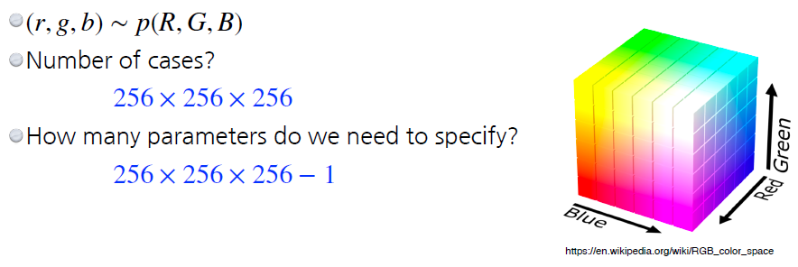

하나의 픽셀에 대해서 정말 많은 파라미터가 필요하다!

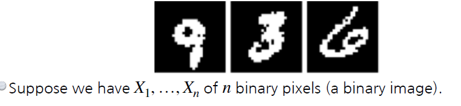

binary pixel의 경우에는 어떨까? possible state는 2^n, 파라미터는 2^n - 1이 된다..

## Structure Through Independence
파라미터의 갯수를 줄여보자!

n개의 픽셀이 독립적이라면, possible state = 2^n 이다.
그러나, 이 distribution을 표현하기 위한 parameter는 n개만 있어도 가능하다!

각각의 픽셀에 대해서 파라미터 1개만 있어도 되며, 모두 독립적이므로 그냥 더하면 된다. 하지만, 실제로 이미지의 모든 픽셀을 independent하게 간주를 하면 우리가 인식하기에는 문제가 있다...

## Conditional Independence
full과 independence 중간점

- Chain rule:
$$ p(x_1, ..., x_n) = p(x_1)p(x_2|x_1)p(x_3|x_1,x_2)...p(x_n|x_1,...x_{n-1}) $$
- Bayes' rule:
$$ p(x|y) = {p(x, y) \over p(y)} = {p(y|x)p(x) \over p(y)} $$
- Conditional independence:
$$ if\, x \bot y|z,\, then\, p(x|y,z) = p(x|z) $$

z가 주어질때, x와 y가 독립이라면, p(x|y,z) = p(x|z)이다. x와 y가 독립이므로 z가 주어지면 y는 x를 표현하는데에는 상관이 없어진다.

그렇다면 파라미터의 갯수는 얼마나 될까?

p(x1): 1 parameter

p(x2|x1): 2 parameter. x1이 주어질때 x2=0, x2=1일 
확률 2가지

p(x3|x1, x2): 4 parameter

$$ 1 + 2+ 2^2 + ... + 2^{n-1} = 2^n - 1 $$

### Markov assumption
i+1 번째 픽셀은, i에만 dependent하다고 가정해보자.

$$ p(x_1, ..., x_n) = p(x_1)p(x_2|x_1)p(x_3|x_2)...p(x_n|x_{n-1}) $$

가 된다.

이 경우의 파라미터 갯수는 어떻게 될까?

$$ 2n - 1 $$

따라서 Markov assumption을 통해 parameter의 갯수를 아주 많이 줄일 수 있다. 이러한 방법을 **Auto-regressive model** 이라고 부른다. conditional independency를 잘 활용한 방법이다.

## Auto-regressive Model
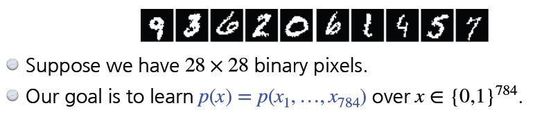

28x28로 구성된 바이너리 픽셀 이미지가 있다고 해보자.

p(x)는 어떻게? chian rule과 joint distribution을 이용하면..

$$ p(x_{1:784}) = p(x_1)p(x_2|x_1)p(x_3|x_{1:2})... $$

arm은 이전 하나의 정보가 이전 정보들과는 독립적이라는 의미다. markov assmption을 통해, i번째 픽셀이 i-1에만 dependent 한 것도 auto-regressive model이지만, i번째 픽셀이 0~i-1 까지 dependent한 것도 arm이다. 이런 점에서 ordering도 중요 고려사항이다.

## NADE: Neural Autoregressive Density Estimator
i번째 픽셀을 1~i-1 까지 dependent하게 만든다.

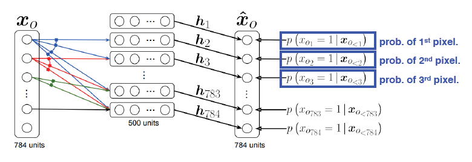

첫번째 픽셀은 온전히 independent. 두번째는 첫번째에만, 세번째는 1~2번째에, ...

$$ p(x_i|x_{1:i-1}) = \sigma(\alpha_ih_i + b_i) \,where\, h_i = \sigma(W_{<i\,x_{1:i-1}} + c)  $$

신경망의 입장에서는 갈수록 weight가 증가하게 된다. 첫번째 픽셀에 대해서는 아무런 weight가 필요하지 않지만, 세번째 픽셀에 대한 네트워크는 2개의 입력이 필요해지고, 백번째의 경우에는 99개의 이전 입력이 필요하다.

NADE는 **explicit model**이기도 하다. 단순히 생성만 하는 것이 아니라, 임의의 입력이 주어지면 확률을 계산할 수 있다.

모델은 첫번째 픽셀의 확률 분포를 알고 있고, 첫번째가 주어졌을 때 두번째의 확률 분포를 알 수 있다. 마찬가지로 3번째의 경우, 1~2번째가 주어지면 알 수 있다. 각각을 독립적으로 계속 계산을 해내면, 아주 작겠지만 확률 값이 나올 것이다.

## Pixel RNN
n x n RGB image

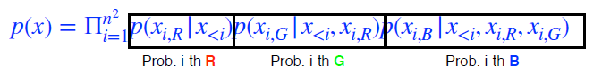

앞의 경우에는 i번째는 1~i-1을 모두 고려한다. 그러나 이 경우에는 RNN을 활용하는 것이 차이점이다.

또 다른 차이점은 ordering의 방법에 따라 2가지로 분류한다. Row LSTM, Diagnoal BiLSTM 이다.

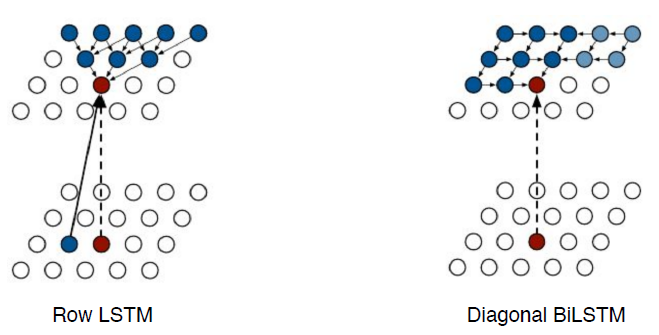

 

# Generative Models part 2

Autoencoder는 generative model인가?

## Variational Auto-encoder
- variation inference (VI)
  - The goal of VI is to optimize the variational distribution that best matches the **posterior distribution**
    - 나의 observation이 주어졌을 때, 내가 보고자 하는 확률 분포
    - 일반적으로 이런 posterior는 계산하기 힘들다. 그에 근사한 값을 구하려고 할 때 사용하는 것이 바로 Variational distribution
  - KL-divergence를 활용하여 posterior와 variational 간의 격차를 줄여보고자 loss로 활용한다.

그렇다면, 내가 뭔지도 모르는 posterior와 어떻게 근사를, 값을 가깝게 만들 수 있을까?

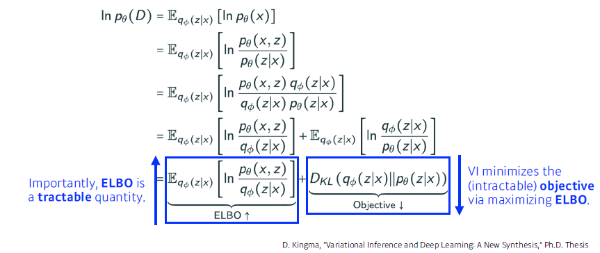

우리의 원래 목적은 불가능하다. posterior를 모르기 때문이다. 따라서 그 대신 ELBO를 계산하여 키우는 것으로 목적을 달성한다. **Sandwich methods**

### ELBO
Evidence Low Bound

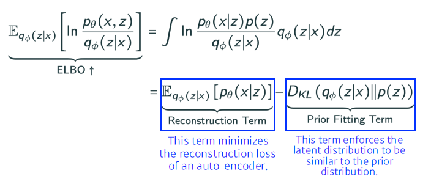

궁극적으로 하고자 하는 것은 어떤 X라는 입력이 있고, 걔를 잘 표현할 수 있는 Z라는 space를 찾고자 하는 것이다. 그러나 우리는 Po(X|Z)를 모르므로, 근사를 하여 구하려고 한다. 이때, ELBO를 maximize하는 것이 posterior distribution과 variational distribution의 거리를 줄여주는 효과가 있다는 것.

ELBO는 Reconstrutcion Term과 Prior Fitting Term 2부분으로 나뉜다. Reconstruction은 X가 인코더와 디코더로 돌아올 때의 reconstruction loss를 줄이는 것이다. Prior fitting term은 X라는 이미지를 space로 올린다. 각 점들이 이미지가 되는데, 이 점들의 분포가 내가 가정하는 space의 distribution과 비슷하게 만들어준다.

Key limitation:
- It is an intractable model (hard to evalutate likelihood)
- Prior fitting term must be differentiable, so it is hard to use diverse latent prior distributions.
- In most case, we use an isotropic Gaussian.

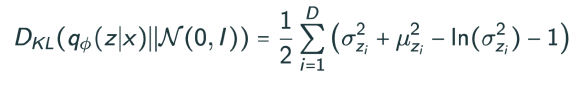

## GAN
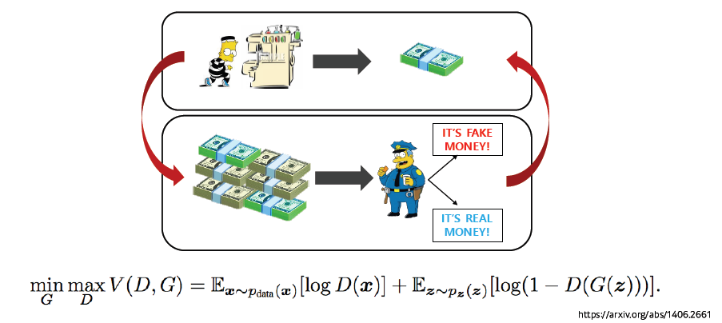

### GAN vs VAE
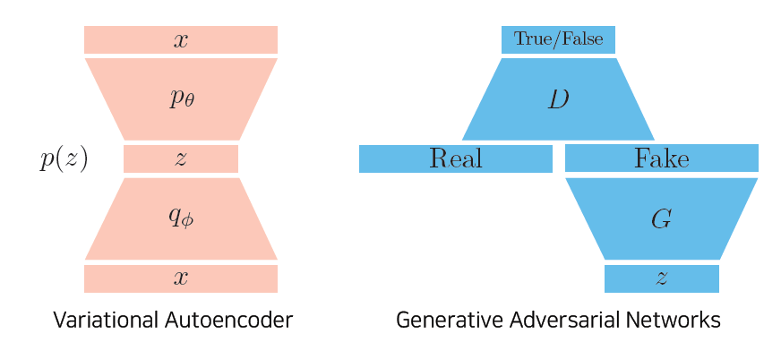

GAN은 양자간의 minimax game으로 볼 수 있다. 이 양자가 generator와 discriminator이고, 서로가 적대적으로 adversarial한 학습을 진행한다. 이 때 목적식을 V(G,D)는

$$ 
 \min_{G}V(G, D) = E_{{x} \sim p_{{data}}}[\log D({x})] + E_{{x} \sim p_{G}}[log(1 - D({x}))]
$$

이때 학습은 iterative하게 진행된다. 초기 상태의 G0 D0가 있고, 각각은 generator와 discriminator를 학습 시킬 때 목적식에 G0와 D0를 넣어 계산된 결과를 활용하여 G1, D1으로 업데이트 한다. 이를 Gn+1, Dn+1 까지 반복한다.

만약 이 목적식으로 학습을 계속 진행한다면, optimal로 수렴할 수 있을까?

generator가 fix가 되어 있을 때, 이를 최적으로 갈라주는 optimal discriminator는

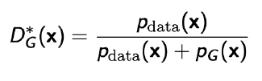

이 optimal di를 다시 generator에 집어 넣으면,

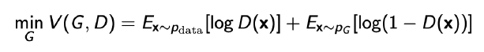
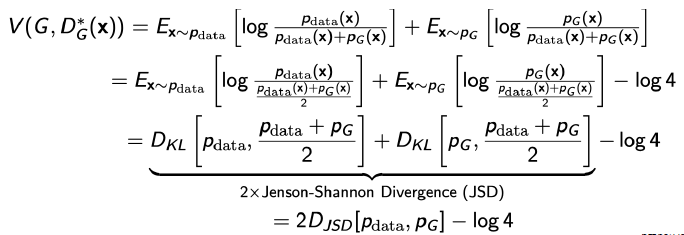

먼저 min-max에서 안쪽의 max를 풀어 optimal discriminator를 얻고, 그것을 목적식에 닷 ㅣ넣는 경우 optimal generator가 얻어지는 조건을 따져보자. 이는 학습중에서는 진행하지 않는 과정임을 유의.

아무튼 수식적으로는 optimal이 가능함을 보여주나, 실제 알고리즘 상에서 optimal로 학습이 될 것인지는 다른 문제이다.

???
?????
??????????

### DCGAN

### Info-GAN

### Text2Image

### Puzzle-GAN

### Cycle GAN

### Star-GAN

### Progressive-GAN

# 의문점
- Autoencoder??
- GAN?????