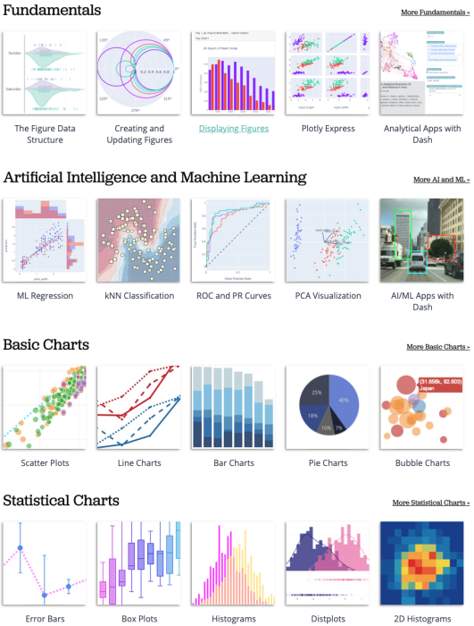
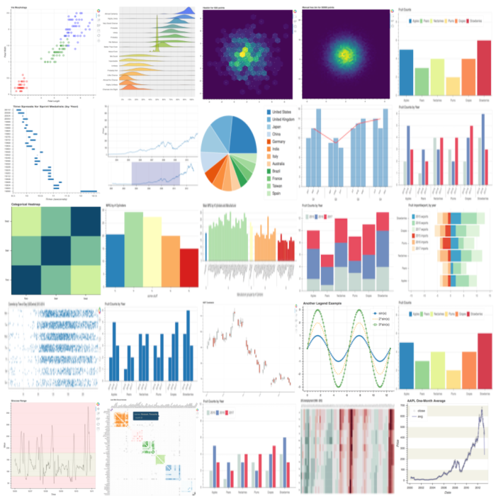
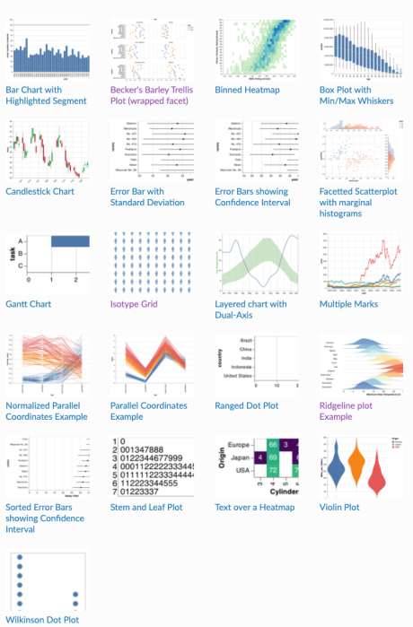

# Interactive Visualization

## 정적 시각화

- 정형 데이터에서 feature가 10개라면,
  - 각각 살펴보는 데 10개의 plot
  - 각 관계를 살펴보는데 10 \* 9 / 2 = 45 개의 plot
  - 공간적 낭비가 큼

## 대표적인 라이브러리

- Plotly
- Bokeh
- Altair

### matplotlib

Matplotlib도 인터랙티브를 제공하지만, 주피터 노트북 환경 또는 local에서만 실행할 수 있다. 다른 라이브러리들은 웹에도 deploy 가능함!

### Plotly

인터랙티브 시각화에 제일 많이 사용됨. Python, R, JS에서도 제공되는 라이브러리이다. 통계 시각화 외에도 지리 시각화, 3D 시각화, 금융 시각화 등 다양한 시각화 기능 제공. Js 시각화 라이브러리인 D3js를 기반으로 만들어졌기 때문에 웹에서도 사용 가능하다.

### Plotly Express

Plotly를 seaborn과 유사하게 만들어 쉬운 문법을 가짐. 커스텀 기능이 조금 부족하지만 다양한 함수를 제공한다.

### Bokeh

문법은 matplotlib와 유사한 부분이 있음. 기본 테마가 상대적으로 깔끔한 편이지만, 문서화가 조금 부족하다.

### Altair

Vega 라이브러리를 사용하여 만든 인터랙티브 시각화. 시각화 + 연산으로 배치하는 것이 특징이며, 문법은 js에 가깝다. 단, 데이터 크기에 5000개 제한이 붙어있음.
