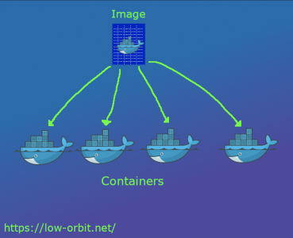
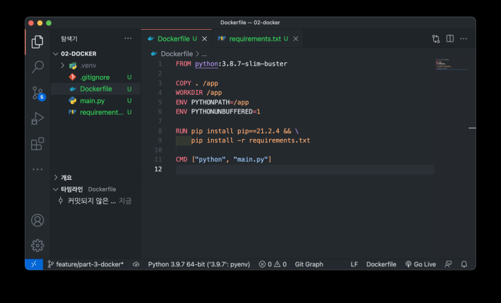

# Docker

## 가상화

개발을 진행한 local 환경과 production 환경이 다른 경우가 일반적이다. 대표적으로 한 가지 경우로는 OS가 다른 경우이다. OS가 다르므로 라이브러리나 파이썬 등 설치를 하는 과정도 다르게 진행해야 한다. 환경이 같더라도 환경변수나 Permission등에 따라 서버에서는 올바르게 작동하지 않을 수 있다.

이러한 설정을 일일히 기록하고 실행하는 방법은 귀찮고 오류가 발생할 수 있음. 또, 운영중인 server가 여러개인 경우, 특정 서버 업데이트 시에도 일괄 적용해야 하는 등 문제가 있음

가상화는 이런 문제점을 해결하기 위해 등장한 거승로, Research/Production 환경에서 공통적으로 사용하는 일종의 **템플릿**이라고 할 수 있다.

## Docker 이전

가상화 기술로 주로 VM을 사용했음. VM은 Host Machine이라 부르는 실제 물리적 컴퓨터 위에 OS를 포함한 가상화 SW를 두는 방식이다. 예를 들어 호스트가 Win이면, Win에서 Linux를 실행한다.

그러나 OS 위에서 OS를 하나 더 실행시키는 점 때문에 리소스를 굉장히 많이 사용한다는 단점이 있음. Container라는 경량화된 프로세스의 개념으로 가상화를 시도하는 방법이 등장함.

## Docker

Container 기술을 쉽게 사용할 수 있도록 나온 도구가 바로 **Docker**



- Docker Image
  - 컨테이너를 실행할 때 사용할 수 있는 "템플릿"
  - Read only
- Docker Container
  - Docker image를 활용해 실행된 "인스턴스"
  - Write 가능

## Docker 명령어들

- docker pull imageName:tag : 필요한 image 다운
- docker images: 다운받은 이미지 목록 확인
- docker run imageName:tag : 이미지 기반 컨테이너 생성
- docker ps : 실행중인 컨테이너 목록 확인
- docker exec -it containerName /bin/bash : 컨테이너 진입
- docker stop containerName : 실행중인 컨테이너 중지
- docker rm containerName : 중지된 컨테이너 삭제

</br>

- Volume Mount
  - 컨테이너 내부는 특별한 설정이 없으면 삭제 시에 파일도 사라짐. 즉, 호스트와 컨테이너간 파일 공유가 되지 않는다.
  - 만약 파일을 유지하고 싶다면 Host와 container의 저장소를 공유해야 함. 이 때 사용하는 옵션이 바로 Volume mount
  - -v 옵션을 사용. -p 와 사용법이 같음

```
docker run -it -p 8888:8080 -v /some/host/folder/workspace jupyter/minimal-notebook
```

## Docker image 만들기



- 파이썬 환경에서 코드 작성
- Dockerfile 작성
  - FROM: 베이스 이미지 지정
  - COPY: 로컬 내 디렉토리 및 파일을 컨테이너로 복사
  - WORKDIR: RUN, CMD 등을 실행할 컨테이너 내 디렉토리 지정
  - RUN: 앱 실행에 필요한 여러 리눅스 명령어들을 실행
  - CMD: 이미지 샐힝 시 바로 실행할 명령어를 지정
- docker build DockerFilePATH -t ImageName:tag : 이미지 빌드
- docker run ImageName:tag : 빌드한 이미지 실행