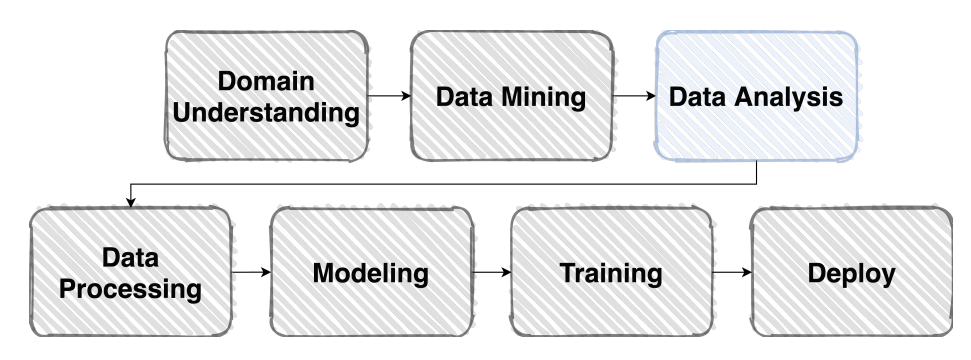
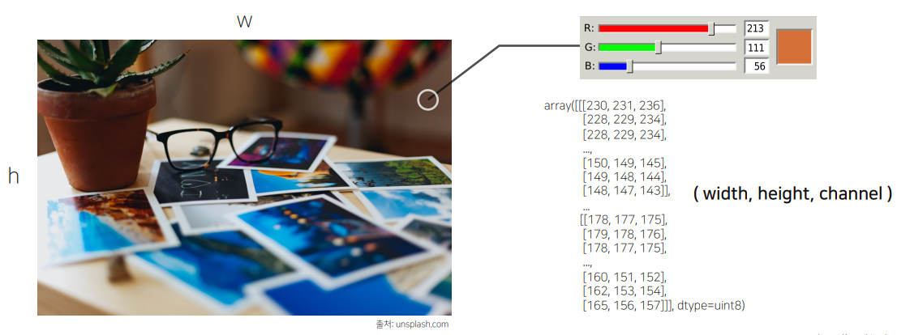
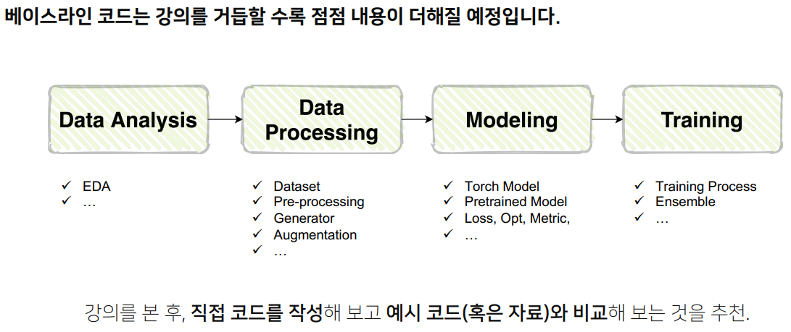
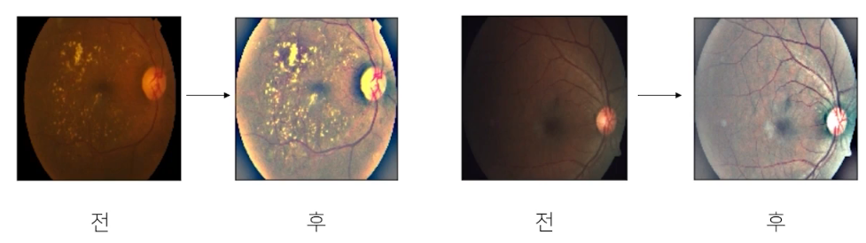
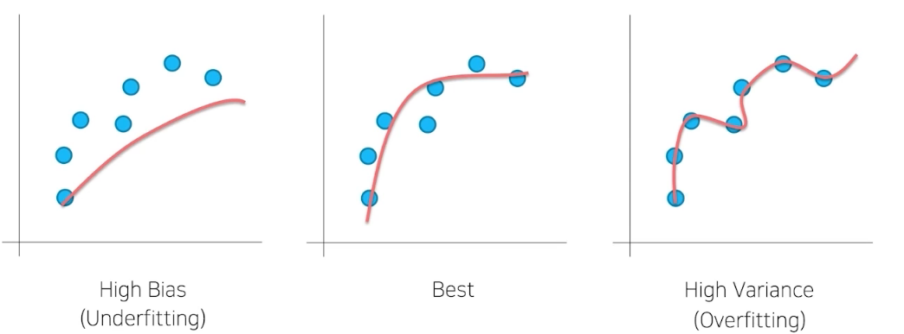

# Level-1 P-Stage

이미지 분류 프로젝트.

프로젝트 진행 과정은 크게 다음 과정들로 볼 수 있다.



Domain Understadning -> Data Mining -> Data Analysis -> Data Processing -> Modeling -> Training -> Deploy

## EDA

Exploratory Data Analysis

"탐색적 데이터 분석" - 데이터를 이해하기 위한 노력이 중요

처음부터 완벽하게 분석하는 것은 쉽지 않다. 또, 분석이란 정답이 없는 과제이다. 잘 만들어진 예제를 참고하여 인사이트를 얻어보자.

https://www.kaggle.com/ash316/eda-to-prediction-dietanic

EDA의 목적에 너무 거창한 것을 목표로 하지 말자. EDA의 본질은 '데이터를 이해하려는 노력'이다. 사용하려는 데이터가 온전하지 않은 경우도 있고, 데이터의 특성이 이상할 수도 있다. EAD의 목적은 그밖에 여러가지 다른 문제 때문에 생긴, **데이터에 대한 의문점을 해결하는** 데에 있다.

모델링을 하는 과정에서도 EDA는 언제든지 다시 진행할 수 있다. 모델의 예측 결과가 데이터 분석 시 예측한 결과와 다른 경우가 있을 수 있고, 또 모델의 결과가 EDA에 또 다른 관점을 제시해 줄 수도 있기 때문이다.

# Image Classification

## Image?



## Model

Classification을 한다는 것은 Input -> Model -> Output이다. input의 형태는 다양할 수 있고, output도 다양할 수 있다.

- input: image, text, sound ...
- output: Categorical Class, Probability, Position ...

Image Classification에서는 input은 이미지가 되고, output은 Class가 될 것이다. 물론 컴퓨터는 이미지나 분류를 그 자체로 사용하지 못 하므로, '숫자'로 바꿔야 모델이 학습할 수 있다.

## Baseline



# Dataset

## Overview

`Data processing`

주어진 vanilla data를 모델이 좋아하는 형태의 Dataset으로 바꿔주어야 한다. numpy.array 형태를 주로 사용함.

## Pre-processing

Data Science의 대부분은 데이터 전처리!!!!! 그래도 경진대회용 데이터는 품질이 양호한 편이다.

- Bounding Box
- Resize

### Bounding box

데이터는 가끔 필요 이상으로 많은 정보를 가지고 있을 수 있다. 예를 들어 자동차를 객체로 삼고자 할 때, 자동차 이미지에서 자동차 외의 다른 객체들이 있을 수 있다. 가로수나, 다른 차들 같은 것 말이다. 이런 다른 객체들이 학습에 방해가 될 수 있다. 이를 noise라고 하며, 최대한 줄여주는 처리를 하는 것이 좋다.

이를 위해 사용하는 기법 중 하나가 Bounding box이다. 이미지를 크롭하여 잘라내고, 그 이미지를 바탕으로 학습을 진행하는 것이다.

### Resize

계산의 효율을 위해 적당한 크기의 사이즈로 변경하는 작업이다. 이미지의 크기가 균일하지 않은 경우, 혹은 이미지의 크기가 너무 큰 경우 계산의 효율을 위해 이미지의 사이즈를 통일하거나 줄일 필요성이 있다.

### APTOS Blindness Detection



도메인이나 데이터 형식에 따라 정말 다양한 case가 있을 수 있다. 예를 들어 의료쪽 데이터의 경우에는 다양한 전처리가 필요할 수 있음.

텍스트의 경우에는 Tokenize 과정을 거치기도 하고, 음성의 경우에는 Noise를 잘 처리하여 특정 음역만을 뽑아내기도 한다.

</br>
<hr>
</br>

# Generalization

## Bias & Variance



학습이 잘 안되거나, 너무 된 경우 문제가 된다. Overfitting의 경우 정말 많은 부분을 모델이 다 cover하게 되므로, 분산이 높아지게 된다. 그래서 High Variance라고 하는 것. 데이터에 noise는 필연적인데, 이 noise까지 지나치게 반영하게 되버린 경우다.

반면 data를 너무 고려하지 않게 되는 경우가 Underfitting이다. 데이터가 너무 적었거나, data를 제대로 반영하지 못 해서 bias가 지나치게 높아진 경우이다.

## Train / Validation

훈련 셋의 일정 부분을 따로 분리하여 검증 셋으로 활용한다. 이 validation set은 절대 학습과정에 쓰지 않는다. 이렇게 데이터를 분리하면 모델이 일반화가 되었는지 확인해볼 수 있다. 또, 이를 통해 overfitting을 방지하는 효과도 얻을 수 있다.

> 주의점: Train set의 일부를 validation set으로 쓰는 것이다. 이는 Test set과는 완전 다른 부분이다.

## Data Augmentation

주어진 데이터가 가질 수 있는 Case(경우), State(상태)를 다양화 하는 방법. 이를 지원해주는 라이브러리도 존재한다. 데이터의 case와 state를 다양화하는 것으로 일반화에 도움이 된다. 예를 들어 특정 이미지 하나를 어둡게 만들어 보거나, 비가 내리는 효과를 추가해보면서 다양한 환경에서도 해당 객체를 잘 인식할 수 있도록 한다.

앞서 설명한 라이브러리의 대표로 `torchvision`이 있다. 이미지에 적용할 수 있는 다양한 함수들이 있다.

- RandomCrop
- Flip
- Rotate
- Resize
- GaussianBlur
- Compose: 여러가지 효과를 섞어서 사용할 수 있음
- etc...

그 밖에도 `Albumentations`같은 또 다른 라이브러리도 있다. 더 빠르면서도 더 다양한 기능을 제공함.

## 마치며...

일반화가 항상 좋은 결과를 가져다 주지는 않는다. 무조건 해야되는 과정도 아니다. 자칫 잘못되거나, 지나친 전처리를 가하는 경우 데이터에 오염이 일어나 오히려 문제가 발생할 수도 있다.

모든 것은 결국 `실험`으로 증명해야 한다는 것을 명심하자. 전처리 과정은 결국 `도구` 중에 하나임을 명심하자. 앞서 정의한 주제에 따라 어떤 기법을 적용할 것인지, 어떤 다양성을 필요로 할지를 생각하면서 적용해야 한다.

</br>
<hr>
</br>

# 개인 실습...

## cuda 설치

```
UserWarning:
NVIDIA GeForce RTX 3080 with CUDA capability sm_86 is not compatible with the current PyTorch installation.
The current PyTorch install supports CUDA capabilities sm_37 sm_50 sm_60 sm_61 sm_70 sm_75 compute_37.
If you want to use the NVIDIA GeForce RTX 3080 GPU with PyTorch, please check the instructions at https://pytorch.org/get-started/locally/
```

RTX3080 에서 pytorch가 동작하지 않는 문제가 가끔 발생한다고 함. cuda toolkit version을 11.0 이상으로 올리면 해결 가능

## 버전 호환 및 패키지 설치

pytorch와 호환되는 cuda toolkit 버전을 확인하고 설치해야 한다.

https://pytorch.org/get-started/locally/

이곳에서 확인 가능하다. 나의 경우 cuda toolkit을 11버전 이상을 사용해야 하므로, 11.3 버전을 설치할 것이다. 이후 cuda toolkit 11.3과 호환되는 cuDNN도 같이 설치해야 한다.

https://developer.nvidia.com/rdp/cudnn-archive#a-collapse805-111

여기서 버전에 맞는 cuDNN을 찾아 설치하면 된다. 나의 경우에는 cuDNN v.8.2.1을 설치했다. 설치방법은 다운로드한 압축 파일을 cuda의 설치 폴더에 풀어주면 된다. 딱히 설치 옵션을 변경하지 않았다면 `C:\Program Files\NVIDIA GPU Computing Toolkit\CUDA` 에 있을 것이다. 해당하는 버전의 폴더에 압축을 풀어주면 된다.
잘 설치되었는지 확인하려면 `nvcc --version` 명령어를 사용하면 된다.

그 다음 pytorch 및 그 패키지를 설치해주자.

`conda install pytorch torchvision torchaudio cudatoolkit=11.3 -c pytorch`

이후 pytorch에서 cuda가 정상적으로 작동하는지 `torch.cuda.is_available()`로 확인할 수 있다.

### troblue shooting

간혹 pytorch에 문제가 발생하는 경우가 있다. conda 환경에서 기설치한 torch가 문제를 일으키는데, 대표적으로 다음과 같은 에러가 있다.

`Key already registered with the same priority: GroupSpatialSoftmax`

해당 에러의 해결 방법은 torch와 관련 라이브러리를 전부 삭제하고 다시 설치하는 것이다. 잘은 모르겠지만, pip로 설치한 것과 conda install로 설치한 것이 서로 충돌이 일어나서 발생하는 문제인것 같다... 모두 uninstall 한 다음 https://pytorch.org/get-started/locally/ 을 따라 설치를 다시 진행해보자.

torch를 재설치 하였다면 `torch.rand(3, 5)` 을 출력하는 것으로 간단하게 테스트 해보자
