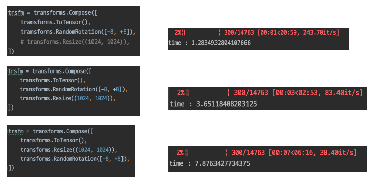
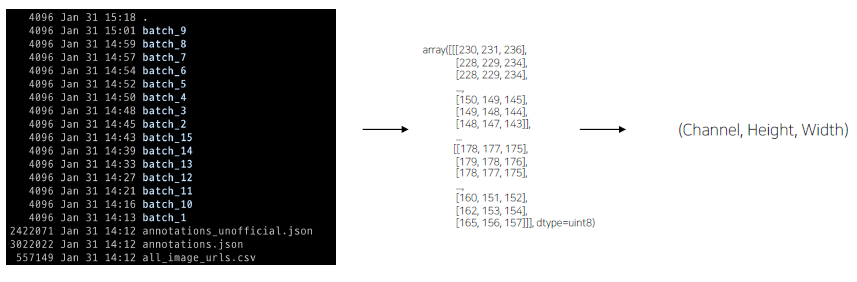
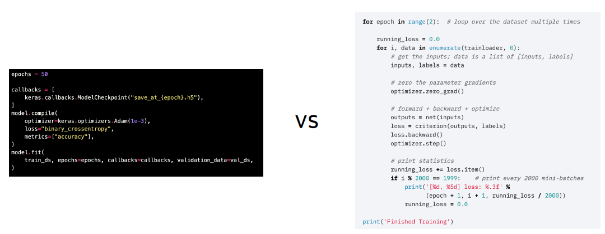

# Data Generation

모델 학습을 하는데 있어서 좀 더 효율적으로 data가 이용되고, 빠르게 생성하는 방법. 데이터 셋을 잘 구성했다 해도, 잘 출력할 수 있어야 한다. Data Processing!

## Data Feeding

모델이 처리할 수 있는 batch/s를 초과하여 Data Generator가 작동하고 있지는 않은지, 혹은 그 반대인지... --> GPU 효율이 떨어지는 상황!

### 예시

Dataset 생성 능력을 비교에 **tqdm**을 이용해보자

```python
for i, data in enumerate(tqdm(dataset)):
    if i == 300:
        break
```



300x300 이미지를 rotation 하는 것과, 1024x1024 이미지를 rotation 하는 것은 차이가 있다!

## torch.utils.data

### Datasets



원본 데이터를 Dataset으로 변환. 파이토치의 Dataset 클래스의 기본 구조는 아래와 같다. 자유롭게 수정하여 사용 해보자

```python
from torch.utils.data import Dataset

class MyDataset(Dataset):
    def __init__(self):
        pass

    def __getitem__(self, index):
        return None

    def __len__(self):
        return None
```

### DataLoader

MyDataset --> DataLoader --> (Batch, Channel, Height, Width)

내가 만든 Dataset을 효율적으로 사용할 수 있도록 관련 기능을 추가할 수 있다.

```python
train_loader = torch.utils.data.DataLoader(
    train_set,
    batch_size=batch_size,
    num_workers=num_workers,
    drop_last=True
)
```

병렬처리를 하거나, last를 빼거나, batch_size를 조정하거나 등등... 그 외에도 많은 기능들이 있다. 알아두면 좋은 기능은 다음과 같다.

- shuffle
- sampler
- collate_fn: 배치마다 특정 작업을 하고자 하는 경우.

  > https://pytorch.org/docs/stable/data.html?highlight=dataloader#torch.utils.data.DataLoader

#### 간단한 실험

loader의 num_worker의 숫자를 바꿔보면서, tqdm으로 시간을 측정해보자.

```python
dataloader = TestDataLoader(data_dir=path, batch_size=16, num_workers=2)
for i, (data, target) in enumerate(tqdm(datalodaer)):
    if i == 0:
        break
# 대략 5초

dataloader = TestDataLoader(data_dir=path, batch_size=16, num_workers=5)
for i, (data, target) in enumerate(tqdm(datalodaer)):
    if i == 0:
        break
# 대략 2초
```

num_worker를 늘릴수록 빨라지지만, 마냥 늘리는 것이 능사는 아니다. 지나치게 늘리는 경우 OS나 다른 부분에 필요한 컴퓨팅 자원이 모자라게 되어 전체 성능을 악화시킬 수 있음... (병목현상 위험)

### 결론

**Dataset과 DataLoader는 엄연히 다른 일을 한다!!!!**

Dataset에 DataLoader의 기능을 넣을 수는 있지만, 이는 코드관리나 협업과정, 재사용에 있어서 좋지 않은 방법이다.

</br>
<hr>

# Modeling

모델?

> an **informative representation** of an object, person or **system**.

## Pytorch

Keras vs Pytorch



- Keras: 쉽고, 접근성 좋고..
  - fit으로 간단하게 학습을 진행할 수 있지만... 학습 내부가 어떻게 진행되는지, 특정 조작이 필요할 때(로거, 조작, loss, optimizer의 정의 등등)이 힘들다...
- Pytorch: 어렵지만 좀 더 low-level한 조작이 가능함!!

## nn.Module

Pytorch 모델의 모든 레이어는 nn.Module 클래스를 따른다.

```python
import torch.nn as nn
import torch.nn.functional as F

class MyModule(nn.Module):
    def __init__(self):
        super(MyModel, self).__init__()
        self.conv1 = nn.Conv2d(1, 20, 5)
        self.conv2 = nn.Conv2d(20, 20, 5)

    def forward(self, x):
        x = F.relu(self.conv1(x))
        return F.relu(self.conv2(x))
```

```python
a = MyModule()
print(a)
print(a.modules())
```

하나의 모델을 알아볼 수도, 모델 안의 여러가지 모듈들도 볼 수 있다. (모듈이란, parameter를 지님)

## forward

이 모델(모듈)이 호출되었을 때 실행되는 함수. 딥러닝의 전파방향을 구현하게 될 부분이다.

## nn.Module Family

그래도 왜 꼭 nnModule을 써야할까?

모든 nn.Module은 child modules를 가질 수 있다. 내 모델을 정의하는 순간, 그 모델에 연결된 모든 module을 확인할 수 있다는 장점이 있다. 이는 학습을 진행하면서 parameter들을 살펴볼 수 있음을 시사한다.

또, forward() 함수를 진행하는 경우, 모델의 forward()를 한 번 실행한 것으로 그 모델의 forward에 정의된 모듈 각각의 forward()도 같이 실행된다.

## Parameter

```python
sd = a.state_dict()
params = list(a.parameters())
```

모델 파라미터들도 data, grad, requries_grad 등 변수를 가지고 있다.

```python
for param in a.parameters():
    print(param.requires_grad)
    print(param.grad)
```

## 결론

Pytorch는 Pythonic하다! 파이토치의 형식과 구조를 잘 파악하면 여러가지 응용을 할 수도 있고, 발생하는 에러들도 핸들링 할 수 있다는 점.
