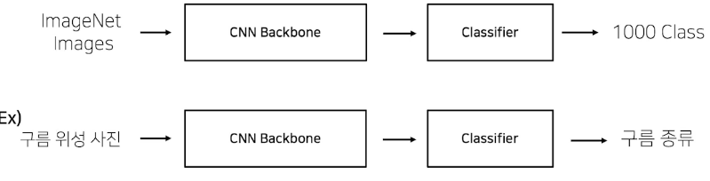

# Modeling Ch.2 pre-trained model

직접 모든 과정을 만드는 것은 비효율적이다. pre-train된 모델들을 가져와서 튜닝하여 사용하는 것이 좋다. '바퀴를 다시 발명하지 마라'

## Computer Vision

알고리즘 개발과 검증을 위해서는 높은 품질의 데이터 셋이 필수적이다!!!

> ImageNet: 14 milion images, 20 thousands categories의 Dataset

이미지넷이 도입되고 발전하면서 동시에 모델들의 accuracy도 급격히 성능이 올라가기 시작했다. 이처럼 성능이 검증된 모델들을 가져와서 활용할 수 있다면? 그 전에는 직접 해야하는 많은 과정들, 학습들을 생략할 수 있을 것이다.

## Pretrained Model

모델 일반화! 매번 수 많은 이미지를 학습시키는 것은 까다롭고 비효율적이다. 좋은 품질, 대용량의 데이터로 미리 학습한 모델을 가져와서 내 목적에 맞게 fine-tuning하여 사용하자.

`torchvision.models`에 정말 많은 pre-trained model이 존재한다.

```python
import torchvision.models as models
resnet18 = models.resnet18()
alexnet = models.alexnet()
vgg16 = models.vgg16()
squeezenet = models.squeezenet1_0()
densenet = models.densenet161()
inception = models.inception_v3()
googlenet = models.googlenet()
shufflenet = models.shufflenet_v2_x1_0()
mobilenet_v2 = models.mobilenet_v2()
mobilenet_v3_large = models.mobilenet_v3_large()
mobilenet_v3_small = models.mobilenet_v3_small()
resnext50_32x4d = models.resnext50_32x4d()
wide_resnet50_2 = models.wide_resnet50_2()
mnasnet = models.mnasnet1_0()
```

https://pytorch.org/vision/stable/models.html

## Transfer Learning

### CNN base 모델 구조 (simple)

```
Input --> CNN Backbone --> Classifier --> Output
```

우리가 가져온 pre-trained model이 classifier와 CNN backbone에 위치하게 된다.

### Code check

Torchvision model의 구조를 한 번 살펴보자.

```python
import torchvision.models as models

resnet18 = models.resnet18(pretrained=True)
print(resnet18)
```

```
ResNet(
  (conv1): Conv2d(3, 64, kernel_size=(7, 7), stride=(2, 2), padding=(3, 3), bias=False)
  (bn1): BatchNorm2d(64, eps=1e-05, momentum=0.1, affine=True, track_running_stats=True)
  (relu): ReLU(inplace=True)
  (maxpool): MaxPool2d(kernel_size=3, stride=2, padding=1, dilation=1, ceil_mode=False)
  (layer1): Sequential(
    (0): BasicBlock(
      (conv1): Conv2d(64, 64, kernel_size=(3, 3), stride=(1, 1), padding=(1, 1), bias=False)
    )
    ...........
  (avgpool): AdaptiveAvgPool2d(output_size=(1, 1))
  (fc): Linear(in_features=512,  out_features=1000, bias=True)
)
```

`fc == fully connected layer == classifier`

이미지넷을 pre-training 하는 과정에 대해서 조금 더 알아보자. 이미지넷의 이미지를 input으로 넣고, CNN Backbone을 통과하고 Classifier를 통과하여 output은 1000개의 클래스로 구분될 것이다.

그럼 이렇게 pre-train한 것을 내가 하고자 하는 downstream task에는 어떻게 적용하면 되는걸까? 먼저 과정을 한번 생각해보자.



예를 들어 내가 구름을 분류하고자 한다면, 구름 사진을 CNN Backbone과 Classifier를 통과할 것이고, output으로 구름 종류를 내보내게 될 것이다. 이는 이미지 넷에 존재하는 1000개의 class에는 없을 것이다. 이처럼 pre-training할 때 설정했던 문제와 현재 문제와의 유사성을 고려하고 사용해야 한다.

### Case by Case

Case1. 문제를 해결하기 위한 학습 데이터가 충분한 경우

데이터가 충분히 존재하므로 CNN Backbone을 사용하는 것에 문제가 크게 없을 것이다. 그래도 우리의 학습 데이터가 얼마나 유사한지에 따라 구분해서 생각해보자.

- feature extraction

  - 우선 우리의 데이터가 이미지넷과 아주 유사한 경우에는 굳이 backbone까지 학습, 업데이트를 할 필요가 없을 것이다. 이 경우에는 backbone을 freeze하여 사용하는 것이 좋다. 여기서 유사하다는 의미는 이미지의 feature를 말한다. class만 다르다는 것이므로 backbone을 학습할 필요가 없기 때문이다.

- fine-tuining
  - 두번째로 우리의 데이터가 pre-train에 사용된 데이터와 큰 차이가 나는 경우에는 backbone 역시 다시 학습을 진행해야 할 것이다. 예를 들어 우리가 자동차의 모델명을 분류하고자 할 때에는 backbone이 자동차 임을 분류는 할 수 있을지언정, 우리가 원하는 분류까지는 할 수 없을 것이다.

Case2. 학습 데이터가 충분하지 않은 경우...

전체적으로 잘 반영하지 못할 확률이 매우 크다. 다만 높은 상관관계를 갖는 pre-trained 모델이 존재한다면 우리의 데이터로는 feature를 업데이트 하기에는 조금 무리가 있어도, classifier로 분류를 할 수는 있을 것이다.

하지만 비슷한 pre-trained 모델이 존재하지 않는다면...? 사용하는 의미가 없을 것이다.
