# Training & Inference

Loss, Optimizer, Metric, Process

## 역전파 - 복습

Error Backpropagation


- output: input데이터를 모델에 넣었을 때 나오는 결과물
- target: 정답으로 지정한 label

loss 함수는 이 output과 target간의 차이를 계산한다. loss의 결과값을 error나 cost라고 부르기도 한다. 이 에러를 역방향으로 전파하여 노드의 parameter를 업데이트하게 된다. Pytorch 에서는 loss 역시 nn.Moudle의 family다. (상속)

### loss.backward()

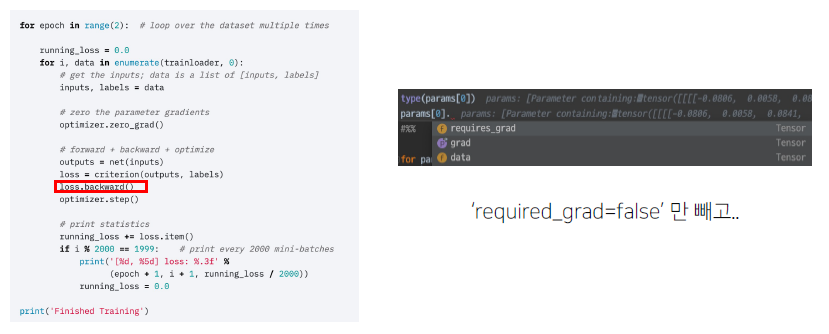

- criterion: 손실함수를 지칭하는 관용적인 표현.
  - out, label을 parameter로 전해주어 loss를 계산함

loss객체를 backward() 하는 걸로 보이는데...?

input -> Model (forward) -> output

위 구조와 유사하게, loss를 넣는 곳이 backward(). 즉, 각 연결된 체인에서 forward와 backward 양방향으로 gard가 전달되는 것이다.

### 특별한 loss

조금 특별한 loss가 있다. error를 만들어내는 과정에서 양념을 치는 것.

- Focal loss

  - loss가 낮은 것을 잡는 것이 어려운 경우. class imbalance 문제가 있는 경우에 맞춘 확률이 높은 class는 조금의 loss를, 맞춘 확률이 낮은 class는 loss를 훨씬 높게 부여한다.

- Label Smoothing loss
  - 경진대회에서 많이 사용함. 클래스가 과연 100% 정답이라고 할 수 있느냐? 예를 들어, 자동차 사진에 나무도 같이 찍힌 경우, 이 사진은 자동차 사진인가 나무 사진인가?
  - Class target label을 Onehot으로 표현하기 보다는, 조금 soft하게 표현해서 `일반화` 성능을 높이기 위해 씀.
  - [0, 0, 1, 0, 0,...]이 아닌, [0.021, 0.009, 0.025, ...]

## Optimizer

loss를 얻었으니, 이제 이걸 어떻게 사용해볼까? 어느 방향으로, 얼만큼 움직이게 할 것인가!

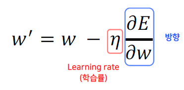

방향과 learning rate를 어떻게 부여하는지에 따라 다양한 optimizer가 된다.

### LR scheduler

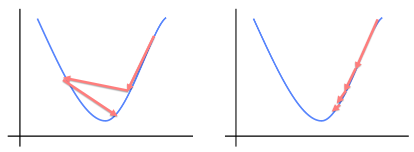

learning rate가 고정되어 있다면 조금 문제가 있을수도... 동적으로 조절하는 방법을 제시하는 것이 바로 LR scheduler이다.

### StepLR

특정 Step마다 LR을 감소시킨다.

```python
scheduler = torch.optim.lr_scheduler.StepLR(optimizer, step_size=2, gamma=0.1)
```

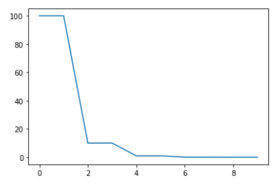

### CosineAnnealingLR

코사인 함수처럼 LR을 급격히 변경함. 격하게 LR이 변동하기 때문에 변화를 다양하게 줄 수 있다는 장점이 있다. 이런 큰 변동치는 local에 갇히는 현상을 막아줄 수 있다.

```python
scheduler = torch.optim.lr_scheduler.CosineAnnealingLR(optimizer, T_max=10, eta_min=0)
```

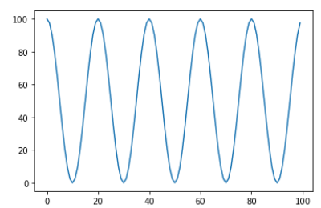

### ReduceLROnPlateau

일반적으로 많이 쓰임. 더 이상 성능 향상이 없을 때 LR을 감소시킨다.

```python
scheduler = torch.optim.lr_scheduler.ReduceLROnPlateau(optimizer, 'min')
```

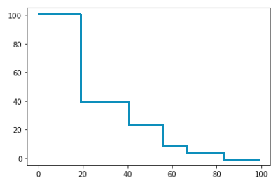

## Metric

모델을 평가하자!

## 모델의 평가

학습에 직접 사용되는 것은 아니지만, 학습된 모델을 객관적으로 평가할 수 있는 지표가 필요함! 여러가지 Task들이 있고, 그에 맞는 Metric도 다양할 것이다...

- Classification
  - Accuract
  - F1-score
  - Precision
  - recall
  - ROC & AUC
- Regression
  - MAE
  - MSE
- Ranking
  - MRR
  - NDCG
  - MAP

데이터 상태에 따라 적절한 metric을 선택해야 한다. class별로 밸런스가 적절한 경우에는 accuracy, class별 밸런스가 좋지 않아서 각 클래스 별 성능을 잘 낼 수 있는지 확인해야 할 필요가 있는 경우에는 F1-Score

## Training Process

실질적으로 training이 이루어지는 과정에 대해 자세히 알아보자.

> model.train(mode=True)

Sets the module in traning mode. This has any effect only on certain modules.

### optimizer.zero_grad()

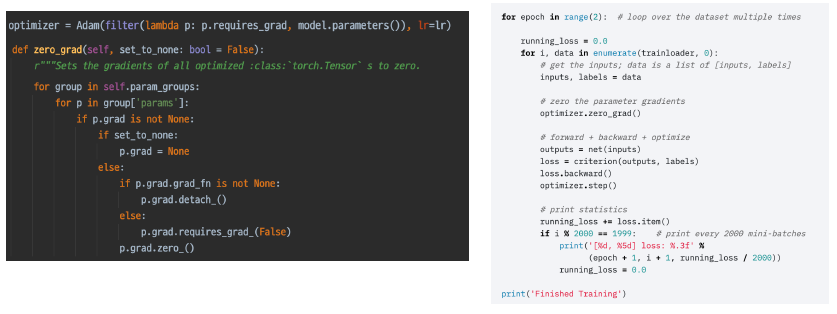

epoch을 위한 for loop

trainloader를 위한 for loop

input, label을 data로부터 가져온다.

optimizer.zero_grad()함수의 의미는?

> grad가 optimizer에 따라 업데이트가 될 것인데, zero_grad()의 이미는 이전 단계의 (즉 2번째 배치부터는 이전 배치의 grad가 그대로 남아있게 됨...) grad를 초기화 시켜준다. 통상적으로 loss는 각 batch에서 개별적으로 활용을 하기 때문에 초기화를 한다.

그러면 왜 굳이 초기화가 아니라 zero_grad를 할까? loss는 중첩시켜서 더하는 것이 기본이다. 따로 처리를 하지 않는 경우 loss가 대체되는 것이 아니고, '더해'지기 때문이다.

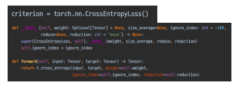

loss = criterion(outputs, labels)

criterion이라는 loss함수에 의한 값(텐서)가 loss에 저장된다. input, output, criterion, loss라는 체인이 완성

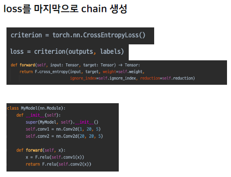

디버깅 작업을 통하면 이러한 chain을 좀 더 명확히 확인해 볼 수 있다.

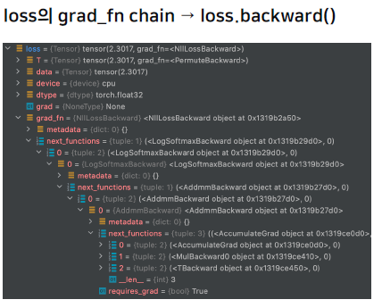

모든 parameter에는 grad를 줄 수 있다!

결과적으로 loss가 각각의 체인에 적용이 되어 grad가 업데이트 된느 것을 확인해볼 수 있다. grad 값의 변경이 최종 목표는 아니다. 최종 목표는 모델의 파라미터의 실질적인 변경이다.

그렇다면 이 grad를 어떻게 반영해서 parameter를 업데이트 하는가? 그 역할을 바로 optimizer가 맡는다.

`optimizer.step()`

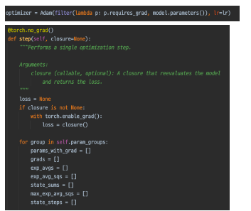

모델의 파라미터를 input으로 가지고 있기 때문에 모델의 파라미터를 자유롭게 바꿀 수 있다. loss가 백워드 되어 있으므로 각각의 grad가 업데이트가 되어 있을 것이다. 여기서 옵티마이저가 step을 밟아서 input으로 받은 parameter를 확인하여 업데이트된 grad를 업데이트 시켜 파라미터를 바꾸게 된다.

### Gradient Accumulation

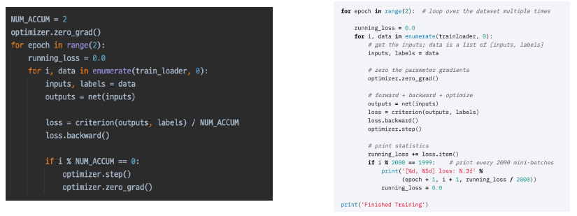

GA기법: 우리의 GPU 메모리는 한정적이다. 어떤 task의 경우 batch size가 중요한 경우가 있다. 이 때 배치 사이즈가 커서 담을 수 없다면...?

학습에 있어서 일반적 방식은 하나의 batch마다 loss의 역전파를 통해 optimizer step을 진행하는 것이다. 그렇다면, 매 배치마다 진행하지 말고, 특정 배치 이후에 step을 진행시키는 방법은 어떨까?

accumulation numbering이 필요할 것이다. if문을 만나서 num_accum에 도달해야만 step과 zero_grad를 진행한다.

### Inference Process

모델의 train이 끝났다... 평가의 시간.

`model.eval()`

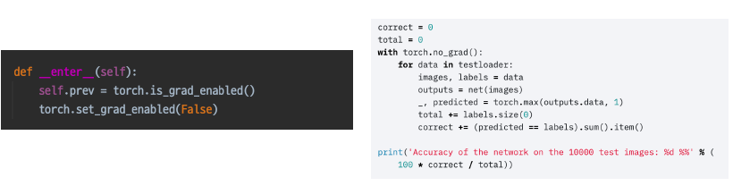

training에서만 파라미터를 업데이트해야 한다. `with torch.no_grad()`를 통해 gard update가 꺼질 것이다.

### Validation 확인

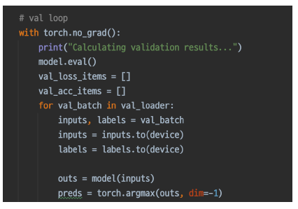

추론 과정에 validation 셋이 들어가면 그게 검증이다. inference 프로세스 안에서 데이터로더에 validation 데이터 셋만 넣어주면 된다.

### Checkpoint

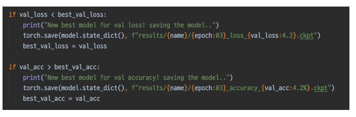

best 결과물을 저장하고자 할 때. 그냥 직접 짜면 된다. 간단함!

## 최종 Output, Submission 형태로 변환하기

최종 Submission 포멧을 확인하고 우리의 결과물을 적절히 변환하여 제출. 예를 들어 output은 보통 텐서로 나올텐데, 이를 대회에서 제시하는 형태로 잘 변환하면 된다.

# Appendix: Pytorch Lightning

조금 더 좋은 생산성을 위해 나온 pytorch 패키지.

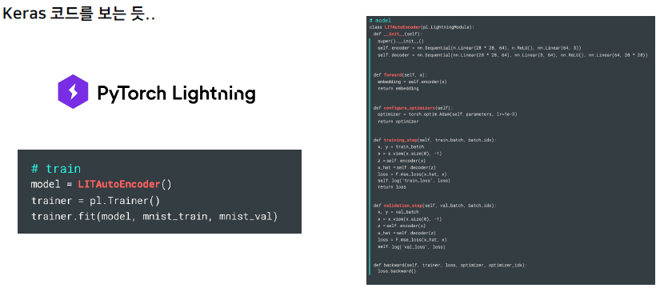

fit만 하면 위에서 구현한 train 과정과 validation과정, inference를 하나로 통일시킬 수 있음. 굉장히 압축적으로 표현할 수 있다!

다만, 충분한 이해가 바탕이 되지 않은 상태에서는 추천하지 않는다. 머신러닝의 전체적인 프로세스 과정을 알고 있어야 축약하고 압축하더라도 그 진행을 이해할 수 있기 때문이다. 이런 과정을 이해하지 않고 축약형을 사용하게 된다면....
