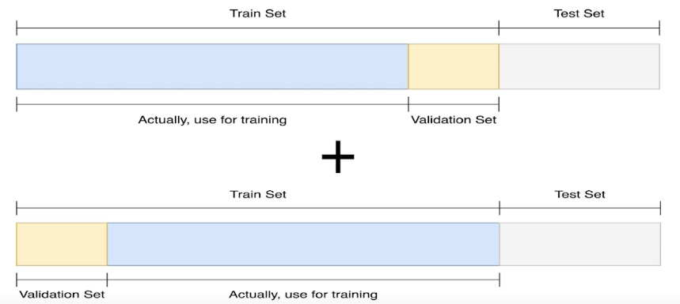
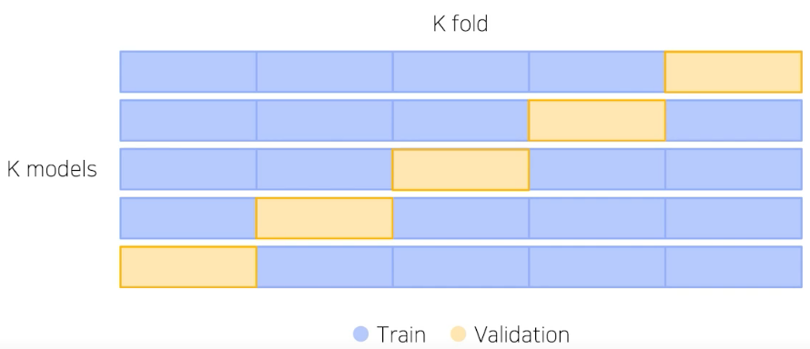
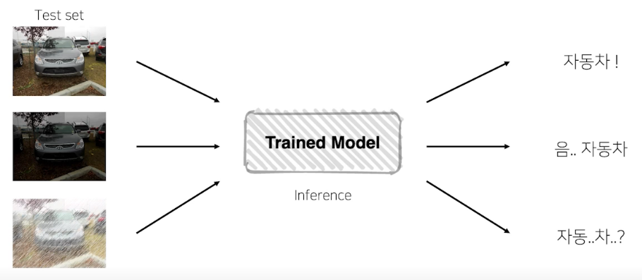

# Ensemble

여러 실험을 하다보면, 여러가지 모델로 여러가지 결과를 만들게 될 것이다. 이렇게 만들어 놓았던 모델들을 버리지 말고, 한번 모아서 사용해보는 건 어떨까?

## 앙상블

현업에서 그렇게 많이 쓰는 분야는 아니다. 성능도 중요하지만, production 배포와 사용성도 중요하기 때문이다. 앙상블은 다양한 모델들을 사용하게 되므로 시간이 상당히 소모된다. 다만, 성능이 중요한 domain이라면 사용해보는 것도 좋다.

딥러닝에서 Overfitting이 일어나는 것이 일반적인 경향성이다. 앙상블을 기법을 통해 오버피팅을 피하는데 도움이 될 수 있다.

## Model Averaging (Voting)

각각의 모델마다 특성이 다르다고 본다. 따라서 각 모델들이 수행한 결과를 취합해보면 어떨까?

서로 다른 모델이 같은 Test set에서 같은 에러를 발생시킬 확률이 거의 없다고 본다. 즉, 모델별로 다른 에러를 발생시킨다고 볼 수 있다. 따라서 모델별로 뽑아낸 에러들을 마치 투표를 하듯이 모아서 다수결로 결정하는 방식이다.

- Hard voing: 다수결. 그러나 제외된 결과물 역시 의미있는 경우일 수가 있다.
- Soft voting: 다른 점수를 버리지 않고 합친다. 그러나 이 경우 결과를 합치면 다른 결과가 나타날 수 있다.

## Cross Validation

`앙상블 과정에서 가장 많이 사용하는 방법이다.`



안그래도 작은 Train Set에서 Validation Set으로 빼내어 훈련 셋트가 작아진다... Validation set을 학습에 활용하는 방법은 없을까?

validation set을 다른 index에서 가져오고, 나머지를 train set으로 삼는다. 다음 세트 구성시에는 또 다른 validation set을 뽑아서 사용한다. 이렇게 다양한 validation set을 경험한 모델들을 합쳐 Ensemble 해보자!

## Stratified K-Fold Cross Validation

가능한 경우를 모두 고려하고 Split시에 class 분포까지 고려하자.



예를 들어 전체 train에서 20%만을 validation으로 사용한다고 가정해보자. 총 5덩어리의 validation set이 가능할 것이다.

가장 큰 단점은 fold를 한 갯수는 validation의 비율에 따라 결정된다. 이 예시에서는 5개의 모델이 만들어지게 된다. 만약 비율이 줄어든다면 더욱 많은 모델이 필요하게 될 것이다. 이 때 K의 숫자가 어느정도가 적절한지는 딱히 정해져있지 않으나, 보통은 5개로 잡는다.

## TTA (Test Time Augmentation)

테스트 할 때의 Augmentation???



테스트 이미지를 augmentation한 후 모델 추론, 출력된 여러가지 결과를 다시 앙상블하여 일반화된 정답이라고 판단한다.

## 앙상블의 Trade-off

효과는 확실하지만, 그만큼 학습과 추론 시간이 배로 소모된다...

# Hyper Parameter optimization

다양한 하이퍼 파라미터들...

- Hidden Layer 개수
- Learning rate
- Batch size
- loss 파라미터
- optimizer
- K-fold
- Drop out

이렇게 다양한 파라미터를 조정해가면서 학습하면 다양한 결과를 얻을 수 있다. 시간과 장비가 충분하다면....

일반적으로는 시간/장비적 여유 때문에 하이퍼 파라미터의 최적화는 잘 하지 않는다. 그러나 의미있는 일임은 분명하다.

## Optuna

파라미터 범위를 주고 그 범위 안에서 trials만큼 실행.

```python
import optuna

study = optuna.create_study()
study.optimize(objectiv, n_tirals=100)

...
```

# 참고

Paper with codes

https://paperswithcode.com
