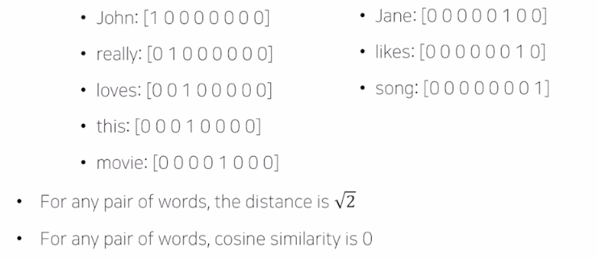
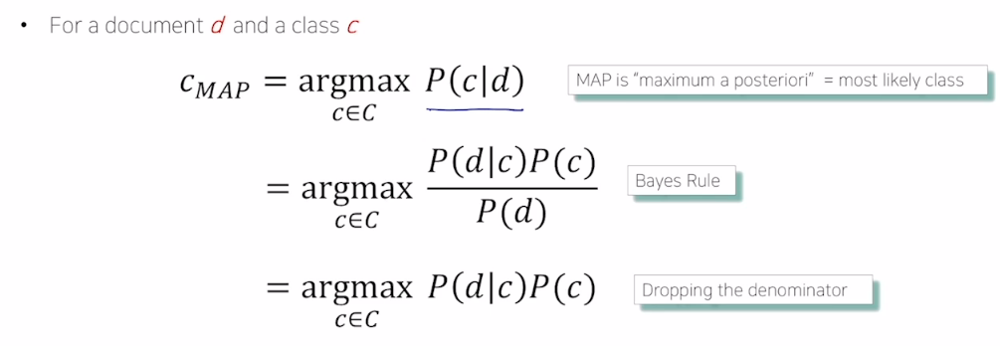

# NLP

## NLP

major conference: ACL, EMNLP, NAACL

- low level task
  - 문장이 있을 때, 문장을 이루는 각 단어를 정보 단위로 이해할 수 있다. 이 단위를 Token이라고 부르고, Token 단위로 쪼개는 것을 Tokenization 이라고 한다.
  - Stemming: 예를 들어 study라는 단어는 어미에 따라 다양한 단어가 될 수 있다. stduing, studed 등등... 이처럼 수많은 어미 변화 속에서도 같은 의미를 가지는 단어라는 것을 컴퓨터가 이해할 수 있도록 단어의 어근을 추출하는 것을 말한다.
- Word and pharse level
  - NER: 단일 단어, 혹은 여러 단어로 이루어진 고유명사를 인식하는 Task. ex) New York Times는 3 단어가 아니라 고유명사다!
  - POS: 단어들이 문장에서 갖는 성분이나 품사를 인식. 형용사구인지, 어떤 녀석을 꾸며주는지 등등.
- Sentence level
  - 문장 단위의 분석. 감정 분석, 기계번역 등
- Multi-sentence and paragraph level
  - Entailment: 두 문장간의 논리적인 내포를 판단. 예를 들어) 존이 결혼을 했다. 어제 누군가 결혼을 했다. --> 둘다 참 임을 알 수 있다.
    - 그러나, 존이 결혼을 했다. 누구도 결혼하지 않았다. --> 모순이 있음을 인식
  - Q&A: 질문이 주어졌을 때 답을 제시. 이전에는 그저 키워드로 검색하여 나열했다면, 이제는 정답까지 알려줄 수 있음. Keword를 포함한 문서를 검색하고, 문서들을 독해하여 주어진 질문에 대한 정답을 알아내서 사용자에게 제시한다.
  - Dialog system: 챗봇
  - Summarization: 문서를 요약

## Text mining

major confer: KDD, The WebConf, WSDM, CIKM, ICWSM

- Extract information: 상품평에서 소비자의 반응을 추출하거나,
- Document clustering: topic modeling. 문서 군집화 기술. 뉴스 데이터나 상품평 등을 군집화하여 분석하는 기술
- Highly related to social science: 사회과학과도 밀접한 관련이 있다. 소셜 미디어 데이터를 수집하여 분석하면 어떤 사회 현상과 관련있다거나, 신조어 사용 방식 등을 분석하면 사회과학적 insight를 알 수 있다.

## information retrieval

major confer: SIGIR, WSDM, CIKM, RecSys

- 정보 검색
  - 아직 까지는 많은 연구가 쌓이지 않았다!
  - 추천 시스템과도 연관이 높다.

## Trends of NLP

- 각 단어들은 vector로 표현해야 한다. 이를 word embedding이라 한다.
- RNN model들은 단어들의 sequence를 처리할 수 있어서 NLP에서 주로 쓰인다. 대표적으로 RNN, LSTM, GRU 등이 있다.
- 현재는 attention module의 등장으로 Transformer가 대세이다. 처음에는 기계번역을 위해 등장하였지만, 이제는 NLP 전반에서 쓰이는 구조가 되었다.
- 이전까지는 여러 NLP task마다 다양한 모델들을 사용했다. 이제는 Transformer와 attention 구조를 갖는 범용적 모델을 사용한다.
- 위처럼 만든 범용 모델을 사전 학습하고, 이를 전이 학습을 하여 세부적인 task에 적용시키는 것이 더 월등한 성능을 보이고 있다.
  - 대표적으로는 BERT, GPT-3 등이 있고, 그 외에도 너무 너무 다양하다!!!
- 최근에는 이런 모델들이 필수적인 요소가 되었다. 그러나 대규모의 데이터를 필요로 하게 되었는데, Open AI의 GPT-3의 경우에는 모델 학습에 쓴 전기세만 수십억원에 달한다고 할 정도다...

# Bag-of-Words

과거에 주로 쓰였던 가장 간단한 기법.

## Bag-of-Words Representation

`John really really loves this movie. Jane really likes this song.`

voca: {John, really, loves, this, movie, Jane, likes, song}

1. 위 문장에서 유니크한 단어들을 모아서 '사전'을 만든다.



2. 각 유니크 단어들을 one-hot vectors로 인코딩한다.

```
Sentence1: [1 2 1 1 1 0 0 0]
Sentence2: [0 1 0 1 0 1 1 1]
```

3. 위 원핫 벡터들을 모두 더한 것을 bag-of-words라고 한다.

## NaiveBayes Classifier

정해진 카테고리로 분류하는 방법중 대표적인 방법.

먼저 문서가 분류될 수 있는 클래스가 C개 있다고 해보자. (기사가 정치, 경제, 스포츠라고 한다면 3이다.)



# Word Embedding - Word2Vec

비슷한 의미를 가지는 단어는 비슷한 공간에 매칭되도록 벡터화한다!

## Word2Vec

워드 임베딩 중 유명한 방법 중 하나다. 비슷한 의미를 가지는 단어는 비슷한 위치하도록 하는 방법.

인접한 단어간의 의미가 유사할 것이란 가정을 하고 배치를 한다.

한 단어를 Mask하고, 주변 단어로 유추하도록 하는 방식으로 학습을 진행한다.

# 과제

```
다음 문장 "Shining through the city with a little funk and soul" 을 띄어쓰기 기준으로 토큰화하여
크기가 10인 vocabulary를 구축하고 각 토큰을 one-hot 벡터로 표현한다고 했을 때,
"funk"와 "soul" 두 토큰의 코사인 유사도를 구하시오. (정수값으로 입력)
```

sentence: [1 1 1 1 1 1 1 1 1 1]

fucnk: [0 0 0 0 0 0 0 1 0 0]

soul: [0 0 0 0 0 0 0 0 0 1]

```python
import numpy as np
from numpy import dot
from numpy.linalg import norm

doc1 = np.array([0, 0, 0, 0, 0, 0, 0, 1, 0, 0])
doc2 = np.array([0, 0, 0, 0, 0, 0, 0, 0, 0, 1])

def cos_sim(A, B):
  print(A, B)
  return dot(A, B)/(norm(A) * norm(B))

print(cos_sim(doc1, doc2))
```
