# RNNs

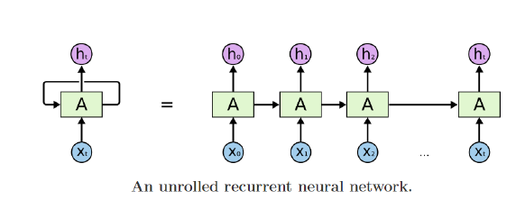

A: RNN module은 매 time step마다 재귀적으로 호출된다. A의 출력이 다음 step으로 전해지는 것!

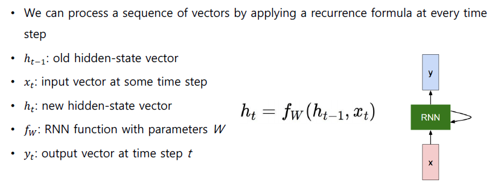

- time step t에서의 입력 벡터 Xt
- 이전 time의 hidden-state: ht-1
- 이 둘을 입력으로 받아서, 파라미터 W (RNN에 필요한 파라미터)를 가지는 RNN 함수 fW
- 출력은 현재 time step에서의 hidden state: ht
- 최종 output은 ht를 바탕으로 yt를 계산해낸다.

## RNN Calculate

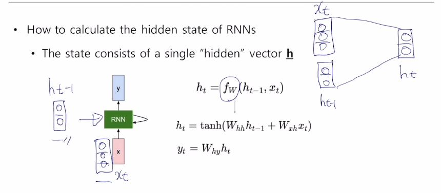
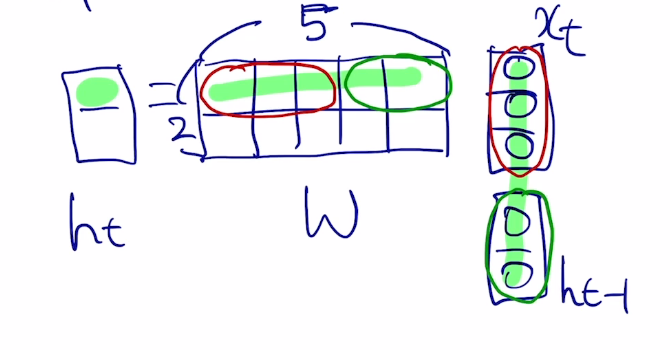
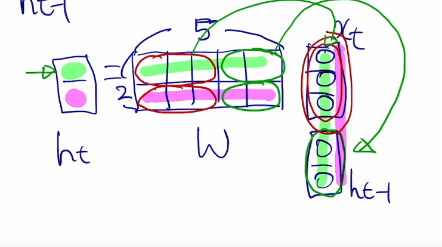
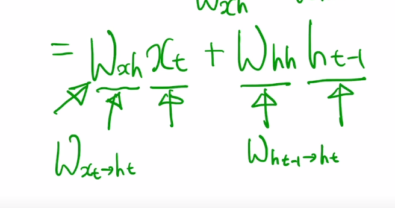
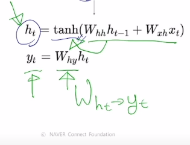

## Types of RNNs

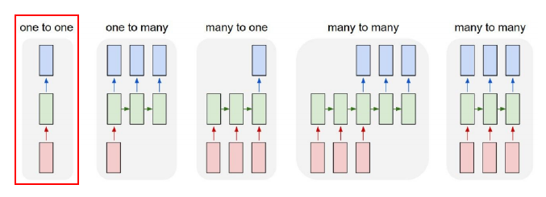

- One-to-one: input(빨강)이 3차원이고, 초록색 hidden이 2차원이라고 하고, output(파랑)은 다시 3차원이 된다고 가정할 수 있음.

- One-to-many: Image Captioning이 대표적. 이미지가 입력으로 들어온다. 이미지에 필요한 단어들이 각 time step마다 순차적으로 만들어진다. input이 하나로 표시되어 있지만, 나머지 RNN 모듈에도 input이 들어가긴 한다. 단, 이때는 입력 값이 0으로 되어있다.

- Many-to-one: Sentiment Classification 혹은 감정 분석이 대표적. 순차적으로 토큰이 RNN 모듈로 input된다. 마지막 Time step에서 (감정)을 출력한다.

- Many-to-many: 기계번역이 대표적. input이 들어온다. 모든 토큰을 다 읽은 후, 번역문이 출력된다.

- Many-to-many 2: Video classification on frame level이 대표적. 입력이 들어올 때 마다 예측을 수행한다.

## Character-level Language Model

문자열, 단어의 순서를 바탕으로 다음 단어를 맞추는 Task. 이 것의 더욱 하위 버전인 '캐릭터(문자) 레벨'이다.

ex) training sequence 'hello'

- vocab: [h, e, l, o]
- h: [1 0 0 0], e: [0 1 0 0], l: [0 0 1 0], o: [0 0 0 1]
- 이를 원핫 벡터라고 한다.

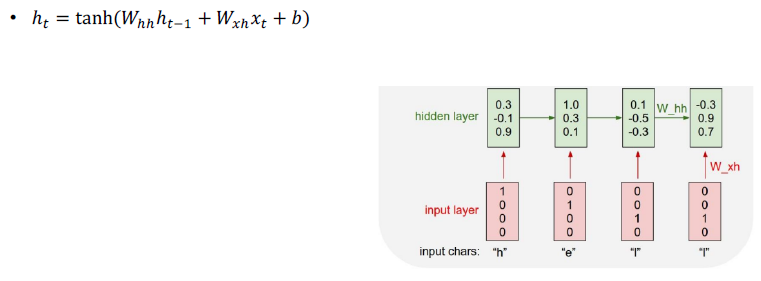

매 타임 스텝에서 들어오는 입력 벡터와 전 스텝의 ht-1을 선형 결합하여 ht를 만들어내게 된다. xt에서 ht로의 선형변환도 이루어지고, 추가적으로 bias를 더하여 ht를 계산한다.

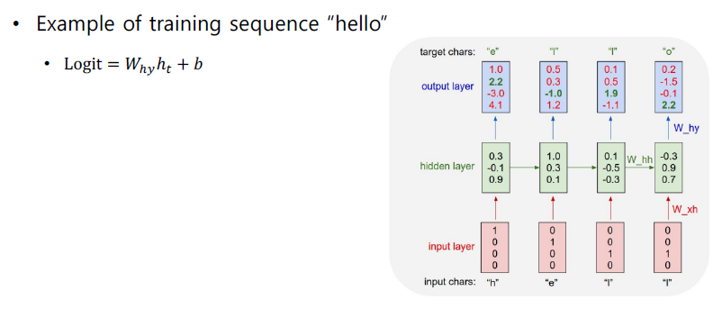

output이 Logit이다. logit의 크기는 vocab(사전)의 크기와 동일하다. 문자열을 예측해야 하기 때문이다. 그림에서 결과는 4.1이 가장 높아 o가 나오지만, 실제 정답은 e 이므로 두번째 값인 2.2를 최대한 높이도록 학습을 진행할 것이다. 분류 문제이니까 softmax를 취하여 값을 높이도록 학습할 것이다.

## Vanishing/Exploding Gradient 문제

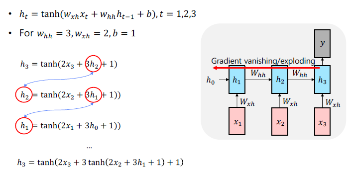

tanh는 -1 ~ 1 사이의 값을 갖는다. 따라서 RNN이 길어질수록 gradient는 소실된다... 또, whh = 3 인데, 이 수치도 계속 곱해지게 되므로... exploding 된다.

step이 길어질수록 y에서 발생한 gradient가 기하급수적으로 커지거나 작아진채로 역전파가 되므로 학습을 잘 할수가 없게 된다.

# LSTM

아이디어: gradient 문제를 해결하기 위해서, cell state 정보를 전달하자!

`Long Short-Term Memory` : 단기기억!

ht = fw(xt, ht-1) 형태였다. LSTM에서는...

전 time step에서 넘어오는 정보가 2가지가 있다.

- Ct: cell state vector
- ht: hidden state vector

`{Ct, ht} = LSTM(xt, Ct-1, ht-1)`

## LSTM memory

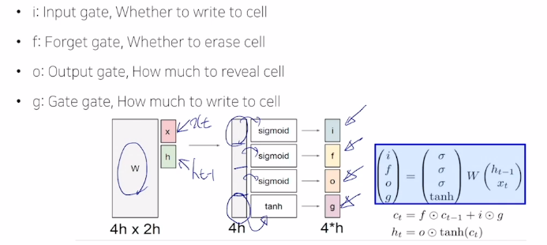

x, h의 dim이 h라고 가정하면, 두개의 concat은 2h가 될 것이다. w 역시 4h x 2h가 될 것이다.

처음 3개의 값에 시그모이드가 곱해진다.(시그모이드의 output이 0~1 사이이므로). 즉, 일부 퍼센테이지만큼의 값을 갖게 된다. 이들이 i, f, o가 된다 (gate)라고 함.

마지막 벡터는 tanh와 나온다. tanh는 -1 ~ 1 사이의 값을 갖는다.

### Gate

- Forget gate

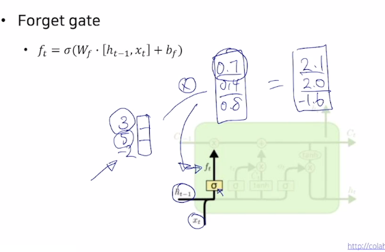

- asdf

Ct~ 는 C tilda 라고 읽는다.

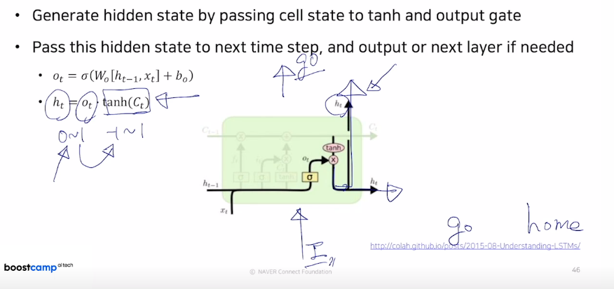

# GRU

LSTM의 단축 버전. ht만을 사용하고, gate 숫자 역시 줄어들었다.

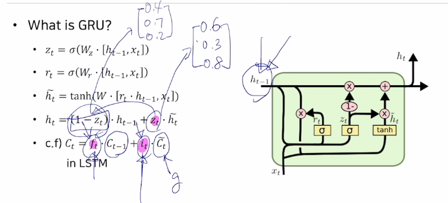

input gate의 값이 커지면 커질수록, forget gate의 값은 작아진다... 따라서 이전의 정보 ht-1과 현재 만들어진 정보인 ht (tilda) 간의 독립적 게이트 적용이 아닌, 가중평균을 내는 형태로 계산된다는 것을 알 수 있다.

즉, ht = ... 에서, ht-1에서는 40% 보존이 된다면, h틸다는 60% 보존이 된다. (가중치의 합이 늘 1이므로)

## Backpropagation in GRU/LSTM

정보를 담는 주된 벡터인 Cell state vector가 업데이트 되는 과정에서, Whh 라는 행렬을 계속적으로 곱해주는 형태였다. (RNN))

그러나 GRU나 LSTM에서는 전 타임의 벡터에서 그때 그때 다른 값으로 이루어지는 forget gate를 곱하고, 필요한 정보를 `곱셈`이 아닌, `덧셈`으로 더해준다. 이로인해 vanishing / exploding이 없어진다!!!

# 퀴즈

LSTM 모델에 대한 설명이 다음과 같을 때, 모델의 총 파라미터 수를 구하시오 (정수값으로 입력).

- 은닉층은 1개이다.
- 입력(xt)의 차원은 25이다.
- 은닉 상태( h\_{t-1})의 차원은 100이다.
- LSTM의 각 게이트는 bias를 가진다.
