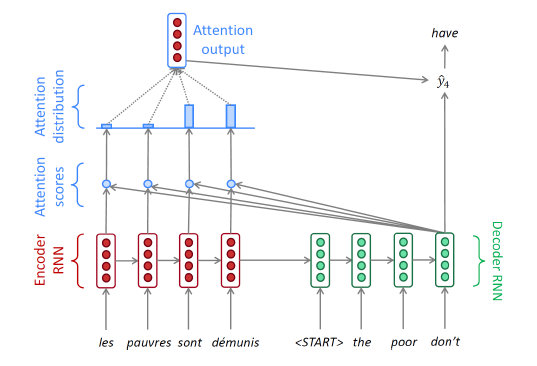

# Seq2Seq

## Seq2Seq model

RNN의 many to many 형태에 해당한다. 입력 시퀀스를 모두 다 읽고 난 후, 출력 시퀀스를 예측 생성하는 모델. 입력은 당연히 word 단위.(토큰)

- 인코더: 입력문장을 읽어들이는 RNN 구조
- 디코더: 출력문장을 하나씩 생성하는 RNN 구조

인코더와 디코더는 별개의 파라미터를 사용한다.

인코더의 마지막 hidden state vector는 디코더의 h0로 들어간다. h0는 앞서 인코더에서 수집한 정보들을 잘 담아내는 것이 관건이다.

디코더의 첫번째 input은 특수 토큰으로, SoS라고 부른다. 디코더가 어디까지 문장을 생성할지는 또 다른 특수 토큰인 EoS가 나올 때 까지 생성한다.

## Attention 모듈

seq2seq의 RNN 기반 구조는 시퀀스의 앞에서부터 순차적으로 단어를 읽어들이고, 정보를 매 time step마다 축적한다. 이 과정에서 hidden state vector의 dim은 정해져 있으므로, 마지막 time step의 hidden state vector에 앞서 나온 모든 정보를 넣어야 한다. 즉, 인코더가 길어질수록 앞선 정보들은 소실될 가능성이 높다.

Attention은 이러한 단점을 해결하고자 고안 되었다. 마지막 인코더의 hidden state만 참조하는 것이 아니라, 각 RNN 모듈마다의 hidden state vector를 전부 디코더에 제공한다. 디코더는 각 time step마다 그때 그때 필요한 인코더의 hidden state vector를 가져가 사용한다.

## Attention 과정 상세

디코더의 hidden state vector는 인코더의 모든 hidden state vector를 반영한다. 이후 Attention score에 softmax를 취하여 가중 평균을 구할 수 있다. 위에서 파란색 구조가 Attention 모듈로, 인풋은 인코더 hidden state vector 세트와 디코더 hidden state vecotr 하나가 들어가게 되는 것이다.

출력인 Attention output은 (컨텍스트 벡터라고 부르기도 함) 디코더 hidden state vector와 함께 concat이 되어 out layer의 입력으로 들어가게 되고, 이를 통해 최종적으로 다음에 나올 단어를 예측하게 된다.

동일한 Attention 모듈을 다시 사용하지만, 두번째 디코더의 hidden state vector를 사용하여 다시 인코더의 hidden state vecotr와 내적을 다시 계산하여 Attetion score를 계산하고, 다시 과정을 반복한다.

## Attention is Great!

- NMT performance
  - 기계 번역 성능!!! 디코더의 매 스텝마다 인코더의 입력 시퀀스에서 어떤 정보를 집중할 지 가능하게 되었으므로
- solve bottleneck problem
  - 인코더 마지막의 hidden state vector만을 사용하지 않으므로, 긴 문장도 가능
- helps vanishing gradient problem
  - gradient가 사라지는 문제도 해결. 디코더의 마지막에서 잘못된 grad를 생성하여 역전파를 수행했다면, 인코더의 초반까지 다시 전파를 할 것이다. 디코더의 모든 모듈을 거꾸로 거치고, 인코더도 거꾸로 거치게 되는데 이 경우 grad가 vanishing 되는 문제가 있다. 그러나, attention을 사용하게 되면서 '정보의 지름길'에 해당하는 컨텍스트 벡터가 있으므로 바로 전달할 수 있다.
- provides some interpretability
  - 흥미로운 해석 가능성. attention distribution을 살펴보는 것으로, 인코더 상 어떤 단어에 집중했는지 알 수 있다. 언제, 어떤 단어를 보아야 하는지 뉴럴넷이 스스로 학습하는 모습을 보인다.
