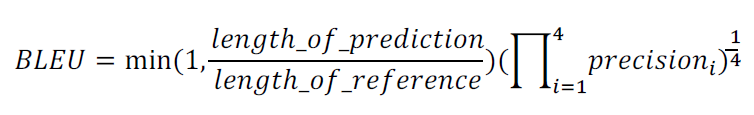

# Beam search

## Greedy decoding

seq2seq 같은 자연어 생성 모델에서는, 다음 단어를 추정한다. 이때 매 time stpe마다 가장 높은 확률을 지니는 단어를 선택하여 decoding을 진행한다. 이를 Greedy decoding이라고 한다. 전체 시퀀스에서 어울리는 단어를 선택하는 것이 아니라, 그때 그때 가장 높은 확률을 가지는 단어를 선택하기 때문이다.

- input: il a m'entarte (he hit me withe a pie)
  - he \_\_
  - he hit \_\_\_
  - he hit a (실수 발생!!)
    - greedy decoding은 이 상황에서 뒤로 돌아갈 수 없다!!!

## Exhaustive search


입력문장 x, 출력문장 y이라고 할때

첫번째 생성하는 단어가 당시에는 가장 큰 확률을 가지고 있다고 하더라도, 수식의 뒷부분에서는 그 확률이 크지 않을 수 있다.

어떤 time step t까지 가능한 모든 경우를 다 따진다면, vocab의 사이즈 V일때 V^t 가지를 고려해야 한다. 이 경우 기하급수적으로 증가하게 되므로 이를 모두 고려하기에는 힘들다.

## Beam search

아이디어: 두가지 approach의 중간책. 매 time step마다 k개의 가능한 가지수를 고려한다. k개의 후보 중에서 가장 확률이 높은 녀석을 선택한다.

- k는 beam size라고 부른다. 보통 5~10개


score를 최대화하는 것이 목적이다. 여기서 log를 취하므로 값을 더하게 되는데, 단조증가하는 함수이므로 확률 값이 가장 큰 때에도 가장 큰 값으로 유지된다.

매 time step마다 k개의 후보들을 추적한다.

### Beam search: 예제


k개의 k개에 대해 또 구한다. 즉, k^2가 된다.


여기서 가장 확률이 큰 -2.8과 -2.5를 선택해서 다음 단계를 진행한다.


greedy 에서는 END 토큰이 등장할 때 까지 decode를 진행하지만, beam search에서는 END 토큰이 등장하는 시점은 다를 수 있다. 한 루트에서 END 토큰이 나오면 그 시점에서 해당 루트는 중지하고 저장한다. 다른 루트에서는 계속 decode를 지속하고, END 토큰이 나올때 멈춘다.

### Beam search stopping

- 미리 정한 timestep T까지 진행하였을 때
- 임시 저장한 END 토큰이 등장한 루트가 미리 정의한 N개에 충족되었을 때

### Beam search finishing

- beam search가 끝난 경우 루트들의 리스트를 만든다.
- 여기서 가장 높은 scroe를 가지는 hypothese를 최종 결과물로 정한다.
- 일반적으로 긴 문장일 수록 확률(score)는 낮아진다. 이는 길어질수록 log 값을 취할 때 음수가 더해지기 때문이다.
  - 때문에 좀 더 공평한 비교를 위해 Normalize를 진행한다.


## BELU socre

기계번역같은 생성 태스크에서 target을 생성한 경우 objective function으로 soft-max loss, 즉 정답 값의 확률이 커지도록 학습을 진행한다. 학습이 완료된 후 성능을 평가할 때도 역시 각 단어별 soft-max를 계산하거나 분류를 할 수 있다.

그러나 특정 time step에서 특정 단어가 나와야 하는 경우에는 전체적인 과정에서 중간에 어떤 단어를 빼먹거나, 추가적으로 생성해버린 경우 잘못된 평가를 할 수 있다.

```
I love you를 생성해야 하는데, Oh I love you를 생성한 경우... 어느 time step에서도 정답을 맞추지 못 했기 때문에 0으로 간주되지만, 그렇다고 이것이 잘못된 것인가??
```

때문에 2가지 평가방법을 생각해볼 수 있다.

### Precision & Recall

- reference: Half of my heart is in Havana ooh na na
- predicted: Half of my heart is in Obama ooh na

이 두 문장간 겹치는 단어의 갯수의 비율을 따져본다.

precision(정밀도) = 맞춘 단어 / predicted 길이

recall(재현율) = 맞춘 단어 / reference 길이

정밀도는 실질적인 정확도로 생각해볼 수 있다. 예를 들어 특정 키워드로 검색 시 정확도로 많이 사용되는 방법이기도 하다. 검색어와 똑같을 필요까지는 없고 어느정도 부합하는 경우 정확하다고 하기 때문이다.

재현율 역시 예를 들어 설명해보자. 키워드로 검색을 하였을 때, 10개의 결과중 7개만 나왔다는 것으로 생각해보자. 나머지 3개는 결과에 노출되지 않으므로 모른채 넘어가게 되는데 그게 중요할 수 도 있다. 즉, 재현율은 의도에 부합하는 것에 대해 얼마나 많이 맞추었는지 라고 볼 수 있다.


이 두가지 measure를 하나로 합쳐 사용할 수 있다.
평균을 구하는 방법에는 3가지가 있다. 산술, 기하, 조화 평균이다. 일반적으로 산술 > 기하 > 조화 의 값을 가진다.

조화평균을 취한 것을 F-measure라고 하는데, 이를 사용한다.

### 예제 다시보기


모델 2가 점수가 더 높네... 과연 이게 옳은 모델인가?? --> 아니다!!

## BLEU score

- BiLingual Evalutation Understudy
  - N-gram overlap: 단어가 하나하나 overlap되는 것에서 벗어나, 연속성도 따져서 겹치는지 판단.
  - precision for n-gram: recall은 무시한다. precision의 특성때문이다.

> I love this movie very much. 라는 문장을 한글로 번역하면, "나는 이 영화를 많이 사랑한다." 라고 할 수 있다. 이 경우 very라는 단어가 생략되었는데, 그렇다고 해도 번역문장은 충분히 좋은 결과라고 볼 수 있다. 즉, precision만 따져봐도 충분하다.

> recall을 쓰지 않는 이유는 또 있다. "나는 이 노래를 많이 사랑한다" 라는 문장은 완벽히 오역이 되기 때문이다.



여기서는 기하평균을 사용한다. 조화평균을 쓰지 않은 이유는 작은 값에 더 가중치가 크기 때문이다.

- brevity penalty: 너무 짧은 문장을 생성한 경우 penalty를 준다. min(1, ...) 에서 짧아진 비율만큼 precision 값이 낮추겠다는 의미이다. 그 외에는 recall의 역할을 어느정도 대신하는 이유도 있다.

### BLEU score 예제


패널티의 경우 원래 문장에는 10개의 단어가 있고, 예측 문장은 9개이므로 9/10 값을 가진다.

최종적으로 precision 4개의 기하평균 값과 패널티를 곱하여 BLEU score를 계산한다.
