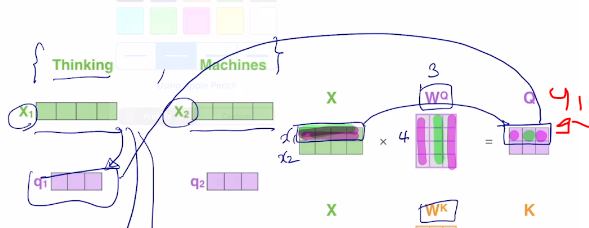

# Transformer

> 참고하면 좋은 사이트: http://jalammar.github.io/illustrated-transformer/

## RNN: Long-Term dependency

가령 3번째 step의 home의 인코딩 결과는 I의 정보를 갖고 있을 것인가? gradient banishing/exploding 으로 인해 먼 거리의 정보는 손실이 발생!

### Bi-directional RNN

정보의 진행 방향 (시퀀스의 진행 방향)을 양방향으로 진행하면 괜찮지 않을까?

hf와 hb를 concat한 새로운 vector를 정의한다. forward, backward 방향의 정보를 모두 담는 것이다.

## Transformer: Long-Term dependency

RNN 모델을 대체하는 Attention module의 구조

3 단어의 input vector가 주어졌을 때, encoding된 벡터가 아웃풋으로 나오게 될 것이다. 구체적으로 어떻게 진행되는가?

I라는 단어의 encoding vector를 만든다고 가정해보자. h1

self-attention 결과는 자기자신과 유사도가 제일 높기 때문에 이대로 사용하면 자기자신의 비중이 너무 높게 나타난다. 이를 개선해야 한다.

여기서 I의 인코딩 벡터를 위해서 주어진 벡터 세트들의 유사도를 구하는 형태로 구했다. (?) -15:00

주어진 벡터 중에 어느 벡터를 가져올지 선정하는 기준역할을 하는 벡터를 Query 벡터라고 한다.

쿼리벡터와 인코딩 벡터간 내적을 통해 유사도가 구해지고, 쿼리 벡터와의 내적이 되는 재료 벡터들을 Key벡터라고 한다.

쿼리벡터를 통해 주어진 여러개의 키벡터를 통해 어느 키가 높은 유사도를 갖고 있는지 그 역할을 하는 것이 키 벡터이다.

마지막으로 각각 벨류벡터의 유사도를 계산하여 softmax를 취하여 가중평균 (재료벡터들은 key 벡터와 동일한 취급으로 사용하고 있지만, 유사도를 위한 key벡터로 쓰이기도 하고, )이 구해지느 재료벡터로써 사용되는 3번째 역할이 바로 Value이다.

결국 한 시퀀스의 인코딩 결과, 각 벡터들이 쿼리 ,키, 밸류 3가지 역할을 하게된다. Transformer의 self-attention 모듈은 도일한 세트에서 출발하였어도 각 역할에 따라 벡터가 다른 형태로 변환되는 것이다

즉, 하나가 쿼리가 되고, 나머지(자신포함)은 키와 밸류가 되는 것이다. 이렇게 인코딩 벡터가 계산이 된다. 이 벡터는 모든 단어를 적절히 고려하여 계산된다. 따라서 시퀀스 길이가 길더라도 self-attention 모듈을 적용하면, Query벡터에 의한 유사도만 높다면 멀리 있더라도 손쉽게 가져오게 된다.

## Transformer: Scaled Dot-Product Attention

- input: q, (k, v) pairs
- output: values의 가중 평균
- 가중치: 쿼리벡터와 value벡터와 해당하는 Key 벡터의 내적값

쿼리벡터와 키벡터는 내적연산이 가능해야하므로 같은 dimension을 가진다. (dk)

K^T: transpose 연산을 통해 대각선으로 대칭된 형태로 변형된다.

(dk X |K|): 여기서 K=4이다

|Q|: 3이다.

(|Q| x dk) x (dk x |K|) = 3 x 4가 된다.

각 벡터간 연산 결과가 어디에 위치하는지는 그림과 같다.

이번에는 |V| 와 계산을 살펴보자.

전체적으로 살펴보면 위 그림과 같다. 결국은 모든 각각 쿼리벡터에 대한 output 벡터를 한번에 계산할 수 있다는 것이다.

행렬연산으로 바꿀 수 있기 때문에 GPU를 활용하여 병렬연산이 가능하다! --> `즉, Transformer 모델은 RNN보다 학습이 빠르다!!!`

### softmax

루트 dk로 나눠주고 softmax를 취하게 된다. 그 이유는? -> 다음에...

### 스케일링: 루트 dk

내적 값은 언제나 스칼라로 나오지만, 쿼리와 키의 차원 수는 다양하게 정의될 수 있다. 만약 2차원 벡터의 Q, K가 있다고 가정해보자.

Q: a b

K: x y

Q와 K의 내적값은 ax + by이다.

만약 각각 원소의 값이 특정한 평균과 분산을 가지는 확률변수라고 해보자.

a, b, x, y가 통계적으로 독립인 평균 0 분산 1인 형태라고 가정해보자.

ax와 by 각각의 평균이 모두 0이기 때문에 내적값의 평균도 0이 나온다.

이때 ax의 분산도 1이 나오게 되고, (둘이 독립이고, 평균이 0이면 1이 나오게 된다. 자세한 증명은 생략)

또, 이 둘이 각각 분산이 1이라면 더해지는 새로운 확률변수의 분산은 둘의 분산의 합과 같다는게 알려져있다.

따라서 최종적인 분산은 2가 된다.

여기서, 만약 차원이 100이라고 가정해보자. 이번에는 100차원이므로 분산이 100이 될 것이다. (더하기를 100번 하니까)

각각 표준편차를 구해보면 루트2와 10이 된다.

여기서 루트2는 대략 1.4이므로,

1.1, -0.8, -1.7 정도가 될 것이다.

분산 혹은 편차가 클 수록 확률분포가 큰 값에 몰리는 패턴이 나타남을 알 수 있다. 분산이 작은 경우에는 확률분포가 좀 더 고르게 분포하게 된다.

따라서 내적에 참여하는 Q, K의 차원에 분산이 좌지우지 될 수 있고, softmax의 결과가 어느 한 Key에 몰리는 극단적인 분포라 나타날 수 있다.

때문에 루트 dk로 나눠주는 것이다. 분산이 1인 형태로 유지된다.
