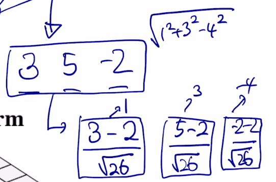

# Transformer Ch4

## Multi head attention

앞서 배운 attetion 구조를 여러개 적용한 모습이다. 서로 다른 버전의 매트릭스가 존재함. 최종 결과는 각 결과물의 concat

싱글 어텐션에서는 오직 한가지 방향으로만 정보를 반영하게 된다. 그러나, 문장이 이어지면 다양한 정보와 다양한 측면의 정보가 존재한다. 이러한 다양성을 고려하기 위해 여러번의 어텐션을 취한다.

이렇게 여러 head의 결과물들을...

concat후(24 = 3 \* 8) Linear 연산(24 \* 4)을 통해 선형변환한다.

- n: 시퀀스 길이
- d: dimension of Q, K
- k: kernel size of convolution
- r: size of

- self-attention: QK^T가 주된 결정자다. 여기서 QK^T ==> (n x d) x (d x n) 이다. 따라서 O(n^2d). 단, GPU의 병렬연산 기능을 통하면 (코어수가 많다는 전제하에) O(1)에 가능하다.
- RNN: 각 time step에서 계산되는 과정을 다시 떠올려보자. 각 모듈의 출력인 hidden state vector의 차원이 d라고 하면, (d x d)인 Whh와 내적하게 된다. 이 경우 연산량은 d번의 계산이 d번, 즉 d^2이 필요하다. 이 계산을 모든 time step에 시행하므로 O(nd^2)가 된다.

여기서 d는 우리가 정할 수 있는 hyper parameter이다. 그러나 n은 입력길이에 따라 변하는 값이다. 따라서 길이가 긴 시퀀스의 경우 Self-attention은 더 많은 메모리가 필요하다. RNN은 훨씬 적은 공간을 사용한다.

병렬화 측면에서 RNN과 self-attention의 차이를 살펴보자. self-attetion의 경우에는 병렬연산이 가능하다. 하지만, RNN은 ht-1을 계산해야 다음 step의 RNN moduel에 입력으로 들어간다. 즉, 앞선 결과를 기다려야 한다.

마지막으로 Maximum path length를 살펴보자. 이는 long-term dependency와 관련이 있는 지표다. input이 최대 얼만큼의 거리를 지나가게 되는지... self-attention에서는 가장 끝에 있는 단어더라도 가장 처음에 있는 단어를 인접한 단어와 별 차이가 없는 동일한 K,V로 보기 때문에 time step이 차이가 많이 나더라도 필요한 만큼 정보를 (attention에 기반한 유사도) 한번에 가져올 수 있다.

## Transformer의 후처리 block들...

- 각 block은 2개의 sub-layers를 가진다.

  - Multi-head attention
  - Two-layer feed-forward NN (with ReLU)

- 각 two step은 또한...
  - Residual connection and Normalization
  - LayerNorm(x + sublayer(x))

Residual connection: gradient vanishing 문제를 해결하는 효과적인 모델.

### Transformer: Normalization

주어진 다수의 sample에 대해서 평균을 0, 분산을 1로 만들어 준 후, 우리가 원하는 평균과 분산이 되도록 하는 변환과정이다.

y = 2x + 3 이라는 연산을 수행하는 경우, 위에서 계산한 값들이 x에 들어가 변환이 된다. 이렇게 계산하는 경우 x의 평균이 0 분산이 1인 경우 변환 결과 평균이 3 분산은 2가 된다. 이때, 뉴럴넷이 2와 3과 같은 변수를 학습하는 것이다.

Layer Norm도 batch norm과 유사하다.

#### Layer Norm

(4 - 3.5) / 1.11 = 0.65

(2 - 3.5) / 1.11 = -0.45

......

그 다음, 원하는 평균/분산을 주입하기 위해 y=ax+b를 어떻게 적용하는가? 각 노드별로 적용한다

0.65 x 3 + 1 = 2.95

0.7 x 3 + 1 = 3.1

...

### Add & Norm 이후?

Feed Forward:

## Positional Encoding

I go home과 Home go I는 같은 동일한 vector 결과가 나올것이다. 이는 attention 수행에서 순서가 전혀 상관없기 때문이다. 즉, 문장의 시퀀스 정보를 고려하지 않는 문제가 있다. (RNN과의 차이점)

직관적 예시: I go home 에서 I가 가지는 입력 벡터가 (3, -2, 4)라고 해보자. 입력벡터 I에 해당하는 벡터가 전체 시퀀스에서 첫번째로 등장했다는 것을 그 벡터에 포함시켜준다. 간단하게는 첫번째 word니까, 첫번째 dimension에 1000이라는 숫자를 더해준다. (1003, -2, 4)

실제로는 sin, cos함수의 결과값을 활용한다. 위치별로 다른 벡터가 더해지도록 하는 것으로 순서라는 정보를 transformer가 두룰 수 있도록 하였다.

## Learnning rate scheduler

learning rate는 Adam등에서 쓰이는 hyper parameter이다. 그러나 이 값을 고정되게 쓰는 것 보다는 학습중에 적절히 변경하여 사용하면 더 좋은 결과를 보인다고 한다. 이를 조정하는 것이 바로 러닝 레이트 스케쥴러이다.

처음에는 learning rate를 크게 하여 빠르게 최적값의 근사를 찾아내고, 이후 과정이 어느정도 진행 된 뒤에는 보폭을 줄여 더 정확한 최적값을 찾기 위해 learning rate를 낮춘다.

## Transformer Encdoer 끝!

## Maksed Self-Attention

decoding 과정 중 주어진 시퀀스에 대해서 정보의 접근을 차단한다. 자기 자신과의 유사도를 얼마로 볼지, 다른 단어와의 유사도를 어느정도로 볼지 담고있는 벡터가 있을 것이다. 여기서 첫번째 단어를 학습할 때, <SOS>만 주어졌을 때, 나는 을 예측할 수 있도록 한다. 즉, 뒤에 나오는 단어를 입력을 동시에 주긴 하지만, 접근 가능하지는 않다.

0으로 만들어주는 후처리가 적용된다. 이후 각 row별로 합이 1이 되도록 하는 Norm이 추가적으로 진행된다.
