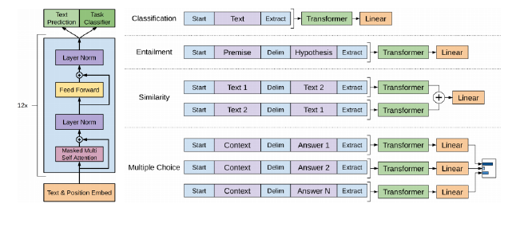
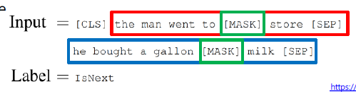
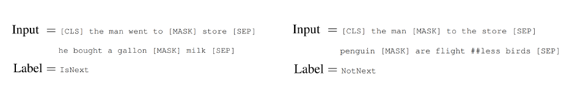
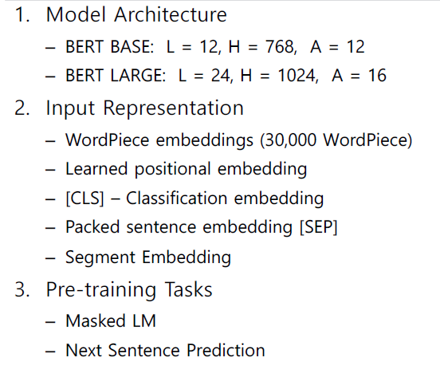
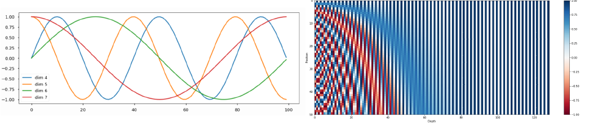
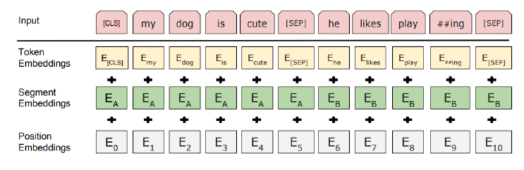
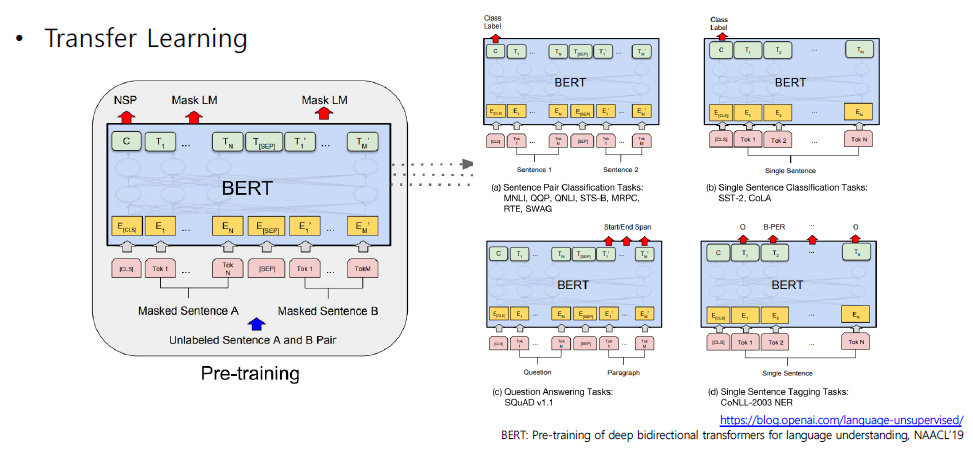

# Self-Supervised PTM

GPT1, BERT, GPT2

## 최근 트렌드

트랜스포머 및 셀프 어텐션 블록은 범용적인 시퀀스 인코더/디코더로써 NLP의 다양한 분야에서 좋은 성능을 내고 있다. 심지어는 다른 분야에서도 좋은 성능을 보이고 있다.

앞서 선보인 트랜스포머에서는 셀프어텐션 블록을 6개 사용했는데, 최근에는 블록을 더욱 많이 쌓아 대규모 학습데이터를 통해 학습하여 (self-supervised) 만들고 있다. 이후 파인튜닝을 통해 다양한 분야에서 사용하고 있다.

최근에는 트랜스포머는 NLP에서 나아가 추천시스템, 컴퓨터 비전, 신약개발 등 다양한 분야에서 쓰이고 있다.

다만, 셀프 어텐션 모델은 greedy decoding에서 벗어나고 있지는 못한다.

## GPT-1

OpenAI에서 발표한 모델이다.

다양한 스페셜 토큰을 제안했다. 간단한 task는 물론, 다양한 task들을 커버할 수 있도록 하였다.

주어진 텍스트 시퀀스의 position 정보를 담은 후, 12층으로 쌓은 셀프-어텐션 블록에 들어가게 된다.

- Text prediction: 다음 단어를 예측하는 task
- Task classifier:

문장레벨, 다수의 문장에 대해서도 모델의 변형 없이 활용될 수 있도록 프레임웍을 제시했다. Task classifier가 그 역할을 한다. 무슨 task인지 분류를 하는 것이다.
이 클래시파이어에 의해 토큰들이 변형된다. 토큰에 따라 Task에 따른 적절한 학습을 하는 것이다.

예를 들어 다음 단어 예측과 동시에 긍/부정 판별을 하거나, Entailment(논리 검증), Similarity(문장간 유사도) 등등 다양한 task를 수행할 수 있다.

### how to transfer learning?

학습을 거쳐 나온 모델을 다른 곳에 써보자. 가령 긍/부정 task를 거쳐 나온 모델을 이용하여 주제분류를 해본다고 하자. 긍/부정 task와는 다르기 때문에 Text prediction과 같은 출력부는 빼버리고 기학습된 인코더만 사용한다. 인코더를 가져오되, 끝부분에는 downstream task를 위한 추가적인 layer를 딱 하나만 덧 붙이면 된다!

이후 우리의 task를 위한 데이터셋을 이용해 학습을 진행하면 된다. 이때 마지막으로 추가한 layer는 학습이 일어나므로 학습을 충분히 시켜주어야 한다(fine-tunning). 다만 기존의 layer 구조는 이미 잘 학습되어 있으므로 딱히 건드리지 않아도 된다. 이것이 바로 전이학습이다.

pre-train에 쓰인 대규모 데이터는 레이블링이 없다. downstream task에는 반드시 레이블링이 따라와야 한다. 하지만 이를 대규모 데이터로 구하는 것은 상당히 어려운 일이다. 때문에 전이학습을 이용하면 굳이 레이블링을 할 필요 없이 이미 대규모 데이터로 학습된 모델을 이용할 수 있다.

## BERT

가장 널리 쓰이는 PTM이다. GPT와 마찬가지로 LM task로 pre-train되어있다. (다음 단어 예측)

GPT 이전, 트랜스퍼 모델 없이 비슷한 것을 구현한 ELMo가 있엇다. 얘는 LSTM을 이용했음.

### Masked Language Model

GPT-1에서는 전후문맥을 보지 못 하고 다음것만 보기 때문에 단점이 존재한다. 정확히는 단방향이었다. 하지만 실제 언어는 bi-directional하게 보아야 이해할 수 있다.

이를 위해 MLM이 고안되었다. BERT를 위해 고안된 pre-train task이다.

문장에서 단어를 일정 확률로 MASK로 치환하고, 그 단어가 무엇인지 맞추는 것으로 학습이 진행된다. 그럼 여기서 얼마큼의 단어를 MASK할지를 사전에 결정하는 Hyper 파라미터가 된다.

논문에서는 15% 정도를 MASK로 치환하였다. 이 비율보다 높은 경우에는 마스크를 맞추기에 충분한 정보가 제공되지 않았고, 작은 경우에는 학습을 위해서는 너무 많은 input이 필요하다는 단점이 있다.

하지만, 15%의 단어를 맞추도록 할 때, 해당하는 모든 단어를 모두 MASK로 치환하는 것은 좋지 않은 결과를 보였다.

- 프리 트레인에 익숙한 모델이 나오게 된다. 이는 downstream task에서는 MASK 토큰이 없으므로 task 수행 시 다른 특성을 보이기 때문에 학습이나 성능에 악영향을 끼친다.
- 따라서 MASK로 치환하기로 결정한 단어들을...
  - 80%는 MASK
  - 10%는 random word
  - 10%는 그대로

### Next Sentence Prediction

버트는 또 다른 pre-train 기법을 제안했다. 주어진 글에서 두개의 문장을 뽑는다. 두 문장을 이어주고 [SEP] 토큰을 넣는다. 다수의 문장 레벨 예측 task를 위한 [CLS] 토큰을 넣는다.

연속적으로 주어진 두 문장이 이어지는 문장인지, 아니면 이어지지 않는 문장인지에 대한 binary classification task를 수행한다.

### BERT 요약

- L: 셀프 어텐션 레이어의 수
- H: 각 블록에서 인코딩 벡터의 차원 수 (경량화)
- A: 각 레이어별로 정의되는 attention head의 수

Word를 좀 더 잘게 쪼개서 Subword를 사용한다. Subword embedding라고 하는데, 예를 들어 pre-train이라는 단어는 pre, train 으로 쪼갠다. 대충 어간과 어미로 나누는 방식이다.

Learned Positional encoding은 트랜스포머에서 제안된 sin/cos 함수 처럼 추출된 position 정보(미리 정해져있음)를 사용한 것의 발전이다. 이제는 이 부분도 학습대상에 포함시킨다. 학습을 통해 최적화하여 사용한다.

Segment embedding은 BERT 학습 시 문장 레벨의 task를 진행하는데, (두개의 문장 연속성 판단) 각각에 해당하는 워드에 해당하는 embedding이 더해질 것이다. 예를 들어 he는 6번째 단어로 E6가 되나, 두번째 문장의 첫번째 단어이므로 해당 정보도 같이 넣어준다. 이러한 정보를 위해 segment embeddings이라는 다른 정보도 같이 넣어준다.

### BERT와 GPT2의 차이점

GPT-2의 경우 바로 다음 시퀀스를 예측하는 task를 수행한다. 따라서 다음 단어의 접근을 허용해서는 안 된다. 따라서 특정 time step에서는 항상 자신의 왼쪽만을 볼 수 있다.

그러나 BERT의 경우에는 이미 MASK된 단어가 들어오므로 전체 단어에 대해 접근하여도 문제가 없다.

Training data size 측면에서 보면 GPT는 800M words, BERT는 2,500M words를 사용했다.

BERT는 SEP, CLS 토큰을 통해 여러 문장이 주어졌을 때 sentence embedding이 가능하다.

batch size 측면에서 BERT는 128,000 words, GPT는 32,000word를 로딩하여 사용한다. 일반적으로 큰 배치일 수록 모델의 성능이 더 좋아지고 학습도 안정화된다.

마지막으로 fine-tunning 관점에서 보면 BERT는 lr을 학습시켜야 하고, GPT는 그대로 써도 된다.

### BERT: Fine-tunning Process

