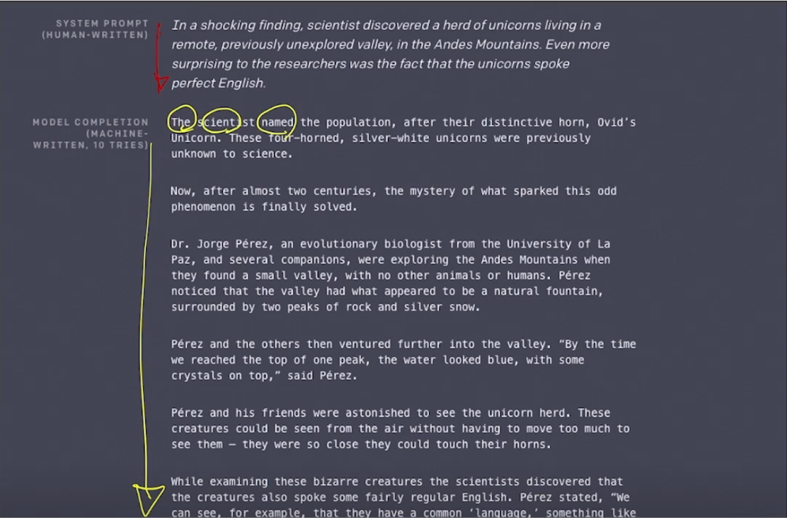
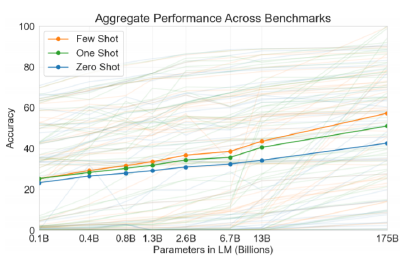
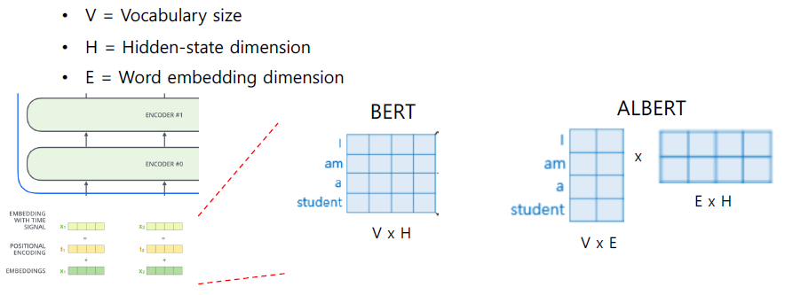
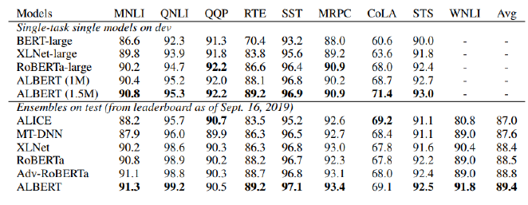
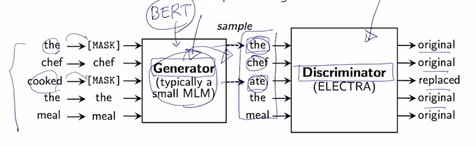
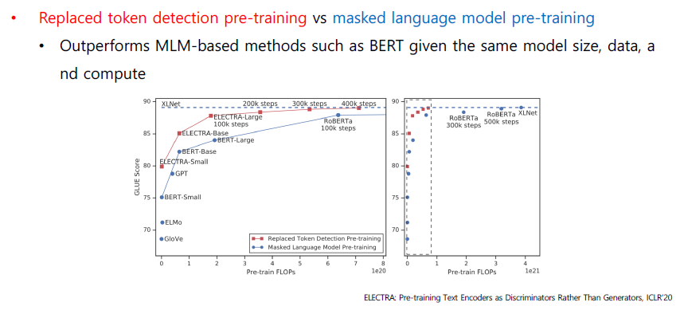

# 또 다른 Self-supervised pre-train model

GPT-2, GPT-3, ALBERT, ELECTRA, Light-weight models, Fusing Knowldege graph into Language Model

## GPT-2

GPT-1에 비해서 크게 다른 점은 없고, transformer 레이어를 더 많이 쌓았다. 또, 여전히 pre-train task는 LM을 이용함(다음 단어 예측).

Training data 도 40GB로 크게 늘어났다. 또 단순히 양만 늘린 것이 아니라 질도 좋은 dataset을 사용했음.

down-streme task는 zero-shot setting으로써 다뤄질 수 있다.

GPT-2가 문장을 생성하는 모습이다. 굉장히 자연스럽고 퀄리티 있는 문장을 생성하고 있다.

### GPT-2: motivation

The Natural Language Decathlon: Multitask Learning as Q&A

- 한 문장에 대해서 긍정/부정을 예측하는 task가 있다고 해보자. 또 문장에 대해서 대응하는 문장을 예측하는(대화적 측면) task가 있다고 하자. 이 두 task는 서로 모델 구조가 상이하다. output 형태가 다르기 때문이다. 그러나 해당 논문에서는 모든 종류의 NLP task들이 전부 Q&A로 바뀔 수 있다고 연구 및 발표하였다.
  - I love this movie. 라는 문장에 대해서 긍정/부정을 적용하고자 한다면 해당 문장을 의문문 형태로 바꾸면 된다.
  - 즉, 다양한 형태의 NLP task를 전부 생성 task로 바꿔볼 수 있다.

### GPT-2: Dataset

정말 많은 data를 사용하였고, 퀄리티도 있는 글을 사용했다. 외부링크를 포함하는 레딧 글을 사용했다. (외부 링크를 통해 가보면 잘 쓰여진 글인 경우가 많았음) 또, 좋아요를 많이 받은 글 위주로 스크랩하여 데이터셋에 포함시킴

그외에도 위키피디아 문서나 뉴스기사등을 포함함

### GPT-2: BPE

- byte pair encoding
- 과제 참고!!!

### GPT-2: Q&A

- QA를 수행했을 때, 모든 task는 질의응답 형태로 바뀔 수 있다는 점에 입각.

  - 질문글과 바로 다음에 나오는 답을 예측하는 task이므로, 다음 문장 예측을 할 수 있다. 이를 시험해본 결과 55의 F1 점수를 얻음.
  - 파인튜닝을 한 BERT는 89점이었음. 딸리긴 하지만, 어느정도 가능성 있어 보인다는 결과
  - 이게 바로 zero-shot!

### GPT 문서요약

- GPT-2도 바로 다음 단어를 예측할 수 있다!
  - TL;DR: 학습 데이터의 많은 글 중에서 TLDR이 나오면 한줄 요약하는 글이 있으므로 이것을 학습하여 문서 요약 task도 가능함

### GPT 번역

- 주어진 문장과 그 번역문을 주어주면 마찬가지로 다음 문장 예측을 하므로 따지고 보면 기계 번역에 해당한다.

## GPT-3

2에서 훨씬 개선한 모델. 개선 방향은 모델 구조가 아닌, GPT-2의 모델 사이즈(파라미터 수)에서 비교할수 없을 만큼 transformer 블록을 쌓았다. 또, 매우 큰 batch size로 학습을 진행하니 성능이 더욱 올라갔다고 발표.

### GPT-3: Few-shot learners

- Prompt:
- Zero-shot: 예시가 아예 없음
- One-shot: 예시를 하나 주고나서
- Few-shot: 몇가지 예시를 주고나서

여기서 예시는 GPT-3라는 모델을 전혀 변형하지 않는다. 즉, fine-tuning하는 것이 아니다.

성능 시험 결과, zero보단 one이, one보다는 few-shot이 더 좋은 성능을 보였다.

즉, 별도의 파인 튜닝 없이 예시를 보여주고 나서 task를 수행하면 뛰어난 성능을 보여주고 있다.

## ALBERT: A lite BERT

경량화된 BERT

앞서 보인 GPT 시리즈는 거대한 모델이다. 많은 메모리가 필요하고, 학습 시간도 많이 소요된다.

이를 성능의 큰 하락 없이, 혹은 더 성능이 뛰어나면서 사이즈는 줄이자는 목표.

### Factorized Embedding

디멘션이 너무 작으면 정보를 담는 공간이 작아 학습이 안 될 것이다. 그러나 너무 커지면 학습을 위한 연산량이 너무 커질 것이다.

또, 레이어(세릎어텐션 블록)을 더 깊게 쌓을수록 더욱 high-level의 문장적 의미를 포착할 수 있다.

첫번째 레이어에서 워드별로 주어지는 독립적으로 주어지는 임베딩 레이어가 있을 때, 그 임베딩 레이어에서 워드가 가지는 정보는 전체 시퀀스에서 고려하여 각 단어를 인코딩하여 저장해야 하는 히든 스테이트 벡터에 비해서는 훨씬 적은 정보만을 저장하며 또 충분하다.

따라서 알버트에서는 임베딩 레이어의 디멘전을 줄이는 기법을 제시했다.

### FEP

즉 ALBERT는 BERT에 비해서 각 워드의 디멘젼이 작다

E x H는 공통적으로 적용되는 선형변환이다.

원래 가지는 Vocab size인 V가 있다고 했을 때, hidden state vector의 디멘션이 100이라면 FEP를 통해 V x 15 형태로 바꿀 수 있다고 치자.

500개 단어(V)와 h=100 이라면 차원은 50000이다. 그러나 vX15 형태라면 훨씬 적ㅇ느 숫자의 파라미터를 차지할 것이다. (500x15니까)

### Cross-layer Parameter Sharing

실제 학습을 해야하는 파라미터는 무엇인가?

한 셀프 어텐션 블록에서 학습해야 하는 파라미터는 바로 Q, K, V 벡터역할을 하는 션형변환 행렬이다. 멀티헤드니까 헤드 수 만큼의 set가 있다.

그리고 각 헤드에서 나온 output 값들은 concat한 후, 선형변환 하여 같은 디멘션을 갖도록 만드는 벡터도 학습의 대상이다.

그러나 ALBERT에서는 적층해서 쌓는 셀프 어텐션 블록에서 각 블록의 서로 다른 선형변환 행렬들을 따로 쓰는 것이 아니라 공통적으로 'share' 하는 방식을 사용한다.

즉, 공통된 하나의 set를 모든 레이어에 적용한다.

- shared-FFN: Feed-forward network paramter
- shared-attention: attention parameter
- All-shared

성능은 all-share로 갈 수록 파라미터 숫자는 많이 줄어들지만, 성능의 하락 폭은 아주 작았다.

### Sentence Order Prediction

BERT의 프리 트레인 기법은 MLM과 NSP가 있다. 그러나 NSP task는 후속 연구 결과 그닥 학습의 중요성이 없는 것으로 밝혀져 MLM 위주 학습만 진행하게 된다.

ALBERT 에서도 별 필요성이 없던 NSP task를 좀 더 유의미한 과정으로 바꿔 학습을 시켜보았다. 두개의 문장이 실제 NSP인지 아닌지를 예측하는 task를 수행하지 않고, 정순인지 역순인지도 판별하도록 변형하였다.

즉, Negative sample (랜덤하게 골라진 2문장)인 경우에는 NSP가 아니다 라고 분류한다. 즉 서로 연관 없는 문장을 배우므로 그닥 언어적 지식을 얻을 수 없다고 가정한다.

ALBERT에서는 여전히 같은 문서에서 추출한 문장을 사용하여 배치한다. 또한 정순인지 역순인지도 판별하도록 하였다. 이를 통해 더욱 문맥을 파악하도록 하였다.

실험 결과 NSP와 SOP를 비교하면 None과 NSP는 그닥 차이가 없었으나, SOP는 유의미한 수준의 성능 향상이 있었다.

### GLUE results

GLUE 벤치마크 결과...

ALBERT는 가벼운 모델임에도 좋은 성능을 보였다.

## ELECTRA

Efficiently Learning an Encoder that Classifies Token Replacements Accurately

조금은 다른 형태의 pre-train을 수행함.

마스크 토큰 추측(MLM)이나, 다음 단어 예측하는 그런 LM이 아닌 다른 task를 씀

LM을 통해 단어를 복원하는 모델을 하나 두고(이를 제너레이터라고 부름), 주어진 문장에서 일부 단어를 MASK로 치환. 이를 다시 예측한 단어로 복원해낸다.

이후 ELECTRA의 Discriminator는 생성된 단어가 원본인지, 대체된 것인지 판별한다. 각 단어마다 이진분류를 한다.

이는 곧 Genrative Addversarial Network와 같은 개념이다. (GAN)

## Light-weight Model

그 외에도 다양한 경량화 모델들이 존재함.

먼저 Distilation 기법에 대해 알아보자.

- 티쳐 모델과 스튜던트 모델. 티쳐모델은 큰 사이즈, 슈튜던트는 작은 모델이다. 티쳐모델의 output이나 패턴을 잘 모사하도록 학습이 진행된다.

  - 티쳐모델이 MLM을 수행한 후 softmax결과의 확률 분포가 있을 것이다.
  - 스튜던트 모델의 output은 티처모델의 확률분포를 사용한다.

- DistillBERT
  - triple loss
- TinyBERT
  - two-stage learning framework
  - 마찬가지로 distilation을 사용. 다만 target distribution을 모사하여 적용하는 DistillBERT방식은 물론, 각 셀프 어텐션 블록이 가지는 어텐션 매트릭스, 히든 스테이트 벡터도 유사해지도록 학습을 진행한다.
  - 즉 티쳐모델의 중간 결과물까지 모방하도록..!

## 최신 연구 흐름: Knowledge Graph into LM

BERT 등장 후, 모델이 언어적 특성을 잘 이해하고 있는지 분석하는 연구들이 많이 진행되었다. 결론적으로 BERT는 주어진 문장과 글에서 문맥을 잘 파악하고, 단어간 유사도를 파악하지만. 주어진 문장에 포함되어 있지 않은 추가적인 정보가 필요한 경우에는 정보를 효과적으로 활용하지 못 하는 모습을 보였다.

가령 주어진 문장이.. "땅을 팠다" "꽃을 심기 위해서" "집을 지으려고" 라는 문장이라고 한다면

Q&A task에서 "땅을 무엇으로 팠지?" 라는 질문을 던진다고 해보자. 이 경우 주어진 문장에서는 답을 구할 수 없으므로 제대로 성능을 보이지 못 한다. 그러나 일반적으로 꽃을 심기 위해 땅을 파는 것과 집을 지으려ㅓ고 땅을 팔 때는 다른 도구를 쓸 것이다. 이러한 '상식'이 결여되어 있다.

그렇다면 이러한 '상식', '외부지식'을 어떻게 주입할 것인가?

> Knowledge Graph

꽃과 집, 2가지 개체에 대한 지식이 필요!

세상에 존재하는 다양한 개념, 개체를 잘 정리하고 관계를 정형화 한 것.

외부지식을 K-Graph로 잘 정리하고, 이를 모델에 잘 결합해보자는 시도가 진행중...

- ERNIE
- KagNET
