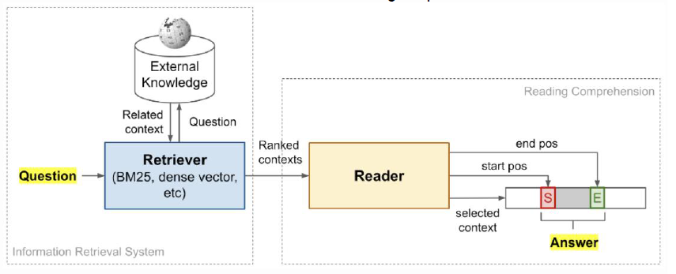
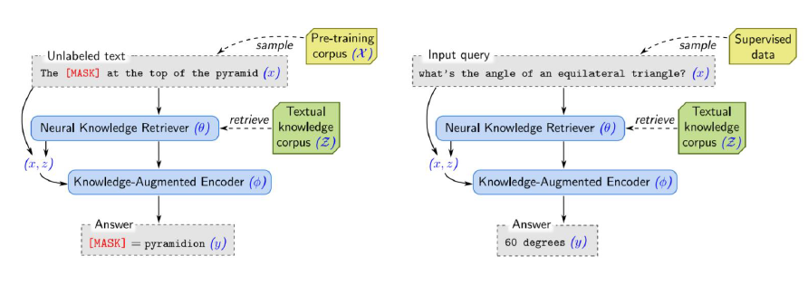
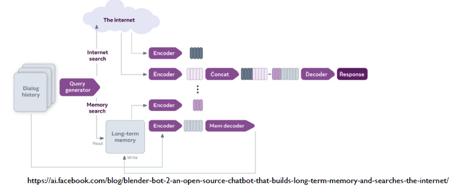
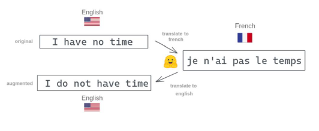
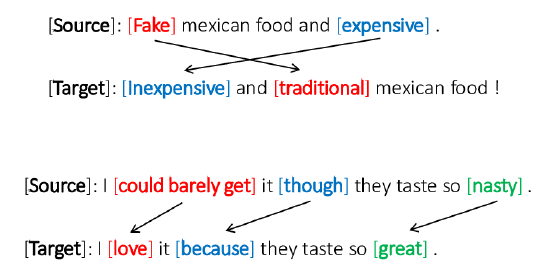
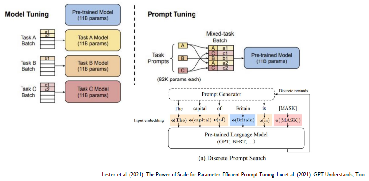
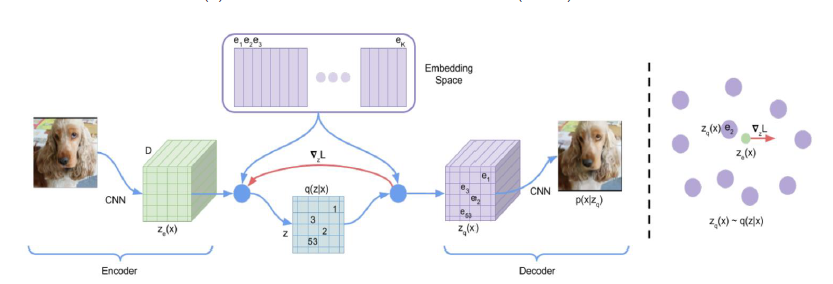
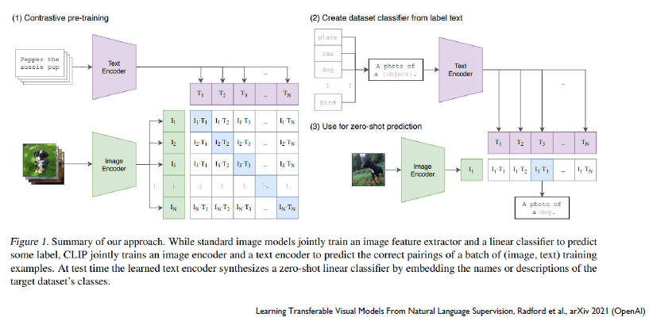

# 9주차 마스터 클래스

NLP 최근동향 - 주재걸 교수님

## 질의응답 task

질문에 대한 답을 하는 task.

최근 구글 검색을 하면 질문에 대한 답을 바로 띄워주도록 발전함. 과연 어떻게 해낸걸까? 세상에서 나올 수 있는 모든 질문을 다 알고 있는 걸까? 전혀!

질문의 키워드들이 포함된 문서들을 검색하고, 찾아낸 문서에 기반하여 답을 추론하여 제시하는 것.

## Open-domain Question Answering

질의응답은 곧 정보검색이기도 하다. 질문/응답에 대한 데이터베이스를 확보하여 학습을 하는 것이 아니다.

상식에 해당하는 질문같은 경우도 처리하기 매우 적절한 방법...

검색을 하고 답이 있을법한 문서를 찾아서 답을 추출하는 것도 중요함.

- External Knowledge?
  - 정형화된 지식
  - Knowldege graph: 개체와 개체가 무슨 관계인지, 어떤 카테고리인지 등등을 구조화한 그래프

정보를 검색하는 부분 + 기계 독해 두가지 부분으로 나눠볼 수 있다.

- retieval-augmented Language Model pre-train/fine-tuning
  - 레이블링이 된 데이터 뿐 아니라, BERT에서 쓰는 MLM 처럼
  - 외부적으로 추가적인 단서가 있어야만 맞출 수 있는 문제도 존재하므로, 들어갈법한 단어와 그 정보만을 제공하고 맞추도록

## Open-domain Chatbot

챗봇도 마찬가지로 오픈 도메인이 주요 화두로 떠오르고 있음.

- Open domain: 심심이, 이루다처럼 특별한 목적은 없이 다양한 상황에서 동작하도록... 다만 굉장히 어려운 문제다.
- Closed domain: 특정한 목적과 토픽에 동작하도록.. 제한된 응답. 고객서비스용 챗봇 등

[링크](https://ai.facebook.com/blog/blender-bot-2-an-open-source-chatbot-that-builds-long-term-memory-and-searches-the-internet/)

- Blender Bot 2.0
  - seq2seq transformer 기반 구조.
  - 페이스북에서 공개
  - 과거까지 쌓인 대화내용을 인코더에 넣고, 답은 디코더에서 생성.
  - Open-domain. 따라서 이전에 갖고있지 못 하던 정보인 경우를 고려해야한다.
    - 필요한 정보는 그때 그때 인터넷에서 찾아와 그 정보를 같이 인코딩하여 문장을 생성한다.

## Unsupervised NMT

문장 페어를 주고 번역을 학습시키는 방법이 아닌 다른 방법은 없을까?

수집한 영어문서와 별도로 수집한 한글문서를 이용해 번역 task를 시도해보자.

이게 말이 되는건가? 가능성이 있는건가???

- Back-translation
  - 영어를 한글로 번역하고, 물론 이 번역된 문장이 정답인지는 전혀 모른다.
  - 다만 두개의 번역기 모델을 만들어서 번역된 한글을 다시 영어로 번역시킨다.
  - 번역 후 다시 원래 문장(영어)로 돌아온다면 번역을 잘 했다고 볼 수 있을 지 않을까?

그러나 좀 부족한 성능을 보인다... 다만, 아직 번역을 확보하지 못 한, un-labeled data도 활용할 수 있다는 점에서 의의가 있다.

## Text Style Transfer

문장이 갖고 있는 뜻과 '스타일'이 있다. 말하자면, 어투나 화법, 문체와 같은 것이다.

인코더를 통해 문장의 뜻과 스타일 2가지를 분리하여 출력할 수 있다면..? 원하는 스타일을 injection 할 수 있지 않은가?

- EX
  - 긍정문을 부정문으로 바꾼다

## Quality Estimation

?? 다시 듣기

## Transfer Learning

우리가 갖고있는, 하고하자는 task에 맞는 데이터로 fine-tuning. 즉, 기학습된 내부의 파라미터를 미세하게 조정하는 것.

## In-context Learning

GPT3에서는 주어진 문장, 문서를 기반으로 다음 단어를 생성해나감. 모든 NLP task는 질의응답 task로 바꿀 수 있다는 연구가 발표가 있었음. 이에 착안하여...

Few-shot.

이런 방식의 새로운 fine-tuning 방식. 사실 정확히는 fine-tuning이 아니다. GPT의 파라미터를 바꾸지 않기 때문...

여기서 문제가 하나 있다. task description을 명령어 형태로 줄 수도 있고, 권유문으로 줄 수도 있고, 아예 비문이나 구어체처럼 쓸 수도 있다. 이런 경우도 다 고려할 수 있는가?

즉, 앞의 지문을 최적의 형태로

### Prompt Tuning

extra information을

## Multi-Modal Models

Dall-E: 텍스트 to 이미지 생성!

Task의 난이도가 상당히 높았는데, 최근 진전이 있었음. 사용된 기술은 다음과 같다.

- discrete variational autoencoder(dVAE)
- transformer

이미지를 일정하게 나눈다. 이를통해 이미지도 시퀀스화 할 수 있다. word-embedding처럼 이미지도 임베딩할 수 있는 것이다.

word에 해당하는 이미지를 transformer 디코더를 통해 생성해낼 수 있다.

강아지 이미지를 인코딩 했을 때의 벡터와 강아지 word를 인코딩 했을 때의 벡터는 유사할 것이다. 이를 가깝게 하고, 다른 텍스트-이미지와는 멀어지도록 학습을 한다.

결과적으로 이미지-텍스트가 유사한 것들은 가깝게 위치하게 된다.

- CLIP

